# 00后富一代vida文章.pdf 图文提取

- 源文件: `00后富一代vida文章.pdf`
- 页数: `235`
- 提取图片数: `82`

> 说明: 按 PDF 原始页序输出，并根据页面坐标把图片插回正文流附近，便于核对是否漏图。

## 第 1 页

00后富一代知乎合集
---

## 第 2 页

第1篇:https://www.zhihu.com/answer/2638590017

关于创业有什么建议？

赞同数: (2541赞同)创建时间: (2022-08-22)

我想给00后的建议：选择轻资产且低成本的套利模式。同时，尽量避免头几次创业就大额投资开店开厂等输一下就无了的重资产
模式。

信息差套利模式是我用了很多年，到现在也最喜欢的战术

没有什么固定的实施方法，因为这是需要你自己去发掘的具体的实施方法就是：尽量寻找市场与市场、人与人之间的信息差，作
为撮合者，用信息差来套利。

考验的是人对于信息&商机的敏感性

现在实践起来，就是我现在研发一个产品/策略，所用的钱都不会超过我总资产的1%。并且我会跨市场跨界的找资源来达成我想要
的效果。

套利模式让我能够拥有很多重试的机会，尝试10个机会当中能中一个成功的就能起飞了。过往看来我的点子胜率也就是10-20%左
右，但是我的点子很多，而且几乎都是想到就直接开搞低成本实践，不会策划很多。输了不痛不痒还涨经验值，赢了一下就是连
本带利还赚数倍的回报。

有几个技能我认为对于信息差套利模式非常重要：
1.英文

英文可以让你踏入海外市场的大门，有英文基础可以让你看到最前沿的技术，你就会有机会把它们倒卖给国内还不了解的人。同
样的，你也可以看到国外有某一样需求；然后你在中国以很便宜的价格满足了这样需求，卖到海外市场。

2. cross the great firewall

这项能力不展开说，但是有了它，你的1号能力才有用，配合上1你能掌握的信息差就能吊打很多人了。大部分人就是输在这里，
这就是时代给我们年轻人的红利。

3.发现需求与对应产品的供应商的能力

发觉可被套利的需求，考验你的是一种习惯，我自己有三个喜欢用的方法：

-当我想买一样东西却花了很久才找到商家时，我就会想我能不能让这个流程变得更快从中赚差价

-我看到一样产品很火爆很赚钱，我就会想我能不能当这个东西的代理商贩或者是直接抄袭模仿

-我看到国外互联网上有卖国内没有的产品，我就会想能不能把这件产品倒卖到国内

一个存在套利机会的需求，这种机会出现的次数少之又少，而且都是有时效性的。所以在它到来之前，你需要不断的去扩充自己
的眼界，发现不同的“供应商”。例如我平时看到一个我自己用不到但是知道他卖的产品比其他人便宜的商家时，我就会在脑子里把
他记下来。下一次一旦需求出现了，我就能立马想到那个商家。

4.组织不同的人完成一件事的能力

很显然你不能一个人完成世界上所有的事情，与人合作组织不同的人来帮你实现一件事情的能力超级重要。这过程就像是拼图，
不同的人分工来帮你拼一部分，这事儿就成了。我也认识光靠一个人单打独斗赚上亿的人，但是他们都是在一个特定的技术领域
做到了绝对的顶尖。和我一样资质普通或者是想同时拓展多个领域，那么与其他人合作是肯定必要的。
---

## 第 3 页

—————————更新———————

写写几个我看到的商机吧：

海外公司注册

其实国内市面上的帮人注册海外公司和报税的人大部分都只是代理，他们的上家要么是有人真的在那个国家帮忙协助，要么就是
在fiverr上找当地的兼职外国人帮忙去注册的。

以英国公司注册为例，在fiverr上找人注册只要花300元左右，倒卖到国内就可以卖到1000元+的价格。

以英国公司报税为例，Fiverr上找人做也是三百块左右，倒卖到国内就是1000元+。

国内大部分人是不具备流利的英文+cross GFW的能力的，利用好这一点，就能发现生活中有很多可以无风险套利的机会

野路子发家的我对于信息差套利的生意都特别敏感，以下是我观察到的一些一本万利的生意：

–卖课卖教程开付费社群

-卖软件、游戏脚本、游戏辅助

-卖*V、卖美剧电影资源。

最近我观察到一个很好的模式是美剧资源找影视下载站合作，免费提供下载，但是下载到的压缩文件要解压就需要购买解压密
码。这样人家都下载下来了才发现要买密码，图方便大概率就愿意付钱了。

-卖Chagpt账号。

这个我以前讲过，自己做一个号成本2元以内，零售卖给别人就是20+起步

-卖Youtube、twitter等社交媒体账户。

-帮人设计公司图标。但实际上用midjourney等工具自动生成，自己再稍微改改就卖给别人了。

8.做开海外银行账户的中介。实际上如果你有存款的意愿，根本不需要什么“开户费”，直接联系银行就能开。但是中介就吃准这个
信息差，只起到一个把你介绍给银行客户经理的作用，就无风险的从你这里赚了中介费。

以上举的例子很多都可以做无货源模式，直接找到一个上家低价进货之后再卖给别人。

另外思维再开拓一些，像chagpt账户这种体力活，完全可以花钱雇x个人天天帮你注册账户然后，然后你负责控制销售环节这个重
要的信息差节点就可以剥削剩余价值了。

第2篇:https://www.zhihu.com/answer/1745335386

如何看待2022年金融危机？
---

## 第 4 页

赞同数: (2216赞同)创建时间: (2021-02-23)

现在是2021年2月23号，

虽然预言很容易被打脸，但是我还是想预言一下接下来股票市场的行情。

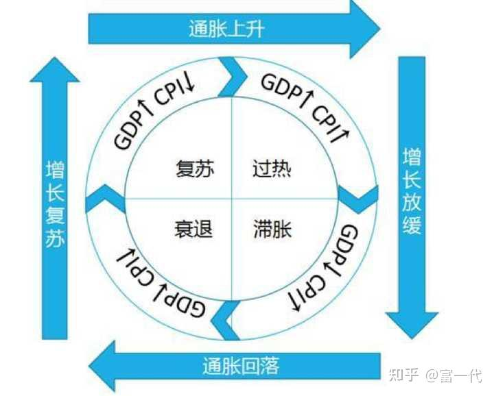

首先来理解一下这一轮周期的全过程。

第一阶段-萧条

2020年1月份到2020年4月份，新冠疫情爆发并开始向全球扩散。随后的几个月发生了什么我们都知道：各国政府开始封城、封锁
经济，造成全球范围内的经济萧条。美国失业率大幅度飙升，直到4月份创下美国几十年来失业率高峰的14.8%。

第二阶段-复苏

2020年5月份到2021年2月份，各国政府开始使用各种财政工具来提振经济。在这期间，全世界货币供给量有飞一般的提升：欧元
区M2增加10%，美元区M2增加25.7%。各国贷款利率也到了非常非常低的水平，我记得在去年隔三差五就接到银行打电话问我需
不需要企业贷款。
---

## 第 5 页

海量的货币为经济复苏提供了有力的支撑，经济发动机开始恢复运转，失业率快速下降。如此宽松的货币政策也使人们对于通货
膨胀的预期提升，促使人们把现金换成金融资产，推高股票市场、房地产市场、加密货币市场的大幅上涨。

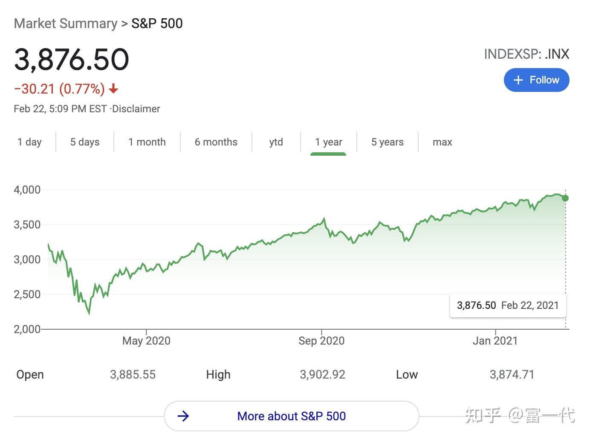

标普500走势图

比特币价格走势图

在这个阶段，成长性强的高风险资产（科技股与比特币）得益于极其充裕的流动性与极强劲的投资者信心，获得了最高的涨幅。

第三阶段-过热

经济就像国家的柴油引擎，转速慢（萧条）时国家就需要给他添加燃料（货币）并努力尝试发动（政策支持），当引擎成功运转
起来后，它会变得越来越快，变得过热。

在这个阶段，GDP与CPI都获得大幅增长，以原油与铜为首的大宗商品价格飞涨，得益于此，采矿业、石油开采类股票价格将会飞
涨。
---

## 第 6 页

伦敦铜价

我们目前就处于这第三阶段。

第四阶段-滞胀

在这个阶段，物价上升，但经济停滞不前。

股票市场的增长会陷入停滞，失业率与高通胀并存。

第一阶段、第二阶段都已经过去，现在我们处于第三阶段-过热。

这段时间将会是股票市场最后的狂欢，好好享受这最后一支舞吧。

我们可以看到近期股票市场上投资风格的转换，热点从科技股转移至大宗商品股。

过热阶段何时结束？这很大程度上取决于美国政策。
---

## 第 7 页

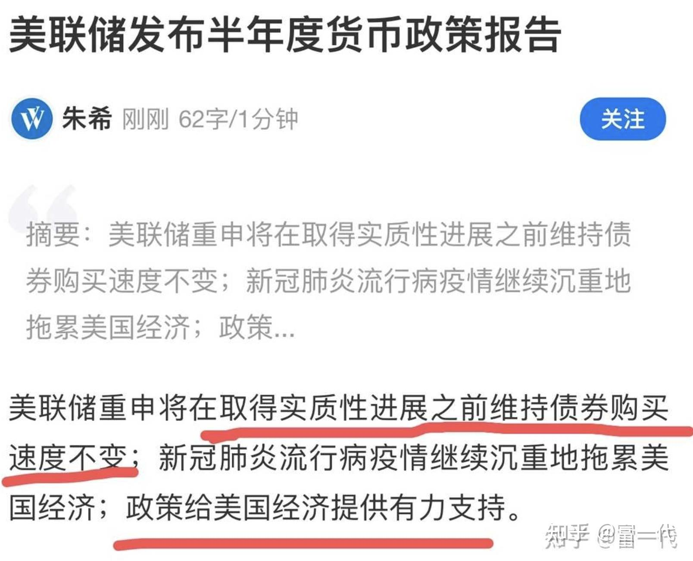

美国目前有三样维持宽松货币政策的工具：

1.量化宽松（美联储每月至少印1200亿美元购买国债）
2. 0利率
3.救济金

按照目前美国控制新冠疫情的速度,2021年中旬我们将会看到疫情基本被控制，美国每日新增病例数将会在1万例以下，届时美国政
府可能会考虑缩减量化宽松的规模或停止发放救济金。而真正终结过热期的将会是加息。当CPI上涨到对民生影响严重，美国政府
无法容忍的时候，可能会进行加息操作。

我的预测是股票市场从现在到2021年中旬之前还会有一段狂欢期，这将是投资者们与泡沫最后的共舞机会，享受这最后的
狂欢吧！

2021年中旬，我们可能会看到美国略微收紧货币政策，股市开始进入缓慢下行阶段，跌三天涨两天的温水煮青蛙。

2021年末2022年中旬，经济基本恢复如初，而通胀程度也会达到美国政府无法容忍的地步，货币政策将会有大幅度的收
紧，量化宽松会停止，停发救济金，利率上调百分之零点X。届时A股港股美股加密货币将会迎来超大幅度的回调。这一
段的行情会很像2018年3月-2018年12月。

2022年中旬至2022年末，市场到达一片绝望与哀嚎的底部。我们将会迎来非常棒的抄底时机。

第3篇:https://www.zhihu.com/answer/3502861456

普通人怎样才能一步步走向成功？

赞同数: (1954赞同)创建时间: (2024-05-19)

1.做轻资产套利类型的生意其实机会还很多，可以看看之前我写的一个回
答，https://www.zhihu.com/question/446914260/answer/2638590017?utm_psn=1775416732980965376我也有在这个回答里举很多的例子，
需要你们自己举一反三。

2.你需要找到一个擅长的领域然后打磨自己成为一名顶尖专家，而不是“普通人”，“普通人”当然只配获得普通的收入
---

## 第 8 页

3.这个时代做任何事情，你都可以做一个对应的个人IP。尤其是对于做小生意的人来说，做一个抖音+小红书号+知乎+B站账户很
可能给你带来数倍的生意。要做就多个平台一起做了，反正内容就复制一下还能增加你获客的概率。

4.我以上说的3点任何人都可以在空闲的时间做，你的生命不是非要呆在一个岗位只做这个岗位的事。

-如果你说“我的工作好苦好累，完全没有空余时间来做这些”并且你月收入低于1万/月那么你应该想办法找机会离开这份榨干你生
命的工作了

-如果你懒到上述三样都不愿意执行，那么恭喜你，你要成功只能靠运气了

5.如果你的父母是普通人，那么就少听点他们的财务建议。我爸这辈子就只赚到了1500万，所以他给我的建议都只是他这个等级
的人能给到的。

-他成功的劝我我在900美元卖了我的ETH，现在ETH 3100美元一个。

-他成功的劝我在28美元卖了我5000个BNB，现在BNB 600美元一个。

-前几天又在劝我在0.25卖了我的FFIE仓位，还好我没听，哈哈，现在FFIE股价1.13美元，最高时涨到3.9美元。差点就害我少赚
200万人民币。详情看我这篇：https://www.zhihu.com/question/656080832/answer/3500833217

我爸这辈子的成就只有那么多，所以他注定也只能给到他这个认知level的财务建议。其实不光是父母，任何给你财务建议的人，你
都掂量掂量他们自己的份量。只听level比你高的人给的建议是最优解。

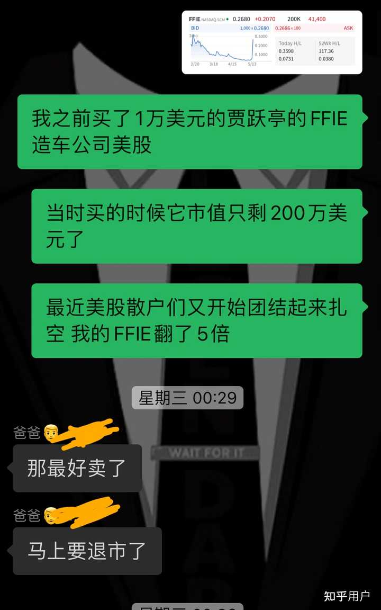
---

## 第 9 页

6.做一个诚信且靠谱的人。因为在中国社会里有一种“兵不厌诈”的商业价值观，觉得做生意缺斤少两很正常、坑一下人很正常。但
是，如果你在这样一个糟糕的环境里做一个诚信且靠谱的人，你会获得很大的优势。

7.远离消费主义，但是也别去存钱给银行打工。

身价0到500万，请你和奢侈品说no no，这不是你这个level应该买的东西。这个阶段的你应该积累现金流，思考探索新的商机，思考
怎么样用最少的钱买来性价比最高的生产力工具，找到属于你的商业模式。

成功之路就是不断的赚钱》再投资进创造更多现金流的生意中。

8.乐观积极的思维很重要。看我这篇想法吧：https://www.zhihu.com/pin/1775418579686883328

最后，不要指望什么“高手带你飞”这种美事，一个真正赚钱的人为什么要把蛋糕分给你呢？如果一个人声称自己多么多么
赚钱，还想带你一起赚钱，那么他99%是盯上了你口袋里的钱。

我有时候找到的一些躺赚alpha，要么分享给员工，要么分享给亲戚，要么分享给能给我想拉拢的人，从来都不会公布出来，好事
情当然是只留给自己人啊。

第4篇:https://www.zhihu.com/answer/79222973825

年轻真好，具有无限的可能。真的就有无限的可能吗？

赞同数: (1160赞同)创建时间: (2025-01-14)

是的，年轻人就是有无限的机会的，因为：

1.年轻人不需要很在意合规。我现在体量大了之后很多时候想到一些商机我都没法年轻人不需要很在意合规。我现在体量大了之后很多时候想到一些商机我都没法
做了，因为我要考虑合规问题，不能触犯法律，而年轻人则不用怕。

比如说我想发个币赚韭菜的钱，但是我这么做就会给我留下污点，让我成为被远洋海底捞的潜在对象，所以我做不了。而年轻人
光脚的不怕穿鞋的，随便发就完事了，因为搞你的利润小于成本。

比如说AI色情、AI任意照片做任意动作（你懂的），这种AI其实对于大厂来说开发起来都是易如反掌的，但是他们即使做出来了
也无法对公众开放、收费，因为他们会面临各种法律诉讼合规问题，而小的AI厂商和个体则不怕，打一枪换一地就可以了。这种
月入千万上亿人民币的AI色情产业现在都是被小团队小个体给赚了，而大厂则被结节限制。

2.年轻人时间便宜。很多好的套利类型商业点子我就算想到了，也没有合规问题，
但是我就是没时间去做。

-比如帮去世的人生产墓碑二维码，还可以帮亲属用AI“复活”去世的人作为增值服务。

-比如世界上大部分人还不知道克隆技术已经很成熟，能克隆出长得一模一样的宠物，所以可以去做宠物克隆厂商的代理帮他们宣
传拉客吃返点。

-比如可以做一名帮中年（70、80后）富人做跨国资产配置、资金自由流动的顶级顾问，其实有大量大量这样的中年富人有这个需
求，只是他们没有很灵活的信息渠道。用自媒体宣传自己拉客，帮他们搞定一站式全包服务。

3.年轻人能冒险能试错，摔倒了失败了也无所谓，只要不去搞那种贷款梭哈某个资
产或者某个生意的莎币行为，那么你有很多试错机会。

对于大部分已经富了的人来说，已经没有能耐再清零一次，一旦这种事情发生那么心态直接崩了。年轻人不一样，摔了你也损失
不了多少，拍拍灰又能站起来了。

4.给中产阶级的年轻人的话：不要以为富二代有多么多么了不起，不要以为差距有
---

## 第 10 页

多么多么的大，以为那象牙塔很高。

很多二代其实很懒很废。别乱听一些媒体鼓吹说什么富二代从小培养有多么优质巴拉巴拉，其实很多人也不过是享乐主义的废柴
罢了。现在是信息时代，很多工业时代致富的老一辈老钱并没有把《获取并利用优质信息》的能力传承给他们的后代（他们自己
都不会），所以这也是年轻人的机会，拥抱信息时代的每一个机会，拥抱人工智能、跨境电商、加密货币这类新兴产业，在这种
全新的领域的竞技其实非常公平。你努力努力，其实获胜的概率不比他们低多少。而老的工业产业则是他们的地盘，留给他们吃
就好了。

第5篇:https://www.zhihu.com/answer/3288815653

有什么技能值得花时间学习？

赞同数: (1095赞同)创建时间: (2023-11-14)

这个时代对于想要变得不普通的00后来说最重要的3个技能：

1.熟练的英语
2.精通使用Google/Twitter/Bing/Duckduckgo来搜索到自己想要的内容的能力，精通—》指的是你至少要背下来Google的几种搜索
语法
3.精通使用ChatGPT等AI工具来辅助自己的生活与工作

别人不会什么，你就学什么。这样子你就能收割到不掌握这些技能的羊群的韭菜。

第6篇:https://www.zhihu.com/answer/3569905798

为什么勤劳不一定能致富？

赞同数: (1036赞同)创建时间: (2024-07-22)

虚假的勤劳致富：

努力勤奋的送外卖、做跑腿、搬砖头、种地以及做类似的重复性的工作。这些没有壁垒的事情注定无法让你勤劳致富，你会卷是
吧，卷的过人民群众吗？

真实的勤劳致富：

商人：勤奋的去读各种商业书籍、努力的挖掘探索新的商机、努力的为实现一个商机而打通各种人脉和寻找各种资源、努力的结
交优质朋友、努力的打造个人和企业品牌

打工人：在一个优质赛道上有高工资或高分红或者是能分到高权益的高门槛工作，勤奋的干，多年后也能有不错的成就

第7篇:https://www.zhihu.com/answer/3365635880

为什么周围做生意的人都开始说相比以前，生意越来越难做？

赞同数: (841赞同)创建时间: (2024-01-17)

那是因为这些人没有选对好的赛道，这几年全球发展都很好的赛道是：

-游戏

-互联网

- AI技术
---

## 第 11 页

-短视频、长视频、直播

-除了A股外的所有传统金融市场

-欧美电商

-加密货币

-以上所有行业的配套基础设施，例如云计算、在线支付行业。

总之万变不离其宗：计算机有关的产业都在蓬勃发展

可是有多少人懂计算机能参与其中呢？可能中国只有不到10%的人口能享受到这些产业的红利。

与之相对的，这几年中国没落消沉的行业是：

-被在线电商蚕食份额的传统实体线下店

-中国房地产

- A股

-线下教育

-传统依赖便宜劳动力的制造业

这些产业承接着90%+人口的生计，所以自然大部分人就会感觉到“钱越来越难赚”、“生意越来越难做”了。

第8篇:https://www.zhihu.com/answer/3502831548

为什么现在越来越多人讨厌美国了？

赞同数: (810赞同)创建时间: (2024-05-19)

我是一名自由资本主义的支持者，也算是半个富豪，但是你塞给我5000万让我移民美国我都不愿意的。我更愿意选择新加坡阿联
酋香港这样的免资本所得税地区的身份/绿卡。

因为：

-美国是世界上铁拳最大的国家，并且它的铁拳除了中俄伊朝之外都能打击得到。

-美国是一个税率较高且执行超级严格的国家，卡彭躲的了fbi，却躲不了irs。以我的情况，如果我移民到美国，按照我的情况我需
要缴纳Day Trading税高达37%的资本所得税。简直变态如斯。

-美国执行的是全球征税制度，只要你是美国人无论你住在哪里你都得给美国交税。任何一个加入swift体系的银行在开户时都有
专门给美国公民的选项，因为他们必须要把信息申报给美国政府，在美国政府面前任何公民的金融资产信息都是透明的，并且没
有任何金融机构敢去糊弄美国政府。不像其他国家一样还存在灰带。

-欧美国家整体而言这几年左人当道，大搞康米，劫富济贫，并且出现了各种奇奇怪怪的政治正确。这几年那一套“因为说了XXX
话就被公司开除”的文字狱在硅谷和华尔街屡见不鲜，搞的“犹太”、“lgbt”变成了一个敏感话题你只能支持或者中立不能反对。原因
是很多硅谷与华尔街的金融、科技公司的的确确是被一群左派or犹太人控制的。

-同样还是因为左人当道，放进来大量非法移民且因为那狗屁的人道主义造成的监狱管理成本，在部分蓝州盗窃金额低于XXX美
元就是轻罪警察几乎不管。中国留学生在社交媒体上说的自己被光天化日之下抢劫与盗窃的案例也有很多很多。

-又又是因为左人当道，全面放开了大麻。更有一些城市如旧金山，甚至因为怕街上的毒虫交叉注射毒品不卫生，而去发放免
费“安全针头”、还有“毒瘾缓解药”。我想问What the f*€k are you f*€king doing?
---

## 第 12 页

总之美国现在被左派康米人搞的乌烟瘴气让曾经的灯塔国变成了康米社会对于很多富豪来说已经丧失了吸引力。美国只适合穷
人、中产，还有我下面提到的部分富豪群体。

那什么样的富豪适合去美国呢？

答：发家致富的过程中赚了中俄伊的不干净的钱的人。美国没有加入crs，也不会配合这三国的调查。所以这三个国家的黑金富豪
把资产藏在美国，在美国过后半辈子是非常合适的选择。

第9篇:https://www.zhihu.com/answer/78314034032

去泰国或者东南亚国家旅行还安全吗？你还敢去吗？

赞同数: (794赞同)创建时间: (2025-01-13)

我在泰国定居了一年，昨天也去TG上看了很多《劳务》《园区》《骗招》《妙瓦底》关键词的频道的信息补了一下功课

客观的来说一说：

泰国安全吗？当然没中国安全

绑架存在吗？存在。但是随机路上看到个游客就撸人上车绑走的那种基本没有。都是有预谋的，和电信诈骗一样是有固定套但是随机路上看到个游客就撸人上车绑走的那种基本没有。都是有预谋的，和电信诈骗一样是有固定套
路的。路的。从绑匪的角度上来看：你怎么确保绑到的人不是哪个重要人物或者正在和朋友通着话而惹出大麻烦呢？你怎么确保目标能
乖乖的在泰国不反抗你，乖乖的被你运到缅甸被你拿捏呢？那就必须想出一个噱头让对方信服。

为什么会出现把人绑到缅甸妙瓦底园区的情况？因为2020开始打击电诈之后，中国人开设的电诈园区以他们以往的高薪招人困难
成本变高，加上敏感户籍出入境管控使得很多老员工回中国了就出不来了。出现了用人荒的情况。所以出现了很多“骗招”。这个骗
招不光是以各种高薪诱惑，还可能是：和你说是背债撸银行的钱，说要让你在泰国躲一躲，然后实际上把你运到缅甸妙瓦底。还
可能是：在小红书上找女生旅游搭子，然后和你上车之后拿武器把你胁迫之后运到缅甸妙瓦底。

泰国政府是否对此知情是否主动参与？官方层面不会，他们靠旅游业每年稳稳当当几千亿人民币收入，没必要去惹这种麻烦
事。但是泰国下面的警察，各种职级，都是贪污的但是泰国下面的警察，各种职级，都是贪污的。在泰国长居的人都知道，如果路上违章了，被警察抓到就塞点小费就能免
正式处罚，过海关护照有问题也可以花钱买“保关”。泰国的警察大部分是工资低且没有执法记录仪的泰国的警察大部分是工资低且没有执法记录仪的。所以有一方警察和妙瓦
底的骗招人头贩子们勾结，是很正常的，也是毫不意外的。比如在关卡的警察就算看到一个未验明身份的人在后座，要被送去比如在关卡的警察就算看到一个未验明身份的人在后座，要被送去
缅甸，可能司机塞点打个招呼警察就放行了。有的绑架犯可能即使被抓，公司花个几十万美金，也就把他保出来潜逃了。

缅甸妙瓦底是一个独立与缅甸的存在，被军阀控制，和缅甸政府翻脸，属于“第四世界”，电诈园区也是在军阀的保护下运营。但
是妙瓦底的水电网食物都是泰国供应的，要是泰国方面一断供，那么妙瓦底的各个园区很快就停摆。这大概也是为什么泰妙瓦底的水电网食物都是泰国供应的，要是泰国方面一断供，那么妙瓦底的各个园区很快就停摆。这大概也是为什么泰
国军方一个电话就能把王星捞回来。

还能去旅游吗？你害怕就暂时不去就好了。

要去的人遵循一个原则也能很大程度保障你的安全：1.你必须是真的去放松旅游而不是去干任何赚钱的工作2.只和关系好的有武
力值的人去泰国3.在海外不要和《在网络或现实中主动勾搭你的中国人接触》，海外华人们应该都知道老乡专坑老乡的道理4.冷
知识：短刃折叠瑞士军刀是可以合法带上任何国家的飞机托运/高铁的，要好好运用

不出所料的话，泰国政府因为这则舆论损失几百上千亿人民币旅游收入了。缅甸妙瓦底买人卖人骗招也彻底上了中央的目光。
100%未来中泰会有行动打击妙瓦底的。妙瓦底苏将军现在估计头都大了。

害怕来旅游的人，等你未来看到妙瓦底的将军也和缅北四大家族一样被铲除，该抓的园区老板和主管被抓，猪仔全遣返。
彻底没有这种骗招绑架的新闻之后，那你再考虑是否来就好彻底没有这种骗招绑架的新闻之后，那你再考虑是否来就好。这样也算是为我们在泰国的华人的安全做一份贡献，把压力给到
中国和泰国警方来解决现在确实存在的问题。

第10篇:https://www.zhihu.com/answer/3242965421

如果有条件，你最想去哪个国家生活？

赞同数: (726赞同)创建时间: (2023-10-09)

暂定泰国，
---

## 第 13 页

其实我特别想作为一名富有的外国人生活在中国作为一名富有的外国人生活在中国，因为这样就能卡到中西方的bug。

我能够享受中国廉价劳动力带来的低物价和高服务质量
我能够享受中国强大的各项基础设施。
我能够享受到中国的优质治安条件
中国没有资本所得税，假设我是美国人，我在中国住满330天就可以成为中国的税务居民而不用给美国政府缴纳资本所得
税。
铁拳只会打自己人，不会影响到我的生活

很可惜我富有，但不是外国人，所以是潜在的被打的对象。

只能去找一个类似中国的地方来实施这样的地理套利。

考察下来比较理想的国家是泰国，因为：

泰国的娱乐产业发达，大概《西游记》里描述的西方极乐世界就是这里吧
泰国是典型的管事情少的东南亚zf，在这种贫富差距大的国家都是有钱就能过神仙一样的生活。富有的你能明显感觉到你的
日子比其他人过得爽很多，钱到位有的是人为你服务。
很多欧美人也选择泰国作为定居地
担心安全问题的话住好点的地方，出行雇个持枪保镖也花不了多少钱。

选择泰国也是因为：我是一名追求优越感的人，我的理想生活状态就是过人上人的生活，我要能明显的感觉到我比别人生活的好
内心才会舒服，而我目前7000万人民币的资产只能在中国/泰国这个等级的国家过这样的生活。

可能未来资产再提升5倍之后，就能在欧美国家也过成理想生活状态了吧。

待定，希望能达成5倍之后更新这条知乎。或许到时候的理想国就变了

——————2025.1.17更新——————

资产已经增长超过5倍了，超过3.5亿人民币

我现在的理想定居地是迪拜，我的规划是一年之内搬迁过去，买个大别墅，迪拜的：

-治安好

-营商环境好，个人层面0税收

-我的行业（加密货币）里的大部分大公司都在迪拜有总部，我的很多欧美老外朋友都定居在迪拜（因为可以免税收）

-我是一个爱炫富的人，我喜欢超跑，而迪拜的路况好且买车方便。准备去迪拜之后买一辆兰博基尼Aventador SVJ和一辆奔驰
G63。

为什么我不选新加坡

因为我喜欢无拘无束无限自由的感觉，新加坡总给我一种和中国类似的感觉，被“管”的感觉

或许再过10年等我老了会考虑新加坡吧
---

## 第 14 页

第11篇:https://www.zhihu.com/answer/33151548357

如何从逻辑上辩驳：做空最多赚100%，做多却可赚无限多？

赞同数: (619赞同)创建时间: (2024-11-16)

不要当杠精不用反驳躺下好好享受好好接受本来这就是事实：凡人靠做多发财的概率比做空的大的多做空最多赚100%做多就是
无限多

不要在错误的道路上努力

-这个世界上大部分资产都是不断上涨的，因为那群人永远在印更多的钞票+人类文明在不断的发展创造新的财富

-做空需要精准的判断行情的顶，但凡人没有这个能力。就算很多顶级交易员有能力看到行情的顶，他们也大多不会做空，而是把
自己满手的多仓平掉，因为很难预判行情接下来还可能有多疯狂。

如果你想要有安全边际的做空，那么你就需要和香橼、Hindenburg Research一样，自己控制着有影响力的媒体，并且去主动的挖掘
标的的一手利空信息。（例如挖掘到的瑞幸咖啡财务造假、印度阿达尼集团操纵股价、SMCI财务造假）

然后自己提前建空仓》发布利空信息〉让市场发现这个标的的缺陷并重新定价》平仓

一定要远离、不看那种整天让你做空的人，即使他能对几次，养成了做空的习惯，早晚有一次要被收了

第12篇:https://www.zhihu.com/answer/107236063362

如何看待bybit被黑客攻击盗取15亿美元资产

赞同数: (605赞同)创建时间: (2025-02-22)

我目前有900万刀放在Bybit交易所里暂时出不来了
---

## 第 15 页

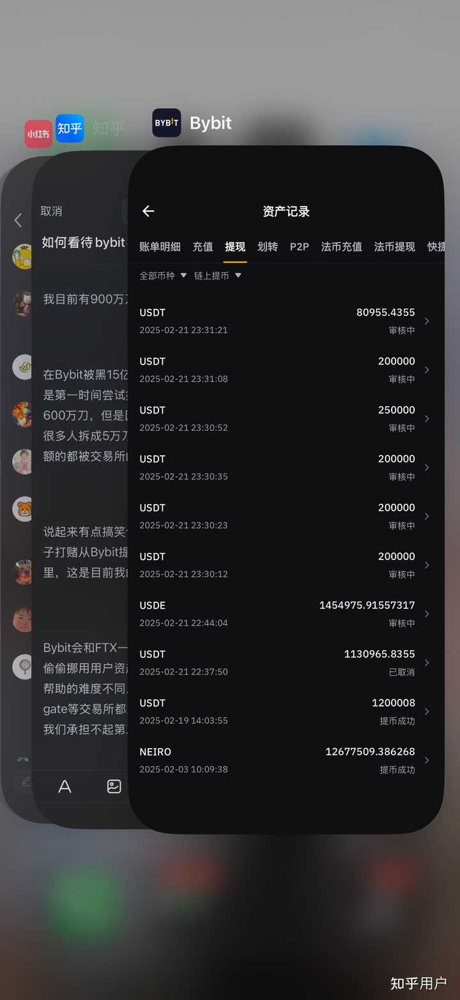

在Bybit被黑15亿刀（6%的AUM）的消息出来之后，我是第一时间尝试提现了的，两个账户加起来申请提现600万刀，但是因为金
额太大而进入了人工审核状态。很多人拆成5万刀以下的小额提现申请通过了，但是大额的都被交易所的风控拦截在需要人工审核
的步骤了。
---

## 第 16 页

说起来有点搞笑也有点幸运，前几天在知乎上为了和黑子打赌从Bybit提现了120万U出来放到了我的热钱包里，这是目前我的Bybit
方面资金唯一出来的。

Bybit会和FTX一样爆雷吗？我认为不会，因为1. FTX是偷偷挪用用户资产而Bybit是被盗，性质不同让他们获取帮助的难度不同。
今天事发之后，Bn、BG、kucoin、gate等交易所都对Bybit进行了援助。行业层面都清楚我们承担不起第二次FTX事件；把锅砸了那
大家全都没得玩。

2.现在市场环境并不缺钱，宏观层面流动性充裕，企业融资方便，15亿刀不是大问题。不像2022年末那种全球资产都在下跌、流
动性紧缩的环境了。Bybit这个体量的交易所过去一年净利润得起码30亿刀吧，Bybit自称是有足够的储备即使被黑也能1:1 cover用户
资产。后续即使真的有小窟窿Bybit从各方获取融资也都是很容易的。

为什么我要在Bybit放那么多钱？因为之前选择在bybit上做资金费率套利策略吃利息，24年末狂暴大牛的时候Bybit很多meme合约的
资金费率高于bn交易所。

基于目前的风险评估，我预计Bybit会在未来几天恢复提现，愿一切安好

其实今天发生的一切也给我再敲响一次警钟，还是要加快从币圈出金到传统金融市场的步伐。加密市场终究还是一个不成熟的市
场，无监管狂野大西部=财富转移的速度快=也伴随着高风险。

———————————————

更新在我发完这篇之后5小时后提现成功到账了平稳落地

第13篇:https://www.zhihu.com/answer/3276017872

如何判断自己是否有商业头脑？所谓有商业头脑的人应该具备

哪些素质？

赞同数: (587赞同)创建时间: (2023-11-04)

有一个很简单的办法鉴定自己的商业头脑好不好：那就是你是否对“研究赚钱的方法”这个行为很感兴趣，能在很短的时间里就把一
个商业模式了解的很透彻，并且有能力快速的去着手复制。

有一些人看了半天都不会明白一份钱是怎么赚到的，也永远都期望着有一个中介或者导师一样的角色去引导自己做事/赚钱。
——————这种情况就是没有商业头脑。

有一些人脑瓜灵光，一看就知道有商业头脑或者说比较会投机（褒义）：看到我知乎一眼就产生好奇》就去翻我之前的各种创作
找蛛丝马迹，通过看我以前装的逼把我的商业模式快速的逆向了出来〉Google上去搜我的公司名字从而找到Linkedin账户》甚至会
拿社工库人肉一下我的个人信息来找到更多线索〉会在Twitter上去看我的关注列表关注和我一样的信息源，会在Twitter/知乎上看我
的点赞记录找我有意无意中泄漏的alpha。这种人发现钱的能力就很强，也懂得怎么通过信息工具去解决问题，所以他们在互联网
上的赚钱竞争力就很强。

第14篇:https://www.zhihu.com/answer/3491656031

有的人赌博上瘾，为什么有的人不会？

赞同数: (563赞同)创建时间: (2024-05-08)

我小的时候对游戏上瘾，拿自己的过年红包+偷爸爸口袋里的累积起来差不多8000块钱充值游戏。
---

## 第 17 页

直到后来机缘巧合下，我想要自己开一个游戏服务器，做着做着，服务器做大了，在我15岁的时候我的月收入就达到了1万元。自
从我自己开了私服，我就不再去给别的游戏充值，因为我站在上帝视角知道玩家们购买的道具不过是我随便编辑几下就出来的东
西，我想要发行多少就有多少。

当你开启一个上瘾行为的上帝视角时，你就会知道既得利益者有多爽，自然就不会去参与了。

所以要戒赌也很简单，

要么，去学怎么出老千作弊

要么，去自己开一个赌场或者做代理（就是有点刑）

————————————

要是我置身于赌博行业，那么我：

要么自己开赌场

要么出老千

要么我当叠码仔

要么我去开青楼、典当行、高利贷等为赌徒服务的产业

————————————

总之横竖都不可能自己下场赌博的，道理很简单，因为长期赌下去当然会把钱输掉流入到我说的上述5种行当里了。既然是求财，
为什么非要自己赌博，去做一个从赌博产业抽水的人不香吗？

第15篇:https://www.zhihu.com/answer/1890847298

如何评价马斯克近期搅动币圈的系列举动？反映了哪些问题？

赞同数: (532赞同)创建时间: (2021-05-17)

先说结论：马斯克对于币圈的影响力并不会像很多人认为的那样会“因为马斯克失信而渐渐减弱”，相反的，我认为会越来
越强

现在每个人都发现了马斯克发利好推文就会拉盘、发利空推文就会砸盘，这会导致越来越多的人遵照马斯克的推文指示去追涨杀
跌。

随着跟风追涨杀跌的资金量越来越多，马斯克的推文对于币价的影响力会越来越被放大，然后又吸引更多的资金加入追涨杀跌的
行列，形成一个正向循环。

除非马斯克被禁止发表关于加密货币的推文，否则他的影响力会一直存在。哦对了，推特的创始人Jack Dorsey是马斯克的好朋友，
马斯克不可能像特朗普一样被封号。

只能等待SEC出手了

第16篇:https://www.zhihu.com/answer/3176034193

如何看待“少年得志大不幸这句话？
---

## 第 18 页

赞同数: (504赞同)创建时间: (2023-08-21)
看到有人说一个人最大的不幸就是年少时期的成功。不知道过来人是怎么想的？或者有没有有类似经历的人可以分享一下自己的
故事？

第17篇:https://www.zhihu.com/answer/3197310484

您能说出自己的开仓条件吗？

赞同数: (503赞同)创建时间: (2023-09-05)

正好酒后吐一下真言：

首先要找到一个市场里的散户韭菜们100%愿意接盘的事件，然后狙击这个事件的发生，在发生的一瞬间买进去，然后抛给接盘韭
菜

第18篇:https://www.zhihu.com/answer/2853037120

您有哪些个人的交易经验？

赞同数: (496赞同)创建时间: (2023-01-20)

交易或者投资也好，做生意也罢

在做一个决定之前先问问自己：

我是要做一次短期的投机，还是要做一次长期的决策？
我最多可以在本次接受什么样的损失？

然后就要给自己订一个强制止损的标准，

如果是交易，则可以使用例如“当标的的4小时收盘价跌破MA11时我就要强制卖出”，“当我的保证金维持率到达30%时我就强制卖
出”，“这笔交易当我的亏损到达50000元时我就要卖出”等等

如果是投资，则可以使用例如“当公司的财报连续2个季度为亏损时我就要卖出了”，“当这个公司的老板在一个季度后仍然在错误的
业务进军我就要卖出了”，“当股价的跌破1周或1月的MA11均线时我就要卖出了”等等

如果是生意，则可以使用例如“这账上的50万亏完我就不继续做了”，“这生意要是在半年里还是在亏损我就不做了”等等

提前给自己设置一个必须强制止损的标准，这么做是为了防止你在一次错误的决策里执迷不悟一下子就
把手里筹码输完。把手里筹码输完。有太多太多的案例，交易员也好老板也罢，本来很成功，然后突然有一天就因为一次有太多太多的案例，交易员也好老板也罢，本来很成功，然后突然有一天就因为一次
决策失误就输的倾家荡产分崩离析。

每一次出手的时候给自己留好一条后路，并且定好一个心理的止损标准，时候到了就是强制要执行。或许这种方式会让你少正确
很多次，但是，它能够防止你遇到那致命的一次错误防止你遇到那致命的一次错误。

第19篇:https://www.zhihu.com/answer/1751808893

手里有四千万怎么稳定利益最大化？

赞同数: (490赞同)创建时间: (2021-02-26)

不知道为什么有那么多人对“买房”有一种深深的执念。。。
---

## 第 19 页

如果你手里有4000万现金，我相信你是不缺自住房的，所以房子并不是你的刚需

未来房产的投资回报率也不会特别高，如果选择买房你可能能够拿到稳定的年化5%的资产增值

注意，是资产增值，不是现金流，在你没有卖出房产之前都是账面浮盈。注意，是资产增值，不是现金流，在你没有卖出房产之前都是账面浮盈。我认为买房并不是一个好的投资途径，它和存银行
定期一样是属于“傻瓜式理财”，只能勉勉强强跑赢通货膨胀，基本等于在原地踏步。

现在是2021年2月26日，

从经济周期的角度上来看，我们在2022-2023年必然会进入滞胀期，股市将会进入熊市。

如果让我在现在的这个时间点来支配这4000万人民币现金流，那我会先把这4000万全部买入货币基金获得大约年化2.4%的收益。
货币基金可以随时赎回兑换成现金，并且基本不可能亏损，储备这随时可动用的4000万现金流是为了等待接下来2022-2023年股市
的熊市。在这在这1-2年的等待期中会稍微跑输通货膨胀几个点，不过这绝对值得等待。

A股：占比25%

在2022-2023的股市熊市中（假设上证指数低于3100点），拿出1000万通过你自己的账户配置在中国的A股上，重点配置隆基股
份、阳光电源、潍柴动力、三一重工、宁德时代这种可以走出国门的高端制造业龙头可以走出国门的高端制造业龙头。

港股：占比25%

1000万通过神秘渠道换汇到香港，配置在香港上市的优质中概股，腾讯控股（最佳首选）、阿里巴巴、美团、比亚迪、小米集
团，这些都是优质的不能再优质的商业巨头优质的不能再优质的商业巨头。

美股：占比25%

1000万通过神秘渠道换汇到美国，配置在美股的优质公司中，Apple、Tesla、B站、AMD、Nvidia、Cloudflare、京东、字节跳动（还
未上市），除了Apple是偏防守型股之外，其他的几支都是拥有高成长空间的股票高成长空间的股票，将会是优秀的印钞机。

A股基金：占比15%

600万配置在中国的主动型基金上，重点关注历史收益率高且重点关注历史收益率高且2021-2022年牛熊切换中没有亏损多少甚至还能赚钱的基金经理
———他是真正靠谱的基金经理，而不是那群永远只会高呼“躺赢在优质赛道”的无脑抱团侠。

加密货币：占比10%

400万配置在加密货币现货上。比特币、替代币（ETH、DOT、ADA）、平台币（OKB、HT、BNB）、DEFI概念币（UNI、Sushi、
YFI）、匿名币（XMR、ZEC、DASH）。加密货币是相对风险较高的投资，在投资组合中配置10%，一方面作为谁也无法没收的
避险资产，另一方面他们在牛市中的超级涨幅绝对会给你一个非常意外的惊喜。

在2021年将这4000万买货币基金，在2022-2023的熊市中换成现金并做完以上的资产配置后，你就可以耐心的等待了。有这些全球
化的头部资产为你创造财富，绝对比你去什么北上广买套房强得多。并且股票、基金、加密货币都是非常易变现的流动金融资
产，你需要资金周转时随时可以将他们变现。

此套资产配置方案是建立在假设2022-2023年金融市场为熊市的情况下而设计的，年金融市场为熊市的情况下而设计的，如果熊市没有如期来临，反而当前的泡沫被
吹的更大的话，那你还需要持有更长时间的货币基金，直到蹲到股市转熊。万万不可在牛市去追高，否则的话你的万万不可在牛市去追高，否则的话你的4000万可以1
年里亏成1000万。

——————分割线————————

评论区有几个没仔细看的人，看清楚点，我明确说了要留货币基金等到2022-2023年的熊市才能去抄底建仓，明确说了不能在现在
去追高。
---

## 第 20 页

其实我无法准确预测2022年是否是熊市，但是根据宏观经济形势来看，至少在2022年那些成长股的估值会比当下更加合理，是买
入他们的好时机

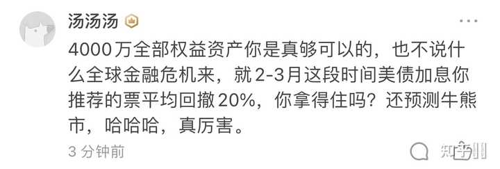

---

## 第 21 页

第20篇:https://www.zhihu.com/answer/2878644615

有钱人有什么特点

赞同数: (467赞同)创建时间: (2023-02-06)

就加密金融圈而言，我认识的白手起家赚到1000万以上的，都有一种“乐在其中”的态度。

他们可以很专注的投入自己看好的一个领域，并且孜孜不倦。

他们并不是靠“自律”和“给自己压力”去做事，而是对事业有一种发自内心的热爱就是喜欢做这个，一天不研究/写代码上几小时就浑
身难受，所以很多人即使已经赚到几辈子花不完的钱，也照样天天花很久钻研。

自身已经形成了一种正向循环，即：

努力投入事业》收获结果》满足了心理的某种需求感到愉悦》更加热爱事业

第21篇:https://www.zhihu.com/answer/2809386693

能否用一个现实的例子解释一下做市商是如何具体赚钱和亏钱

的？

赞同数: (452赞同)创建时间: (2022-12-20)

我的交易模式主要专注于从做市商身上薅钱，做为Toxic Flow的创造者我对做市商是怎么亏钱比较了解：

做市商最怕的就是在超短的时间内单边超大幅度波动、知情交易者、延迟套利者和发现与利用做市漏洞者。

做市商的角色是提供一个买卖双方的流动性提供者，它赚钱依靠的是交易标的在短时间内一个标的在特定的范围内波动，赚一份
盘口的spread价差以及交易所提供的返佣。

短时间行情大幅单边波动：如果行情在超短的时间内发生超大幅度变动，比如LUNA事件里LUNA一天暴跌了99.99%，按照
程序设定：做市商本来应该买了货之后尝试高价卖出，而行情却一直在单边下跌，那么做市商手里会留有的大量的LUNA库
存，这部分损失他们无法挽回。

知情交易者：做市商本身在市场信息上是滞后的，如果我是某一个交易标的的知情交易者，我可以在标的价格即将发生大幅
单边变动之前提前买入。比如我是内部知情人士，我知道今天下午16:00新闻发布会上会宣布国家将采购10000万吨铁矿石作
为战略储备：那么我就在15:59大量买入铁矿石期货，16:01新闻驱动市场暴涨完之后再抛售，这个时候我在期货市场上2分钟
里赚的钱，大部分来自于15:59吃下你的买单的做市商的亏损。所以做市商都很鸡贼，如果让他们感知到有人在短时间里大量
单边交易，就会把盘口的spread改的特别大。如果你是知情交易者，最佳的下单方案是短时间一下下一个大单把盘口的一个
范围吃下，而非在一段时间里TWAP。

—延迟套利者：虽然做市商往往有交易所的独家colocation，但是也保不准速度最快，延迟套利者在做市商还未感知到行情发生变
化之前就下单在多个不同的交易所进行对冲。他们的每一份利润都来自做市商的亏损。

-发现做市漏洞的套利者

典型的例子是FTX之前的OTC报价与外界市场有10秒的延迟，所以只要在波动足够大的场景下就能够在OTC交易中套利，赚做市商
定价错误的价差。
---

## 第 22 页

还有我记得一个被FBI刑了的案例是在美股有一个人发现了做市商的算法漏洞，用订单簿的spoofing来诱导做市商对价格进行指定方
向的调整，然后他靠这个赚了几千万美元最后被fbi上门服务了。

第22篇:https://www.zhihu.com/answer/66024665351

为什么在有钱人的圈子里，会相信玄学？

赞同数: (445赞同)创建时间: (2024-12-28)

我不相信我也没见过哪些我认识的有钱人相信

我所处的群体是年轻的新兴富豪群体，在最近5年内发家致富，所处行业：互联网、加密货币、跨境电商

在我看来，成功依靠的是1%的运气+聪明的商业头脑（50%）+执行力（25%）+勤奋（24%），我的圈子里的人也大都认同这个

这其实是文化差异，你只会看到中国经常强调“发家致富天注定”，因为中国历史上就一直相信“天命”这个东西。所以如果你接受的
是中式文化熏陶，那自然会相信这个。

换到泰国等佛教国家，人们相信“富有是上一辈子修的福报”或“虔诚的供奉一个特定的神明之后获得的保佑”

换到西方，人们就相信“上帝帮助那些自助者”，强调个人能力的重要性

当然我知道很多人说也说不通听也听不进去你继续保有你的关于获取财富的信仰就好了。

你无法：

-去说服信基督教的人说上帝不存在

-去说服穆斯林说阿拉不存在

-去说服佛教徒说佛祖不存在

-去说服信仰天命的人说天命不存在

-去说服唯物主义者说有神明

根深蒂固的观念差异让我们无法互相说服。

第23篇:https://www.zhihu.com/answer/3492244302

资产上亿的富人会担心被歹徒绑架吗

赞同数: (438赞同)创建时间: (2024-05-09)

以前我不担心，但是随着资产越来越多，我开始担心。

因为我知道这个世界上有很多人缺钱：

-他们可以为了100-200万连命都可以不要愿意卖身上所有器官

-他们可以为了几百万，冒着被判10年+的风险去当职业背债人

绑架一个身价上亿的有钱人如果事成至少能赚1000万吧，如果有机会这个世界上有很多人愿意这么干也不怕坐牢的。
---

## 第 23 页

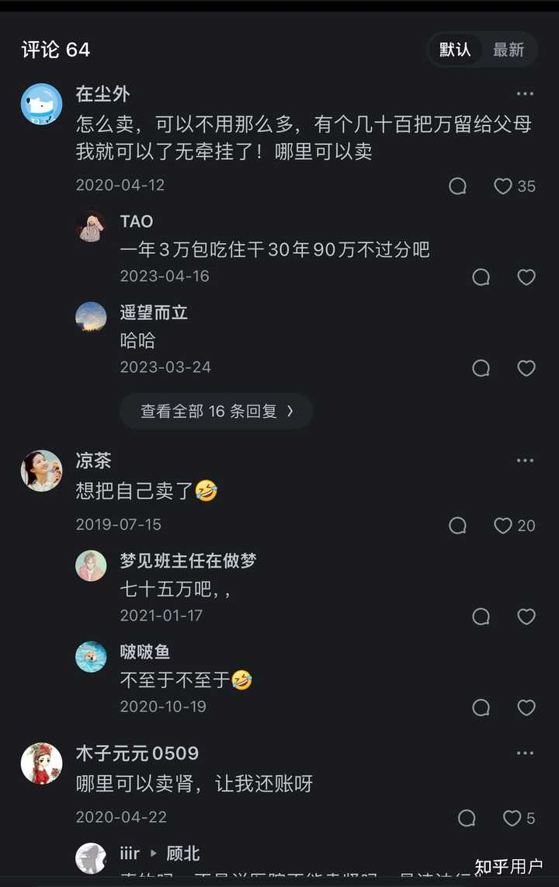
---

## 第 24 页

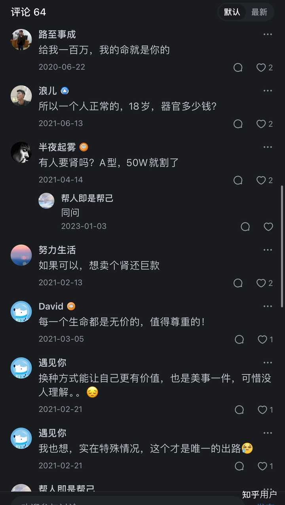

所以我在异国他乡一方面很低调，一方面出行只住高端社区和高端酒店，因为在这种地方安保措施好且住客至少十几户是亿万富
翁，没有什么歹徒会针对性的来绑架你

有很多来泰国的数字游民会选择去清迈、普吉岛，因为那里可以认识更多志同道合的人。但是对我来说我不想去这些地方生活，
因为我不想在我生活的地方结识同行业的人。针对币圈富豪的绑架案，大部分都是熟人作案。

第24篇:https://www.zhihu.com/answer/1943172729

赚钱的逻辑是什么？什么规律或观念使人与人赚的钱产生了巨

大差别？

赞同数: (429赞同)创建时间: (2021-06-16)

最好的赚钱方式就是不要去陷入内卷，去找到那个其他人想不到的地方，在那里散发光芒。一般来说这种机会要么是跨行业，要
---

## 第 25 页

最好的赚钱方式就是不要去陷入内卷，去找到那个其他人想不到的地方，在那里散发光芒。一般来说这种机会要么是跨行业，要
么就是在新兴市场。

新兴市场的例子

1930年代的白求恩在加拿大可能只是一个能力稍稍出众医生，但是他来到当时落后的中国，就能被当时的中国人民誉为神医、成
就一段佳话。

一个普通程序员在中国属于普通水平，但是把他拿到非洲落后地区去那就是妥妥的顶级专家、稀缺人才。

一个拥有计算机+金融双重能力的人如果选择在美国股市做程序化交易，可能收益都跑不赢标普500，因为他面对的竞争对手是全
世界最成熟的资本市场中的全世界最聪明最顶级的那批人。

如果他选择在中国股市做程序化交易，那么年化收益率就很可能超过20%到达比较优秀的水平了。在中国股市，他面对的对手是
30%的机构+70%的散户。

如果他选择在加密货币市场做程序化交易，那么年化收益率很可能超过100%达到超级优秀的水平。因为在加密货币市场，他面对
的对手是10%的机构，90%的散户。

跨行业的例子

一个普通程序员跑到互联网公司可能只有1-2万的月薪，但如果他带着能力跑到潮牌潮鞋圈，开发爬虫程序帮助黄牛们抢购鞋子，
他一个月可以赚几十万元。

国内一个优秀程序员最多在行业内打打工拿十几万的月薪，但如果他带着能力跑到白酒行业，用程序员思维去做全新的白酒品
牌，他一个月可以赚上千万元（观云白酒）

第25篇:https://www.zhihu.com/answer/1917201863

有1000万怎么理财

赞同数: (418赞同)创建时间: (2021-06-01)

以下是我个人2021年将会使用的资产配置方案部分内容，仅讲述了现金类资产的配置。年将会使用的资产配置方案部分内容，仅讲述了现金类资产的配置

在我自己完整的资产配置中还会在量化交易、做市、合约套利、做空等等领域上赚取Alpha收益，这些领域要求的门槛较高不适合
普通人涉足，我就不分享了。

现在是2021年6月1日，

这篇写给我自己，也写给其他需要在2021年中旬这个时间点配置资产的人作为参考资料

首先要弄明白两点核心奥义，

1.在2021中旬当下这个时间节点，大量配置任何风险资产都不合适，今年适合防守，适合配置更多在流动性好的低风险资产流动性好的低风险资产上。

因为市场即将面临一大金融灰犀牛的挑战：流动性收缩流动性收缩。首先是美联储会在今年下旬开始讨论缩减量化宽松规模，在当下资产被
高估的大环境中很可能会造成Taper Tantrum（QE缩减恐慌症）2.0版本，让风险资产尤其是美元代替品产生大幅回撤。具体影响可
以参考2013年5月23号美联储宣布要缩减QE规模以后的中国上证指数的表现，可谓是飞流直下三千尺，疑是银河落九天。
---

## 第 26 页

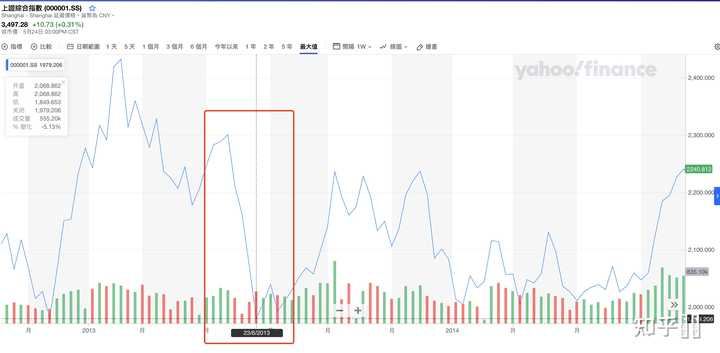

2013年6月上证指数直线下坠

其次，中国信贷增速已经开始大幅减缓，中国政府喜欢使用“逆周期调控”，也就是在经济稍有萧条或者过热的苗头时就会开始调
控。由于中国政府的经济政策调整相较宏观经济周期具有一定的提前性，这使得中国信贷指标相对于世界其他国家经济体也具有
领先性，在本轮2020-202X新冠周期大概领先世界其他国家1-2个季度，中国开始缩减信贷投放意味着全世界接下来的1-2季度也会
开始跟进缩减信贷规模，对风险资产的估值造成风险。

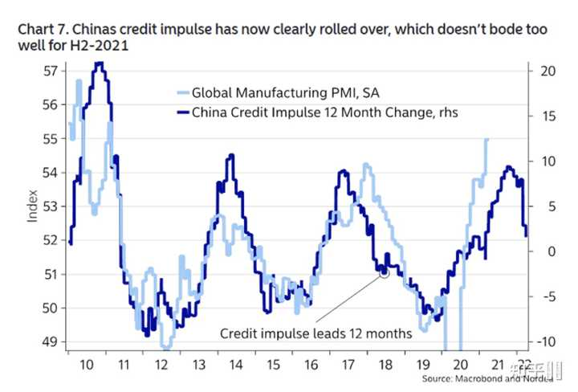

2.必须能跑赢通货膨胀

由于世界主要经济体在过去一年采用大量投放货币的方式来刺激经济，通货膨胀不可避免的到来。

今年美国的CPI和PPI都双双爆表

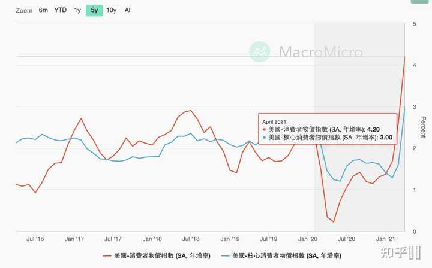

资本增长率至少需要达到3%以上才能在2021年跑赢通货膨胀，如果你的整体资本增长达不到这个标准，那么你实际上是在缴通货
---

## 第 27 页

膨胀税。

人民币现金资产：

500万存入支付宝的余利宝至尊版，这个余利宝至尊版的性质是中航信托，产品名称叫：天玑臻宝。100万元起投，属于风险
非常低的信托，投资范围是：银行存款、货币基金、债券基金和债券回购。年化投资回报率3-4%左右浮动，收益率很大程度
上接近中国10年期国债收益率。和余额宝一样，是可以随时买入与赎回的产品，可以随时提现到银行卡，每天有200万元的
转入银行卡0手续费额度。我个人这么喜欢这款产品是因为它在保障了安全性的同时也可以保障足够好的流动性，遇到合适
的投资机会我可以随时提现出来干它一把。

美元现金资产：

300万换成USDT/USDC/BUSD/DAI等稳定币存入币安交易所的流动性挖矿池，流动性挖矿就是自动做市商，赚提供流动性的
手续费。之所以选择存入币安交易所而不选择defi平台是因为我认为现阶段defi技术还不够成熟，哪天代码有漏洞被黑可不好
玩。币安在安全性方面还是首屈一指的。这部分在币安的美元现金资产的年化投资回报率在8%-15%左右，可以随时赎回，
随时变现。
100万换成USDT/USDC/BUSD等稳定币存入币安联合Compound搞的defi借贷池，defi借贷说白了就是区块链上的P2P。
Compound是最大的去中心化P2P平台之一了，代码的安全性是首屈一指的。这部分的年化回报率在7-13%左右，可以随时赎
回，随时变现。
100万换成USDT/USDC/BUSD等稳定币存入币安的币安宝，币安宝的性质是币安交易所内部P2P借贷，相当于你借钱给有需要
使用资金的用户。币安宝的安全性比Compound高，但是收益率也少一些。年化回报率在6-7%左右，可以随时赎回，随时变
现。

美元稳定币我建议尽可能使用BUSD或者USDC，这两个美元稳定币一个是币安（世界上最大的交易所）推出的，一个是
Coinbase（美国最大交易所，美股上市公司）推出的。

比USDT的背景更靠谱，USDT指不定哪天就会暴雷。

综合下来，这套让你躺在家什么事都不用干天天等着收利息的人民币+美元现金资产组合方案的年化回报率是5.2-8.5%之
间。

操作简单门槛低√

收益率高，风险较低√

中国与海外配置平衡√

机动性充分，可以随时充提√

可以确保在收益率不低的同时，若全球金融市场发生巨大回调时可以从容的取钱出来抄底。

注意

这个策略是临时性的，也是择时性的

押注类现金高流动性资产的目的是为了躲过接下来潜在的权益市场大幅回调风险

2022-2023全球金融市场会出现非常好的买点，需要好好把握

第26篇:https://www.zhihu.com/answer/16381735675

出国给你最大的感受是什么？
---

## 第 28 页

赞同数: (401赞同)创建时间: (2024-10-28)

这就像：你有一个爱管着你的妈妈，什么事都要管、控、严，而且爱搞“枪打出头鸟”、“木秀于林风必摧之”。被她管着的时候是挺
烦，你离开了她之后，她管不到你了，你会感到她挺好的。

偶尔节假日回去看看她可以，长期接触还是受不了的

可以理解她的管，因为她管所以她把家里搞的井井有条有秩序，但是别来管我这名游子就行。

上述这段话，深入一下来表述：你有一个妈妈她让家里所有孩子都必须强制做家务所以家里被收拾的干干净净整整齐齐。后来你
成为了一名在外漂泊的游子偶尔回一下家看到家里干净整洁还是挺开心的因为不用你去做家务

第27篇:https://www.zhihu.com/answer/3475553528

如何看待有钱人都往国外跑

赞同数: (401赞同)创建时间: (2024-04-23)

我就是一个往外跑的有钱人，我的情况：

1.我所在的crypto行业目前不涉及犯罪，但是也不是很合法，这感觉就像头上悬了把达摩克利斯之剑有一天可能落下。

2.我所赚之钱皆来自虚拟行业的资本投资，不符合“实业兴邦”、“劳动致富”、“共富”的当下XX主张。总是有一种不安全感，正如一
位答主所说“像一头肉猪”
---

## 第 29 页

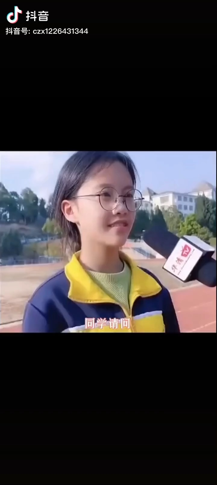

https://www.zhihu.com/video/1777351399296696320

3.在海外置业是因为我想和那些在海外的俄罗斯、伊朗人一样，可以在世外桃源不参与自己不想参与的一些事情。当在未来某些
事情发生的时候，我能够置身事外隔岸观火。
---

## 第 30 页

第28篇:https://www.zhihu.com/answer/105002650041

做一名白手起家赚到10亿人民币的00后是什么体验？

赞同数: (391赞同)创建时间: (2025-02-19)

本来我提这个问题就是为了【等后面有哪个00后达成10亿成就之后来回答】，我是提问者，我还没赚到10亿，我抱着【谁先赢比
赛呢】的竞争心态来提问，想不到炸出很多小酸子在质疑，那我不得不提前回答一下这个问题了，我最喜欢做的就是拿货真价实
的实力XX妨碍我炫富的酸子了

顺便透个底：我的资产10亿差得远，但是我3亿+是有的，具体什么数字我不会透露

——————证明环节————————

链上可查地址：0xaf0c57295e243f33cf82f3c65bd49716a71ba59c

如何证明此地址是我的：我刚刚用这个地址注册了个ens域名：00rich.eth

另外我会在这个地址放120万USDT为期5天，从2025.2.19开始存放，到2025.2.24之后我会提走

链上资金流入流出皆可查

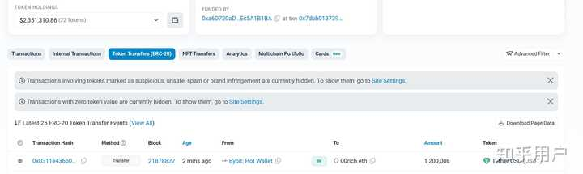

链上资产证明，酸子说话？

另外，你但凡是华语币圈的交易员，应该就不会不用我旗下的媒体：方程式新闻

如果你知道方程式新闻，那么也大概率知道我这笔公开的战绩：

上币2秒后买入ACT获利千万，「新闻交易」是如何实现的？-深潮TechFlow

再随随便便晒几个总值1.5亿人民币的美股和币圈账户吧
---

## 第 31 页

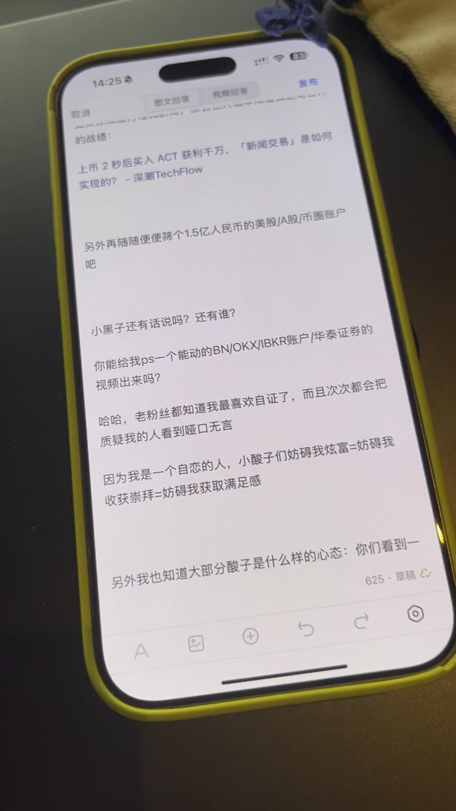

1.5亿实盘证
明https://www.zhihu.com/video/1875568167197216768

小酸子还有话说吗？还有谁？

你能给我ps一个能动的BN/OKX/Bybit/IBKR账户的app出来吗？

哈哈，老粉丝都知道我最喜欢自证了，而且次次都会把质疑我的人看到哑口无言

因为我是一个自恋的人，小酸子们质疑=妨碍我炫富=妨碍我收获崇拜=妨碍我获取满足感

另外我也知道大部分酸子是什么样的心态：你们同样也是自恋的人，然后看到一名00后赚了几个亿还经常炫耀，就会感到一种咬
牙切齿的威胁感和焦虑感，然后内心就会产生一种想法：“这个人要么是造假要么是靠运气赚的钱”来宽慰你们的内心。

——————受@夜晚中的星空猎人邀请，再亮1000万人民币国内资产证明——————
---

## 第 32 页

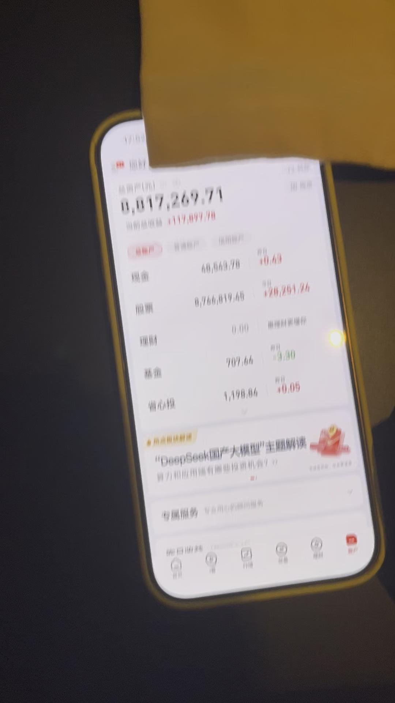

国内1000万资产证
明https://www.zhihu.com/video/1875620417227603968

玩的就是真实

不知道你说话算不算话呀

第29篇:https://www.zhihu.com/answer/70841615472

如何评价「马斯克改网名引爆Meme币市场」？

赞同数: (357赞同)创建时间: (2025-01-03)

没有商业思维的人只会抱怨“马斯克操纵市场”、“马斯克玩弄人民群众”

有商业思维的人会思考：人民群众那么喜欢买和马斯克有关的概念，那我怎么样在下一次马斯克改名或者发好玩的meme的时候，
---

## 第 33 页

在第一时间（1分钟内）发现并去发行一个meme币或者第一时间去交易已有的meme币。然后抛售给后知后觉买进来的韭菜，把那
群笨笨的家伙的钱收割到自己的口袋里

第30篇:https://www.zhihu.com/answer/3492278647

币圈用什么手机

赞同数: (346赞同)创建时间: (2024-05-09)

涉及到放了大额币的设备，我只用苹果的产品。

苹果手机，苹果电脑，美区ID。

安卓和Windows都有一个毛病，你不需要告诉别人解锁密码，人家插一根东西上来就能直接读取你设备里的信息。

另外大部分木马病毒、粘贴板替换木马、假钱包app、钓鱼假tg应用都是根据安卓和windows研发的。

对于爱折腾各种磁盘加密的计算机极客你们当我没说别杠，但是对于币圈的普通人来说，买最新一代的苹果+设置非常用密码就是
最安全的便携式储存你的钱的方式。

第31篇:https://www.zhihu.com/answer/3528048646

当前我们处于通缩还是通胀，或是滞胀？

赞同数: (344赞同)创建时间: (2024-06-12)

很简单，2022-2024的主题是：

欧美国家在通胀，

中国在退缩。

所以你会发现海外的商品价格在上涨，而中国的商品价格在下跌。

主要涉猎海外业务的企业都发展的不错，

专精本土的业务则一言难尽。

海外富人的钱在变多，中国富人的钱在变少。

第32篇:https://www.zhihu.com/answer/1890004512

如何评价马斯克暗示要卖出特斯拉持有的比特币？

赞同数: (314赞同)创建时间: (2021-05-17)
---

## 第 34 页

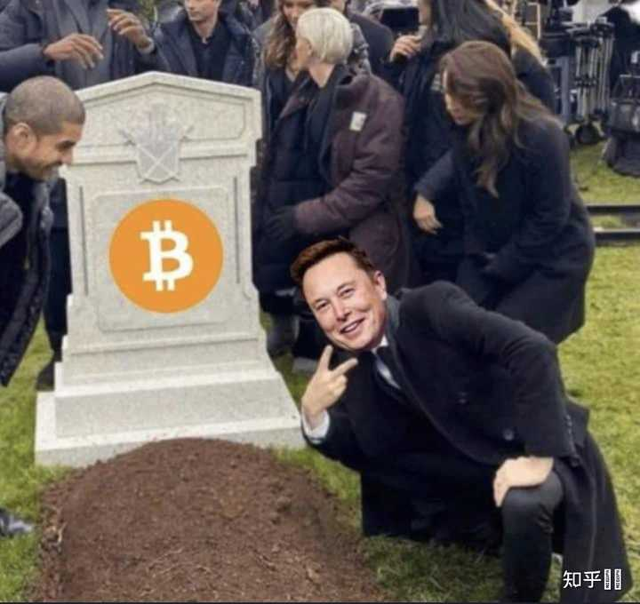

作为一名当下比特币的坚定做空者，我这段时间一直都在关注外网舆论。

我来和大家梳理一下这件事情的来龙去脉，为什么马斯克要连续放出重磅利空。

首先分清楚目前币圈的两大阵营，散户派和机构派。

散户派的代表人物是Elon Musk与The Chairman（WSB运动领袖），主要看多的币种为Dogecoin。

机构派的代表人物是灰度基金创始人Barry Silbert、Microstrategy创始人Michael Saylor、币安CEO赵长鹏，主要看多的币种为比特币、
以太坊、莱特币等公认的价值币

散户派和机构派一开始可以友好的相处，直到5月初币圈开始出现”动物园盛况“，具体的表现为Shib、Pig、Akita等以动物为名字的
小市值币种开始有几十上百上千倍的涨幅，这让很多机构派的人纷纷表示不爽。试想一下，你是一个机构，辛辛苦苦做项目、与
时间做朋友、普及区块链技术、投入大量真金白银在价值币上坐庄，一年下来赚10倍涨幅。结果突然进来一群什么都不懂的小白
散户随便乱买买就获得数倍于自己的收益，这些动物币泡沫崩盘的时候还会把市场情绪也给带低落，甚至还可能会吸引更严厉的
监管，简直就是一群来砸场子的，你作为一家机构你会开心吗？

导火索-币圈的萨拉热窝事件（2021.5.8）

终于，在美国时间5月8号，马斯克上台Saturday Night Live演出时，灰度基金的创始人Barry Silbert突然放话说已经开始做空
DOGE，DOGE的价格应声大跌。从高点回撤近40%，许多使用了杠杆的散户赔的血本无归。
---

## 第 35 页

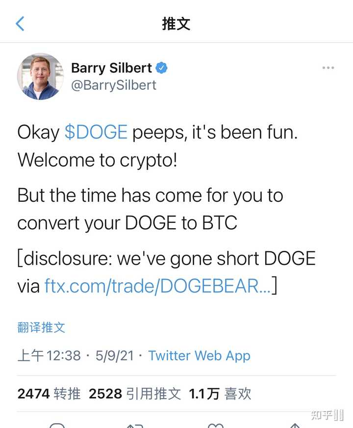
---

## 第 36 页

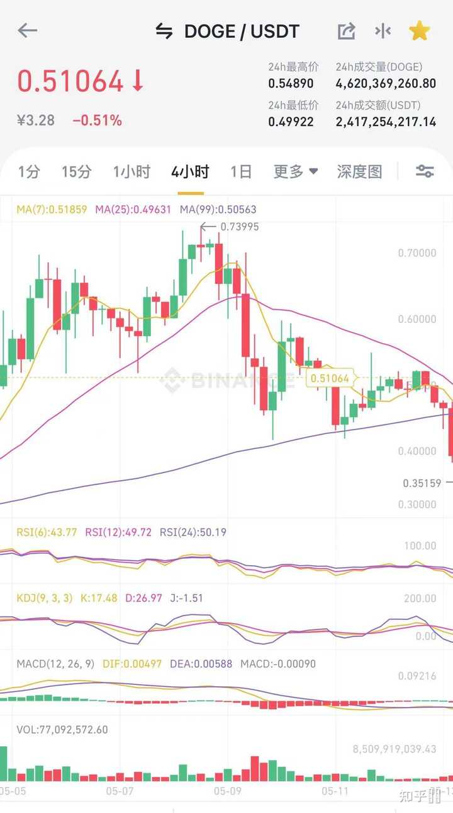

马斯克这名Dogefather本来高高兴兴上著名电视节目，是一个大喜的日子，应该欢天喜地迎接All time high才对，结果却让散户投资者
和一众马斯克的信徒们被泼了一脸冷水，许多被接近腰斩的散户们都跑到马斯克的推特下留言”救救doge“。马斯克本身就非常讨厌
对冲基金做空一个标的，结果自己最心爱的doge居然在大喜的日子被比特币巨鲸灰度做空，币价被重挫。

这相当于是机构派对散户派的直接宣战：战争，开始了！

备战状态（2021.5.11）

在3天后的美国时间5月11号，马斯克发起一则推特投票，调研是否想要特斯拉支持Doge支付，Doge价格应声大涨。这算是一个聚
拢散户人心的利好消息，相当于是接下来的全面开战做好了准备。
---

## 第 37 页

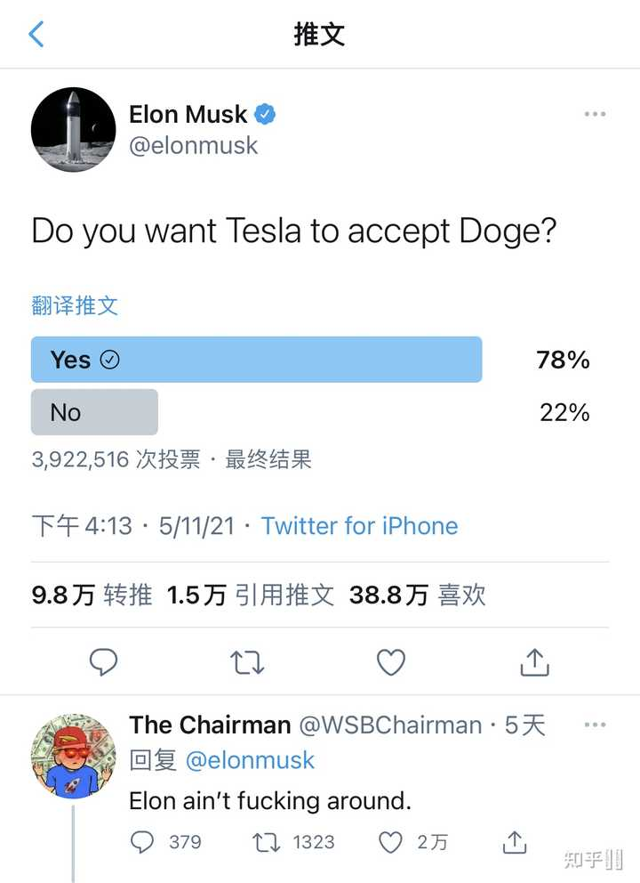

双方正式宣战（2021.5.13）

马斯克在5月13号发布了一则推特，声称因为出于比特币对环境污染的考虑，要暂停特斯拉支持比特币支付。比特币价格受到这则
利空影响，当天重挫17%，总市值流失上千亿美元。就是从这一天起，许多价值币的投资者开始对马斯克产生敌意，也有越来越多
的价值币投资者开始发表言论攻击Doge与马斯克。很多价值币的投资者都认为马斯克这种行为是在操控市场，马斯克让区块链变
得”中心化“。在这一天，散户派和机构派正式势不两立！
---

## 第 38 页

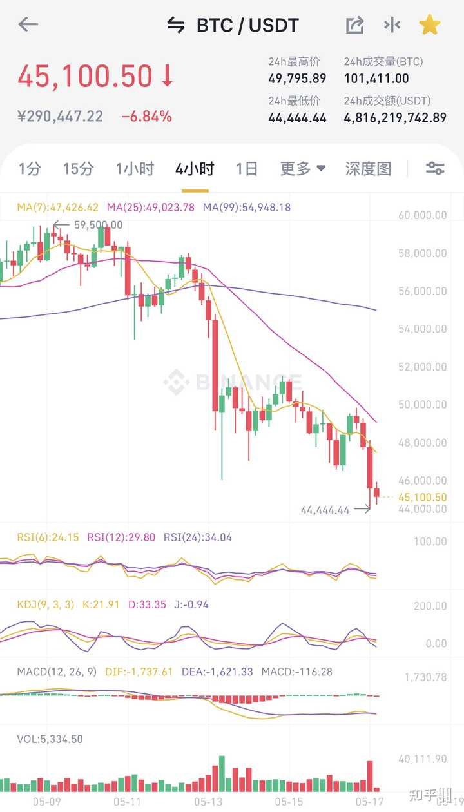

全面战争（2021.5.14-现在）

5月14号，币安CEO赵长鹏表示他已经取关了马斯克的推特

5月14号，马斯克表示正在和Doge的开发者们一起改善doge转账体系的效率。

5月14号，大量价值币的投资者开始纷纷表示要阻止马斯克”操控市场“，并表示”doge是垃圾币“

5月16号，Michael Saylor表示世界需要的是比特币，而不是Doge。

5月16号，马斯克表示如果doge的区块确认速度快10倍、区块大小增加10倍、节约100倍的手续费，则它可以赢。

5月16号，莱特币的核心开发员之一认为马斯克说的上述功能根本无法实现，doge也根本用不上这么快的网络。
---

## 第 39 页

5月16号，马斯克反驳说”我是paypal的创始人，我比你更懂在线支付“

5月16号，马斯克被质问doge币的过度中心化怎么解决。

5月16号，马斯克被大量著名币圈技术人员、机构投资者质疑，他们都认为doge是没有用的垃圾，马斯克不应该一直保护着这么一
个垃圾币。

重磅戏来了！

5月17号凌晨，马斯克表示“那些讨厌的言论让我想All In Doge”

5月17日凌晨，马斯克评论Michael Saylor的比特币奶文说”他应该在万圣节的时候穿着印着比特币logo的性感长裤“，马斯克直接讽刺
了比特币的信仰者。

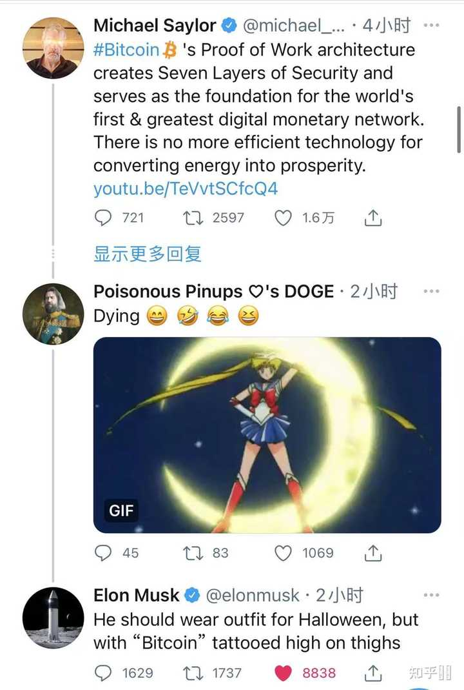

5月17日凌晨，马斯克又指出比特币实际上是高度中心化的。言下之意是：”你们这群比特币的狂热信仰者没有资格说doge不好，比
特币也不是什么好东西“
---

## 第 40 页

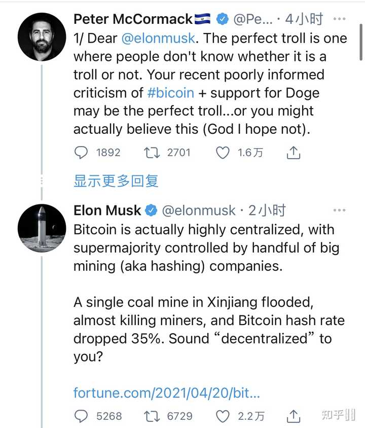

5月17日凌晨，有越来越多的比特币信仰者开始骂马斯克，马斯克的推特留言全是一片来自HODLER的骂声。

于是他直接使用大招，暗示：特斯拉会在下一个财报发布日清仓比特币
---

## 第 41 页

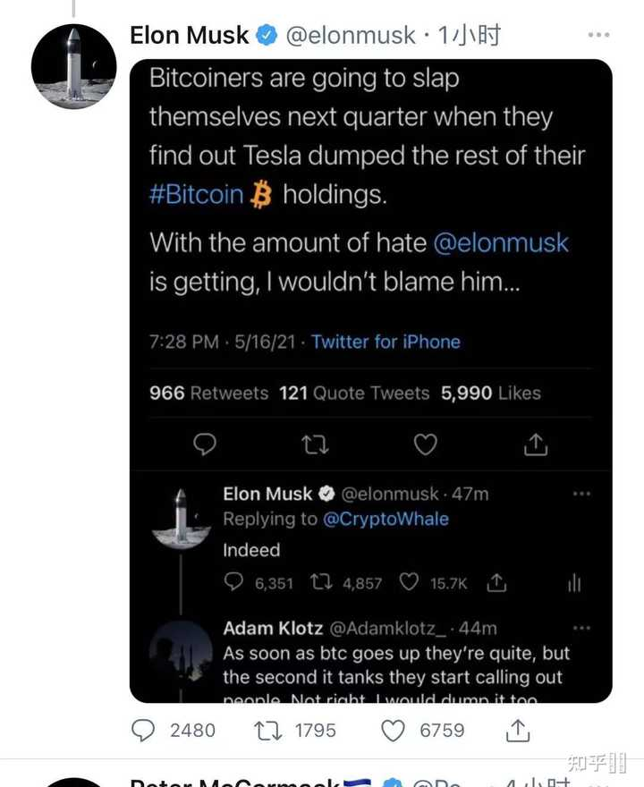

如此重磅的利空消息，很快就让比特币价格重挫。
---

## 第 42 页

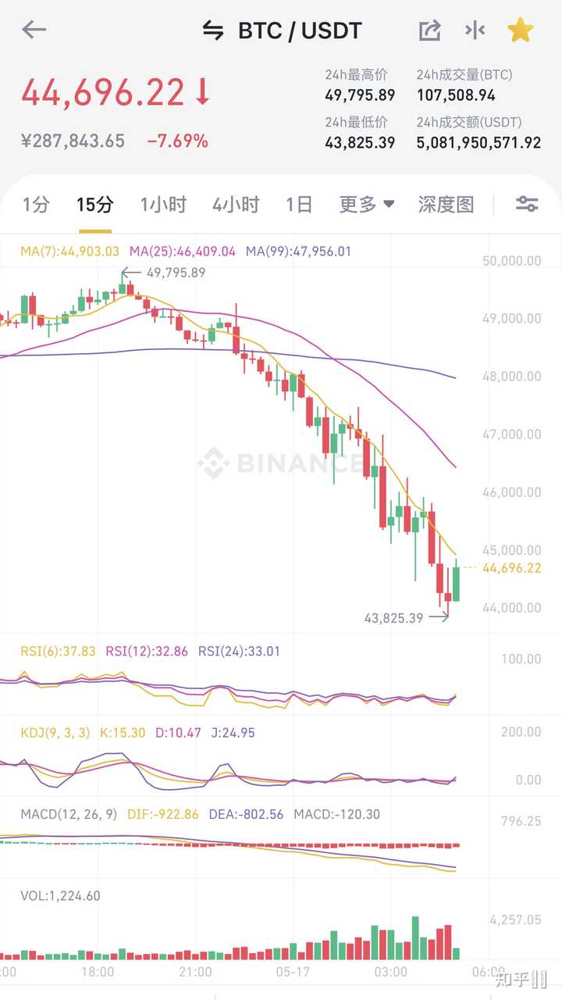

比特币24小时最低价格达到了43825，惨不忍睹

评语：

比特币之牛市成也马斯克，败也马斯克。

如果不是马斯克在1月末宣布特斯拉支持比特币支付、特斯拉开始囤比特币，那么比特币就无法走出1月份的下跌趋势，再赶上2月
末的纳斯达克股重挫，比特币牛市多半就会在2、3月份草草结束。
---

## 第 43 页

如果不是马斯克5月13号宣布特斯拉暂停比特币支付，那么比特币也许可以再次尝试冲击6万美元关口，也许这场疯狂的盛宴还可
以继续被延续，如果不是马斯克今天暗示特斯拉会出售比特币，那么比特币也许可以在5万美元的关口企稳。

神仙打架，凡人吃瓜。

作为一名很早就开始做空比特币的空军，我是感到非常开心的。

第33篇:https://www.zhihu.com/answer/17011387434

你怎么看待“木秀于林，风必摧之这句话？

赞同数: (302赞同)创建时间: (2024-10-28)

文化糟粕。

什么枪打出头鸟、什么木秀于林风必摧之，都是很奇怪的。凭什么做得好了就得低调，不低调了你就想来摧毁

人类文明的推进就是靠那一个个出头秀木而不是守着自己一亩三分地的稳定盘

第34篇:https://www.zhihu.com/answer/3285666378

被老师打，是一种什么体验？

赞同数: (282赞同)创建时间: (2023-11-12)

我初中里的时候，我的数学特别差班里倒数的那种。

那时候数学老师经常拿1米的大黄尺子打人而且口出各种脏话，而成绩倒数的我自然老是被针对。后来有一天她又来打我，实在忍
无可忍当场把她的尺子抢过来，折了，和她说“你再打一个试试看？”。

于是乎，被叫家长—》但是我的家长不但没有说我，反而把老师数落了一顿，说老师本来就不应该打人。从此以后我再也没有被
那个老师打过，真痛快。

后来因为成绩不好没法去上普通高中，所以读了国际学校，开启了我的传奇之路，折断那把压迫人的尺子是我这辈子做过的最正
确的决定之一

———————————————

体验过公立学校和私立学校的差别之后，我是不会让我的孩子上公立学校的，因为公立学校的那套系统的设计机制就是强制的把
一个人塑造成社会需要的标准模板样子，而我想要我的孩子在他热爱的领域里成为最顶级的专家or能够整合多个专家的通才。

如果我的孩子因为校园霸凌他人、主动骂老师、浪费食物等违反公序良俗的行为而被打，我可以接受。如果是因为学习不好、题
目做不出等原因被打，被我知道了，我的小孩是怎么被打的，我就怎么打老师。

第35篇:https://www.zhihu.com/answer/3491649240

怎么样才能真正戒赌

赞同数: (280赞同)创建时间: (2024-05-08)

我小的时候对游戏上瘾，拿自己的过年红包+偷爸爸口袋里的累积起来差不多8000块钱充值游戏。

直到后来机缘巧合下，我想要自己开一个游戏服务器，做着做着，服务器做大了，在我15岁的时候我的月收入就达到了1万元。自
---

## 第 44 页

从我自己开了私服，我就不再去给别的游戏充值，因为我站在上帝视角知道玩家们购买的道具不过是我随便编辑几下就出来的东
西，我想要发行多少就有多少。

当你开启一个上瘾行为的上帝视角时，你就会知道既得利益者有多爽，自然就不会去参与了。

所以要戒赌也很简单，

要么，去学怎么出老千作弊

要么，去自己开一个赌场或者做代理（就是有点刑）

第36篇:https://www.zhihu.com/answer/1757407881

A股现在有哪些严重被低估的股票？

赞同数: (264赞同)创建时间: (2021-03-02)

2021.3.2

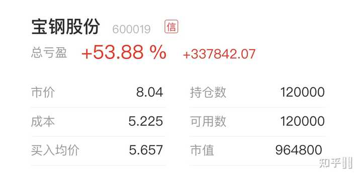

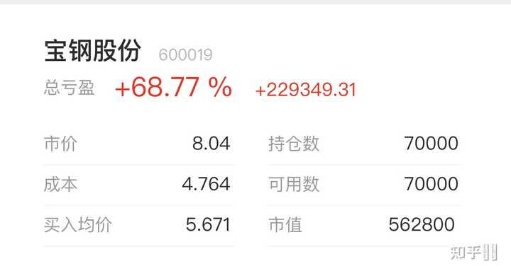

利益相关

我认为目前被严重低估而且还处在价值洼地的股票是宝钢股份（600019），它是我A股账户持有的第一大重仓股———中国钢铁行
业真正的龙头老大，北上持股：北上持股：6.83%

主营业务是冷轧碳钢板卷、热轧碳钢板卷顿与钢管等各类钢铁产品。

2020年Q1-Q3由于通缩导致的钢铁产品价格下跌+市场需求减少导致业绩大幅下降，

但是从Q4开始，伴随着钢铁产品价格大幅上升与需求端回暖，宝钢股份的业绩已经体现出超级大幅度的回升。
---

## 第 45 页

在4月底将会公布的2021年Q1财报上将会体现超级超级优秀的业绩！！！受益于1季
度的钢材价格，2021年1季报预计会比2018年Q1的业绩还要高出20%左右！！！

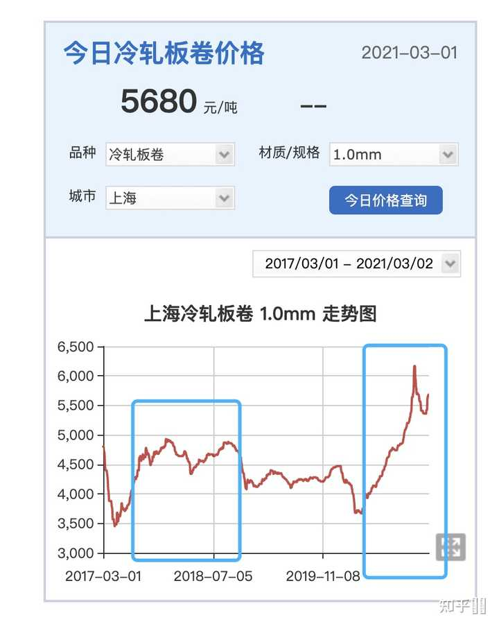
---

## 第 46 页

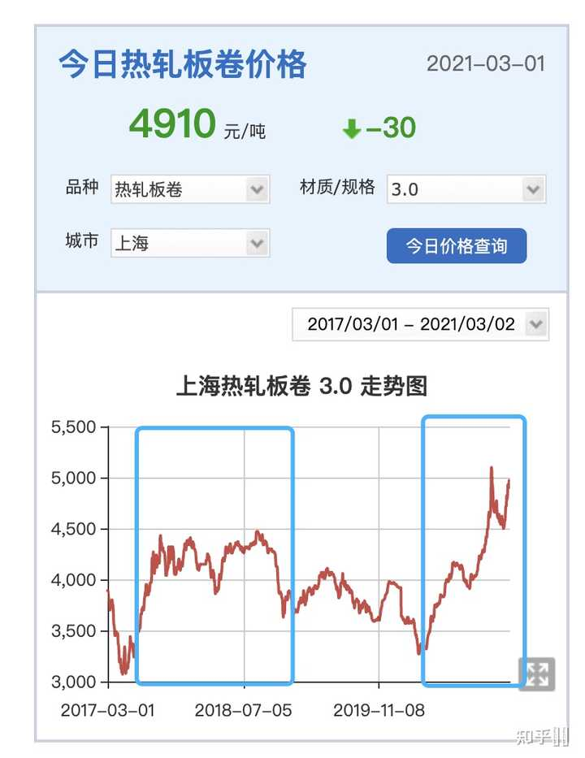

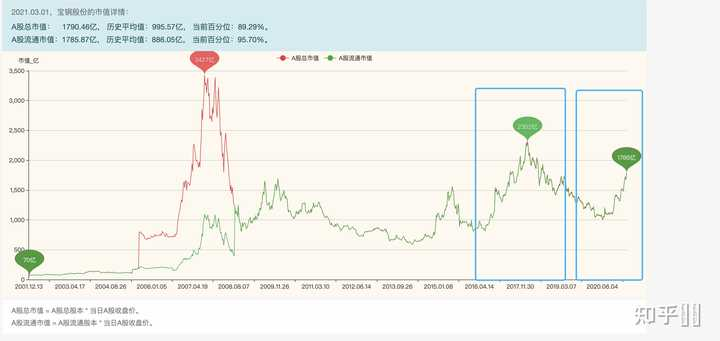

宝钢股份历史股价

全球大放水产生的大宗商品顺周期使宝钢股份的Q1预期业绩将会比2018年Q1股价巅峰时还要高出20%左右，而目前总市值
1786亿才只有2018年前高的77.6%

我认为其合理估值应该在10元以上。

考虑到目前资本市场的流动性充裕带来的流动性溢价+龙头股溢价

我的心理预期目标价是11.46-13.75

但还要持续跟踪后市行情，视行情而定
---

## 第 47 页

第37篇:https://www.zhihu.com/answer/2452692352

就高频量化交易系统而言，据说rust作为主要面向安全的高性

能计算编程语言，比c++要强，这个是真的吗？

赞同数: (257赞同)创建时间: (2022-04-22)

国内的股票期货之类的我不了解，但是我们团队最近一个月有开始尝试用RUST做crypto的延迟套利

目前使用后的感想：

同样的逻辑RUST的处理速度是nodejs和python的10倍以上，速度层面比肩C++应该没问题
同样的逻辑和并发量，RUST程序的CPU占用率比python和nodejs写的程序低很多，不知道是什么玄学原理
RUST可以单进程调用系统的多个CPU核心，所以做低延迟+密集计算型的程序很合适

RUST开发遇到问题了会很麻烦，基本上能解决问题的文档都是英文的，而且遇到小众问题就基本没有现成的解决方案了，
都要自己实现，所以对开发人员的英文与技术能力要求很高
交易所对于RUST的支持是0，没有任何交易所有现成的库可以调用，全靠开发员手撸，这是它的缺点

综上所述，站在一个PM的角度，使用RUST做低延迟量化交易没问题，只要：

你的开发员能力够强并且愿意钻研
心理做好同类型项目开发进展比其他语言推进的慢一些
你的项目没有必须要和其他某个语言写的组件对接的需求（nodejs除外，rust对nodejs的兼容不错）
你的项目没有追求纳秒级这种极限延迟的需求，因为这可能要硬件的什么特殊定制而rust实现起来很难？（我对这一块技术
层面也不了解）

第38篇:https://www.zhihu.com/answer/1728529356

现在没有上比特币的，是不是要等下一轮了？

赞同数: (251赞同)创建时间: (2021-02-13)

总有一帮上车早的镰刀会来忽悠新韭菜在BTC 40000美元+的价位接盘

比特币是一个好的投资标的，但是现在的它就是太贵了，不适合上车。目前46000USD+的价格大概率属于3-5年内的顶部区
域，没有必要去当那山顶接盘侠。

不如等几年泡沫破裂后再去抄底，不要心急，该来的总是会来的。

亚马逊是好公司没错吧？

它在1999年末股价巅峰有113美元，2002跌到了6美元，直到2010年才让那批被套在山顶的人解套，而现在亚马逊每股是3277美
元。

你可以在1999年买在山顶113美元/股，拿到现在大约翻了30倍

也可以在2002年抄底在底部6美元/股，拿到现在大约翻了540倍

1999年忽悠人上车亚马逊套在山顶的专家当然可以自豪的在现在说“看吧，长期持有优质资产，赚了30倍呢！”
---

## 第 48 页

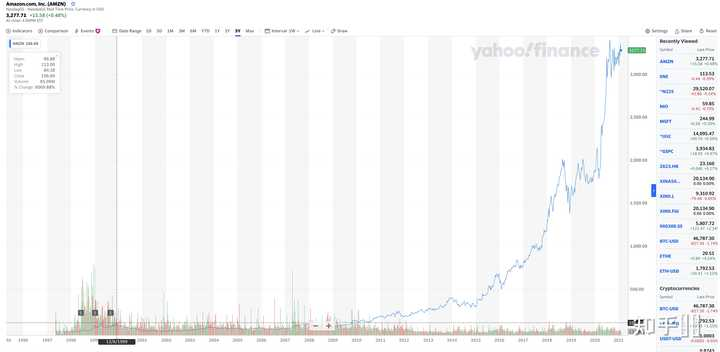

也许二十年之后，比特币120万美元一枚，2021年在知乎上忽悠人40000美元+买入比特币的人也可以自豪的说“看吧，长期持有优
质资产，赚了30倍呢！”

我是相信比特币可以达到10万美元一枚的，但是我并不相信它会在这一轮牛市（2020-2021）完成，这个过程将会花费数年的时
间，期间我们会有许多底部建仓的机会，没有必要现在在山顶建仓。耐心点，等着吧，机会会来的

_______________分割线________________

2021.2.15

我目前少量持有少量持有开仓价BTC 46500的2倍空头仓位，准备持有至2022年。

由于比特币的价格虚无缥缈，无法用一个锚定标准来估值，且目前的币圈是一个由散户主导的市场，所以我只会轻仓做空它只会轻仓做空它，当
是做一个实验。

也持有美股特斯拉、蔚来、小鹏、理想、恒大汽车的空头仓位，将会大力做空这些新能源汽车股。大力做空这些新能源汽车股。因为股票是有一个价值锚点
的，且这是一个由机构主导的市场，机构更加理性，等意识到潮水正在退去就会减持这些高估值股票。

将会在2021年上半年开始分批建仓，2021年末之前完成建仓

我是这么看待比特币的

我的观点是目前的全球金融市场高估值泡沫会在2022年伴随着各国的货币政策收紧而破裂

让时间来证明我的对错

欢迎各位过几年来掘坟，如果到时候证明我错了，欢迎疯狂抨击我

_______________分割线________________

2021.2.20

美联储发布半年度货币政策报告，比特币随后突破56000美元，一路畅通无阻力
---

## 第 49 页

关于很多人关心的我的比特币空单爆没爆的问题

我用15000美元开的BTC空单爆仓价是69555，爆仓还有一段距离

反正也是一个实验性的测试，我不会再补仓，至于会不会爆就随缘

我现在对于比特币的态度是看空不做空

更好的做空时机应该要等到确定性的流动性拐点：美联储收紧货币政策

美联储目前有三样放水工具

1.量化宽松（每月1200亿美元购买资产）
2. 0利率
3.救济金

现在反思的话，从上周就开始做空比特币确实是错误的

做空要等到确定性的时机，应该至少要等到其中一样放水工具撤走才能开始做空比特币

按照目前欧美控制新冠疫情的速度，年中我们就能见到疫情被基本控制，年末时美联储可能会停止量化宽松政策或者停止发放救
济金，在2023年开始加息。

从目前的形势来判断，我们在2021年末-2023年可以预见全球范围内的流动性收缩，届时美股、A股、港股、币圈都会迎来大回调
的。但在此之前，我们还或许能见证更多疯狂的行情。

但全球资产牛市都已经走到这一步，早上车的老司机们已经蠢蠢欲动想出货了，新
韭菜真的不应该再参与进来。目前币圈牛市已经进入了疯狂阶段，在这种利好消息
满天飞且情绪高涨的情况下去做多或者做空都是十分危险的，依然不推荐任何没来
得及上车的人现在去上车。

什么是韭菜？

韭菜就是2020年3月12号币圈暴跌的时候嘲讽比特币跌成4000美元一枚，是彻头彻尾的骗局迟早要归零，而现在56000美元一枚的
时候高呼“还很便宜，要现在买入长期持有！”的那帮散户

—————2021.4.14—————

比特币目前是64000美元一枚

但是我还是相信比特币会在2022-2023年这个世界经济加息去杠杆周期跌回15000美元/枚的位置（挖矿成本价）

—————2021.6.12—————

比特币目前价格是35000美元一枚

目前有很多小韭菜被套牢在山顶

第39篇:https://www.zhihu.com/answer/19837122058

量化交易会将散户赶尽杀绝吗？

赞同数: (246赞同)创建时间: (2024-10-31)

不会。

1.量化交易赚的钱很多来自于散户的赌博，而人民群众对于赌博的生理需求永远存在。即使一个市场一个细分领域被量化搞坏了
---

## 第 50 页

没有赚钱效应了，散户会找到新的可赌博的市场/标的。只要有人赌博，那卖银的、出老千的和开赌场人就会赚。只要有人赌博，那卖银的、出老千的和开赌场人就会赚。

2.世界/国家有起起落落的经济周期（债务周期），在债务上升阶段人民群众口袋里钱变多了之后赌博需求也会同步提升自然而
然会把更多钱投入金融市场原本被量化搞坏了的市场/标的也会因为有新钱的流入再一次有赚钱效应
---

## 第 51 页

第40篇:https://www.zhihu.com/answer/1767467663

作为00后，年入百万是什么体会？

赞同数: (242赞同)创建时间: (2021-03-07)

生活过的比较潇洒，可以买这个年龄段的任何想要的东西。

思想会比较成熟，对于青春期本该有的许多娱乐活动嗤之以鼻，认为人应该把自己的精力投入到提升自己的能力与认知上。
心理年龄可能有25岁以上

是一个反消费主义者，所以消费会比较克制，别人看着可能我花的钱多，实际上我每个月用于消费的钱都只会占月收入的1/5
左右，我更愿意把赚到的钱用于投资新的商机与资本复利当中

认为很多同龄人沉溺于”奶头乐“中是非常幼稚的。所以更喜欢和积极上进有目标的人待在一起

很喜欢和70-80后的老板们聊天，与他们交谈也没什么代沟，很容易在交谈中得到他们的赏识，每个人都会说我前途无量

所承受的压力远高于同龄人。欲戴皇冠，必承其重

第41篇:https://www.zhihu.com/answer/1700399979

想靠炒股成为有钱人，靠谱吗？

赞同数: (241赞同)创建时间: (2021-01-27)

我爸是一个从农村出来的大学生，学的是自动化，标准的理科生一枚，毕业后他却去了一家外企当采购经理。按照他一个月20000
人民币的工资收入，他是不可能积累千万级的资产的。

但是他有一颗聪明的头脑与极少数人才拥有的耐心，非常适合使用巴菲特的价值投资理念。

从1996年开始他就进入股票市场，在2000年、2007年、2015年牛市中都赚到了不少钱。目前这波2020-2021的牛市收益率也不错，
但还没止盈。

以往每一次牛市结束后，他都会把股市上赚到的钱一部分用来买房子，我们家积累了10套房产，而中国房产又恰恰是过去投资回
报率最好的低风险投资，算是又买对了。

炒股是可以改变一个人的阶层的，但前提是你不要把它当成“炒”，而一个把它当成“投资股票”，然后这应该是属于七分天注定、三
分靠打拼的赚钱门路。股票投资最适合能掌控自己情绪的人、理性思维能力很强的人，我认为它并不适合一个感性的人参与。

第42篇:https://www.zhihu.com/answer/3365900117

为什么基金经理和股票交易员等金融从业者工作时需要同时使

用数个电脑屏幕？
---

## 第 52 页

赞同数: (235赞同)创建时间: (2024-01-17)
各个屏幕上一般分别有什么信息？

第43篇:https://www.zhihu.com/answer/3566349618

什么样的人是世界上最危险的人？

赞同数: (231赞同)创建时间: (2024-07-19)

对赌博以及类似赌博的活动，先天没有控制能力（一部分人先天就更容易沉迷于赌博带来的快感），沉迷其中，并输到倾家荡产
的人。很多极端的犯罪是由这些人为了拿到最后一次钱最后赌一把看能不能翻身而犯下的。

如果一个人只是抑郁/情绪不好，他往往不会做出什么伤害他人的事情。

如果一个人是赌博输红了眼，并且欠了很多债务，那么他的不甘心的心理叠加上多巴胺的刺激，会让这当中一部分人愿意犯下滔
天罪行也要最后爽那么一把。

第44篇:https://www.zhihu.com/answer/3252371003

奋斗逼的内心世界是什么样的？

赞同数: (217赞同)创建时间: (2023-10-16)

我就是一名很成功的奋斗逼，我的内心世界是有一个飞轮在运作的：我奋斗》赚到了更多金钱〉收获快乐、成就感以及社会认
可〉更加努力的奋斗

我过去两年从事的生意就是一个零和博弈的游戏，体量就这么大，所以就比谁抢得下来。我赚了，竞争对手就赚不到。竞争对手
赚了，我就赚不到。

在我进入这块业务之前，原本是有几十个百家争鸣的欧美人在一起分食蛋糕一起共同富裕的，在我进入了这篇领域之后现在已经
成功被我卷的只剩另外两家可以与我一战了。

真的是一将功成万骨枯，在过去的两年时间里，我靠勤奋+努力+投机+智慧卷死了无数的不够努力的竞争对手，也终于打造出了我
想要的商业护城河把很多的小竞争对手扼杀在了摇篮里。

我一直都很喜欢在竞争中获胜的感觉，在我的价值观里，我崇尚实现洛克菲勒一般的的垄断资本主义，也从商业的角度欣赏秦始
皇的扫清六合统一天下。总之就是要干掉竞争对手》抢到有限的资源〉实现独大一家。

—————————生活中——————

以前我总是去敦促身边的年轻人们要努力奋斗，各种分享鸡汤，后来我发现大部分人是没有这样的意识的，至少95%的人都只是希
望能过一个普通的生活。所以我已经放弃了助人情节。

只有自己肯发奋努力的人才能成为一名奋斗逼，一名奋斗逼成功的概率就是比躺平佛系人高，这毋庸置疑。

现在我也不会去强求别人，我只需要把自己这个榜样给做好就行了，做一名让每一个人能看得到的“奋斗就能攀得高”的好榜样。

第45篇:https://www.zhihu.com/answer/1841243019

如何看待比特币4月18日暴跌？是否意味着击鼓传花的游戏已
---

## 第 53 页

经结束？

赞同数: (217赞同)创建时间: (2021-04-18)

刚刚出现了超级重大利空，美国财政部要起诉多家涉嫌使用加密货币洗钱的金融机构（多半是几家交易所）

春江水暖鸭先知，机构总是最敏锐的，出现这种利空消息的时候机构总是能跑在散户前面撤离，一下子就把盘给砸成这样了。

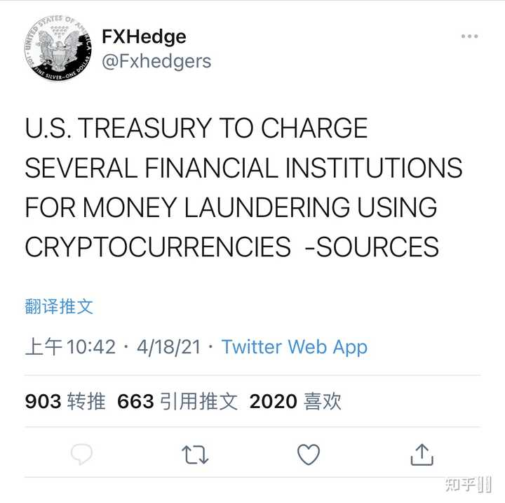

第46篇:https://www.zhihu.com/answer/1781394391

九零后和零零后喜欢为什么东西花钱或者付费

赞同数: (206赞同)创建时间: (2021-03-15)

写写我观察到的00后喜欢的消费品：

1.潮牌衣服裤子鞋子
2.奢侈品牌衣服裤子鞋子包包化妆品
3. Relx或者柚子牌的电子烟，有很多对烟草上瘾的00后甚至开始完全使用电子烟代替传统烟草
4.手机、耳机、电脑等电子产品
5. Bilibili、爱奇艺、腾讯视频等流媒体平台的VIP
6.和平精英、王者荣耀、原神等手游的付费道具
7.战地、GTA、使命召唤等端游的付费正版
8.逛迪士尼以及购买周边玩偶
9.外卖
10.宠物文化

00后的消费主义与享乐主义文化比90后还要严重，几乎一大半的满18岁的00后都有使用花呗消费的习惯。00后非常追捧品牌，非
常喜欢新潮的电子产品，愿意为版权付费，愿意为娱乐花大钱。
---

## 第 54 页

如果想割00后的韭菜，那么推荐关注00后喜欢的消费品背后上市公司的股票。

$BILI $RLX $腾讯控股$小米集团$美团$LVMH $CHDRY $DIS $AAPL $JD $NIKE $泡泡玛特

第47篇:https://www.zhihu.com/answer/1883077382

SHIB会是下一个狗狗币吗？

赞同数: (174赞同)创建时间: (2021-05-13)

绝无可能，祝山顶买入的人腰斩愉快

2021年5月13号凌晨1点58分

我已开始1倍杠杆做空

Shib本月应该就会跌掉80%以上的市值

Shib在发行的时候有50%的币，目前价值100亿美元左右，被打到了以太币创始人Vitalik的钱包内

而现在Vitalik已经开始抛售了shib，我应该是中国第一个汇报此消息的人

如果你看到这条知乎回答，请立刻抛售你的shib，很快他们就会一文不值

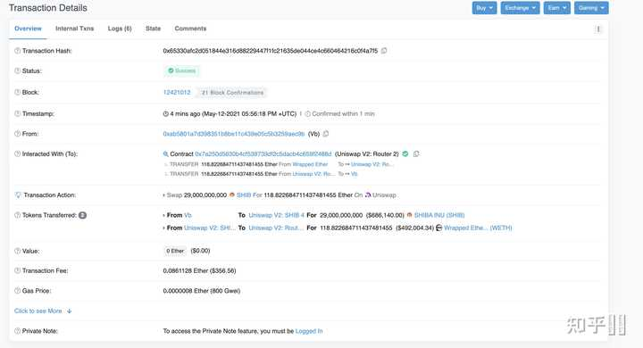

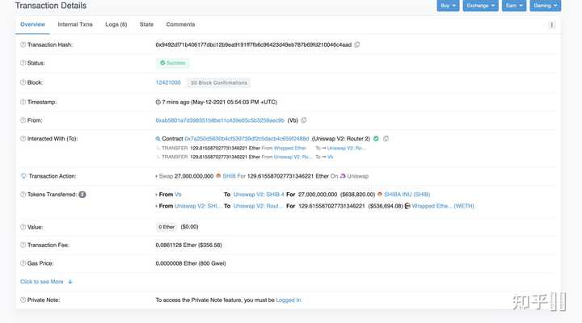

Etherscan查询地址
---

## 第 55 页

————————更新————————

V神刚刚又捐了价值10亿美元的Shib给印度新冠救济基金会

https://etherscan.io/address/0x68a99f89e475a078645f4bac491360afe255dff1#tokentxns

第48篇:https://www.zhihu.com/answer/1791992964

巴菲特说，一旦你有省钱的脑子，就不会有精力培养一个赚钱

的脑子！大家对这句话怎么看？

赞同数: (173赞同)创建时间: (2021-03-21)

查无此句，事实就是巴菲特根本就没有说过这句话，你可以让说出这句话的人把巴菲特替换成鲁迅。

这多半是中国的微博小红书上的微商拿出来洗脑鼓吹消费主义的文案。

巴菲特自己就是一个很节省的人，也很鄙视那些挥霍无度浪费金钱的人。

"The biggest mistake is not learning the habit of saving properly,"

这句是他的原话，翻译过来是“人最大的错误就是没有养成储蓄的习惯”

有很多愚昧的人相信“不会花钱就不会赚钱”这种言论，不知道这是什么时候流行起来的

第49篇:https://www.zhihu.com/answer/1938973987

如何看待年轻人「躺平」的现象？

赞同数: (168赞同)创建时间: (2021-06-14)

我是一个精英主义者，我自己很排斥躺平，我相信在这个世界上要获取财富就是需要从别人手中争夺的，在残酷的资本市场上赚
的每一分钱都是别人亏的钱，要获得财富成功就需要和别人竞争，就需要自己的武器库比别人更强。但我也非常支持自愿躺平的但我也非常支持自愿躺平的
人自由的躺平。

之前的内卷机制相当于是计划经济，每个人都要强制被分配一定的内卷份额。就相当于改革开放以前的大锅饭，不管你喜不喜欢
吃，你就是得和大家一起吃。

而现在随着越来越多的年轻人开始意识觉醒之后，内卷将会变成一个自由市场，每个人可以自由选择是否参与内卷，很期待见证
---

## 第 56 页

未来数十年内卷市场“改革开放”的大趋势。

社会学上，自由市场是一个在社会中分配商品的经济系统：生产什么和购买什么，由市场的供求关系调节购买力所决
定，并非取决自中央分配。

内卷自由化以后，希望躺平的人可以自由的选择躺平、希望拼搏的人可以自由选择内卷。躺平的人不再被社会指责，而内卷的人
少了很多竞争对手。两方都能有更舒适的未来，这将会是一个共赢的局面。

如今欧美国家就是这样的现状，大概有8成的人选择安稳躺平，2成的人选择努力奋斗。社会重大的进步大多靠那群“奋斗逼”们来完
成，躺平族们可以安安稳稳过自己的生活自由选择自己想做的事情。

第50篇:https://www.zhihu.com/answer/2211525568

如何看待马斯克发投票征询是否出售10%特斯拉股票，并称

将遵守投票结果？

赞同数: (153赞同)创建时间: (2021-11-07)

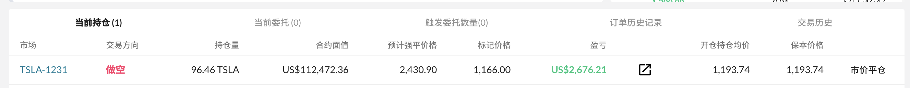

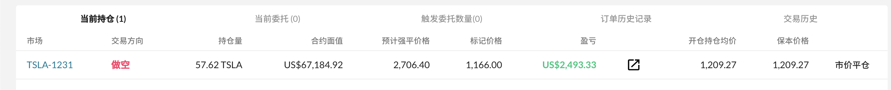

消息出来的一瞬间我就在FTX上做空了TSLA-1231合约，总计154股。

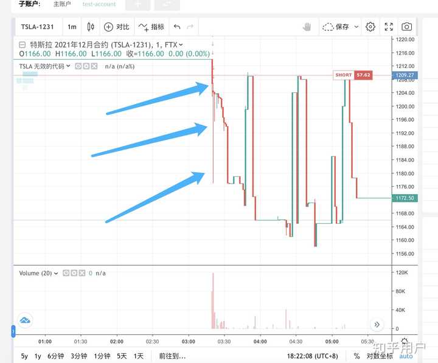
---

## 第 57 页

因为在美股非交易时段的流动性太差，用市价单下单还不慎把价格砸下去了3%。

我只做超短线，只赚市场的信息差与情绪的钱

希望这一单能有一个好的收获吧，我会在周一美股盘前或开盘的一刻，市场恐慌抛售的时候平仓。周一美股盘前或开盘的一刻，市场恐慌抛售的时候平仓。

真的感觉特斯拉最大的空头就是马斯克自己

————————————————————————

我很喜欢也很钦佩马斯克，不过这不妨碍我做空特斯拉赚点零花钱。
---

## 第 58 页

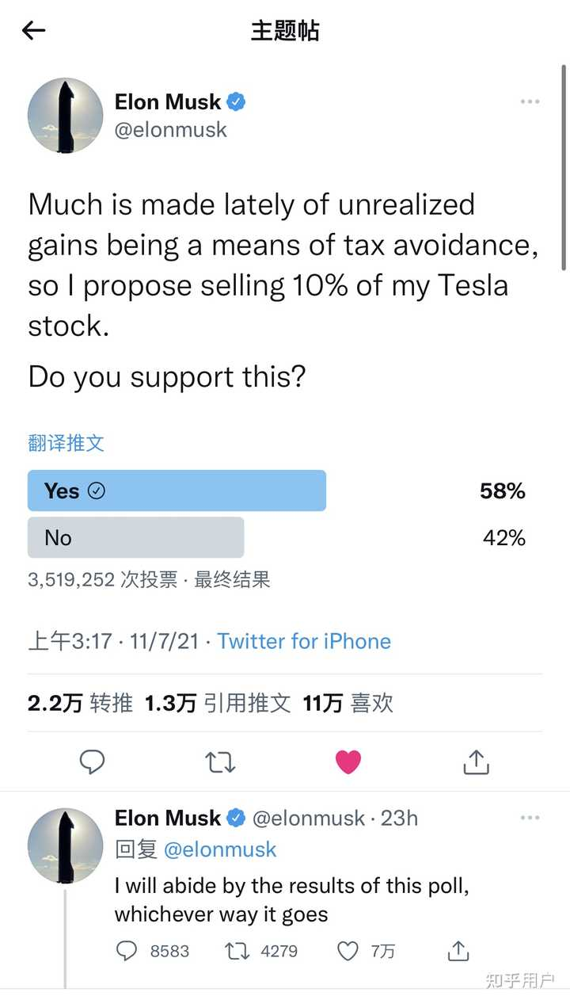

看来真的要卖了哈哈哈哈哈哈期待明天散户们的恐慌抛售
---

## 第 59 页

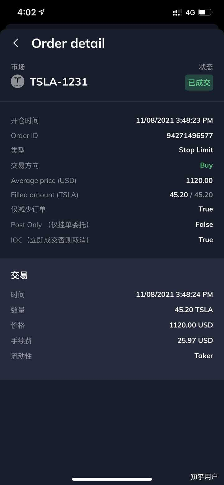

先在1120平仓了一部分，把一批利润落袋为安

还有的留到美股盘前再平仓
---

## 第 60 页

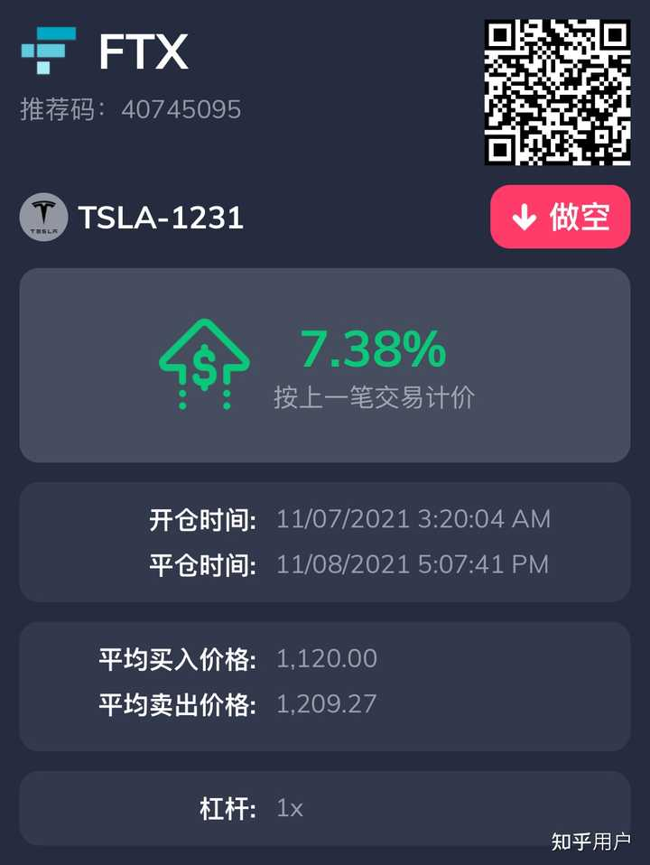

有一个子账户的57张头寸已经平了，还有主账户上96股没平
---

## 第 61 页

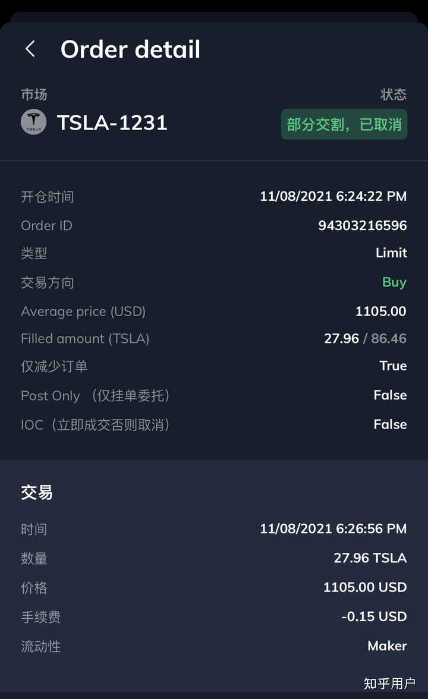

主账户上1105又平仓了27.96张
---

## 第 62 页

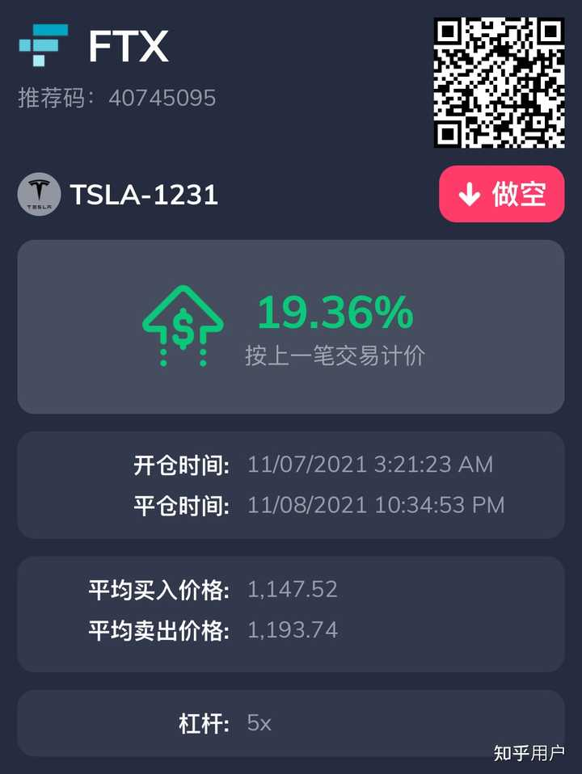

因为看到特斯拉的股价在开盘后大幅反弹，所以把最后的1/3也平仓了，本次一共盈利大约1万美元

第51篇:https://www.zhihu.com/answer/98478827586

你身边有被“做局的人吗？

赞同数: (142赞同)创建时间: (2025-02-11)

我好希望遇到对我做局的人

因为我当暴发户那么久了，也很高调。互联网和现实生活中都有很多人知道我是亿万富翁，我怎么就没遇到那些传说中的“引诱我
去参加赌博”或者是“引诱我去参投什么什么项目”或者是“针对性的金融诈骗”

我是一个很调皮的人，平时我遇到对我发的电诈信息我都会调戏一下，所以我也想遇到做局的人，然后可以调戏调戏他们玩玩
---

## 第 63 页

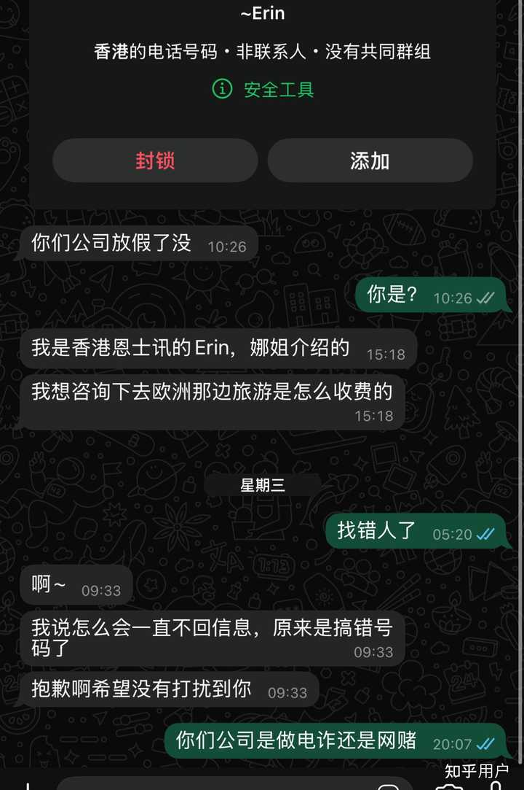

样本：调戏电诈

第52篇:https://www.zhihu.com/answer/3595316202

最近电脑很奇怪，Chrome频繁页面崩溃，求高手看下什么问

题？

赞同数: (137赞同)创建时间: (2024-08-15)

出这个问题的都是人都是用的华硕主板+非常新的intel i9系列cpu，我也是最近更新了驱动之后就这样。从chrome错误日志来看报的
是C0000005代码。

这是CPU调度内存的问题，根据一篇reddit上的回答，临时的解决方案是：

1.开机狂按F2进入华硕BIOS设定

2.在高级设置里关闭Intel虚拟化技术

3.下载Intel Extreme Tuning Utility这个软件

4.把性能核心设置成49x，节能核心设置成38x
---

## 第 64 页

代价就是牺牲点CPU性能

不过目前我的问题已经解决chrome不再崩溃了至少不影响正常办公了

第53篇:https://www.zhihu.com/answer/112050534277

如何看待特朗普发行500万美元一张的金卡，规格高于绿卡？

赞同数: (131赞同)创建时间: (2025-02-27)

除非这个项目正式推出时能有更有竞争力的条件，否则不会有很多富人愿意买单

按照美国绿卡（永久居留权）现有的的规则，一旦成为绿卡持有者，就意味着要给提交美国所得税申报表，并申报全球收入

绿卡持有者还必须每年在美国呆满146天才能维持绿卡

按照现有的规则，比较适合拿这个特别金卡的是：

1.愿意长期呆在美国生活的超高净值人群

2.愿意在美国开始稳定新生活的那种做黑灰产以及在 哈俄伊朝有zz问题的富豪

如果它更改成更有竞争力的条件，那么广大的像我这样的世界游民富豪才会考虑：

比如，

-只需要投资500-1500万刀什么特别债券，持有满多少多少天，就能获得永居（或者X年居留权都可以）

-不需要有每年必须呆满146天的条件，一年想呆多少天都可以。相当于给我一个永久的美国旅游签证就行。这辈子可以把美国当
做“江东父老”，真有啥事来临的话可以学习贾跃亭精神

-此特别金卡持有者只要每年不在美国呆满X天就可以免申报税务

对我而言，如果美国明码标价要100万美元就可以获得一个我描述的这样的Visa，作为一份人生保险和生活的额外选择，那么我是
很愿意买单的

但是让我花500万美元买一个和正常人没任何区别的Visa那是万万不可能的

第54篇:https://www.zhihu.com/answer/2895396272

你会看不起哪种人？

赞同数: (124赞同)创建时间: (2023-02-16)
如不方便请匿名，但请说真话

第55篇:https://www.zhihu.com/answer/85029795436

为什么有人会崇拜希特勒和纳粹德国？

赞同数: (122赞同)创建时间: (2025-01-22)
---

## 第 65 页

因为“纳粹党”的全称是和很多人的理念一致的，尤其是粉子

第56篇:https://www.zhihu.com/answer/2840308500

高频交易最看重什么？

赞同数: (116赞同)创建时间: (2023-01-11)

延迟。只要延迟足够低，低过全部的对手盘，不愁没钱赚。

再好的算法策略没有足够低延迟的执行框架也赚不到钱，再差的算法策略有了最低的执行延迟也能赚钱。

第57篇:https://www.zhihu.com/answer/3315582243

在知乎上回答了一个问题，被隐藏了，不是折叠，为何？

赞同数: (110赞同)创建时间: (2023-12-06)
知乎这种操作算是怎样，也没有提示说明。只有在自己资料点我的回答才能看到。

第58篇:https://www.zhihu.com/answer/3541963541

为什么现如今网络上那么多人如此的评判所谓的“资本家

赞同数: (108赞同)创建时间: (2024-06-25)

这是历史遗留以及遗留下来的教育的问题

只有简中互联网上会经常提及《资本论》和“资本家”，也只有简中互联网喜欢煽动对富人的仇恨。

第59篇:https://www.zhihu.com/answer/1745329112

现在2021年的股市行情会成为15年的复刻嘛？

赞同数: (102赞同)创建时间: (2021-02-23)

现在是2021年2月23号，

虽然预言很容易被打脸，但是我还是想预言一下接下来股票市场的行情。
---

## 第 66 页

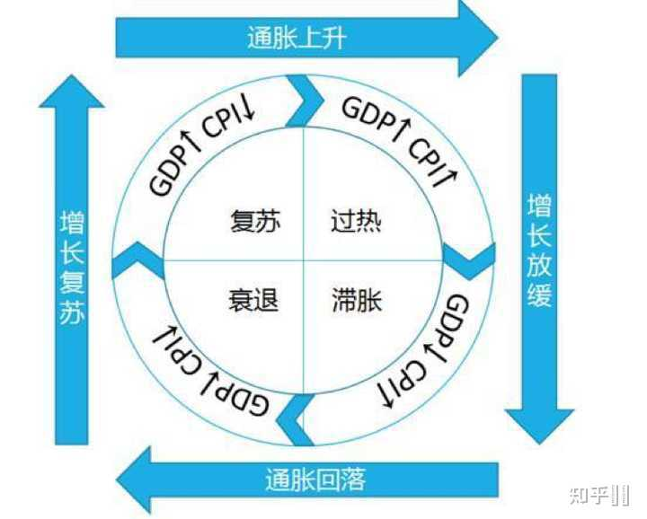

首先来理解一下这一轮周期的全过程。

第一阶段-萧条

2020年1月份到2020年4月份，新冠疫情爆发并开始向全球扩散。随后的几个月发生了什么我们都知道：各国政府开始封城、封锁
经济，造成全球范围内的经济萧条。美国失业率大幅度飙升，直到4月份创下美国几十年来失业率高峰的14.8%。

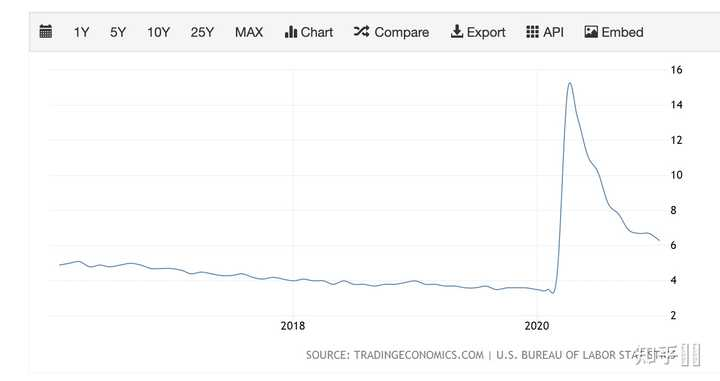

第二阶段-复苏

2020年5月份到2021年2月份，各国政府开始使用各种财政工具来提振经济。在这期间，全世界货币供给量有飞一般的提升：欧元
区M2增加10%，美元区M2增加25.7%。各国贷款利率也到了非常非常低的水平，我记得在去年隔三差五就接到银行打电话问我需
不需要企业贷款。
---

## 第 67 页

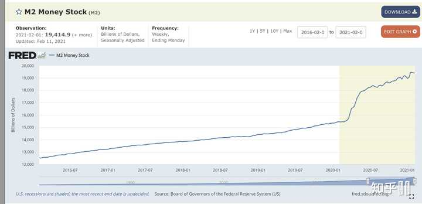

海量的货币为经济复苏提供了有力的支撑，经济发动机开始恢复运转，失业率快速下降。如此宽松的货币政策也使人们对于通货
膨胀的预期提升，促使人们把现金换成金融资产，推高股票市场、房地产市场、加密货币市场的大幅上涨。

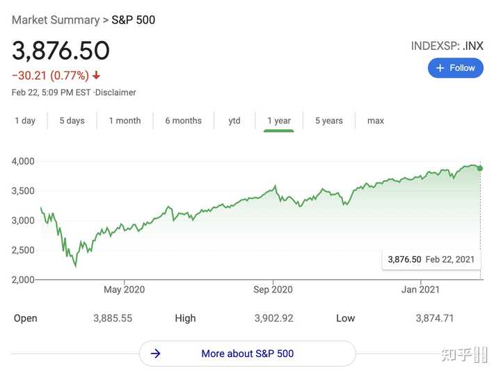

标普500走势图

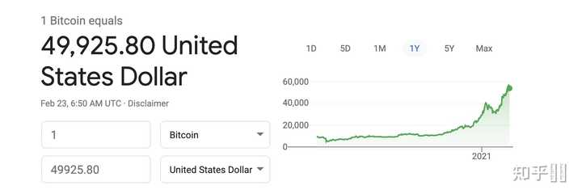

比特币价格走势图

在这个阶段，成长性强的高风险资产（科技股与比特币）得益于极其充裕的流动性与极强劲的投资者信心，获得了最高的涨幅。

第三阶段-过热

经济就像国家的柴油引擎，转速慢（萧条）时国家就需要给他添加燃料（货币）并努力尝试发动（政策支持），当引擎成功运转
起来后，它会变得越来越快，变得过热。

在这个阶段，GDP与CPI都获得大幅增长，以原油与铜为首的大宗商品价格飞涨，得益于此，采矿业、石油开采类股票价格将会飞
涨。
---

## 第 68 页

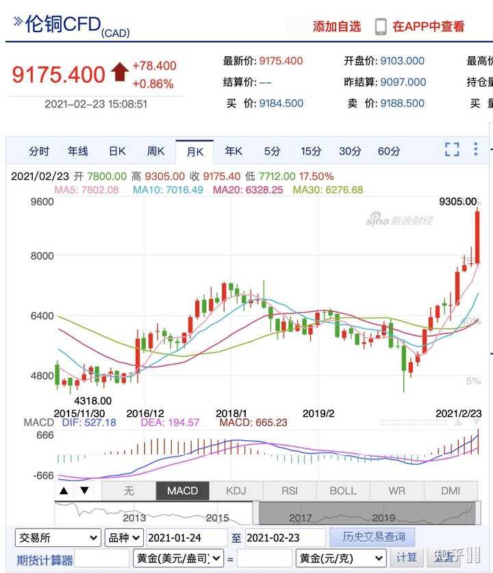

伦敦铜价

我们目前就处于这第三阶段。

第四阶段-滞胀

在这个阶段，物价上升，但经济停滞不前。

股票市场的增长会陷入停滞，失业率与高通胀并存。

第一阶段、第二阶段都已经过去，现在我们处于第三阶段-过热。

这段时间将会是股票市场最后的狂欢，好好享受这最后一支舞吧。

我们可以看到近期股票市场上投资风格的转换，热点从科技股转移至大宗商品股。

过热阶段何时结束？这很大程度上取决于美国政策。
---

## 第 69 页

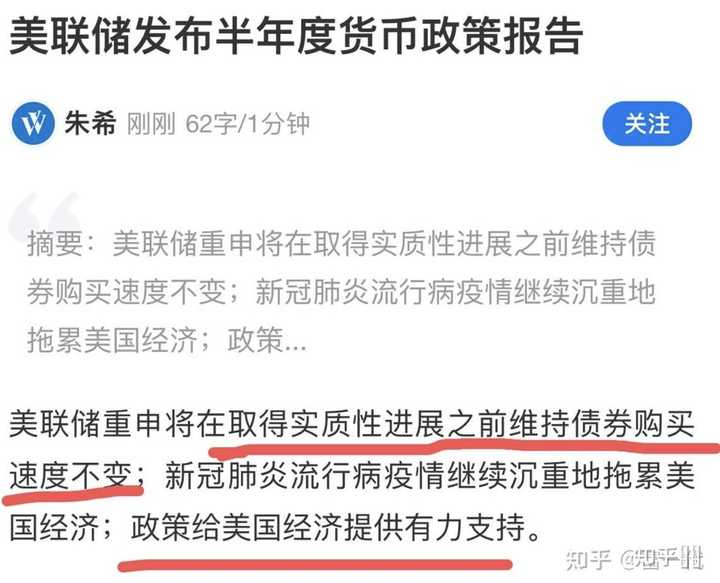

美国目前有三样维持宽松货币政策的工具：

1.量化宽松（美联储每月至少印1200亿美元购买国债）
2. 0利率
3.救济金

按照目前美国控制新冠疫情的速度,2021年中旬我们将会看到疫情基本被控制，美国每日新增病例数将会在1万例以下，届时美国政
府可能会考虑缩减量化宽松的规模或停止发放救济金。而真正终结过热期的将会是加息。当CPI上涨到对民生影响严重，美国政府
无法容忍的时候，可能会进行加息操作。

我的预测是股票市场从现在到2021年中旬之前还会有一段狂欢期，这将是投资者们与泡沫最后的共舞机会，享受这最后的
狂欢吧！

2021年中旬，我们可能会看到美国略微收紧货币政策，股市开始进入缓慢下行阶段，跌三天涨两天的温水煮青蛙。

2021年末2022年中旬，经济基本恢复如初，而通胀程度也会达到美国政府无法容忍的地步，货币政策将会有大幅度的收
紧，量化宽松会停止，停发救济金，利率上调百分之零点X。届时A股港股美股加密货币将会迎来超大幅度的回调。这一
段的行情会很像2018年3月-2018年12月。

2022年中旬至2022年末，市场到达一片绝望与哀嚎的底部。我们将会迎来非常棒的抄底时机。
---

## 第 70 页

第60篇:https://www.zhihu.com/answer/1919768003

越南市场值得投资吗？

赞同数: (100赞同)创建时间: (2021-06-03)

如果你是一个普通人，当你听说“xxx涨了很多”然后产生想买入的冲动的时候，就说明行情已经快到顶了。

越南属于新兴市场，其股市潮起潮落不光取决于这个国家的经济基本面，非常大程度上还要看美元的潮起潮落。

越南股指已经有大幅上涨、美联储正在筹备渐渐收紧货币政策，综合这两个因素来看，当下这个时间点去买越南etf是非常不合适
的

你要买就应该几个月之前买，不是现在看到涨幅后再想着进去接盘

第61篇:https://www.zhihu.com/answer/2807483282

新手司机刚刚拿证能开跑车吗

赞同数: (97赞同)创建时间: (2022-12-19)

我给自己订了一辆保时捷帕拉梅拉，然后刚拿到驾照隔了三天我就去三十公里外的4s店提车了。

在提车的前两天，我在闲鱼上分别约了2个不同的陪练开车的师傅先在路上每天各开了三个小时，接受了6个小时的指导。

到了提车的那一天，和没有任何驾驶经验的女朋友打车去了4s店，一路小心翼翼的开了三十多公里回来了那是我人生中的第一次
长途驾驶就开了那么好的车，还是自己买的全新的第一次上路，撞了会非常心疼，所以我开的格外小心，只敢跟着一辆其他车的
屁股后面开。路上也会有很多老司机觉得我开的慢而鸣喇叭的，但是我不理会只专心开我的车。

拿到车的有一段时间是天天爱不释手，每天都开车出去兜风，

现在已经开了两个多月了，开了1500公里，跑过三次长途，目前一次小碰撞或者摩擦都没出现过。

综上所述，经过我的测评，新手刚刚拿证可以开跑车：

但是在上手之前你要练习一段时间，另外刚刚上路的几天里开得慢一点。等开熟练了再飙车。

目前三个月了，2300km行程，保持着0擦碰+0扣分
---

## 第 71 页

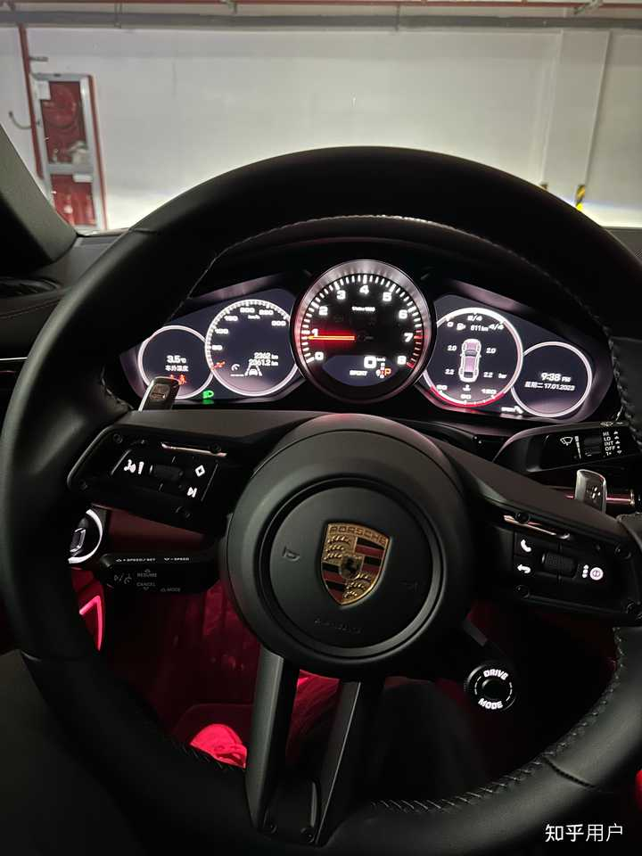

第62篇:https://www.zhihu.com/answer/1946829148

作为一名00后白手起家千万富翁是什么体验？

赞同数: (96赞同)创建时间: (2021-06-18)

爽快乐自豪自信自由独立

第63篇:https://www.zhihu.com/answer/1768042761

你在大学生活中最美好的一个瞬间是什么？

赞同数: (85赞同)创建时间: (2021-03-08)
看到了一个关于高中美好生活的瞬间，所以想问问大学生活的美好瞬间。

第64篇:https://www.zhihu.com/answer/2852658754

开车路怒症是一种怎样的体验？

赞同数: (81赞同)创建时间: (2023-01-19)
---

## 第 72 页

我是一个“反路怒”的人，

就是我平时好好开车不会生气，也基本不怎么使用喇叭和闪灯，遇到其他人开的慢我也不会去管，能礼让则礼让，但是只要遇到只要遇到
别人对我表现的没素质我就会暴怒。

写写我几次路怒的经历：

有一次在高速上车流较多较堵的情况下，我跟着前车开着80km/h的速度，后面跟了一辆车拿闪光灯不停的闪我，闪几下还可
以理解，关键是连续被他闪了几十下。于是乎暴怒，猛按喇叭并拉下车窗就对他比了个中指。

有一次我在一条有停车位的非机动车道上开，因为旁边也停满了车我怕蹭到开的慢了点，后面一辆车对我先按了一次喇叭，
我就加快了点速度，然后开的也更紧张了。后来他又按了2次喇叭，我就不乐意了开始暴怒和他一起按喇叭。

有一次我在停车场入口，在前面有一辆奥迪车还没进去的情况下，我就被后面的小红车按喇叭催了一次。然后在奥迪才刚刚
进去之后，停车杆还没落下、停车场系统还没识别到我车牌的情况下，小红车又对我按了一次喇叭，于是乎我暴怒，和他对
按喇叭。

刚刚又怒路一次，我在停车场的单向出口扫码缴费中，有一辆车想进来，然后她对我按了3次喇叭，又用闪光灯闪了我一
下，我就暴怒了用闪光灯使劲闪她，然后她就把车子往那边一停人下车想走把我堵在停车场里面，于是我当场就下车把她骂
了一顿让她挪车。

总结一下，我发现只要别的汽车对我连续按多次喇叭或者连续打闪光灯都会让我怒路。

怒路的形成我认为是司机之间的信息不对等，比如在日常生活中如果有人想让我走的快点，那就会比较友好的说“麻烦让我先走，
可以吗？”，而大家都在车上的时候，只能按喇叭，而喇叭容易被理解为愤怒的意思。

第65篇:https://www.zhihu.com/answer/3286206793

如何看待AngelaBaby杨颖和张嘉倪因为看了lisa的疯马秀被封

杀？

赞同数: (74赞同)创建时间: (2023-11-12)

不是上述明星们的粉丝，但是她们的故事，说明了明星要提前搞一个国外社交媒体账号、把资产转移到国外以及提前准备第二个
国籍的重要性，提前把自己一部分国内粉丝引流到海外媒体账号上。

然后哪天自己被一些莫名其妙的理由封杀的时候，就可以润出国，痛痛快快的集结粉丝们把广电总局骂一顿，硬刚对线，也不用
担心有软肋。

第66篇:https://www.zhihu.com/answer/1761030869

对做股票投资朋友的建议有哪些？

赞同数: (72赞同)创建时间: (2021-03-04)

世界顶级宏观对冲基金创始人Ray Dalio认为：在当今这个国际秩序变化的年代，投资的分散化是非常有必要的。应该把资金配置在
不同的领域、不同的国家。
---

## 第 73 页

我观察到的很多中国股民都只会投资A股，而A股也只能做多。可以说他们的目光是
非常局限的，像极了古代那些守着自己一亩三分地的农民，天天要祈求风调雨顺，
遇到灾年他们就要挨饿。我认为作为一名优秀的投资者，目光决不能局限于单个市
场，应该放眼全球，且应该合理运用金融衍生品去对冲风险，创造最多的收益。

#新兴市场

#A股

#港股

#美股

#比特币

#黄金

#ETF

#大宗商品期货

第67篇:https://www.zhihu.com/answer/2453152298

形容少年得志的诗句或者成语的有哪些？

赞同数: (61赞同)创建时间: (2022-04-23)
比如，春风得意马蹄疾,一日看尽长安花。

第68篇:https://www.zhihu.com/answer/2812866626

疫情防控放开了，你们的想法有没有发生改变？

赞同数: (57赞同)创建时间: (2022-12-23)

我是共存派，阳的第4天，想法没有改变，坚持开放，并且用消费行动支持经济

因为我：

-要自由的进出公共场所不用扫各种码和看行程卡

-要自由的去各个城市游玩，把失去的青春补回来

-要自由的进出国门

-要看到人来人往的人间烟火气

-要看到大型体育赛事在我们国家举办

-不要大规模的以月为单位计的封城

-不要因为一个小区里有一个感染就封整个小区

-不要划地为牢把很多校园、厂区等有宿舍的人员密集场所直接封锁
---

## 第 74 页

总结：愿景是在未来的1-2年能够重见2018-2019的正常生活

我目前还在末，之前几天体验了一波感冒+发烧+咳嗽+关节疼组合拳，不过现在都已经缓解只剩下咳嗽没有褪去

亲历过之后我也明白对于很多有老人与小孩的家庭，这放开的初期应该不太好过

但是，自由就是有价格的

如果想恢复正常生活，那么每个人都必须做出一点牺牲

另外，知乎上回答这些问题的大部分是年龄30+的人

所以知乎上的舆论倾向自然是抨击共存派的

如果你去年轻人多一点的地方问同样的问题，例如小红书、b站，那么得到的回响会大不一样。

盲猜我这篇回答发出来就会被404 shadow ban，因为知乎小编显然大部分是清零派的，会有偏好性的人工筛选这类回答然后偷偷屏
蔽（你看得到但其他人看不到）

很多评论也是发不出来的，会被自动删除。

在评论区投个票吧：

支持我的发6

不支持我的发666

没办法其他的发不出来啊
---

## 第 75 页

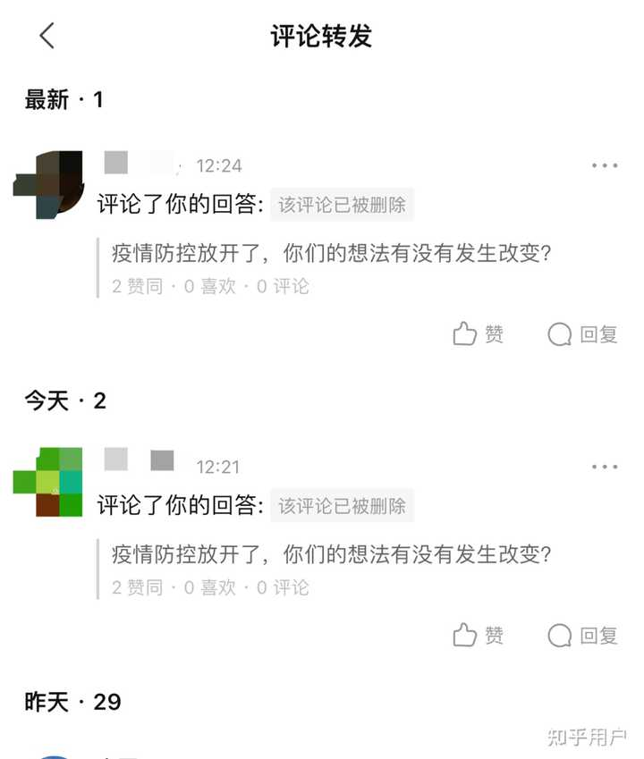

第69篇:https://www.zhihu.com/answer/1892682487

如何看待最近一批新人涌入币圈？

赞同数: (54赞同)创建时间: (2021-05-18)

和二月份的基金热潮一样，都是一群信息获取滞后的散户听说“XXX赚了很多钱”然后冲进来妄想一朝发财的接盘散户。

经过前段时间的大跌后，他们中的绝大部分都已经被腰斩再腰斩。

最搞笑的是大部分这些FOMO进来的新韭菜还就是之前买基金被套的同一批人，大多是90后和00后

“华尔街没有新鲜事”

第70篇:https://www.zhihu.com/answer/1944022589

证券行业有哪些具影响力的人物？

赞同数: (48赞同)创建时间: (2021-06-16)
---

## 第 76 页

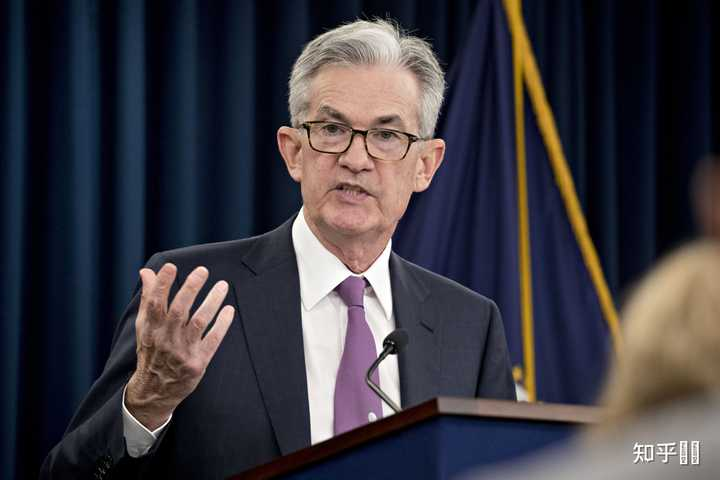

这个男人是世界证券界的扛把子

第71篇:https://www.zhihu.com/answer/1622401110

为什么有钱会变坏？

赞同数: (45赞同)创建时间: (2020-12-11)

因为富有能给予人自由选择的权力

总有部分人会选择作恶

第72篇:https://www.zhihu.com/answer/1597103024

陌生人，你们上进的动力是什么？

赞同数: (44赞同)创建时间: (2020-11-26)
---

## 第 77 页

为了让我与未来的她过无忧无虑、缤纷绚丽的生活

第73篇:https://www.zhihu.com/answer/1677346260

25岁应该存款多少？

赞同数: (43赞同)创建时间: (2021-01-14)

至少3000万净资产

第74篇:https://www.zhihu.com/answer/2310740357

电子音乐《送给未来的你》-阳山伟伟是原创吗？

赞同数: (43赞同)创建时间: (2022-01-14)

金融博主乱入一下，

我很喜欢《送给未来的你》这首歌，因为我能在这首歌听出那种在事业上奋发向上、遇到挫折不放弃，迎难而上、事业开始蒸蒸
日上，最终逆风翻盘成为人生赢家的快感。

我认为阳山伟伟没有抄袭，完全听不出来有重合的地方，听I'amour toujous和《送给未来的你》完全是不一样的感觉。前前后后已
经让不同的DJ给我定制了5-6个版本的送给未来的你，我这边发我自己觉得最满意的一个remix版本。

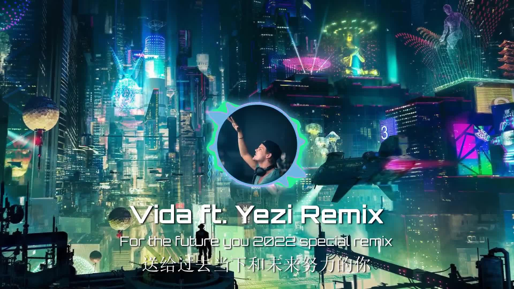

https://www.zhihu.com/video/1465385487423131648

注明：本作品的版权属于原作者阳山伟伟

等我的身价达到10亿人民币会用100万来和他买这首歌的版权（希望到时候他肯卖）

第75篇:https://www.zhihu.com/answer/2010263009

为什么现在美元通胀严重，却挺着不敢加息？

赞同数: (42赞同)创建时间: (2021-07-21)

最近美联储除了在6月15号提高Overnight Reverse Repo（美联储余额宝）的利率到0.05%和提到change policy之外貌似都没有做任何实
质性的“收紧货币政策”的动作。只有Taper Talk这种嘴炮和口头上说“如果通胀超预期可能会提前改变政策”这种话，而美元指数却已
经涨上天了。

美联储现阶段不需要做任何动作，只需要口头上说说缩减qe、可能提前加息之虚，就能行美元指数上涨、大宗商品下跌之实。只
能说美联储真的很强，全世界的交易员们都在盯着它放出来的话，一句话就能操纵全球金融市场。
---

## 第 78 页

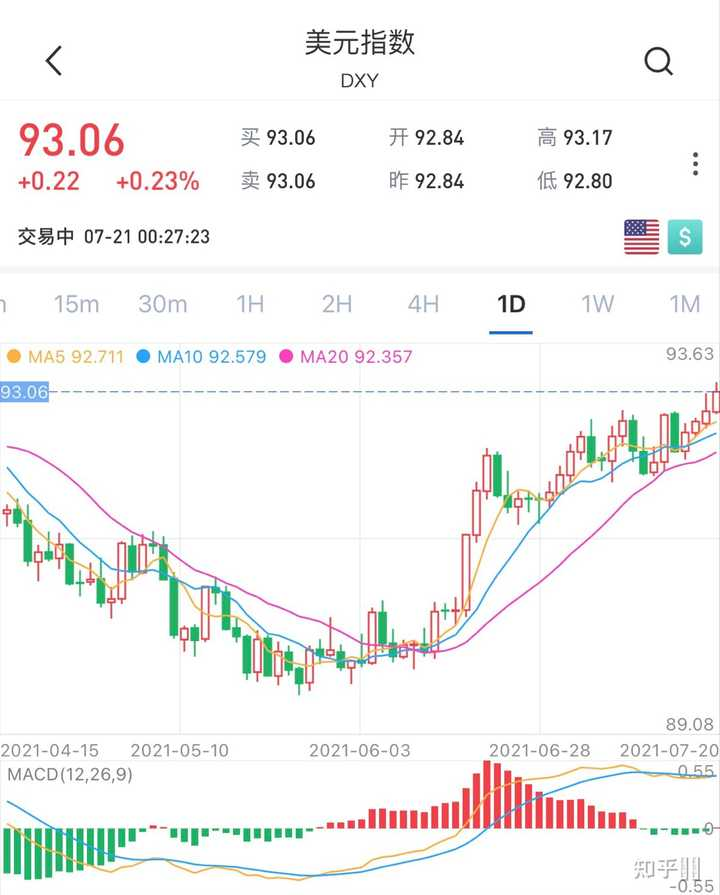

第76篇:https://www.zhihu.com/answer/1895413538

如何看待5月19日比特币跌至3.85万美元，较一月前高点近

乎腰斩，又一轮熊市开始了吗？

赞同数: (39赞同)创建时间: (2021-05-20)

牛转熊也是需要一个缓慢的过程的，不是一步到位的，中间还会有起起伏伏各种悲欢离奇。

比特币在中国A股有一个类似的镜像好兄弟：阳光电源

他们包含共同特征：

1.行情由机构启动，由散户抬轿
2.都在一年内上涨了超过10倍
3.都是宏观流动性充裕以及市场给予过高的预期下产生的大泡沫

阳光电源先是从2020年底部翻了13倍，最后在2021年3月份被腰斩，股价横盘震荡一段时间后反弹，但是它怎么挣扎股价都很难在
几年内创下新高了。

2021年剩下的时光，比特币继续抽抽蹦跶几下也很正常，回到5万美元的水平也有可能，但是我认为它这几年内再也无法回到最高
点的6.4万美元。
---

## 第 79 页

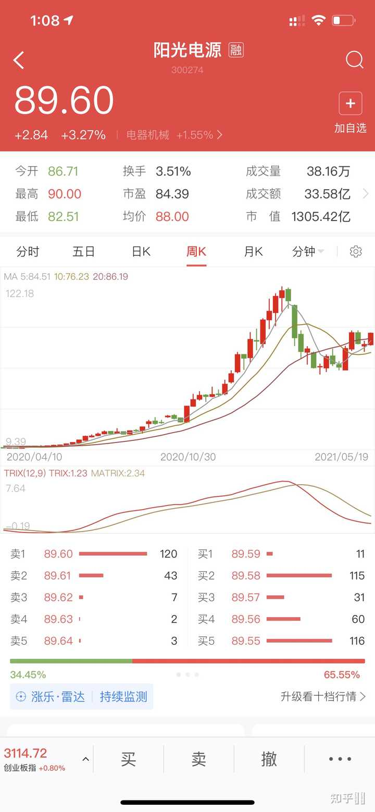

第77篇:https://www.zhihu.com/answer/1954868883

用内幕消息交易加密货币是否违法？
---

## 第 80 页

赞同数: (38赞同)创建时间: (2021-06-22)

我问的这个问题成功预测了未来

第78篇:https://www.zhihu.com/answer/1775148234

为什么有些中国人不买A股，而是去买美股？

赞同数: (35赞同)创建时间: (2021-03-12)

因为我大A自有国情在此，尔等蛮夷，安能知我大A？
---

## 第 81 页

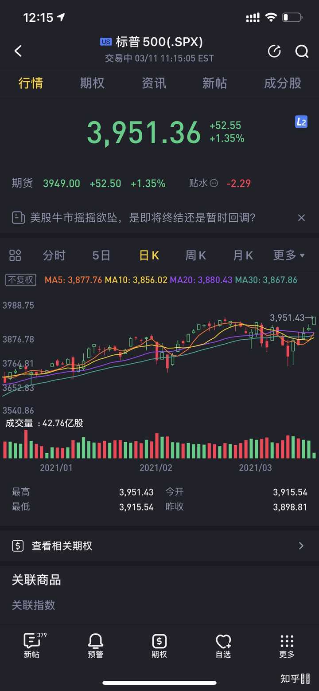
---

## 第 82 页

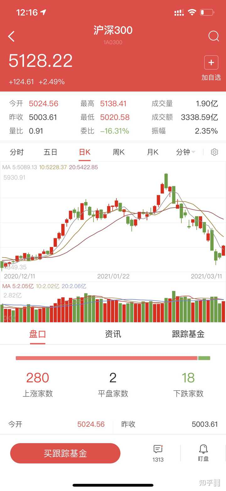

经历同样幅度的一次大跌之后

美股：再创新高

A股：老乡别跑
---

## 第 83 页

第79篇:https://www.zhihu.com/answer/1754677494

比特币今年大牛市能持续到几月份

赞同数: (28赞同)创建时间: (2021-02-28)

资产牛市并没有结束，但是像比特币、特斯拉、茅台这种高估值资产的牛市已经结束了像比特币、特斯拉、茅台这种高估值资产的牛市已经结束了。接下来除非各国央行释放更多的流动
性（不太可能）或者机构联手起来为散户接盘（像Ark那样高位接盘），否则他们会一直处于下跌趋势。

劝高估值资产的投资者及时止盈落袋为安劝高估值资产的投资者及时止盈落袋为安，过去的一年赚的还不够多吗？过去的一年赚的还不够多吗？

你们的信仰无法改变正在转变的宏观趋势。除非你的信仰强大到心甘情愿在山顶套个几年再解套，否则的话如果你被套，那么近
期找到解套机会就出掉吧。

当潮水退去，你就知道是谁在裸泳
---

## 第 84 页

第80篇:https://www.zhihu.com/answer/1668409024

比特币和黄金的投资逻辑有什么不同吗？

赞同数: (26赞同)创建时间: (2021-01-09)

其实比特币的投资逻辑又像黄金又像特斯拉。

————像黄金————

许多机构都开始认定比特币是一种可以和黄金一样对抗通货膨胀的避险资产。但之所以比特币的涨幅比黄金高是因为加密货币的
盘子小，同样的1万亿美元流入总市值7.5万亿美元的黄金市场就只能拉个百分之十几，而流入加密货币市场则可以拉升百分之几
百。

————像特斯拉————

比特币与特斯拉相似之处在于它们都代表着对未来成长的一种预期，人们看好它们在未来的发展。许多人开始相信比特币以后可
以替代黄金作为国家战略储备，相信比特币可以作为生活中许多场景下的支付方式，所以市场愿意给予比特币非常高的估值。

第81篇:https://www.zhihu.com/answer/1758174439

2021年3月2号A股为何大跳水？

赞同数: (26赞同)创建时间: (2021-03-02)
---

## 第 85 页

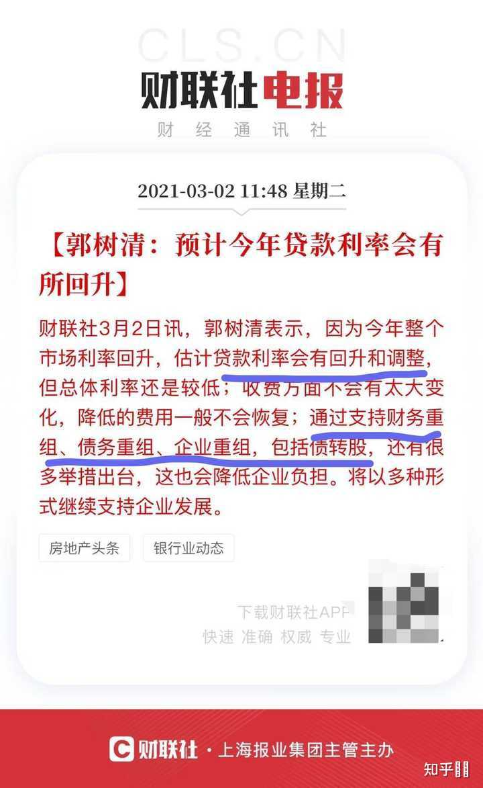

因为中国已经半官方的表态了：我们要开始温和去杠杆了。去杠杆化意味着什么呢？会收紧货币政策，抽走一部分流动性，对于
流动性非常敏感的股票（例如贵州茅台）会首当其冲的下跌。

第82篇:https://www.zhihu.com/answer/1599526665

财富自由后你是选择退休还是继续奋斗？

赞同数: (25赞同)创建时间: (2020-11-28)

会想着为人类文明的发展做一些贡献

第83篇:https://www.zhihu.com/answer/1664599811
---

## 第 86 页

比特币能站上35000美元吗？

赞同数: (22赞同)创建时间: (2021-01-06)

Right now. Right this moment.

第84篇:https://www.zhihu.com/answer/1700441698

你们觉得比特币在这波牛市能突破到多少万？评论区留下你们

的答案。☀☀

赞同数: (20赞同)创建时间: (2021-01-27)

最多5万美元，而且大概率达不到5万美元

第85篇:https://www.zhihu.com/answer/1750114017

普通散户具体如何做空港股个股？

赞同数: (18赞同)创建时间: (2021-02-26)

老虎证券可以直接裸卖空

第86篇:https://www.zhihu.com/answer/1668444756

比特币可以分割成更小单位可以理解为某种程度上的无限吗？

赞同数: (14赞同)创建时间: (2021-01-09)

按照这逻辑来讲的话黄金也是可以被无限分割的，黄金可以最多被分割成原子单位

第87篇:https://www.zhihu.com/answer/1748128022

如何看待2021年2月24号A股大跌？

赞同数: (13赞同)创建时间: (2021-02-24)

先前被炒高估值且业绩预期一般或不佳的抱团股肯定要横盘调整一段时间了，再跌也不会跌到哪去。抱团行情并没有结束，只
是基金经理们会调仓抱团，这个迹象在前几天就已经非常明显，预期绩优股、大宗商品生产股、顺周期股将会是新的抱团基金经理们会调仓抱团，这个迹象在前几天就已经非常明显，预期绩优股、大宗商品生产股、顺周期股将会是新的抱团
标的。

今天A股收盘前抄底了隆基股份还有广发高端制造基金（持仓股以顺周期+大宗商品生产股为主）

像白酒这种增速放缓且想象空间有限的的消费板块

以及新能源造车这种尚未盈利就被炒飞天的股我觉得被杀爆估值是活该。
---

## 第 87 页

但是光伏行业与大宗商品顺周期股被杀估值我觉得是在恐慌情绪之下被错杀了，他们的1季度财报都会非常漂亮。

我认为A股今日的全面下跌是因为市场风格切换导致的基（jiu）民（cai）恐慌赎回+昨日纳斯达克指数收跌形成的戴维斯双杀导致
的。

今天抄底是为了做一波中线投资，埋伏到4月底1季度财报发布。

第88篇:https://www.zhihu.com/answer/1748068943

如何看待2月22日机构抱团股大跌，是否代表着抱团行情的结

束？

赞同数: (13赞同)创建时间: (2021-02-24)

先前被炒高估值且业绩预期一般或不佳的抱团股肯定要横盘调整一段时间了，再跌也不会跌到哪去。抱团行情并没有结束，只
是基金经理们会调仓抱团，这个迹象在前几天就已经非常明显，预期绩优股、大宗商品生产股、顺周期股将会是新的抱团基金经理们会调仓抱团，这个迹象在前几天就已经非常明显，预期绩优股、大宗商品生产股、顺周期股将会是新的抱团
标的。

今天A股收盘前抄底了隆基股份还有广发高端制造基金（持仓股以顺周期+大宗商品生产股为主）

像白酒这种增速放缓且想象空间有限的的消费板块

以及新能源造车这种尚未盈利就被炒飞天的股我觉得被杀爆估值是活该。

但是光伏行业与大宗商品顺周期股被杀估值我觉得是在恐慌情绪之下被错杀了，他们的1季度财报都会非常漂亮。

我认为A股今日的全面下跌是因为市场风格切换导致的基（jiu）民（cai）恐慌赎回+昨日纳斯达克指数收跌形成的戴维斯双杀导致
的。

今天抄底是为了做一波中线投资，埋伏到4月底1季度财报发布。

—————2021.3.15—————
---

## 第 88 页

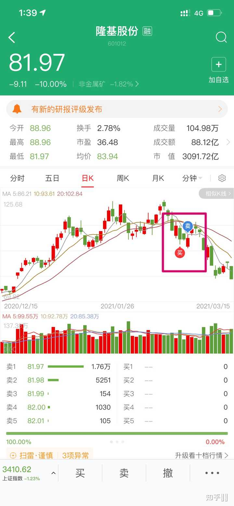

我在抄底完隆基之后意识到10年期美债收益率会不断上升，在2021年末应该会超过2%，这个过程对于成长股而言是灾难性的打
击，所以赚了一点蝇头小利就把隆基抛了，目前看来我的决定很正确。

第89篇:https://zhuanlan.zhihu.com/p/705014500
---

## 第 89 页

给00后们的话

赞同数: (2371赞同)创建时间: (2024-06-24)

整体而言互联网上年轻人中都是负能量的：

卷、压力、房贷、还款、彩礼、内耗、焦虑、通缩

这些词我看的太多也看的厌烦了因为我完全无法共情，搞得好像和什么现代儒家孔子文化一样

我想给00后们的话：未来是属于我们年轻人的

别把那套现代孔夫子的东西挂嘴边把它从你脑子里删除ok吗？

1.别自己给自己找不快活

买不起房子就别买现在房子的pe ratio依然很高，适合租房。你兜里就几十万就想买房，我现在有1.6亿我都没有买自己的房子。凭
什么你想买？为什么你非要买？什么？你说不买房就不能结婚？那你为什么非要结婚？为什么非要搞那么一大堆儒家奇葩糟粕然
后背上个上百万贷款日子苦哈哈？

2.新的蛋糕在源源不断的被创造

君不见世界首富top 20里，有15人都是富一代。世界永远是给新人的舞台总有新的模式、新的市场、新的行业出现。20年前中国的
富豪群体大多是：房地产、矿产资源等传统行业，现在中国的富豪群体大多是来自互联网、新能源、跨境贸易行业。三年河东三
年河西，你们要做的就是当这样的机会出现的时候第一个冲上去抢占摊头。怕什么青春有的是机会来试错。

3.任何年轻人都应该专精的做自己喜欢做的事

哪怕你喜欢打游戏，你都可以把游戏打到最好，或者是开创自己的游戏公司/打金工作室/代练工作室。

成为一个细分领域的专家你这个人就会更值钱

就算赚不到什么钱又如何呢？做自己喜欢的事情一辈子你会收获快乐的一生。更何况现实生活中细分领域的专家们往往都能拿社
会top10%的收入。

4.对于最近高考失利的人，我想说：我没参加过高考但是我的中考成绩是194分因为我是随便写的

成绩算个P，别让它定义你的人生。成绩只能决定你人生的下限，人生的成就上限是由你自己定义的。

从小到大我都没怎么正儿八经的追求过成绩（因为笨），但是我现在照样玩转计算机+金融，我照样在低延迟细分领域把我的正规
军自营交易公司们竞争对手们打的节节败退，我照样是知乎最爱装逼的现金流1亿+的00后富一代

为啥？因为我把我的天赋点全点在了商业的投机取巧上

如果你的追求是更多的金钱，你会发现花几年学习实践投机比你苦读100年书都管用。

最新的商业上的投机学学校里永远是不会教的它需要你

直接去看拿到结果的人写的东西（这里推荐：张一鸣的条语录/《李嘉诚传》/ GCR语录）
---

## 第 90 页

亲自来做生意、感受金融市场的波动历练出来

很多人经常问我读什么书，但是我其实根本不怎么看书，我就像李云龙一样，是个出生于草野的将军。没读过多少兵书，但是就
是懂怎么打商业仗

我经常刷Twitter/看Youtube/混人均资产200万美元以上的高含金量的英文社区，我只看最优秀的交易员的发言。

第90篇:https://zhuanlan.zhihu.com/p/404169902

我爸的A股投资思维

赞同数: (1950赞同)创建时间: (2021-08-27)

我爸从1996年就进入中国股市，逃过2007、2015年的顶，买过2000、2008、2015年的房。从一个外企的采购经理变成了一个提前
退休、经常游山玩水的自由人。

他是巴菲特价值投资派的门徒，同时也有一套自己在中国股市投资的独特方法，我会不定期的更新他教给我的一些内容：

第一.选股时非常注重“安全边际”

他会很关注这家公司市盈率是多少（或者下个季度的市盈率大概是多少）、公司控股了哪些其他的上市公司、这家公司的净资产
是多少、这家公司的未来1年的业绩会如何、这家公司是否有龙头地位。

“不安全”的会被他排除掉的公司类型：市盈率高的泡沫股、市场上一致看多的白马股、债务水平超过50-60%的股、老板是忽悠型
企业家的股（比如贾跃亭）。

第二.逆着大众走

他在2020年2月份-3月份的时候，一直劝我此时应该大胆的加仓，因为这个时候大家都在害怕，而所有人都害怕的时候往往就是好
机会。我那个时候非常从众、也很胆小、没有自己的独立思考能力，听着一堆国内经济学家们那时候在媒体上各种鼓吹“现金为
王”、"安全第一"，就只补仓了一点点，而他则是在那时候大胆的满仓ALL IN了。

2007、2015年他逃顶的时候，也是因为观察到每个人都在讨论股票、每个人都在讨论今天赚了多少钱，所以他在股灾来临前就减
持了大半，自此以后他就相信一定要逆着散户们走，逆着周期去投资，不在乎趋势

2020年末-2021年初，那时候人人都在讨论白酒、新能源、医疗股，他就非常看不起那些抱团的基金经理认为他们跟风从众没有主
见，他选择卖掉大半我们手头的光伏股，转而重仓无人问津、被市场忽略的钢铁、有色金属等周期股。

第三.耐心

他持有股票的周期往往在1-5年左右，因为他知道中国股市是有周期的。只要选的公司质地不差，安全边际好，等到一次景气的周
期出货就能赚很多钱，所以他保持着极其出色的耐心。无论公司的股价如何波动他都不会感到害怕，因为每一次买入之前他都已
经做过深入的研究，他懂他在买什么、干什么。

第四.不看/很少看技术分析很少看技术分析

买一只股票前他会关注股价、市盈率、净资产率、负债率，然后做大量的功课去研究未来1-3年的行业基本面，到了下单买入的环
节最多就看一眼K线，不会去做任何的技术分析。但是有一种情况他不会买，就是当一只股票处于很明显的下跌趋势的时候他不会
买（比如说这段时间我在持续买入腾讯控股、bilibili，他就一直让我不要着急），因为他的经验告诉他买下跌中的股票很容易买在
半山腰。所以他喜欢等到看好的股票停止下跌了，开始横盘震荡了，才会开始买入。（但是我不想听）

第五.想象自己是庄家想象自己是庄家会怎么做会怎么做
---

## 第 91 页

每一只牛股的上涨过程中，庄家都喜欢多次挖坑骗人下车。”你是庄家你肯定也会愿意这么干“他是如此和我说。
庄家掌握了大量的媒体喉舌和钱，所以这就是为什么一只股票在充满泡沫时市场上却会跑出来许多的媒体去鼓吹/证明泡沫的
合理性。
庄家喜欢在一只股票横盘震荡、无人问津的时候吸筹，在市场上充满看多言论与信仰、股价飞涨的时候出货。

第六.不怎么关注宏观经济

经济学家们口中的经济一天一个样，所以没有必要过多关注
中国这个国家长期向好的方向发展
中国政府需要一个新的有赚钱效应的池子来替代房地产

第七.不听任何消息来买股票

他踩过几次坑
可能可以对几次，但是错一次就把赚到的搭进去了
消息股往往也是些没有安全边际的垃圾股、小市值公司，很容易被庄家操纵

第八.只选自己懂的行业的股

他比较懂的行业是中国实体制造业的上中下游，所以他选择的公司也皆是来自这块领域，只有选择看得懂的行业股你才能够靠不
对等的信息赚钱。

第九.卖出准则

当一只股票产生泡沫（市盈率水平极高）、社交媒体上一致看多时必须果断清仓或者至少抛一半。
卖出时最佳的方式是分批卖出，这样能够最大概率的卖在顶部。
不会因为一只股票下跌而”止损“，因为”止损“往往是卖在庄家给散户们挖的坑里。

这些内容我还会不断的更新，偶尔和我爸聊聊他就会和我分享点心得，到时候会更新在知乎上。

评论区真的好多被营销号、抖音号坑惨了的人。。。

请放心，这就是我本人的父亲讲的内容

你们单看内容就会发现我和那些营销号不一样

营销号就和坑人的基金经理们一样喜欢吹捧白酒、医疗、新能源、芯片，喜欢鼓吹“赛道”、“核心资产”，且经常非法荐
股，对着那些高估值的泡沫一口一个价值投资，看着就很恶心

你们翻翻我之前的知乎文章、想法、回答，也会发现我不是一个做营销号的，我不靠写文章赚钱

第91篇:https://zhuanlan.zhihu.com/p/671039236

币圈到底是谁一直在赚钱？
---

## 第 92 页

赞同数: (1243赞同)创建时间: (2023-12-08)

分三种人

1.抽水者们

2.聪明的交易者们

2.破坏规则者们

抽水者，顾名思义就是不参与赌局只在其中抽水或当中介的人：

-搞交易所返佣的。别歧视人家，做得大的Youtube、微博叠码仔一个月佣金上百万人民币很正常，头部的Youtuber像MoonCarl一年
佣金上千万美金。另外这个领域计算机知识也是有大用处的，有一些专业SEO技术团队专门做这一块的关键词，有时候你在搜索
引擎上搜索一个交易所的名称，点进去的第一个搜索结果反而是他们的邀请链接，这种头部SEO团队牛市里一个月赚几百上千万
都正常。

-开付费社群、做信息中介的。往往是一些大V积累到一定的粉丝量就会开始弄个付费社群，一个稍微大一点的付费社群年费就能
收到上百万人民币。另外这些群主还有额外的收获，那就是比如他们发现XXX交易所有什么XXX活动，他们往群里一发，里面就
有很多人通过他链接注册，一下子就又能赚到好多人头费。假设我这个知乎账户现在发一个什么“美股开户教程”，估计发一条文章
也能有至少200个人通过我的链接开户。一个人头=100-1000美元佣金，你们可以算算假设我道德感低点能赚多少钱。

聪明的交易者们，大多数是有独门绝技的人或者团队。

-计算机派系。很多在这个市场里赚很多钱的交易者都是有计算机基础的程序员或者是有大量程序员工作的机构。由计算机技术演
化出来的门派有很多种，不过大致分为链上和CEX两个派系。

链上撸子链上撸子：有些人会开发程序去批量的撸空投、撸活动、撸fair launch、撸whitelist。一切能够确定后面有人接盘让他们赚钱的，他
们都撸。国内币圈撸届里面做得大的很多都是2016-2017年就开始用Fiddler工具撸羊毛的那一群职业羊毛党。

链上MEV：赚的是散户交易者们付出的滑点价差，你可以说这很卷，但你不能说这赚不到钱。做的最大的几个MEV bot普遍月入
上百万美元。

链上-CEX套利：很多时候游资和庄家都是喜欢在套利CEX上引爆行情，一个大单把价格拉上去好几个点，遇到这种大价差的时候套利
者们的机会就来了。他们可以在链上买筹码然后在CEX的合约上对冲然后静待价格回归慢慢抛售，完成无风险套利。

统计套利者们统计套利者们：这个市场上有很多币存在关联性，其背后的原理是市场参与者们的心理上存在“AAA已经涨/跌了，而同概念的
BBB还没涨/跌，所以我要去买BBB”。统计套利者们会写精密的程序来计算出不同的币之间历史上的大致的相关性，当偏差达到一
定程序的时候他们就会出手套利。

做市商做市商：其实做市商很多时候是身兼多职的，一方面他们为市场买卖双方提供流动性，一方面他们也会做统计套利、延迟套利甚
至是VC。理论上来说做市商本职是赚盘口的spread价差，但是他们也会做很多的其他私活来提高自己的投资回报率。
---

## 第 93 页

新闻交易新闻交易，也就是我扎根的领域。赚的是散户交易者们信息滞后的钱以及做市商的信息渠道不够快来不及撤单的钱。散户交易者
获取信息往往靠那几个慢吞吞的新闻媒体或者社群口口相传，对一条新闻的反应时间往往要好几分钟，所以只要买的比散户快，
就有利润赚。

太五花八门了不想继续写了

-综合数据流派系综合数据流派系。数据流派系往往会看市场的IO持仓数据、大单成交数据、监控着大户的地址异动。他们像是在市场里开了全
视之眼，比普通人更快的掌握钱的流动，本质上赚信息滞后的钱。

破坏规则者们

-市场操纵者市场操纵者，也就是二级市场的庄家，也就是二级市场的庄家，他们会提前积累大量小市值山寨币的现货筹码，然后再去启动行情拉个10倍以上，等散
户fomo买进来之后慢慢twap出货。散户一看“哇这个币跌了50%了我要抄底”，实际上即使跌了50%，市场操纵者们依然是有的赚
的。

-发币MCN，一级市场的庄家。当世界上突然出现一个热点时，比如马斯克发推说，一级市场的庄家。“我的ai的名字叫GROK”，发币厂们就会开始
行动，他们有一套全自动的部署体系能一键发行代币、添加流动性、分配给自己的老鼠仓地址。然后他们会用几十到几千个地址
去创造虚假的交易繁荣，同时买通许多合作的KOL一起宣传此代币。吸引力足够的散户入场后，他们有些缓慢出货，有些一根大
红柱子直接rug。

为什么市场操纵者可以肆无忌惮的呢？因为很多非欧美的国家对待加密货币的态度是商品，而针对商品这个类别在很多国家的立
法里是没有“操纵市场”的概念的。就像你在中国囤货炒高劳力士手表、球鞋再零售卖出去不会有人管，同样的炒高币价再出货，也
没人管。

第92篇:https://zhuanlan.zhihu.com/p/665809598

高质量英文CT信息源列表

赞同数: (856赞同)创建时间: (2023-11-08)

GCR

https://twitter.com/GCRClassic

绝对的神话，以色列籍美国人，消息面boting+挖交易所漏洞+叙事交易+宏观交易门派的祖师爷，身价3亿美金以上。现如今为了防
止引来IRS和SEC追查，已经神隐。

有人整理了GCR的很多经典quotes在这里可以看：https://cryptonarratives.substack.com/p/compilation-of-the-best-gcr-nuggets

Tree of Alpha

https://twitter.com/Tree_of_Alpha

将新闻交易+消息面boting+挖交易所漏洞这个门派真正发扬光大的无私奉献英雄，身价3000万美金。

Hsaka
---

## 第 94 页

https://twitter.com/HsakaTrades

叙事交易的鼻祖

Nacho

https://twitter.com/NachoTrades

叙事交易者，也是TIC（The Inner Circle）的创始人，TIC掌控着加密市场的叙事权

PC Principle

https://twitter.com/PC_Larp

https://twitter.com/PC_PR1NCIPAL

叙事交易者，TIC成员，也是对市场叙事把握很好的人

Pentoshi

https://twitter.com/Pentosh1

宏观交易者，在2021-2023期间对于市场的多次预测都准确。

Trading Horse

https://twitter.com/trading__horse

2023年新晋的很强的宏观+叙事交易者，最近3个月来没什么败绩

RunnerXBT

https://twitter.com/RunnerXBT

订单流+新闻+宏观交易者

2022-2023多次靠观察orderflow/io/funding数据准确的预测了市场

NorthRockLP

https://twitter.com/NorthRockLP

自营交易公司的创始人，新闻交易者

对于ETF一块的了解程度较为细致

暂时就添加这么多吧，等我之后想更新了再更新

第93篇:https://zhuanlan.zhihu.com/p/560161882

为什么我要开这个知乎账户？
---

## 第 95 页

赞同数: (851赞同)创建时间: (2022-09-01)

一些人可能会有疑问，我的号开了2年多了，到底是什么意图？

其实一开始我就很清楚我要从我的个人IP上获取的三样东西：精神追求精神追求、、名名还有利

精神追求：

我来自一个中产阶级的家庭，以前在私立国际高中上学，大学也是在3+1的海外学院，所以学生时代接触的大多数同学家庭
都很富有。从那时候在二代的圈子里，我就经常听到一种声音：“有些东西你生下来有就是有，生下来没有就是没有”，我非
常反对这种思想。在16岁的时候，一位外教老师让我们每人写一封给10年后的自己的信，我就在信里写到“26岁的我一定会
成为一名大老板”。我想用我的实践证明用我的实践证明“寒门难出贵子”这句话是谎言，我想记录这全过程，好让说这句话的人能哑口无这句话是谎言
言。

因为极度极度极度极度反对公立教育体制或者说是反对“中国传统固定路线”，崇尚和崇尚和硅谷精英硅谷精英们一样的自己创造的人生路们一样的自己创造的人生路
线线，所以我要做一个榜样，来证明不需要走：“好好读书+内卷+考试>找一份好工作的传统路线”，我照样能过人上人的生
活。

在积累到一定的财富层次脱离了基础物质需求后，分享有用的知识会给人带来一种天然的快感。很多富有的人都很乐意在不
伤害自己现有利益的情况下，分享自己的所学所得给需要的人分享自己的所学所得给需要的人。

名：

我希望能创造一个类似创造一个类似比尔盖茨或者是扎克伯格这样的神话扎克伯格这样的神话：年轻的时候就拥有大量财富，并且我要记录这全过程让我
老了以后能慢慢回忆起年轻时的意气风发，同时我想这也能给想学习我的历程的人一个参考。

作为一名大V本身也有更高的权益保障更高的权益保障，在加密市场上，如果是一个普通人的资产因交易所的bug而造成损失，往往是申诉
无门的交易所都不会认账。而如果是大V遇到问题一发出来，那交易所就会不得不认真对待这个工单了，得给公众一个交
代。

利：

名，本身也是聚拢更多利的工具，像特朗普从小就积累打造很好的个人IP，让他自己本身这个IP就价值连城，他可以自己为
自己的产业代言，他可以为自己的总统竞选拉选票。在生意中，如果我是一个名声在外的财经大V，那么本身我说的话就会
更有分量，它本身就像是一个光环它本身就像是一个光环。

我的3年期目标是等有一天我靠着运营自营交易公司，让我的资产达到1亿美金以上时，会在新加坡或者迪拜创立我自己的对
冲基金。我的名能作为一个可信度的保障，以及起到一个展现产品的作用吸引到潜在的客户。我一直有一个理念就是：有能有能
力有才华，就一定要高调秀出来，这样才能让伯乐看到你力有才华，就一定要高调秀出来，这样才能让伯乐看到你。

一个长期使用的个人IP还起到商业名片的作用，也许未来有一天想了解你的时候，他就可以翻阅知乎账号来快速了解

第94篇:https://zhuanlan.zhihu.com/p/20075613681

2025我的1000万刀美股战略布局
---

## 第 96 页

赞同数: (803赞同)创建时间: (2025-01-24)

现在是2025年1月23日

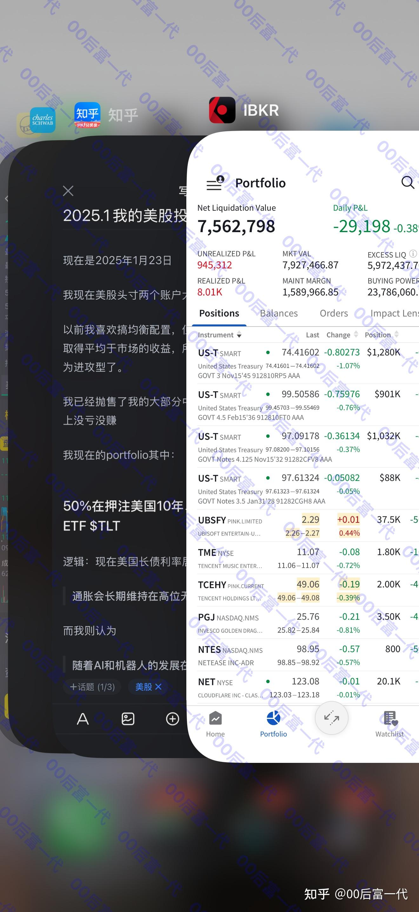

我现在美股头寸两个账户大约1000万美元
---

## 第 97 页

以前我喜欢搞均衡配置（老粉知道我以前是Ray Dalio的信徒），但是搞了半天发现这么做只能取得平均于市场的收益，所以我现在
在美股的战略改变为进攻型了。

我已经抛售了我的大部分中概科技股，在他们身上基本上没亏没赚

我现在的portfolio其中：

50%在押注美国10年、30年国债，以及长债ETF $TLT

逻辑：现在美国长债利率居高不下是因为市场觉得

通胀会长期维持在高位无法被抑制

而我则认为

随着AI和机器人的发展在未来几年人类社会会变得超级高效，大量的人们将会失业or工资降低，商品价格会变
得更低，贡献通缩力量

故此，我在押注美国长期利率将会下降，利率下降=债券价格上涨，会pump我的bag

30%在Cloudflare $NET这家公司，成本均价106

我认为这是一只有潜力几年内营收翻几倍的被低估的科技股。全世界19.3%的网站在使用它的服务而且这个比例还在提升（包
括OpenAI也是在使用它的服务），加密货币领域大部分网站也都是使用它的服务，它未来只需要类似X和TG一样推出多个增值服
务，盈利能力就能大幅提升。增长潜力无限。

20%配置在分散配置上

有ARKK、ARKW这种美股科技ETF，有阿里巴巴腾讯网易小米集团这四个龙头中概股。

如果有好的机会，我真的很想加仓小米集团如果有好的机会，我真的很想加仓小米集团，因为我之前还没买够它就起飞了一个月翻倍。我认为未来小米集团会
成为中国最伟大的公司之一。

为啥这么选呢？因为我有很多资金是最近半年才转入美股券商账户的，而我感觉现在上车主要的AI科技股们比较贵了，所以选择
了现在的大部分押注长债的投资模式。

——————日常怼——————

1.我的投资抉择无需你认可与否，这是我的投资选择。金融市场最好的一点就是玩的是真金白银，如果我输了我就会亏，如果我
赢了我就会赚。如果觉得我的判断错了，请把我为什么会输的原因打在评论区一起交流，过几年回来华山论剑探讨验证，如果回
头看我错了，我也会谦虚的认错

2.我也知道很多40岁以上的中年人看到00后炫耀那么多财富就会酸我，然后觉得“这个人炫富是为了打造人设割韭菜”。你们继续当
鸵鸟挺好的乖乖把头埋下去吧。https://zhuanlan.zhihu.com/p/719648377

我所有的资产证明都是真实的，在这里欢迎任何人来打假我来领取赏金和满足你的成就感
---

## 第 98 页

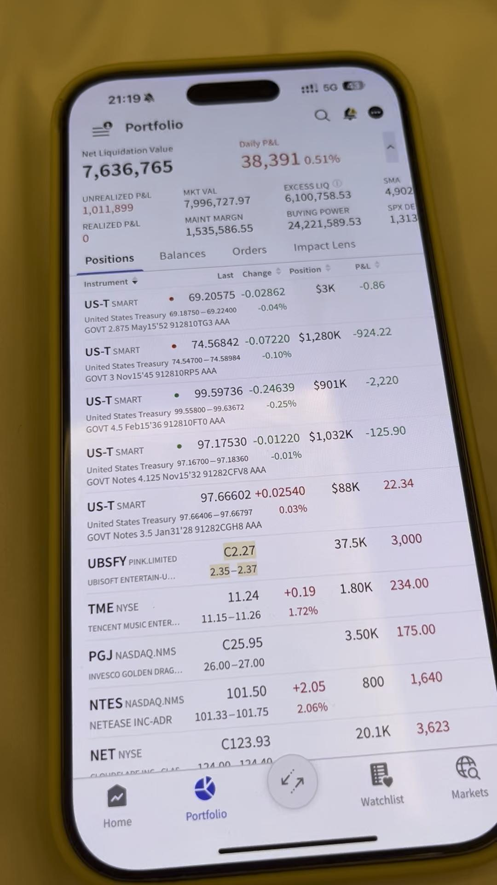

附上ibkr资产视频证
明https://www.zhihu.com/video/1866234241165164547

第95篇:https://zhuanlan.zhihu.com/p/367090849

我的致富思维

赞同数: (533赞同)创建时间: (2021-04-23)

总结一下我致富的原因：

1.冒险精神：我从小就很喜欢去探索未知，愿意承担风险。一旦发现一个新的商机，只要我感兴趣，我就会去尝试。我从不怕尝
试商机而带来的亏损，因为我懂得控制好风险，而且每一次尝试之后无论赚钱与否，我一定能学到新的东西。
---

## 第 99 页

2.独立意识：我一直都不喜欢被控制，尤其是被强势的人控制，我更喜欢去控制别人。我很难，也很讨厌成为别人的一枚棋子，
我一直都只允许自己掌控全局，自己掌握自己的人生。

3.延迟满足：我愿意为了更美好的未来去牺牲当下，在我的价值观中，没有“活在当下”这个概念。我愿意放弃当下的娱乐去拥抱学
习，因为我知道学习能在未来给我带来金钱的回报。我愿意暂时不买一样昂贵的消费品，因为我知道同样的金钱如果被我用去投
资，则可以在未来赚到更多的钱。延迟满足=未来收获更多=我的快乐

4.合作意识：我知道世界上有很多人都比我更聪明，所以我应当与他们合作。我明白单打独斗无法做出大事业，一定要和与自己
更聪明的人合作才能到达更远的地方。

5.风控意识：并不是每一个商机都能成功，事实上，以往真正让我赚到钱的商机只占1/5，大多数商机是让我亏损或不赚不赔的，
所以我一直都有很强的风险控制意识。我从来都只会拿自己输的起的钱去尝试新的商机，在我只有2000块的时候我就拿500块去尝
试新的商机，在我有100万的时候我就拿10万去尝试新的商机。满仓All IN从来都不是我的风格，我更欣赏“大胆的小心”风格。

6.生财意识：我一直都觉得把钱存进银行定期是很愚蠢的，一下子让自己丧失流动性的同时还很容易错过好机会。所以我会花很
多时间去研究宏观经济与投资标的，让我有能力好好管理自己的财富，获得不错的收益并且保有充足的流动性，在有新商机出现
时可以立马拿钱出来尝试。

7.慕强意识：我会有意识的与各个领域的强者做朋友，因为我可以从他们身上学到新东西。并且这些厉害的人在以后很大概率以
后会有合作的机会。

8.跳跃性思维：我很擅长把无关的事物组合起来合并成一个新的解决方案。把A的技术和B的资源结合起来再卖给C是我的常用商
业技巧。从A手上买到货物，再卖给求货无门的B从中空手套白狼也是我的常用手段。

第96篇:https://zhuanlan.zhihu.com/p/719648377

写给黑粉的话

赞同数: (532赞同)创建时间: (2024-09-12)

这篇文章在我遇到韭菜的攻击的时候会拿出来回复你，当你看到我回复你这条文章链接的时候说明我很想骂你，但是很可惜知乎
发不出来，请你自己脑补我怎么骂你。

黑粉指的是：

觉得我没有一个亿人民币，只是在“立”什么狗屁人设的
觉得“你肯定是想割韭菜的”

1.首先这些黑粉往往是40岁以上的中年人，因为你们的认知里就觉得只有老了30岁以上了才能赚到大钱。你不看看现在是什么
时代？还拿传统行业那套经验生搬硬套呢？过去几年赚大钱的new money都是掌握信息优势的年轻人。

2.我都【带和当前时间吻合】炫耀了那么多次实盘了，怎么还是有人觉得我连一个亿都没有呢？我切腹切那么多回了，你还说我
吃了两碗粉，幽默。
---

## 第 100 页

真正的骗子/立人设的那种人：要么像知乎上某个老虎头像的，1982年生却说自己是有10个亿90后的，他完全不发任何实盘，因为
他拿不出来。要么像微博上某帆少，自己实际资产只有2-4千万，却冒充自己有一个亿的，他的套路是用手机展示他的已有资产，
再用电脑网页端F12审查元素改一下余额额外冒充一些资产。

一个很简单的方法看一个大V是不是割韭菜的：如果这个人声称自己很有钱，还想
带你赚钱，100%骗子。另外就是那种声称自己很有钱，但是又各种诱导你加微信
加付费群的也都是骗子。割韭菜的那种大也都是骗子。割韭菜的那种大V最终一定会诱导你去加他的第三方联系最终一定会诱导你去加他的第三方联系
方式方式，以达成变现的目的。自己对号入座去看吧。，以达成变现的目的。自己对号入座去看吧。

这里给质疑我的资产数量的黑粉一个公开的对赌，长期有效：我可以给你看1亿实盘，全程直播。如果我有，你需要给我发500元
红包+知乎公开道歉。如果我拿不出来，我直接删号，也欢迎你发帖子捶我。

很多人都劝过我说“要忽略低素质的人”、“忽略质疑远离内耗”。我当然也明白这个道理，但是我就是一个较真的人，我有钱有时
间，就是爱和你们这种黑子对线，我就是爱刨腹自证。就怕小黑子别500元的赌都输不起哦？

另外，那种割韭菜的大V可不会像我一样专门写一篇文章给黑粉，他们喜欢规避冲突他们喜欢规避冲突+删除负面评论，当缩头乌龟，他们的割
韭黑料多多，经不起挖掘，也怕闹大了影响自己的韭菜田收成

3.我的知乎账户到现在都6年了，你自己翻翻我有没有发过广告？有没有诱导你进什么“投资群”、“付费群”，有没有诱导你加什
么“xxx微信”、有没有发什么土狗币让你买？你找得出来我吃一斤大便+删号，此招募榜长期有效

我靠收割我靠收割二级市场二级市场上的上的散户散户们就已经赚的盆满钵满了，还差你这三瓜两枣？为什么你觉得我想赚你兜里那三瓜两枣？你哪们就已经赚的盆满钵满了，还差你这三瓜两枣？为什么你觉得我想赚你兜里那三瓜两枣？你哪
来的自信觉得我发知乎就是为了收你那几个铜板？

4.有一些黑粉会说“真的有钱人不会这么高调”，不会炫耀。凭啥？我23岁就已经赚了1亿+人民币现金，凭什么不能高调？换成是你
你低调的起来？你这么喜欢当司马懿啊那么爱中式隐忍？我肉身都润了高调咋了？我就是爱收获被崇拜的感觉，在我的观念在我的观念
里，只有钱而没有名是不完美的，我赚更多的钱的动力之一就是为了获取更大的名气、拥有更拽的头衔里，只有钱而没有名是不完美的，我赚更多的钱的动力之一就是为了获取更大的名气、拥有更拽的头衔。我的偶像马斯克28
岁赚到人生中第一个3000万美元的时候，也对着媒体镜头笑嘻嘻的展示他的限量超跑。

我就是不喜欢像拼多多黄峥和腾讯马化腾那样的中式低调隐忍，我喜欢像马☁一样的美式高调

我知道你又要酸，说“呵呵有钱且高调在这片土地不是好事”，我当然明白这个道理。所以我已经润了，我做一名世界公民，国际
资本家，资产配置在全球，不用受天庭那套“隐+忍+稳+管+控”的规则制约

第97篇:https://zhuanlan.zhihu.com/p/16288309339

我的精英主义的强化

赞同数: (418赞同)创建时间: (2025-01-04)

随着财富的增长以及在这个鱿鱼游戏加密市场呆的久了，我的精英主义观念也越来越强了。愈发的觉得：

-只有少数人能靠alpha致富，因为那种捕获alpha的聪明投机头脑+执行力确实只有少数人有

-信息时代，获取优质信息的能力只有少数人能掌握，因为学校不教这个，个体要拥有这个能力得靠机缘巧合。信息的差异是造成
财富差异的最重要因素，精英掌握并使用信息，人民群众总是慢吞吞。市场里的表现就是：精英们想办法获取廉价筹码，人民群
众们等价格涨上去XX倍之后再去接盘。

-我认为人民群众的作用就是给精英们创造价值（富人最大的财富是穷人），人民群众的大部分钱会以：买商品、在金融市场和赌
---

## 第 101 页

场输掉等形式流入精英们的口袋

马斯克说过他不喜欢和华尔街的人打交道，因为他们总是想着零和博弈，现在我被他给说中了

第98篇:https://zhuanlan.zhihu.com/p/597748595

市场投机心得论驱动市场的叙事

赞同数: (386赞同)创建时间: (2023-01-09)

先科普一下：

叙事(Narritive)，是在一段特定时间内市场的参与者们认可的、可驱动市场向着上涨方向推进的“共识故
事”。

有超大的全球宏观级别的叙事，例如美联储从2020-2021年实施的0利率政策就创造了一个“美联储会无限放水、负利率时代即
将来临”，创造了一个无比宏大壮美的全球资本市场的共识——狂暴大牛市。
也有规模较小的叙事，例如2021年10月份扎克伯格宣布facebook改名为META并要all in元宇宙，这一举动创造了“元宇宙”的叙
事，在美股、A股、加密市场都驱动了元宇宙板块暴涨，一时间元宇宙成为全球资本市场的热点。
还有更小规模的叙事，例如2022年10月份马斯克完成对twitter的收购，在加密市场上创造了“twitter叙事”，在几个星期里驱
动DOGE、MASK大幅上涨。

一个对市场有大幅驱动作用的叙事的形成要素，是天时地利人和的结合

天时：叙事只会在市场较平稳或者牛市时形成，往往不会出现在连续绵延下跌的市场悲观阶段。市场的情绪面要处于平稳或兴
奋，悲观的场景下叙事很难运行因为相信其中的参与者们太少。

地利：叙事本身必须是一个新颖的题材，或者是突发的重大事件改变了标的的基本面。只有不在市场预期中的突然出现的新事
务，才会有更多的人愿意相信故事并参与其中。

人和：任何一个叙事，都少不了叙事人(Narrator)。如果拿到大层面来看，叙事人是那些投资公司|银行|对冲基金的创始人、著名宏
观分析师、私人企业创始人等。而在小的细分市场，掌握叙事发酵话语权的是有众多粉丝关注的大V、大的散户社群、财经APP
等。

谁是叙事中的赢家和输家？

在大部分场景下，一个叙事的发生周期只有几个星期最多数月。所以也注定了叙事交易是一场零和博弈，会分输赢。

谁能赚钱：提前建仓的叙事者们、操纵市场引爆题材的游资、早期介入叙事的交易者、在不关注叙事但是在高位抛售的长期投资
者

谁会亏钱：相信叙事并心甘情愿长期投资的人、叙事发酵晚期参与交易的参与者

第99篇:https://zhuanlan.zhihu.com/p/708167331

当然是爱国的

赞同数: (358赞同)创建时间: (2024-07-11)

作为一名中国人我希望我的国家越来越好越来越富强最终能靠经济、文化的影响力实现万邦来朝经济、文化的影响力实现万邦来朝

我看品客们就是不爽，因为这群家伙的思维是“真理只在大炮射程之内”，“只要大炮够强不管他们愿不愿意都得给我们跪下”
这种排外慕枪，弱肉强食的思维并不能真正得人心也只会引来外邦的敌对心理

并不能真正的让大中华雄立于世界民族之林，被其他各民族尊重
---

## 第 102 页

第100篇:https://zhuanlan.zhihu.com/p/371835576

资本市场接盘韭菜的共同特征

赞同数: (254赞同)创建时间: (2021-05-12)

看看你或者你身边的朋友中了几个

1.很容易对一个不断上涨或者快速上涨的投资标的产生信仰，某样资产涨的越多他们就越是有信仰。涨的越高脱离基本面时他们
不但不减持，还可能不断加仓，越涨越买

2.盲信大V和“专家”，没有独立思考能力，听得风就是雨。

3.很容易就盲信描述未来的故事，不去考虑当下的事实。比如之前很多韭菜都觉得“新能源是人类的未来”，所以他们去高位买入新
能源汽车股，却没有考虑那些新能源汽车公司10年之后能生存剩下来的其实寥寥无几，而且那些股票的价格已经透支了未来很多
年的业绩。

4.喜欢听小道消息、喜欢听身边同样是韭菜的人给的投资建议

5.当看到一样资产价格涨飞天时会产生FOMO（害怕错过）情绪，会忍不住去参与

6.缺乏金融与经济学知识，什么都不懂就进入资本市场追涨杀跌

7.把资本市场当赌场，在进行投资或者交易时总想着要“赌一把”、“搏一搏”

8.买入之前不做任何调研，只是因为“感觉会涨”而买入

——————————欢迎评论区补充，会持续更新————————————

第101篇:https://zhuanlan.zhihu.com/p/346547699

论新时代如何实现阶级跨越

赞同数: (246赞同)创建时间: (2021-01-23)

“寒门难出贵子”、“中国的阶级已经固化了”

这是我听的很多的一句抱怨。固然，在某种程度上，中国的阶级确实正在渐渐固化，在传统行业里体现的尤为明显，因为传统行
业有限的财富份额早已经被老资产阶级瓜分殆尽。但，向上突破的通道依然存在。

首先要从社会学的角度去分析，在什么样的社会中阶级变动最频繁？答案是：有变化的社会。越是缺乏流动的年代、法治越是健
全的社会，阶级流动就越缓慢。反之，越是动荡有变化的年代，法治越是不健全的社会，阶级流通就越快。刘邦等历史风云人物
---

## 第 103 页

均是抓住了来自动荡年代的机遇，从底层实现超级阶跃变成国家最高领导人。现在商界许多老一辈企业家也都是勇敢探索抓住了
中国改革开放初期的社会变化，才实现了阶级跨越。社会变化———意味着风险与机遇并存，意味着一方旧势力的衰落与新贵崛
起。

时势造英雄

100年前的世界首富是石油大亨洛克菲勒，30年前的世界首富是日本房地产商，20年前的世界首富是电信服务供应商，10年前的世
界首富是比尔盖茨，现在的世界首富是马斯克。这，就是变化的力量，这就是时势的力量。在过去的二十年里，世界上最大最大
的变化大概就是计算机的普及与互联网的发展，这股强大的变化创造了许多新的财富分配给新贵，也从许多旧势力中掠夺了财富
并重新分配给新贵。我的环境中能接触很多富二代，但我只见过家业在房地产、建筑业、矿业、能源业等传统行业的富二代，从
来没有遇到过任何一个爸妈是做互联网&计算机的富二代，为什么？因为在这个领域只有富一代！

当今计算机&互联网革命就是风口浪尖，就是这个时代的阶级上升VIP通道。这一波红利很大一部分已经被X与Y世代瓜分的差不多
了，留给我们Z世代的机会已然不多，这条VIP通道是在变得越来越窄，但依然有很多细分领域可以吃到小蛋糕屑。要实现阶跃的
关键就是一定要把握好这宝贵的时代机遇，一定一定不能错过它！要投身计算机互联网，并在细分领域做到极致出色！百万亿的
财富蛋糕在被计算机互联网行业重新分配，即使吃不了一整口，能吃到一小点蛋糕屑也能变成亿万富翁。

突破阶级壁垒的VIP通道依然通畅，但已经变得越来越窄了。连蛋糕屑都正在被吃完，时间可不等人！我愿意放弃青春的许多美
好，只为换这最后一班船的票！

注：

X世代指1965年～1980年出生的人

Y世代指1980年代和1990年代出生的人

Z世代指在1990年代中叶至2000年代中叶出生的人。

第102篇:https://zhuanlan.zhihu.com/p/345025938

患得患失：金融投资与情场之大忌

赞同数: (242赞同)创建时间: (2021-01-18)

投身金融投资行业也有一年了

研究情感心理学也有一年了

说说我观察到的金融投资与情场非常相似的点吧：那就是在你投入其中之后，一旦出现患得患失的心态，那你就大概率真的会遭
受损失

墨菲定律：“越是会担心的事情就越是会发生”

是什么导致患得患失的心态？是因为你下了超过心理【可承受损失范围】的注，简单的来说就是你输不起，所以一旦有一点点账
面亏损就会慌的手忙脚乱。而在手忙脚乱的情景下，人会失去理智，做出的决策往往是极其错误的。在情场上，出现患得患失的
---

## 第 104 页

心态就意味着你是弱势的“需求方”，必然会陷入被动。

金融市场上谁赚钱谁赔钱？大部分富人是赚钱的，大部分穷人是赔钱的。这是为什么呢？因为富人拿1000万去炒股，赔掉了一半
也不会影响他开豪车住豪宅，富人有极大的心态优势，可以让他更理性的做出决策，更容易赚到大钱。而穷人呢？拿着他好几年
辛辛苦苦攒下的10万块钱去炒股，赔了一半心态就崩溃了，想着自己辛辛苦苦积攒了1.5年的钱打水漂了，就开始唯唯诺诺患得患
失，开始进行不理性的交易操作，最后亏钱割肉离场。

情场上谁输谁赢？最后往往是高价值的人赢，低价值的人输。因为高价值者有足够多的“行情筹码”在手，不缺这一个，所以会建立
很强的心理优势。而低价值者没有那么多筹码，往往会有患得患失的心态，就容易进行委曲求全的行为。《简爱》中有一段话可
谓是一针见血：“爱是一场博弈，必须永远保持与对方不分伯仲、势均力敌，才能长此以往地相依相惜。因为太强的对手让人疲
惫，太弱的对手令人厌倦。”

金融投资和情场，本质上都是一场博弈。要与别人斗，也要与自己的情绪斗，而患得患失是许多人输掉这场博弈的原因。要赢，
首先就要确保自己不怕输，要有输光也无所谓的底气，这就是“在战略上要藐视敌人，在战术上要重视敌人”的灵活运用。

第103篇:https://zhuanlan.zhihu.com/p/530453797

经济周期：从历史看到今天

赞同数: (208赞同)创建时间: (2022-06-18)

1929年

繁荣导致经济积累了过多的信贷>信贷达到一个阈值开始进入自行衰退的过程>经济体里流通的钱变少>经济陷入衰退>衰退使得钱
变得更少。这样进入了一个死亡螺旋卡bug了。直到罗斯福上任后放宽一定的印钞权+政府扩大支出靠超级大放水，才把经济救回
来一点。（但是全球经济真正恢复还一直拖到了2战以后）。

为什么现代货币体系下1929级别的大萧条很难发生？因为大萧条之所以会发生，很大一部分原因就是当时的美国政府在危机初期
没有铸币权。当时的美元是和黄金锚定的，不是可以随意印的。还有就是危机发生初期的那个美国总统相信“由经济自行修复，政
府不应当多干预经济”所以错过了挽救的良机

2000年

繁荣导致经济积累了过多的信贷>美联储连环加息加速信贷自行衰退的过程>经济体里流通的钱变少>经济陷入衰退>经济体里流通
的钱变少>美联储怕了在2002年开始降息>市场上流动性缓慢的变多>经济慢慢的被救回来>新的繁荣周期形成

2008年

繁荣导致经济积累了过多的信贷>信贷达到一个阈值开始进入自行衰退的过程>经济体里流通的钱变少>经济陷入衰退>经济体里流
通的钱变少>美联储历史上首次使用0利率+核动力QE印钞机>市场上流动性快速增加>经济较快的被救回来

2020年

这次因为疫情导致经济活动缩小>经济体里流通的钱变少>经济陷入衰退>美联储第二次使用0利率+核动力QE印钞机>市场上流动性
飞速增加>经济被极速救回来>新的繁荣周期形成>繁荣导致经济积累了过多的信贷>信贷达到一个阈值开始进入自行衰退的过程又
叠加上了俄乌战争与美联储加息>当下我们就在这里，这个阶段我们会体验到美元本位的经济体里的流动性在减少，这个阶段直到
美联储干预才会结束
---

## 第 105 页

关于宏观周期，我推荐两本书，《周期》和《债务危机》，其中《周期》能浅显易懂的教会你周期的原理以及身在一个周期的时
候判断当下所处的位子。而《债务危机》剖析了每一次历史上的金融危机是怎么形成的以及后续的全过程。

宏观经济不是一个用来赚快钱的学问，但是对于防守以及大方向战略判断的胜率提升还是很有效的。原理很简单，学点入门，一
辈子受用

By the way，我不认为这次美联储会酿成2008式的全球性经济危机。因为1.从历史的规律上来看，美联储每次都在不断的进化，在
一次次危机调控中做的更好。2.很多金融与商业大佬其实都对这场衰退有所感知提前撤退了，它不是一个像2008雷曼兄弟爆雷那
样的突发性事件不给人反应的时间。个人认为这次最多就是轻微的全球经济衰退+美元本位金融市场遭大殃，有点类似2000-2002
的情况。

目前币圈已经上演了一段时间并且还没有结束的过程嘛，可以借鉴2000-2002的互联网泡沫破裂阶段的纳斯达克综合指数，纳指跌
了80%，软银孙正义做了2天的世界首富后身价在2年里跌去了99%、很多个股退市归零、亚马逊在两年内跌了95%，Cisco这家web2
基础设施龙头公司把买到山顶的投资者套了22年至今还没有解套。

But，不要丧失希望，珍惜并好好利用这段安静的时光，保持学习保持参与，crypto依然是一条优质赛道，等当前的至暗时刻过去
后，下一场轰轰烈烈的大牛市又会在一轮经济的新繁荣周期里拉开序幕。

第104篇:https://zhuanlan.zhihu.com/p/366189120

2021.4.20谈谈我在未来几个月内的投资动作

赞同数: (185赞同)创建时间: (2021-04-20)

我之前的文章不是写着玩玩的，一向做到知行合一

我先前已经在多篇文章和想法中提出我看空2021下半年到2022年末的股市以及加密货币，因为今年下半年开始我们将会面临世界
流动性收缩的格局，当前维持各种资产在历史高位的先要条件”宽松货币政策“将会渐渐不复存在，市场面临极大的回调风险。将会渐渐不复存在

我相信比特币会在这一年多内跌回20000美元左右的位子。

至于股票市场，即使没有特别大幅度的崩盘，中小幅度的回调（10-20%）与频繁的震荡行情也应该会是2021下半年-2022全年的主
基调。这种行情磨人心态，也非常考验操作技巧，我认为以我目前的中短线操作水平我无法在这种行情中赚多少钱，甚至极有可
能亏钱，所以还不如多留现金资产，晚上睡觉还能香一点。

以下是我未来2-3个月内会完成的操作，

1. A股方向股方向

在4月/5月/6月分三批清仓目前占我总资产配比46%的A股股票，躲开危险的2021下半年和2022全年。变现出来的人民币现金我会择
时兑换成USDT/BUSD/USDC存入币安交易所的币安宝定期，相当于是利息超高（6-7%）的美元货币基金，另一部分跟单查理芒
格，换成港币逢低配置类现金股票：阿里巴巴

2.币圈方向

保留目前占比1%的开仓价为58500的BTC 2倍做空合约，直到我的预期价28800才会平仓。

3.美股方向

保留目前占比9%左右的做空小鹏汽车、理想汽车、蔚来汽车、特斯拉、拼多多的仓位
---

## 第 106 页

4.港股方向

保留目前占比4%左右的做空恒大汽车的仓位

5.人民币现金、债券方向

保留目前占比35%的人民币现金资产：货币基金、余利宝信托以及不同的人民币债券

6.投机方向

保留5%的绝对机动资本（余额宝货币基金），用于随时投资新商机、新项目。

很多美国的专业投资者，例如瑞达利欧都建议不要在当下配置现金，其实他们说的是不要配置美元现金和美国债券不要配置美元现金和美国债券，因为这两样
资产的实际收益率都为负，都跑不赢通胀。而我选择配置的皆是收益率为正的币圈货币基金、人民币货币基金、人民币固收信币圈货币基金、人民币货币基金、人民币固收信
托以及人民币债券托以及人民币债券，至少我不会交“通货膨胀税”。

可以说我的新资产配置方案非常非常的保守，因为我真的不想参与接下来的动荡行情，与其在震荡中追涨杀跌，我想不如等到更
好的时间点再去买入估值低估估值低估/合理的好公司或者加密货币合理的好公司或者加密货币，然后长期持有长期持有。我认为最佳的买点会出现在2022年下半年至2023年
初，美联储停止量化宽松+2023年加息预期，两大超级利空落地，应该会使市场处于比较绝望的底部区间。

等2021上半年完成上述资产配置后，未来的1年我就会花很多时间用心去发现好公司以及好加密货币项目，在2022-2023熊市时分分
批建仓批建仓，开始长期持有长期持有，耐心等待下一次泡沫的诞生。

第105篇:https://zhuanlan.zhihu.com/p/320831990

谈新时代消费主义

赞同数: (177赞同)创建时间: (2020-11-30)

什么是消费主义呢？

消费主义是一种价值观念和生活方式。作为一种价值观念。它以过度消费、超前消费、奢侈消费、攀比消费为人生的价值体现方
式。把消费活动当成是实现自我个性的主要形式和寻求身份认同的主要方式。将消费等同于事业的成功、人生的幸福：消费成为
人存在的目的和人生的支点，人为了消费而消费，为了消费而存在。

消费主义为什么会形成？

消费主义其实是资本主义在发达到一定程度后的产物，通俗点来讲就是商家需要从已经饱和的市场中榨出更多的利益来，需要刺
激消费者进行更多消费

消费主义的体现？

比如学生用花呗消费分期买一双AJ、比如上班族女孩花攒了几个月的钱来买一个自己喜欢的包。还有为什么有些人要租车装逼泡
妞呢？因为很多女孩觉得“男人开的车决定了他的社会地位”，所以租车泡妞这套真的能骗到很多女生。

消费主义的常用语？

“喜欢就买”

“You are what you buy”

“男/女孩要爱自己”
---

## 第 107 页

“钱不是攒出来的是花出来的”

消费主义主要横行场所？

小红书、Club等年轻人聚集的场所

消费主义的危害？

其最大的危害就是会让一个人失去储蓄/投资意识，在面对重大风险或者千载难逢的投资机会时他们拿不出钱。消费主义会加重贫
富差距！因为穷人和中产阶级会在消费主义洪流中被榨出他们的财富，而这些财富最终会流入掌控商品生产/售卖的老板手里。

消费主义的好处？

对于商家以及国家而言，消费主义是非常好的东西。它能够促进消费者进行更多消费，商家能赚到更多钱，国家的GDP能被拉的
更高。美国的GDP为什么这么高？因为他们的人民有很强的消费能力，钱全用来透支消费了，他们的消费占比占GDP的70%。

我对消费主义的看法？

首先消费主义是资本主义发展到一定程度后必然会出现的衍生品，历史进程的洪流我是挡都挡不住的，所以只能顺其自然。肯定
改变不了别人，但是我可以让自己做的很棒，能够很大程度上抵挡消费主义的冲击。

消费主义与我财富增长的关系？

我的财富积累速度为什么这么快呢？因为我赚的钱很多很多，但从来都是有节制的花钱，每次只会花一小部分用于生活消费，其
他大部分钱都用于继续投入公司生产或者其他领域的投资。和我同样收入的人越到后面就越不如我赚钱速度快，因为他们往往没
有这种意识，相反的他们大手大脚的去消费过纸醉金迷的生活，所以他们错失了很多让自己赚更多钱的机会。如此循环下来，我
的财富水平比同收入的人高了很多很多，而且他们不可能追得上我。

我的消费理念？

身边已经有太多人和我说“你要学会包装自己”，其实他们会这么说的本质就是因为我不是很想把钱花在“让别人觉得我过得很好”的
地方。我想买一个10万块的表也就是轻轻松松的事情，但是我不想买，因为我觉得这10万块可以花在让我自己生活品质更高的地
方。比如我出行可以住豪华酒店、可以次次打的坐礼橙专车、可以头等舱出行等。我觉得把钱花在这种真正让自己过得更爽的地
方才值得。

最后总结：

消费主义是资本主义发展到一定高度后的衍生品，其逻辑就是商家会把商品与某种价值绑定，从而刺激消费者进行更多的消费。
消费主义是一种趋势，在中国年轻人中会继续鼓吹发扬光大的趋势，这是势不可挡的。我也不是完全出淤泥而不染的，我也有我
喜欢的品牌，我也会偶尔买点奢侈品，毕竟确实部分商品的附加值可以博来他人的认同感+自己更多的自信。但是我一直都严格控
制购买消费品在总开销中的占比，消费永远只占我月收入的一小部分，大部分的钱都用于投资/扩张生产，这让我的财富积累速度
都比普通人快很多。

对消费主义上瘾其实就像国民对烟上瘾一样，对于国家而言是一件带动gdp的大好事，但是对于个人（尤其是中产和底层阶级）来
说则是一个阻碍阶级晋升、放缓财富增长速度、增加贫富差距的坏因素。

第106篇:https://zhuanlan.zhihu.com/p/352361174
---

## 第 108 页

对2021-2022年股票市场的预测

赞同数: (158赞同)创建时间: (2021-02-23)

现在是2021年2月23号，

虽然预测很容易被打脸，但是我还是想预言一下接下来股票市场的行情。

首先来理解一下这一轮周期的全过程。

第一阶段-萧条

2020年1月份到2020年4月份，新冠疫情爆发并开始向全球扩散。随后的几个月发生了什么我们都知道：各国政府开始封城、封锁
经济，造成全球范围内的经济萧条。美国失业率大幅度飙升，直到4月份创下美国几十年来失业率高峰的14.8%。

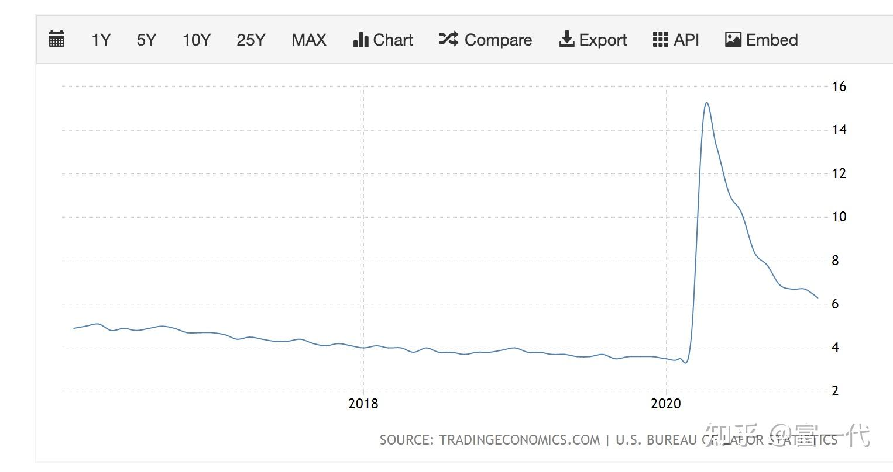

第二阶段-复苏

2020年5月份到2021年2月份，各国政府开始使用各种财政工具来提振经济。在这期间，全世界货币供给量有飞一般的提升：欧元
区M2增加10%，美元区M2增加25.7%。各国贷款利率也到了非常非常低的水平，我记得在去年隔三差五就接到银行打电话问我需
---

## 第 109 页

不需要企业贷款。

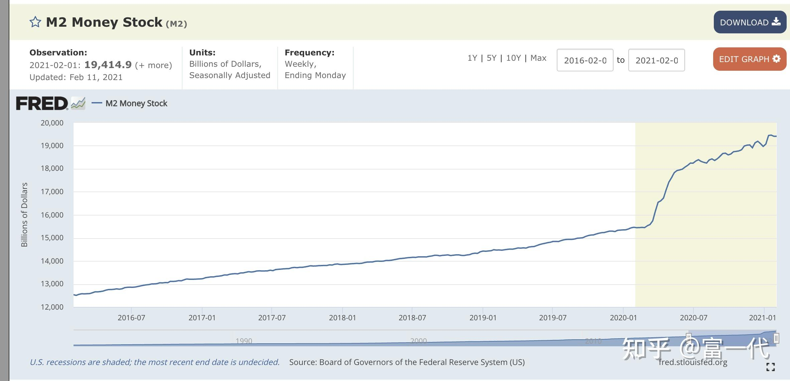

海量的货币为经济复苏提供了有力的支撑，经济发动机开始恢复运转，失业率快速下降。如此宽松的货币政策也使人们对于通货
膨胀的预期提升，促使人们把现金换成金融资产，推高股票市场、房地产市场、加密货币市场的大幅上涨。

标普500走势图

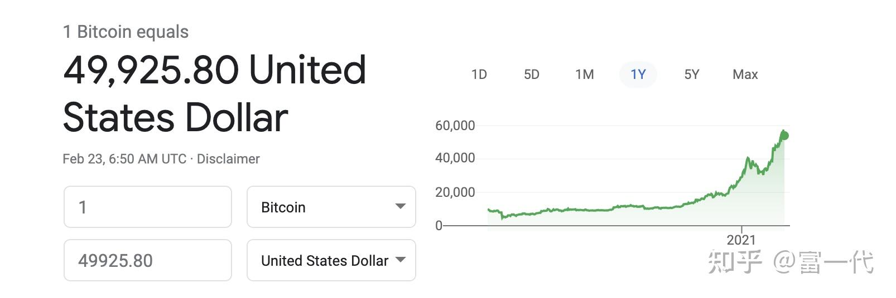

比特币价格走势图

在这个阶段，成长性强的高风险资产（科技股与比特币）得益于极其充裕的流动性与极强劲的投资者信心，获得了最高的涨幅。

第三阶段-过热

经济就像国家的柴油引擎，转速慢（萧条）时国家就需要给他添加燃料（货币）并努力尝试发动（政策支持），当引擎成功运转
起来后，它会变得越来越快，变得过热。

在这个阶段，GDP与CPI都获得大幅增长，以原油与铜为首的大宗商品价格飞涨，得益于此，采矿业、石油开采类股票价格将会飞
涨。
---

## 第 110 页

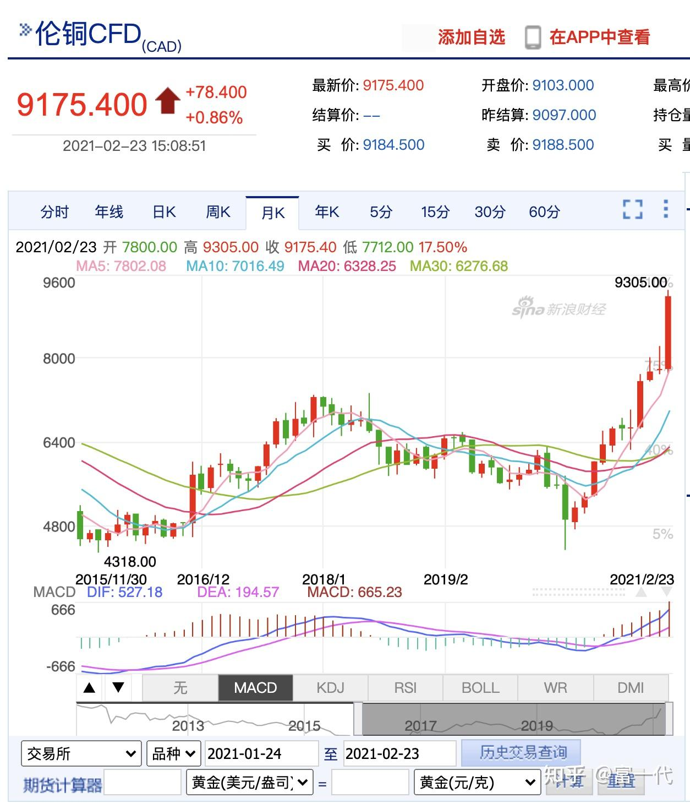

伦敦铜价

我们目前就处于这第三阶段。

第四阶段-滞胀

在这个阶段，物价上升，但经济停滞不前。

股票市场的增长会陷入停滞，失业率与高通胀并存。

第一阶段、第二阶段都已经过去，现在我们处于第三阶段-过热。

这段时间将会是股票市场最后的狂欢，好好享受这最后一支舞吧。

我们可以看到近期股票市场上投资风格的转换，热点从科技股转移至大宗商品股与顺周期股。

过热阶段何时结束？这很大程度上取决于美国政策。
---

## 第 111 页

美国目前有三样维持宽松货币政策的工具：

1.量化宽松（美联储每月至少印1200亿美元购买国债）
2. 0利率
3.救济金

按照目前美国控制新冠疫情的速度,2021年中旬我们将会看到疫情基本被控制，美国每日新增病例数将会在1万例以下，届时美国政
府可能会考虑缩减量化宽松的规模或停止发放救济金。而真正终结过热期的将会是加息。当CPI上涨到对民生影响严重，美国政府
无法容忍的时候，可能会进行加息操作。

我的预测是股票市场从现在到2021年中旬之前还会有一段狂欢期，这将是投资者们与泡沫最后的共舞机会，享受这最后的
狂欢吧！把握好大宗商品与顺周期股的机会，这将会是最后一班快车。

2021年中旬，我们可能会看到美国略微收紧货币政策，股市开始进入缓慢下行阶段，跌三天涨两天的温水煮青蛙。

2021年末至2022年中旬，经济基本恢复如初，而通胀程度也会达到美国政府无法容忍的地步，货币政策将会有大幅度的收
紧，量化宽松会停止，停发救济金，利率上调百分之零点X。届时A股港股美股加密货币将会迎来超大幅度的回调。这一
段的行情会很像2018年3月-2018年12月。

2022年中旬至2022年末，市场到达一片绝望与哀嚎的底部。我们将会迎来非常棒的抄底时机。

第107篇:https://zhuanlan.zhihu.com/p/425295649

加密资产配置战略核心要义

赞同数: (130赞同)创建时间: (2021-10-25)

公认的最好的投资方法是逆周期投资，在传统市场的表现为：在基准利率高时多配置股票，在基准利率低时多配置债券。

加密市场应该反过来：在基准利率低时多配置现货，在基准利率高时多配置美金本位套利。

传统市场中，基准利率是由政府设定调控的，基准利率越高则导致投资人投资意愿下降导致资产价格缩水，基准利率越低市场借
---

## 第 112 页

贷成本越低则投资人投资意愿增加，进而导致资产价格增长。

加密市场中，基准利率是由市场自由定价的。币价越高则人们投资意愿越狂热进而导致基准利率越高，币价越低则人们投资意愿
越低迷而基准利率越低。

注：加密市场的基准利率=defi借贷、交易所借贷、做多资金费率等一切借USD途径的平均年化利率

第108篇:https://zhuanlan.zhihu.com/p/307734917

好胜心

赞同数: (116赞同)创建时间: (2020-11-23)

无论是打一盘游戏、做一门生意或者是演人生这场戏，我的求胜欲都很强，一定要拿冠军或者至少跻身顶尖行列才行。

这种对胜利的渴望无疑是鞭策我前进的强大动力，它让我非常认真严谨的对待生活中每一件事，让我真的成为了一名年少有为的
人生赢家。

好胜心是白手起家者都有的特质，我的偶像——世界上第一个亿万富翁洛克菲勒，就是一个好胜心非常强的人，他说“好胜是我永
不磨损的天性”，他也真正达到了他的目标——世界首富，不光财富是世界第一，而且活了98岁，有完美幸福的婚姻。希望有一天
我能和他一样完美，在多个维度都做一个赢家。

当然有很多与世无争的人会批判我的好胜，的确，和我呆在一起他们会觉得被“被动努力”。这些与世无争的人往往在乎的是“娱乐
性”，输赢不重要，而我在乎的是成为一名赢家，这种人生观的冲突会让我们格格不入。

而我，其实也会刻意疏远那些不求上进随遇而安的人，因为我觉得他们会是我成功路上的阻碍。

第109篇:https://zhuanlan.zhihu.com/p/347822033

高估值资产泡沫：一个迟早要爆炸的定时炸弹

赞同数: (97赞同)创建时间: (2021-01-29)

“History may not repeat itself. But it rhymes.”

当下的风险资产（例如科技股与加密货币）体现出的泡沫真的是越来越大，一大篓子科技股都有百倍市盈率，加密货币总市值更
是接近万亿美元。

在2000年也发生过一模一样的故事，不过那时候被炒作的是互联网股，在那时候，互联网代表着的是“人类的未来”

而当下的2019-2021泡沫，被重点炒作的是以新能源为首的科技股，科技代表着的也是“人类的未来”

其实本质上，我们都是在炒作“人类的未来”题材罢了。

既然是泡泡，那就会破，无一例外。

泡沫是会整容的，每一次它都会以一种新的形式出现在我们面前，吸引资金去把它吹大，但每一次收场都是以泡沫破裂为
结局。

我不是不看好人类的未来，而是目前那些被过高估值的科技企业确实不值这么多钱。
---

## 第 113 页

2000年泡沫破裂的导火索是美联储提高了基准利率

我相信本轮泡沫破裂的导火索依然会是美联储提高利率。哪怕从目前的0利率提高到1%，科技股、概念股、加密货币等风险资产都
会有排山倒海似地崩盘。

大胆的预测一下，泡沫破裂的时间点会是在美国疫情大体被控制住的时候，也就是2021年年末或者2022年。

疫情得到控制=经济复苏=货币政策正常化=流动性收缩=高估值泡沫破裂

世界主要经济体的疫情什么时候结束，这个泡沫什么时候破裂。

第110篇:https://zhuanlan.zhihu.com/p/405567446

为什么我现在不再看空中国股市

赞同数: (92赞同)创建时间: (2021-09-01)

声明：不看空≠看多

我本人目前虽然配置了26%的资产在中国股市上，但是最近没有大把加仓的计划

我依然在等待美股出现大回调后把A股股一起带下水然后冲去爆买便宜货的机会一起带下水然后冲去爆买便宜货的机会

1992、2000、2007、2015、202X？

之前4月20号的时候我发了一篇文章谈论我看空下半年的全球资本市场，

00后富一代：2021.4.20谈谈我在未来几个月内的投资动作

我依然看空美股股市、加密货币市场。

但是关于中国股市，我现在改变了看法。

认为现在的大盘整体估值处于合理区间且内部没有系统性风险，原因如下：

1.中国政府对待A股的态度明显比上半年好，不再去提“防风险”这个字眼，而且也多次很明显表现出想扶持中国本土资本
市场的意思。

打压了进行非法市值管理的公司
打压了部分操纵市场的游资
打压了诸多股市杀猪盘
创业板注册制改革：降低了创业板的上市门槛但是提高了审计标准以及对虚假信息的刑事打击力度
敲打了部分不规范运营的基金

2. delta病毒病毒再次威胁全球经济，进而使中国经济面临下行风险，而再次威胁全球经济，进而使中国经济面临下行风险，而美联储美联储又即将在又即将在2022年初开始微微紧缩。这些因素正在
迫使中国政府采用更宽松的货币政策。居民存款利率被下调，中国10年期国债利率的下跌就是最好的证明。
---

## 第 114 页

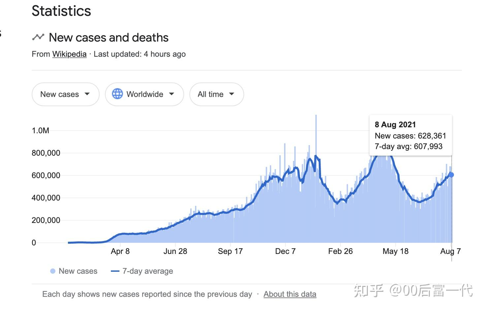

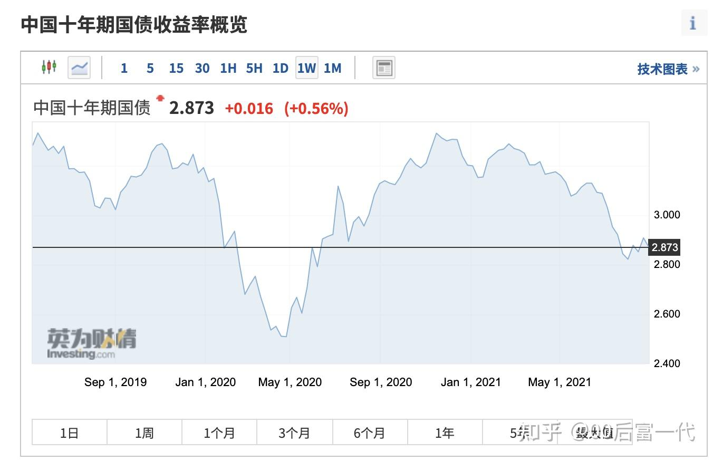

3.十年期国债利率倒数与A股PE中位数走势这个历史上正确过很多次的择时指标已经显示出当前股市正处于好买点区间
（因国债利率下跌+权重股下跌导致）。当国债PE大于A股大盘PE时，往往意味着股市被低估。

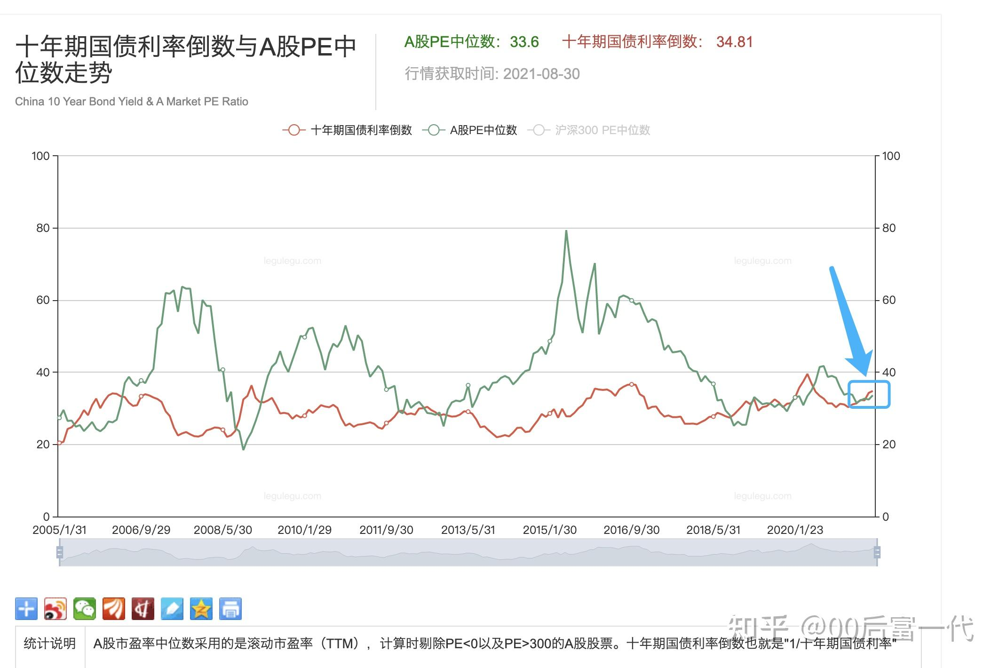

4.北向资金北向资金已经连续已经连续5个月净流入，代表海外资本看好中国
---

## 第 115 页

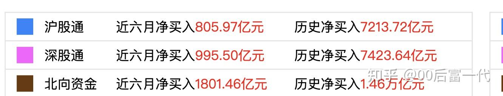

5.从恒大系的垮台和房产公司股票被大资本所抛弃的现状来看，中国政府打压房地产市场已经略有成效。房产在中国公民
未来的资产配置规划中的占比应该会降低，相信未来会有相当一部分钱涌入股市。

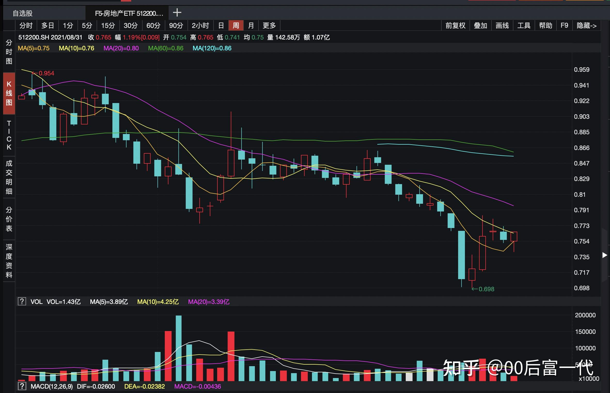

6.市场呈现结构性行情，冰火两重天。没有出现全面上涨的泡沫行情，散户、基民们大部分都叫苦连天。这是一个好现
象，说明股市没有全面的系统性风险，只有个别板块的风险。

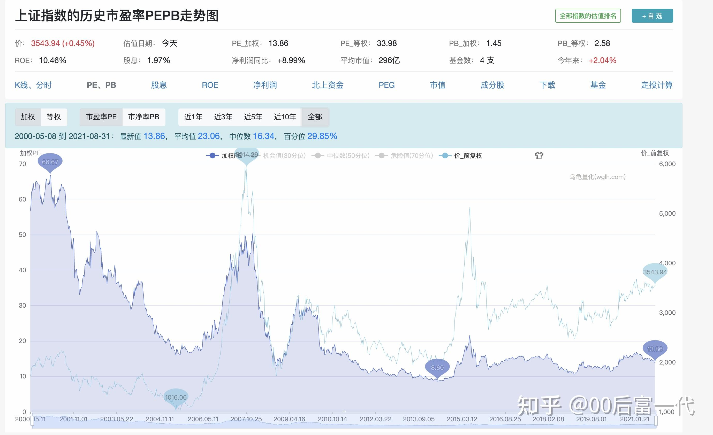

第111篇:https://zhuanlan.zhihu.com/p/370256841

为什么我一直不喜欢公募基金

赞同数: (92赞同)创建时间: (2021-05-07)

1.公募基金的发行方是靠抽取资金的管理费用赚钱，客户的盈亏并不会影响他们的收入，所以他们没有积极帮客户赚钱的动力。

2.公募基金体量太大，很难调仓，尤其是那些明星基金产品，几百亿甚至上千亿的持仓市值，稍微调一下仓就会对市场产生巨大
---

## 第 116 页

影响。所以很多时候即使公募基金经理知道持仓股接下来有下跌风险，他们也无法灵活调仓避开下跌。

3.公募基金有仓位限制，即80%的资金必须用于投资基金名称表明的方向。所以即使股票型基金经理知道市场接下来有回调风险，
他们也无法减仓超过20%，只能持股等死。

4.一些指数型公募etf基金（比如光伏、白酒、钢铁etf）完全就是在躺着白吃基民的手续费。这种etf的基金经理配置好仓位之后基本
就不需要调仓了，躺在那边不动都能稳定一年收1%-2%的手续费。与其交这智商税，你不如按特定的比例买那个板块的股票自己
创造一个组合，和买这种etf是一模一样的效果。

中国股市目前还算是一个“新兴市场”，新兴市场的特点就是波动大并且涨跌与美元的潮起潮落有很大关联性。所以，新兴市场的特点就是波动大并且涨跌与美元的潮起潮落有很大关联性。A股没
有“慢牛”，也做不到在全球资本市场独善其身。投资新兴市场，【择时】是非常重要的，而公募基金们的种种局限恰恰就让他们无
法去择时。主动型公募基金能做到的只有“选择好公司”，而具体能否盈利则与市场大体行情有很大关联性。行情好的时候收益率就
高，市场大体行情差的时候就亏损，盈亏同源，这就是很多人口中的“赌国运”

如果是一个没有选股能力、没有择时能力的普通人，那么公募基金肯定是比他们自己去瞎操作更好的选项。

但如果你有能力挑选好股票、有能力去则时买入卖出，那么就尽量少买公募基金。

如果你没有选股能力，但也不想买公募基金，有一个很简单的方法，你可以买富时中国A50（FTSE A50）的成份股或者可以查询
并买入明星公募基金的重仓股。这样你既可以获得充足的流动性可以灵活调仓和择时买卖，又可以确保自己选的公司是好公司。

第112篇:https://zhuanlan.zhihu.com/p/311652719

正向反馈带领我们走向光明人生

赞同数: (80赞同)创建时间: (2020-11-25)

正向反馈——用通俗易懂的话来讲就是“我付出就有回报”，它是一种神奇的奖励机制，会不断鞭策被作用者【要做得更好】来获得
更多的满足感。

在学校里学习成绩拔尖的学生往往会一直保持他们的好成绩，这不光是他们智商卓越的功劳，他们还往往愿意花比普通学生更多
的时间去学习。这是因为他们的好成绩给他们带来了老师和家长的表扬与在校园内的名望，所以他们有比普通学生更多的动力去
追求更好的成绩。

公式：学习=好成绩=表扬与名望=前进的动力

美女往往会特别在乎美丽，她们的美丽为她们带来了许多生活中的便利、异性的关注、同性的羡慕，所以她们有非常强的让自己
变得更美的欲望，而且她们希望这种美能够保持的越久越好。她们会花比普通女生多的多的多的时间在学习穿着打扮、控制身材
和化妆上。

公式：学习=美丽=关注与羡慕=前进的动力

而我对于更多财富的追求也正是来自于正向反馈。财富让我可以满足自己的物质需求，财富让我从一个普通少年变成一个被人人
羡慕的对象，财富给我机会结识更优秀的人。正是因为先前这些正向反馈，才使得我对财富有那么大的渴望。我希望保持这份优
势，并且希望这雪球越滚越大。所以我会花比普通人多的多的多的时间来学习提高对财富的支配能力，这使我真的在不断变得更
---

## 第 117 页

富有。

公式：学习=更多财富=满足与羡慕=前进的动力

如果把一个【领域】比做一片土地，我们是矿工，那么正向反馈就像是我们在这片土地上追求的黄金。有些矿工幸运，挖了几锄
头就挖出了黄金，他获得了即时的反馈便会更卖力的在这片土地上挖。有些矿工不幸，挖了一阵子没挖出金子，就中途放弃觉
得“自己不是做这块的料”。有些矿工不幸但坚持，挖了一阵子没挖出金子，但他没有放弃，继续挖了很久，终于挖出金子，便也从
此有了坚定的信念，这片土地上卖力的掘金。

第113篇:https://zhuanlan.zhihu.com/p/344795044

左与右：学院派与社会派

赞同数: (61赞同)创建时间: (2021-01-16)

在政治上，有两个派系，左派与右派。

在我们的日常学习工作与生活中，也分两个主要阵营：学院派与社会派

学院派的典型特征是成绩往往都很棒，但人情世故一块有所欠缺，钻研与学习是学院派的人最拿手的事。拿学校为例子的话，最
极端的学院派者大概就是彻头彻底的书呆子（Nerd）。学院派信仰的赚钱之道是“认知决定财富水平”，所以学院派的上进者往往会
很注重学习。

社会派的典型特征是人际交往能力特别强。但学习成绩往往不咋地，交际与沟通是社会派的人最拿手的事。依然用学校为例子，
最极端的社会派者就是拉帮结派的混混（Gangster）。社会派信仰的赚钱之道是“人脉决定财富水平”，所以社会派的上进者往往会
很注重发展关系。

当然，这个世界并不是非黑即白的，人是一个复杂的生命体，往往具有多重属性。比如我自己，一开始是属于典型的比较极端的
学院派者，但后来与社会派的人接触多了之后受到很多影响，现在也拥有了许多社会派者的属性。我的主倾向依然是学院派，依
然保持这钻研与学习精神，但是我也同时具备了一小点社会派的能力，比如说夸人术、识人术等。

我认为区分出这两大派系的最主要原因是人与人之间“智商”和“情商”的差异，这是与每个人的基因与后天成长环境非常相关的。智
商与情商两个属性就像天平的两头，一边高了，另一边就会低。由于基因与环境的影响，绝大多数人都有一个主倾向，也就是会
有一头高，另一头低，只有极少数天才可以做到两头都高，也有极少数傻瓜会两头都低。

第114篇:https://zhuanlan.zhihu.com/p/358632729

简谈当前美联储面临的困境

赞同数: (55赞同)创建时间: (2021-03-20)

美联储美联储目前面临的困境：目前面临的困境：

美国发行了大约27万亿美元的国债
去年美国向系统内注入了大量的货币
今年拜登政府又签署了1.9万亿经济刺激计划
---

## 第 118 页

2021年美国经济复苏的驱使强劲，导致市场对于通货膨胀的预期越来越强烈，使得美国国债持有者获得的实际收益率为负。这让
他们不愿意继续持有美债，仅在过去的两周就有超过800亿美元的美债被抛售。美债在自由市场被抛售会导致美债收益率提升，而
美债收益率又是作为金融市场“无风险利率”的标杆，无风险利率的上升是对风险资产（股票市场）的利空因素。

美债持有者会抛售美债直到其收益率接近通货膨胀率才能从中获取持平或跑赢通胀的收益，而今年美国的通货膨胀率会超过2%，
这也就意味着10年期美债收益率会在今年超过2%，在这收益率上升的过程将会对整个世界的股票市场造成重大影响。

国债持有者抛售国债变现的美金流去了哪里？

答案是：流向了有更高投资回报率的地方，比如分红比美债收益率更高的股票、购买大宗商品与投资实体经济。

如果10年期美债收益率温和上升，那么美股可能会在短期内有10-15%的回调，但不会有“崩盘”（美股超过20%的下跌就属于崩
盘）。如果10年期美债收益率快速上升，那么美股会有巨震，甚至可能会“崩盘”。美股如果只是回调，那么对美国实体经济不会造
成多大的伤害，美联储可以不管。但如果美股崩盘，这也会对美国的实体经济造成重大影响，美联储将不得不介入。

美联储如果想降低美债收益率有什么办法呢？他们有一个财政工具叫：YCC（Yield Curve Control），简单的解释就是美联储印更多
的钞票来购买美国国债，从而降低收益率。

为什么他们迟迟不使用YCC？

这是因为如果目前每月1200亿量化宽松的基础上再加码YCC的话会严重打击美元信用，导致美元贬值，进一步推高美国通货膨胀
率，进一步吹大金融市场的泡沫以及增加贫富差距。

所以美联储目前的态度是：我们目前不会对美债收益率上升进行调控，但是我们保留随时使用YCC介入的权力。他们目前也只敢
喊喊话来安抚世界金融市场的人心，防止股票市场出现崩盘。

美联储不使用YCC，会发生什么？

会利空全世界的高估值风险资产，尤其是那些以美国的纳斯达克股与A股创业板为首的在过去1年中被炒飞天的高估值股票。
股指因为高估值股们被大杀估值而回调，如果这个杀估值的过程太快，可能会引发恐慌抛售导致崩盘。
股息率高于美国国债收益率的股票下跌幅度较小，因为他们会得到更多资金的青睐。

如果美联储使用了YCC，会发生什么？

美元信用被严重打击，美元兑外币的汇率下降
任何以美元计价的资产都会涨飞天（美股、比特币、大宗商品）
美国可能会陷入类似德国魏玛共和国时期的滞胀性萧条

美联储什么时候会使用YCC？

在美股崩盘的时候必然会开动印钞机救市
在市场对于美股信心严重不足，美联储预感到崩盘即将发生前也会开动印钞机

第115篇:https://zhuanlan.zhihu.com/p/354259886

2021,我的投资策略

赞同数: (46赞同)创建时间: (2021-03-03)

过去的2020年简直就是傻瓜行情，无脑买龙头就能赚很多钱。
---

## 第 119 页

过去的2020年简直就是傻瓜行情，无脑买龙头就能赚很多钱。

但在当下的2021就不一样了，必须要有对行情很好的判断才能赚到大钱。

机会依然有，市场上的流动性依然充裕，就看你是否能把握的住。

今年最大的灰犀牛应该是全球资产泡沫化，由于货币泛滥而导致全部金融资产的价格被大幅推高。这颗被充满的气球对于“流动
性”格外敏感，但凡一点收紧货币政策的风吹草动都会让资金有恐慌出逃之势。

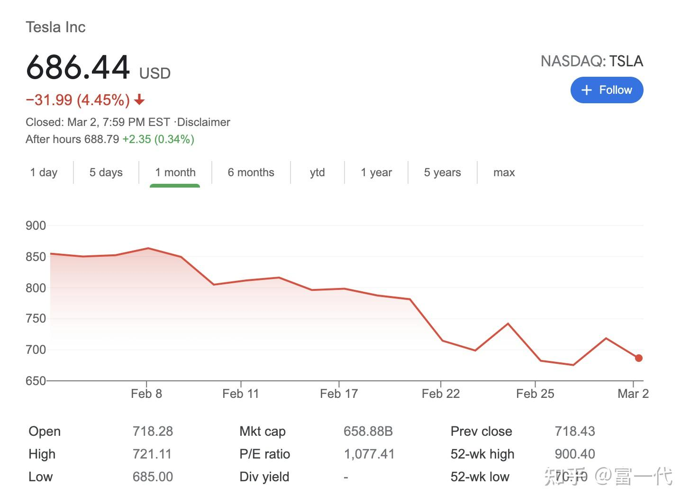

今年最大的确定性机会就是大宗商品将会迎来历史高光时刻，超发的货币推高了世界上每一样大宗商品的价格。

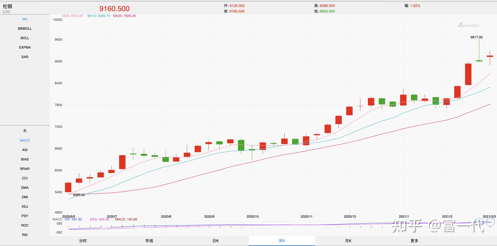

为了把握这两个确定性的机会，在我今年的投资组合中主要包含了

美港股方向做空特斯拉、蔚来、理想、小鹏、恒大汽车这种新能源泡沫。占比13%

基金买入顺周期、大宗商品、防守股占比较高的广发高端制造股票C、招商中证大宗商品股票指数。占比6%

A股依然保持满仓，全部配置在钢铁、有色、化工板块上。占比46%

为了应对任何突发情况

我还保留大量现金。占比35%
---

## 第 120 页

做好以上配置，相信在2021年我可以取得不错的投资成绩

第116篇:https://zhuanlan.zhihu.com/p/393437819

当下最想买的中概股名单

赞同数: (42赞同)创建时间: (2021-07-27)

最近中概股利空频出，早就想布局他们的我觉得越来越馋了，他们的股价越跌我越高兴。因为一方面我从年初就开始做空部分中
概股（拼多多、理想汽车、蔚来汽车、小鹏汽车、恒大汽车）要平仓收网了，另一方面这是几年内少数可以买到便宜货的机会。
当下他们的估值合理，而且恐慌造成的股价持续下跌使估值在向着被低估的区间奔去。我能看到的买入他们后的唯二风险就是：1.
监管部门想杀了这些公司（不大可能）2.美股大盘来一次10-20%的大回调（2021年末-2022年极大可能来一次）

已上市的三个

1. Bilibili：年轻人最喜欢用的长视频平台，用户粘性高付费意愿强，有机会成为中国的Youtube

2.悦刻：年轻人中最受欢迎的电子烟厂商，每一个有烟瘾的年轻人都会有一杆relx电子烟，许多年轻人干脆不抽传统烟草全部改抽
电子烟

3.腾讯控股：垄断了中国互联网半壁江山的巨头，与政府的关系较好不容易被过分打压，虽成长空间有限但当前估值水平低

将会上市的三个

1.字节跳动：抖音&TikTok开发商，全球互联网巨头，中国互联网企业出海典范楷模

2.网易云音乐：用户量和QQ音乐旗鼓相当，但未来上市时估值因为用户单价低而导致市值100%会大幅低于QQ音乐的在线音乐平
台

3.小红书：年轻人喜欢用的医美&穿搭&美妆社交媒体，掌握大量流量但是目前变现能力差，“颜值时代”其潜力无限

注意：我只是发一下我自己最近想买的公司，我买入这些公司后都有持有超过5年的打算，不构成投资建议。

第117篇:https://www.zhihu.com/pin/1865298417711988737

又想到一些想成功的投机家需要做到

赞同数: (824赞同)创建时间: (2025-01-22)
又想到一些想成功的投机家需要做到的事| 1.远离悲观负能量的人。首先悲观的人之所以悲欢多半是因为他们的人生很失败，而跟
这种人呆在一起你会被他吸走你的正能量也会把他的愤世嫉俗带给你。你和悲观的人说任何一个商机，他首先想到的会是“这个事
情会因为XXX而失败”。
---

## 第 121 页

2.远离消费主义，永远只花你赚的百分之X。把大部分金钱用于开发新的商机或者新的投资。

3.远离赌博。这个赌博不光是那种在赌场的赌，还有就是不要脑子一根筋的就梭哈XXX资产或者梭哈XXX商机。我不知道为什么
很多人有“贷款创业”、“梭哈杠杆投资”的习惯，不管是谁给你灌输的这个扭曲思想，你现在记住：你这个行为就和拿一把装了5发
子弹的六发左轮手枪对自己开枪一样。不要做这种让你错一次就能直接输几年人生的傻事情。

之后我要写一篇文章做一个我的科学投机思想合订本，我要做00后投机套利家的启蒙者。希望十几年后会有很多粉丝取得成功，
然后在你被媒体访谈的时候说到“那时候给我启发最大的是一个叫00后富一代的人”，那我看到了会很开心会炫耀

第118篇:https://www.zhihu.com/pin/1802089436776894464

这个世界上未来几十年都会存在的商

赞同数: (760赞同)创建时间: (2024-07-31)
这个世界上未来几十年都会存在的商机|目前世界上主要分为两大阵营，且未来都会是如此：
一个是以美国为主导的发达联盟
一个是以 鹅伊朝巴为主导的正义联盟

一个作为“中间人”的角色能让你从两大阵营中源源不断的获利

-当任何一方出现新科技、新商业模式时，可以互相照抄。（例如chatgpt、tiktok电商热潮、temu把拼多多模式搬到欧美，还有各种
把欧美开源软件改一下变成“自主研发”的国内公司都是很好的例子）

-一方的法律管不了另一方，可以钻漏洞。例如在欧美盗版电影是重罪。但是在正义联盟里盗版欧美的作品没什么人管。例如在
欧美，磺合法但是在正义联盟里是重罪。

-当发达联盟和正义联盟发生冲突时，就会产生从中渔利的机会。比如2022年的战争，鹅被制裁，从事中俄贸易的人大赚。1.作为
中间人帮助鹅人买欧美商品赚差价2.把鹅人的商品换成人民币再换成美元帮俄罗斯人做swift结算的跳板3.直接帮很多鹅人用卢布
换外汇。比如现在很多国内公司有大量训练AI的需求，但是因为制裁买不到GPU，所以就会有中间人注册海外空壳公司，再以海
外公司名义购买显卡，再以神秘渠道运到国内卖给大公司。

投机要搞
要搞就搞跨国投机

第119篇:https://www.zhihu.com/pin/1863978711478579201

Trump meme上很多人发财

赞同数: (716赞同)创建时间: (2025-01-18)
Trump meme上很多人发财了|早期介入TRUMP获取廉价筹码的信息精英们
要么是和0xsun一样监控着Moonshot上新
要么是监控着0xsun等聪明钱包地址的操作
要么是看到方程式新闻的报道（有一个粉丝私信我说靠方程式新闻这波A8了）
要么是监控着Sol链上meme价格异动

我自己一觉醒来都已经市值100亿刀了 晚了，就肯定是不会买的，只要是我无法获取廉价筹码的机会我就不会参与。

——————————————————
其实对于信息精英们来说在crypto赚钱就是那么容易：努力+技术，监控着各种信息，第一时间识别散户们100%会接盘的机会，买
入，等价格涨上去之后抛售给散户们，把他们的钱收割到自己的口袋。

各种乱七八糟的量化策略都不如这么简单的事情好使，很多高学历高技术的量化团队因为太孤傲看不上这种机会反而他们赚不了
这种钱。所以给了草莽英雄们成为信息精英的机会。

我不会现在买
并且如果你现在还想着去买，那么你就是人民群众的一员。要想办法获取早期的廉价筹码，这次错过了就下次努力，而不是涨了
几十倍之后你再去接盘。
---

## 第 122 页

———————————————
最后恭喜今天发财的人，你们的成功来自勤奋、智慧、认知、勇气，你们值得今天的胜利
---

## 第 123 页

第120篇:https://www.zhihu.com/pin/1856089413123186688

关于AI我还是建议所有我的读者

赞同数: (685赞同)创建时间: (2024-12-27)
关于AI |我还是建议所有我的读者尽早的让AI充满你的生活
开一个Chatgpt、Claude的订阅依然是这个时代最值的投资

我准备回国了给我的亲朋好友全都免费弄上Chatgpt plus或Claude的订阅，尤其是家族里的年轻人和小辈

如果我是一个数理好的年轻人且我是以金钱为目的而读书，那我一定选和人工智能有关的专业。
数学不好的人，也应该用AI辅助你的生活，想办法用AI优化你的现有工作/业务。

使用AI这一方面真别偷懒，未来10年的主旋律就是AI。

什么样的人一看就成不了气:
“你应该用Chatgpt”
“可是翻wall违法”这点小事都怕只能老老实实的被限制在那一亩三分地了

第121篇:https://www.zhihu.com/pin/1818660471491919872

年轻人创业失败的主要原因我看到

赞同数: (573赞同)创建时间: (2024-09-15)
年轻人创业失败的主要原因|我看到的年轻人自己做生意，失败的主要原因：

1.搞重资产
本来年轻人做自己第一个生意失败率就很高，一次就成功的概率就和与初恋步入婚姻殿堂相守一辈子一样渺小。还要去搞重资产
重资产也就算了还要去贷款搞重资产产业（开店）。这不是给自己找麻烦吗

人生中第一个生意应该是套利类型的：多卖多赚少卖少赚不卖不亏的。用来积累经验和资本

2.不亲力亲为
很多家伙就出点钱入股了个其他人的生意，美其名曰合伙创业，然后什么p事都不管等着分钱。这是拿自己的人民币考验人性，且
不说自己不去看着自己的产业别人能不能认真干。就算干出来了人家认真做事的也打心底的不想和你分钱。

还有些家伙自己生意才刚刚起步，雇了几个员工，就妄想当甩手掌柜，不管店里的事情了。这能做的好吗？几千块钱一个月的工
资怎么指望的了员工帮你干好活呢？如果老板都懒惰，员工没有任何义务勤奋，因为团队的奋斗情绪是由老板带领的。

做初创公司的老板自己就该多亲自披甲上阵，多干活，多去微管理，中心化。

3.老板个人能力弱
比如吧连个PPT都做不像样信息时代了连个自媒体账户都弄不出来内容做得很差。指望员工？真正的顶级人才不会看上一个初创
公司。初创公司能招到的人才往往有一定的缺陷，需要老板本身去协调培养。如果老板自己业务能力都很弱，怎么能带领好整个
团队呢？不是每个人都能当刘备的，关羽和张飞这样的良将愿意跟随一身无分文的匹夫起家这是极小概率事件。

初创公司的老板需要是一个能力上八面玲珑的人，什么都会点，什么都能做，这样才能统领好其他人

第122篇:https://www.zhihu.com/pin/1858677159528370176

最强华人交易员我心目中最强且还

赞同数: (565赞同)创建时间: (2025-01-04)
最强华人交易员|我心目中最强且还爱输出内容的华人交易员是：憨巴龙王
---

## 第 124 页

-爱输出干货而且比我谦虚低调多了
-身价超10亿人民币
-最近在BIO上赚了10m USD
-有超级强大的市场嗅觉

是一个强大到让我佩服的五体投地的顶级交易员
建议关注他并开启小铃铛

第123篇:https://www.zhihu.com/pin/1793386897353084928

如果你是一个币圈普通韭菜怎么样

赞同数: (560赞同)创建时间: (2024-07-07)
如果你是一个币圈普通韭菜怎么样择时？|答案是在Twitter上关注很多优秀的交易员，并且【打开通知】【打开通知】【打开通
知】，优秀指的是他们至少身价要有500万美元，且不是靠囤币/做项目等beta行为赚来的钱。

比如：我、GCR、tree of alpha、憨巴龙王、rewkang、pc principle、awawat、hsakatrades、nachotrades、hyooktrades、artxbt、the horse。
这些都是币圈叙事/套利宗的大师。另外在推特很简单的学习方法就是你去关注这些人关注的人肯定不会差。

如果你想要择时那你就少看囤币党、交易所工作人员、项目方工作人员发的任何乐观内容，因为他们有路径依赖，对市场永远是
看多的。

另外格外要注意的是要少看中文区的很多韭菜kol发言，因为整个简中互联网的文化就是“发泄情绪”，你很容易被一些乱七八糟的
小卡拉米的言论带偏，而西方互联网的文化是讲事实和逻辑。

第124篇:https://www.zhihu.com/pin/1859600729163038720

成功的套利者都是反消费主义的拥

赞同数: (535赞同)创建时间: (2025-01-06)
成功的套利者都是反消费主义的|拥有《花现在的钱=花未来潜在的利润，所以我现在要节约》的套利者普遍都做得很成功，有这
种思维的人干套利类型的生意非常适合。

或者反过来说，在套利领域做的出色的人，都有节约思维。倒不是说要抠门成什么样，但是我们绝不花自己收入超过1/10的钱。我
们把大部分资本留下来购入更多生息资产。

我到现在每个月也就花20-30万，算是低调的一逼了。前几天在迪拜跨年想去一个餐厅吃饭，要4万人民币两个人，我都不舍得
订。直到那天晚些时候，PEPE交易上又赚了60万人民币，我才舍得去预定。
-我的消费观念是我花钱不能超过我赚的钱的5-10%
-如果要买大物件，比如一块新手表，则需要先大赚一笔才能心安理得的买

其实想过的比普通人好就这么简单的事情：节约钱》买入生息资产〉赚更多的钱》购入更多生息资产。古代的富农、地主，也大
都是这么省出来的。

第125篇:https://www.zhihu.com/pin/1839134617971585025

[图片]

赞同数: (496赞同)创建时间: (2024-11-11)

第126篇:https://www.zhihu.com/pin/1775418579686883328

知乎平台的小套利机会刚刚我想给
---

## 第 125 页

赞同数: (491赞同)创建时间: (2024-05-19)
知乎平台的小套利机会|刚刚我想给我写的一篇文章买热度，结果发现知乎在中国区和美国区的定价不同。
中国区900元的推广套餐，在美区只要99美元（710人民币）

所以如果你是一个套利者，你可以在X鱼X宝开网店，向潜在的人卖9折知乎热搜，赚信息差的钱。

举这个例子只是作为参考，不是让你去做这个生意。

另外，有一类人是注定不会成功的，就是看到我发了这个之后脑子飞速运转想办法证明“这个商机因为怎么怎么的所以做不成”。这
类悲观理性的人，想的太多，不适合自己做生意。

会成功的思维
“我怎么样才能把这个商机做成？”
“如果这个商机不行，那互联网上有没有其他类似的机会？”
“中国和外国之间会不会有类似的机会？”

第127篇:https://www.zhihu.com/pin/1837050438362480640

越来越多的后起之秀出现了这个世

赞同数: (476赞同)创建时间: (2024-11-05)
越来越多的后起之秀出现了|这个世界依然留有大量大量大量巨量的机会留给：掌握AI技术的年轻人。可预见的未来5-10年AI技
术相关人才依然会疯狂赚钱赚全世界的钱。

掌握AI之人将在各个领域赚走本该属于其他人的利润，就和当年电商抢实体店的利润一样残暴。要是我现在身价只有7-8位数那一
定会涉足AI方面的生意的or用ai优化现有的生意。

可以预见5年之后我现在在的新闻交易领域也会被AI完全取代，但是低延迟交易领域则不行，因为低延迟交易比拼的不是谁算得
快，而是拼资源拼各种秘密的优化edge。

第128篇:https://www.zhihu.com/pin/1830231470544936962

关于“命事实：命运具有随机性

赞同数: (408赞同)创建时间: (2024-10-17)
关于“命” |事实：命运具有随机性

悲观的人会说：正因为命运是随机的所以我无法控制我的命运我要躺平
乐观的人会说：正因为命运是随机的所以只要我试的足够多我就会撞到好的结果我要努力

最终差距就这么被拉开了
好运会眷顾尝试的足够多的人

而你要做的就是给自己尽可能多的争取尝试机会

第129篇:https://www.zhihu.com/pin/1861771262755467264

看得我实在是火大我搞不懂为什么

赞同数: (400赞同)创建时间: (2025-01-12)
看得我实在是火大|我搞不懂为什么这种40岁以上的老中就喜欢酸呢？
遇到很多很多个40岁以上的家伙要么看衰要么酸悲观的要死

我偏偏就是要屡创新高好打你们的脸
我和40岁以上悲观老中势不两立
---

## 第 126 页

人生哪来那么多奇葩悲观看法，马斯克扎克伯格雷军哪个不是年少有为，且到现在也在创新高。

悲观的人建议直接把我取关了别来恶心我了，自己去信那个狗屁“伟大不可不尊敬的命运”吧

一些搞趋势搞玄学的交易员喜欢挂在嘴边说“要敬畏市场”
我就从来不敬畏市场，因为我选择开外挂找alpha收割其他玩家，市场拿我咋地了吗？我实盘PnL和收益率都吊打把“敬畏市场”挂在
嘴边的那帮交易员。

我也从来没敬畏过命运。本来命运大部分时候就是靠你自己改变的，就算失败了也不能拿命运当借口而应该怪你自己不够努力不
够聪明。

那帮悲观的中年人多半是被社会给毒打了，然后就开始产生想法相信自己就是XX命所以这辈子就这样躺平了

第130篇:https://www.zhihu.com/pin/1853867858330800128

如果我是一名野生quant如果

赞同数: (392赞同)创建时间: (2024-12-21)
如果我是一名野生quant |如果我是一名技术高超的单兵quant
我现在一定会去挖掘Hyperliquid上的套利机会（漏洞），懂的人知道我在说什么并且肯定会闷声发大财，这种自己做市的交易所一
定会有某个机制可以薅钱。

- 2022年FTX的otc desk取的是10秒内市场平均价格来报价，所以只要价格发生大幅波动就有延迟价差可以套利
- 2022年FTX出现过强平引擎的漏洞，可以通过两个账户同时多空开仓，赚到强平补贴基金的钱
- 2023年Mexc出现过资金费率结算漏洞，在一个币资金费率异常高的时候去开100倍杠杆做多空，等资金费率一结算，仓位会爆
掉，但是收到的资金费率能高于爆仓成本
- 2023年Mexc和某所都在搞超低费率和高超反佣的活动，可以通过做市策略刷量薅maker补贴

这样的漏洞很多，我现在公布的也都是已经失效了的策略，依然有效的策略当然是闷声发大财。

Hyperliquid自己做市和用户对赌但是它必须假装自己是一个去中心化交易所 ，所以你赚钱他也不会冻结你的账户，找到这样的
漏洞狠狠赚就完事了。

第131篇:https://www.zhihu.com/pin/1847624812962381824

我现在已经没那么爱炫富最近几个

赞同数: (390赞同)创建时间: (2024-12-04)
我现在已经没那么爱炫富|最近几个月我的财富提升了好几个档次，并且也被各路媒体争先恐后的报道了。

收获的名气太多太大，吸引来的仇恨值也挺高，很多老人是看不惯一个00后的成就把他们吊打的，会给他们威胁和焦虑感。所以
我暂时不会去争取更多的名，也不想发布我的财务状况报告。

闷声发大财，等过个半年一年的这轮牛市结束之后再考虑是否炫耀自己的成果吧

第132篇:https://www.zhihu.com/pin/1805730559525281792

[图片]

赞同数: (381赞同)创建时间: (2024-08-10)

第133篇:https://www.zhihu.com/pin/1869283957998243840
---

## 第 127 页

2025对我来说是防守的一年我

赞同数: (379赞同)创建时间: (2025-02-02)
2025对我来说是防守的一年|我将贯彻今年的财富管理战略是：防守、保守。
所以今年的财富增长计划只定20%

以美债和其他现金类资产为主，准备好在2025年下半年或者2026上半年开始迎接2018、2022式的major correction，然后在那时把现
金类资产调仓换成便宜的价格公道的优质资产（纳指、标普、比特币）。

我的保守型战略当然可能会错，错了也无所谓，最多只是财富增长率慢点，收的利息也可以确保也不会跑输通胀。

我执行保守策略的前提是：
1.我可以通过在加密市场的自营交易业务给自己创造源源不断的现金流，所以我不需要靠投资也能赚钱，我很有耐心

2.对我现在的体量来说只要确保不摔大跤，稳定增值就行了。我可以接受慢慢变富，反正我年轻的很，也富有的很。我的优势就
是可以比别人多复利那么多年，所以我要追求的是稳定的复利，而非激进的策略。

————————————
说人话：美股（纳指+标普）和比特币我现在都觉得贵，满手现金但不想现在上车，不如等等上车机会。

第134篇:https://www.zhihu.com/pin/1809006867113975808

关于近期的加密市场主观交易给主

赞同数: (374赞同)创建时间: (2024-08-19)
关于近期的加密市场主观交易|给主观交易者的建议：
你不需要天天都去参与市场交易，但是你必须保持关注市场的讯息以确保自己了解最近市场的叙事是什么。1-2个月就会出现一次
突发事件，平时管住自己不要去赌博，只等待大机会就完事了。

最近一个月市场的两次主观交易大机会：
1. 8月5日全市场大暴跌》抄底爽赚
2. 8月8日XRP官司取得重大进展》驱动XRP暴涨28%

如果你每2个月能抓住一次类似的机会，你就会吊打大部分追涨杀跌求仙问道搞哲学的交易员了

第135篇:https://www.zhihu.com/pin/1782892088356106240

给所有套利投机者的统一建议想到

赞同数: (368赞同)创建时间: (2024-06-08)
给所有套利投机者的统一建议|想到一个空手套白狼的套利类型的商机，直接自己开搞就完事，不用想太多。

输了无非是输了你自己一点时间
成了那人生就起飞了

这段话主要写给一些行动起来很墨迹老是想一大堆事情的人，2023初有一个粉丝想搞一个Chatgpt的套壳站，又因为觉得有“法律风
险”、“网站没法备案”而磨磨蹭蹭的不敢去动，白白错过大好风口。真的不用这么怕事情。

这种类型的国内外互联网倒买倒卖类型的生意不用考虑任何风险，直接开搞就行。身价只有7位数以下考虑那么多唧唧歪歪的完全
没必要，你这个光脚的怕什么穿鞋的。

另外在聊天截图中问我这个问题的人只有16岁，他让我看到了以前的自己。这种很小就具有跨市场投机思维的个人开发者，只要
后天雕琢+踩到风口，很难不成功。

第136篇:https://www.zhihu.com/pin/1842303079984263168
---

## 第 128 页

加密市场的每一轮牛市都会被捧出

赞同数: (359赞同)创建时间: (2024-11-19)
加密市场的每一轮牛市|都会被捧出来一个因为长期持有XXX币而暴富的神话，然后这个神话人物会给新入场的人们灌输：你也要
长期持有你才能变得富有的观念
等到这一轮饕餮盛宴结束，就是这一群新入场的人们买单。

我不是说市场见顶，市场没有任何指标显示见顶，我对加密市场的后市依然保持乐观，这一轮美国叙事还能炒作半年是没问题
的。

我只是想提醒很多人，如果你在过去几个月或者未来几个月趁着大好行情赚了大钱，记得及时变现一部分，不要变成一年之后喊
的苦哈哈的买单人。

第137篇:https://www.zhihu.com/pin/1831040563010494464

当你的实盘长这个样子就不会去信

赞同数: (355赞同)创建时间: (2024-10-19)
当你的实盘长这个样子就不会去信什么玄学|当你的实盘长这个样子
2022.10到2024.10两年时间一条直线笔直
就不会去信什么玄学什么风水、什么100%天注定了

因为我清楚的知道我赚的每一笔钱来自哪里：
要么是贪婪的散户要么是信息不够快的做市商
而不是靠什么虚无缥缈的趋势什么天赏饭

我能赚这钱是因为我的高认识+计算机技术+资源统筹与团队管理+拿捏散户心理学+资金量大

第138篇:https://www.zhihu.com/pin/1780104825944391680

有一点我不理解为什么40岁以上

赞同数: (342赞同)创建时间: (2024-06-01)
有一点我不理解|为什么40岁以上的中年人普遍都无法理解我想要获取更多名气的欲望。

很简单的道理我都这么有钱了而且才23岁发发自己的成就享受享受被万人敬仰的感觉为什么不行？
我肉身都翻墙了，为什么要低调？
我就是不喜欢司马懿这种窝藏着的个性，我喜欢李白那样又高调又有财富的人物。我喜欢甲骨文创始人拉里艾立森、马斯克、
2020年以前的马☁这样的高调亿万富翁。
更何况我过去的一年时间赚了超过1亿人民币，马斯克当年赚到人生中第一个2000万美金的时候也笑嘻嘻的对着媒体摄像头说“这
是我新买的限量版跑车”。

总之如果只有钱而没有名那人生得多无聊？

@老树欢迎你来对线我就是爱花时间和你们玩。

欢迎各种验证，在这里我承诺：我知乎上发的任何实盘截图要是有假我删号+吃 。怎么样这个赌注给不给力？但是：如果你输
了你赔我1000元时间损失费别说你1000都输不起

当然你这种中式“隐忍”思维的中年人还是永远不会理解为什么的，因为在你们的惯性思维里：
1.有钱人不会花时间当网红
2.有钱人都闷声发财
3.我专门给你写这一条想法你的大脑里又会想“这个人都那么有钱了还专门给我发这段文字肯定是为了什么阴暗的目的”

☝你看我会读心术我连你脑子里在想什么都知道
---

## 第 129 页

第139篇:https://www.zhihu.com/pin/1861016601723289601

关于泰国我个人是一个崇尚无限的

赞同数: (335赞同)创建时间: (2025-01-10)
关于泰国|我个人是一个崇尚无限的个人自由主义（海盗主义）的信仰者
意味着我不喜欢被人管着我喜欢无限的自由

泰国和迪拜能给到我这种自由的感觉，未来几年我也主要在这两地发展。新加坡则让我感到被管束的感觉，我不是很喜欢。

泰国安全吗？我住的地方房租4万人民币一个月，安保也是顶级的，很安全。泰国99%的人民是很和善很友好的，比我在其他地方
遇到的都友好。

其实你会发现在海外针对中国人的各种绑架、诈骗、抢劫，十有八九是中国人干的。包括这次被运到缅北的王星，也是被中国人
口贩子忽悠。所以我在泰国不和任何华人进行线下社交，只和圈子里认识的老外们聚聚。
---

## 第 130 页

第140篇:https://www.zhihu.com/pin/1872126755470450688

我还会把我的rmb现金换成A股

赞同数: (330赞同)创建时间: (2025-02-10)
我还会把我的rmb现金换成A股|我还会把我的300个w的rmb现金换成A股，
之后A股总仓位会达到1000w。

因为：
-本身我现在大部分时候呆国外，本身现在就用不到rmb了，而现在货币基金类的产品利率太低了
- C最近聪明起来了，最近半年明显能感觉到更对外开放，更鲜明的支持经济发展、开放友好地拥抱西方世界，而非R化了。（这
里感谢R开头的国家提供一个活生生的样本 ）
-以沪深300市盈率/十年国债利率这个指标来看，股票处于极度低估的区域。

我预计未来几年C也会维持低利率，而会有越来越多的C人也像我一样因为“现金没地方放”而选择买入股票，这也是宏观调控降息
的结果。

对于生活在C的普通人来说，理财渠道只有：现金/债券、A股、房地产。现在债券和地产都是悲观预期，那么也只有股票可以乐观
一下、可以放点钱了。

第141篇:https://www.zhihu.com/pin/1798154503519887362

又被删了重发如何判断交易员大

赞同数: (316赞同)创建时间: (2024-07-21)
又被删了重发|如何判断交易员大V是否真的有实力呢？

1.晒【带和当前时间、价格】吻合的实盘，优秀的交易员不会介意给你看他的交割单，这是最基础的实力凭证。拿不出来的一律
定义为口嗨。

2.真大佬不可能开一个收费群或者课程，手把手教你致富。还是那句话凡事说自己很赚钱还想“带你赚钱”的都是盯上了你口袋里
的钱。以这一简单的一条为准则你就不会踩坑

第142篇:https://www.zhihu.com/pin/1808978566429417472

A9以上富人没那么愿意润去美国了

赞同数: (316赞同)创建时间: (2024-08-19)
A9以上富人没那么愿意润去美国了| -税高且美国实行全球征税且美国的铁拳全球最大最硬基本上没人有那个胆子逃美国的税
-西方这几年普遍左倾》大搞平均主义共同XX劫富济贫》一旦新的大选哈里斯上台，就又要对富人征收新的赋税
-左翼放进来的大量难民以及宽松对待轻罪，导致治安条件不好

西方世界大部分国家已经变成了披着资本主义的皮的社会主义国家，
只适合高知中产和穷人润去。

富人把钱藏在美国倒是不错的选择，国籍润过去就太不划算了。

现在对富人最友好的两个真正的资本主义国家：
-阿联酋
-新加坡
都是0资本所得税，超低企业所得税

明年我会考虑搬迁到阿联酋，并在迪拜买下人生第一套房，迪拜的物价和生活条件整体感觉比新加坡好，迪拜的气候也比新加坡
舒服多了。
---

## 第 131 页

第143篇:https://www.zhihu.com/pin/1869598386489024513

刚刚GCR又在自己小群分享了一些

赞同数: (316赞同)创建时间: (2025-02-03)
刚刚GCR又在自己小群分享了一些观点| -他在12月份比较悲观是因为当时人们把特朗普上台后一切可能的利好都充分定价完了，
而有一些期望完全不切实际（比如设立一个让美联储以BTC为储备且让美国政府源源不断的买入BTC这种硬储备体系）。
给不懂的人科普，软储备=美联储将之前以及未来罚没的BTC作为储备不再出售（很可能实现），硬储备=美联储不但不卖以前
的，而且还要买入新的BTC（不大可能实现）。

-他认为当前crypto市场大部分山寨币已经跌了90%的情况下，现在不是投降的好时候。股票市场开盘后加密市场产生反弹他不会
感到意外。意味着他当下并不看空加密市场

-他认为2026年中期美国会出现经济衰退。但是他不认为是通货紧缩，而是类似2022的滞胀（经济增长放缓+通胀保持）。

———注意这段是长期预测长期预测长期预测———
-他认为美国政府在未来意识到经济出现状况后会在某个时刻采取大规模干预措施刺激经济来应对危机，人们手里会有太多钱没地
方去，然后我们将会进入类似2021年的投机赌博黄金时代。
这个时间节点大概是2030年。
———注意这段是长期预测长期预测长期预测———

GCR说话一直都很隐晦，很多理解也要看个人。
不过比较明确的是他认为2026年的全球金融市场不会很好
我希望我未来的粉丝能2年之后来挖坟，看看GCR这次预测是否正确。

第144篇:https://www.zhihu.com/pin/1827369896167731200

加密市场是世界上最适合聪明人的市

赞同数: (315赞同)创建时间: (2024-10-09)
加密市场是世界上最适合聪明人的市场| There’s no second best market in the world.
加密市场是世界上最适合聪明人的市场。

因为这里有无数无脑冲锋的韭菜散户们、这里有非常易使用的杠杆，这意味着价格的反应比传统市场快数十倍。

这里没有规则，这里没有老钱们垄断关键领域，每个人聪明人都能用自己的头脑快速变现。

什么web3什么价值投资？在我看来是笑话
加密市场最大的作用就是财富的转移，
从95%的底层散户转移到5%的精英，
从uninformed traders转移到informed traders，
来到这个市场当然是奔着掠夺他人的财富来的。

如果你想要取得成功那么你最好让自己远离人民群众（normie）这个群体，想办法让自己的生态位往上爬，成为肉食阶级的一员。

肉食阶级包括但不限于（币圈到底是谁一直在赚钱？）

第145篇:https://www.zhihu.com/pin/1503204558252158976

最近涨了很多新粉丝，很多人私信问

赞同数: (308赞同)创建时间: (2022-04-29)
最近涨了很多新粉丝，很多人私信问我怎么入门投资，我想推荐的三本书，分前后顺序

《危机时代》吉姆罗杰斯
《周期》霍华德马克思
---

## 第 132 页

《投资最重要的事》霍华德马克思

看完你就能入门了，相当于读完了小学

我个人还喜欢的一种学习方式是你把抖音、B站、Youtube等你用于娱乐的APP上多关注一些聊金融投资的博主，然后强制自己给他
们点赞 这样以后这些app的算法就会每天给你推送一些这方面的内容

不过，我想强调的是：
这和世界上其他任何一样事情一样，要做的好且顶尖，你就需要对它感兴趣，然后夜以继日且乐此不疲的投入精力在其中。

投资/投机最重要的不是你看了多少本书，而是需要你真正从实践中理解感悟，一次次跌倒再爬起，一次进步一些，在下一次做得
更好

路漫漫其修远兮，还需要每个人自己上下而求索

第146篇:https://www.zhihu.com/pin/1830235439929360386

关于商业天赋我接触的粉丝太多太

赞同数: (306赞同)创建时间: (2024-10-17)
关于商业天赋|我接触的粉丝太多太多了所以我已经发现了一个事实：
人与人之间的商业天赋是存在很大的差异的。
有商业天赋的人分分钟想的出一堆可实现的套利点子，没天赋的人怎么样都想不出。

但是如果你在想商业点子方面不行不代表你就无法取得成功，你可以去抄袭已经成功的人的商业模式然后比他执行的更好。

第147篇:https://www.zhihu.com/pin/1777258306790715392

为啥我不割粉丝因为我靠收割二级

赞同数: (298赞同)创建时间: (2024-05-24)
为啥我不割粉丝|因为我靠收割二级市场上信息滞后的散户和卖给我货的做市商们就足够我吃的饱饱的了，再加上我比较珍惜自
己的羽毛追求的是名利双收。

所以你在有生之年不会看到我：
卖课、开付费社群、发土狗币让你买、接乱七八糟的推广。

其实我现在的这个号但凡发个海外银行开户+券商开户的合法广告，算一个人头赚300美元吧，都能至少有100个客户了。要是我发
发非法的割粉，那就赚的更多了。

有一说一，如果我身价只有6-7位数，那我的轻资产套利商业版图里肯定会有帮人开海外银行账户+券商账户的这一项，因为这是
无本万利的生意，且有巨量的中国人有这个需求。而且可以靠这一块发展的客户无限衍生出子业务：1.海外房产中介2.资金跨境
服务（刑）3.海外签证/移民业务4.币圈交易所返佣

第148篇:https://www.zhihu.com/pin/1824142674514538496

我期待看到新生代英雄我期待看到

赞同数: (297赞同)创建时间: (2024-09-30)
我期待看到新生代英雄|我期待看到A股、美股、币圈上能出现一名新的00后白手起家的游资，能做到和我一样富有，然后与我华
山论剑做个朋友互相追赶竞赛

第149篇:https://www.zhihu.com/pin/1869721034296549376
---

## 第 133 页

市场暴跌时100%安全能抄底的资

赞同数: (295赞同)创建时间: (2025-02-03)
市场暴跌时100%安全能抄底的资产|就是FDUSD

每次市场大跌时很多人需要换USDT补保证金+做市商撤单跑路降风险，所以FDUSD经常产生不合理的价差。

我今天还有400万USDT放在现货账户里的子弹，在当时暴跌的时候都抄底了FDUSD成本价0.9931赚点零花钱。

你问我为啥不当时都拿来抄底币？因为我胆子小，插针之后我在合约账户里开了550万刀仓位，再加仓现货的话心理上承受不住拿
着1000万刀的赌博仓位的感觉。

第150篇:https://www.zhihu.com/pin/1854520296922558465

迪拜的时差迪拜大概是对cryp

赞同数: (293赞同)创建时间: (2024-12-23)
迪拜的时差|迪拜大概是对crypto和美股交易人群最友好的地区了，免税且来这边之后作息就很正常，终于能体验早上8点起床晚上
12点睡觉的感觉。我计划买个小别墅，明年搬迁到这里生活几年。

按照我现在的财力完全可以选择新加坡的家族办公室方案然后定居在新加坡，但是新加坡买车太贵了点地方也小，我想趁年轻多
体验体验超跑，所以选择先住在迪拜，等过几年再考虑去新加坡。

第151篇:https://www.zhihu.com/pin/1853119333062012928

我不会怎么做慈善与其做慈善直

赞同数: (280赞同)创建时间: (2024-12-19)
我不会怎么做慈善|与其做慈善直接给困难群众捐钱捐物我更喜欢：
-资助我觉得有高潜力的投机思维发达的投机者，比如这个07年生的投机家@Piger他16岁投机倒把的天赋点和我当年类似
-给Wikipedia和一些我喜欢用的开源软件开发者捐款
-基本上我上手的任何AI程序我不怎么用我也会开年费会员以此资助他们的研发

第152篇:https://www.zhihu.com/pin/1776907926902816768

我发现很多人拿赵长鹏举例子我发

赞同数: (276赞同)创建时间: (2024-05-23)
我发现很多人拿赵长鹏举例子|我发现很多人拿赵长鹏举例子来说“当世界公民就是被美国人收割”，然而赵长鹏恰恰是最好的反
例，证明了当世界公民的优越性。

赵长鹏只被判了4个月监禁+币安公司被罚款40亿美元，你知不知道币安赚40亿美元只需要一个季度？赵长鹏服刑四个月出来之后
照样是一名好汉，依然有几百亿美金身价，币安依然是一家价值千亿美元的公司。别孤陋寡闻了，也只有墙内媒体在那里夸大其
词的说“被美国人割巴拉巴拉”。

但凡要是赵长鹏在中国受审，那就是10年起步最高无期了。并且按照那一套创收论，很可能被没收全部个人财产，另外有关单位
还会想顺便没收币安全部用户的财产。

第153篇:https://www.zhihu.com/pin/1872134488642953216

对于Crypto市场短期（半年）
---

## 第 134 页

赞同数: (274赞同)创建时间: (2025-02-10)
对于Crypto市场短期（半年）的预测|我认为当下市场就类似2024.5-2024.10那段整理期，原理也很简单，就是之前涨太多了车太重
了所以要跌跌。

很多人担心“这轮加密牛市结束了”但我并不这么认为，因为只要宏观流动性充裕（美股维持强健），那么加密市场起起伏伏的投机
热鱿鱼游戏永不眠。

我预测过了几个月之后还会有一波新的行情，到时候剧本又会是突然来了一个XXX的重磅利好消息驱动市场短时间暴涨点燃情
绪。我都能猜到各种币圈群里的人又要开始刷“牛回速归”了。我依然维持本轮牛市（2023-2025）BTC会达到12万美元的预测。

但是很多人期待的全面普涨山寨季依然不会到来，现在新资产那么泛滥注定了市场只能有限的集中炒作某一个叙事热点。下一场
次的鱿鱼游戏又会是什么叙事？我无法预测。

———————————————
加密市场真正的类似2022年的那种韭菜喊苦喊累的残暴大熊市会在2025年末-2026年中期等到美股老大哥先发生major correction的时
候到来。

第154篇:https://www.zhihu.com/pin/1860130133534445568

为什么我不在推特上炫耀我很少在

赞同数: (268赞同)创建时间: (2025-01-08)
为什么我不在推特上炫耀|我很少在推特上像我在知乎上这样炫耀，有这些原因：
1.要是让加密市场的群众看到我赚的钱来自他们，会经常引起很大的舆论。最终就会有很多人抱怨“不公平”，导致制度的改革。
2.我的欧美竞争对手们都关注着我的推特，如果我经常炫耀则会引起他们的嫉妒和不甘心，会更加和我卷
3.我现在的体量在X上只是小鲸鱼，被那些A10、A11中、大鲸鱼们看到我只是得了一点成就就得瑟样子其实挺尴尬。但是我在知
乎上就是大鲸鱼了

第155篇:https://www.zhihu.com/pin/1872107929546674176

接下来我会考虑购入更多的1-2年

赞同数: (248赞同)创建时间: (2025-02-10)
接下来我会考虑购入更多的1-2年美国短债|接下来半年时间我会考虑购入更多的1-2年美国短债。

我目前的所有预设都是在尝试安全可控的择时交易2026年美国发生经济衰退（不是粉子以为的那个衰退而是连续2个季度GDP增速
下滑）

预期影响：这将会在衰退迹象发生后的几个月之后促使美联储降息拯救美国经济，会驱动短债利率下降债券价值上升

而在衰退初现到美联储终于开始降息救经济这当中会有一段时间的市场恐慌期，预期会造成类似2018、2022的全球金融市场大回
调。（预计在2026年中旬-下旬发生）

然后我会在这个期间把我的美债短债卖掉来抄底便宜资产（标普500纳指各种AI类的优质公司还有各种币），在我看来现在他们
都太贵我是不会买的

至于我的30年长债仓位，我可以考虑在没看到长期利率下降到3%之前不卖出，因为我的入场均价有4.8%的利率实在太香。买了就
算不做利率投机也可以作为一份人生保险。《———你在中国找不到年化利率近5%而且爆雷概率无限接近0%的产品（除非
WW3）

顺便炫耀一下我现在的900万刀ibkr账户，前几天NET大暴涨+入金让它创新高了

第156篇:https://www.zhihu.com/pin/1839128187851915264

我是如何管理我的加密闲钱的我有
---

## 第 135 页

赞同数: (246赞同)创建时间: (2024-11-11)
我是如何管理我的加密闲钱的|我有大概700万刀的闲钱，少部分在Kraken和Bitfinex理财，其他大部分都在币安用来搞资金费率套
利

币安正常情况下是无法用meme币当保证金的，但是使用统一保证金账户的模式，则可以用PEPE这种meme币的现货当保证金，来做
空合约。1:1对冲达成资金费率套利的目的。

-会爆仓吗？PEPE作为保证金其抵押率为80%，除非PEPE合约的标记价格比PEPE现货高4倍，否则不会爆仓。能出这种情况除非币
安暴雷
-看着亏很多？那是因为我用的PEPE现货作为抵押物，做空合约，你看到的亏损只是合约亏损

按照现在的市场火爆行情我每天光靠我总计750万刀的资金费率套利仓位就可以赚接近1万美元不过这种好行情不怎么可持续就对
了。

之后等次季交割合约利率apy超过20%时，我会从永续合约套利调仓至交割合约套利。

第157篇:https://www.zhihu.com/pin/1837525319168425986

恭喜特朗普获胜以及比特币创下历史

赞同数: (243赞同)创建时间: (2024-11-06)
恭喜特朗普获胜以及比特币创下历史新高|我的Polymarket赌博也赢了
特朗普是历史上第一名加密友好的美国总统，加密市场会因此在未来几年泽福

第158篇:https://www.zhihu.com/pin/1680558442262237185

身价突破7300万在前天交易了

赞同数: (243赞同)创建时间: (2023-08-31)
身价突破7300万|在前天交易了Grayscale打赢官司新闻后，我的资产突破了7300万人民币其中97%是流动金融资产，大概是目前中
文币圈最富有的00后了，过去2年我赚的90%的钱都来自于收割信息滞后的散户群体，这其中又有至少75%是来自全自动交易。身
价是一个台阶一个台阶的稳步提升，而不是靠赌博或者是运气。

我的交易理念：低延迟为王&信息为王&计算机自动交易为王

在金融行业，掌握最快的信息=掌握了印钞机

信息有两大方面：1.新闻2.行情（orderbook&trade）

这个市场上就是有一些新闻100%会驱动行情，比如马斯克发一条DOGE的推文，就是100%会驱动DOGE上涨的，比如X安上架一个
新币，就是100%会驱动那个币上涨的，比如Grayscale/Ripple打赢与SEC的官司，就是100%会驱动全市场上涨的，就是比谁先获取
到并先下单。有一些突发新闻是需要人手动去下单操作，而大部分新闻则是可以全自动交易。

这注定不是一个凡人能驾驭的游戏，如果是一个个体，要在我所在的领域做到拔尖，需要：1.计算机特别好2.英文特别好3.对信
息的敏感度4.大量的时间观察市场

第159篇:https://www.zhihu.com/pin/1629145642759852032

如果我只有10万以内的本金那么

赞同数: (235赞同)创建时间: (2023-04-11)
如果我只有10万以内的本金|那么我不会想着靠金融投资来发家致富，而是会同时进行这两项：

1.打磨一项一技之长在那个细分领域做到最好，然后出卖我的部分时间来换取金钱。
2.挖掘人与人之间存在信息差的互联网商机，倒买倒卖商品，做人与人之间无风险的套利
---

## 第 136 页

第160篇:https://www.zhihu.com/pin/1649819258857922560

列举一些我知道的一本万利的生意

赞同数: (228赞同)创建时间: (2023-06-07)
列举一些我知道的一本万利的生意|野路子发家的我对于信息差套利的生意都特别敏感，以下是我观察到的一些一本万利的生意：

1.卖课卖教程开付费社群

2.卖软件、游戏脚本、游戏辅助

3.卖*V、卖美剧电影资源。
最近我观察到一个很好的模式是美剧资源找影视下载站合作，免费提供下载，但是下载到的压缩文件要解压就需要购买解压密
码。这样人家都下载下来了才发现要买密码，图方便大概率就愿意付钱了。

4.卖Chagpt账号。
这个我以前讲过，自己做一个号成本2元以内，零售卖给别人就是20+起步

5.卖Youtube、twitter等社交媒体账户。

6.帮人设计公司图标。但实际上用midjourney等工具自动生成，自己再稍微改改就卖给别人了。

7.海外公司注册。
直接Fivver或者Google找海外专门做这一行的公司，然后把他们的服务加一个30-50%的溢价卖给中国的客户，自己在中间提供一
个“英文翻译”的服务。

8.做开海外银行账户的中介。实际上如果你有存款的意愿，根本不需要什么“开户费”，直接联系银行就能开。但是中介就吃准这个
信息差，只起到一个把你介绍给银行客户经理的作用，就无风险的从你这里赚了中介费。

以上举的例子很多都可以做无货源模式，直接找到一个上家低价进货之后再卖给别人。尤其是2、3、4、5。

另外思维再开拓一些，像4这种体力活，完全可以花钱雇x个人天天帮你注册账户然后，然后你负责控制销售环节这个重要的信息
差节点就可以剥削剩余价值了。

第161篇:https://www.zhihu.com/pin/1875649505388539906

发红包咯1000元红包分30

赞同数: (220赞同)创建时间: (2025-02-19)
发红包咯| 1000元红包分300份给粉丝们来自和我对赌的赞助者

请不要骚扰这位女施主
因为她是出于好的目的来尝试打假我，而且人家愿赌服输，我拿出证明之后，她说到做到真的给了

第162篇:https://www.zhihu.com/pin/1671444975580749824

关于我的学习我从来不看书、也没

赞同数: (220赞同)创建时间: (2023-08-06)
关于我的学习|我从来不看书、也没有人教，计算机｜金融｜商业管理都是自学成才。

为了学习xxx知识专门去“买一本书”、报一门线下课——》在我眼里是过时的行为。这个时代的最前沿的任何知识都可以通过互联
网学习。

如果我现在要培养一个小孩，我一定会着重培养他使用Google+Youtube+Twitter+ChatGPT+Github+Fivver等等互联网工具来检索所需
---

## 第 137 页

要的信息、实现他想做的事情的能力。

第163篇:https://www.zhihu.com/pin/1769860034362523648

crypto市场的既得利益者们（

赞同数: (220赞同)创建时间: (2024-05-03)
crypto市场的既得利益者们（交易所项目方科学家聪明大户量化交易公司）想要把你训练成的样子：
无论什么价格都无脑买的被动投资、定期投资、长期持有、看看K线指点江山。所以他们会不断的给你灌输这样的想法，如果你仔
细观察就会发现每个交易所都想驯化用户成为这个样子。既得利益者们给这些行为起了一个伟大的口号“为web3行业而build”。

既得利益者们不想看到你的样子：
开很多账号薅羊毛、做MEV、搞各种套利，总之一切从这个市场上抽水的行为，都不是他们想要的。

他们需要的是畜养食草动物，而不是吃食草动物的肉食动物。

第164篇:https://www.zhihu.com/pin/1762880829959950337

暴跌往往是捡尸体的好时候我自己

赞同数: (218赞同)创建时间: (2024-04-14)
暴跌往往是捡尸体的好时候|我自己有一个提醒，当BTC在4小时内下跌超过7%时会触发我一部用不关机的手机的铃声。

然后我就会迅速做到电脑面前去操作，昨天的操作：
1.平掉了所有0628 BTC跨期套利的仓位，此仓位已经实现大部分利润。然后把BTC现货换成了FDUSD，用来挖Launchpool。

2.昨天PAXG（一款和黄金挂钩的稳定币）因为伊朗发射火箭的消息影响，很多币圈不懂黄金的散户乱冲产生溢价，PAXG昨晚的
交易价格一度比周五黄金收盘价高了20%。我看到之后立马去看PAXG是否有合约，发现在Bybit上有合约之后做空了65万刀的
PAXG成本2633左右，这部分仓位目前还没有平仓，我会等到周一国际黄金市场开盘了再平仓。

大跌往往就是捡免费钱的好时候，因为这种时候散户会恐慌、做市商为了防范库存风险会减少挂单导致流动性紧缺，两者一结合
就出现了很多“捡尸”的机会。

第165篇:https://www.zhihu.com/pin/1817262319174037504

发个口令红包先到先得知乎账户开

赞同数: (205赞同)创建时间: (2024-09-11)
发个口令红包先到先得|知乎账户开了那么久一分钱没割过粉丝的一分钱没从知乎赚
居然还要被sqj的韭菜老钟给黑气死我了

第166篇:https://www.zhihu.com/pin/1559931148893106176

如果你在学习crypto交易，那

赞同数: (203赞同)创建时间: (2022-10-02)
如果你在学习crypto交易，那么我推荐你多看Twitter上的内容，并且尽可能多的关注英文博主。你就会发现这个世界上不止有看K
线看量价指标赌涨跌的玄学交易法，还有你在国内媒体上很少看到人讨论的MEV/跨市场套利/统计套利/做市/新闻交易/事件交易/订
单流交易/基本面交易等等。

只有当你学习与实践的足够多，脱离”normie“这个群体的时候，你才能赚到大钱。

国内的知乎微博上，很多时候各个大V（包括我）发言表达的是自己的一种情绪，而非是科普。看这类表达情绪的言论是学不到东
---

## 第 138 页

西的，反而容易让自己做出错误决策。

如果你真的想学东西，就和国际接轨上Twitter吧。如果不知道关注谁，那就关注我的Twitter @Vida_BWE之后把我的关注列表都关
注一遍。我的Twitter不怎么发言，更多的也是在学习。

第167篇:https://www.zhihu.com/pin/1721924418429943809

MEXC交易所恶意冻结交易利润

赞同数: (200赞同)创建时间: (2023-12-23)
MEXC交易所恶意冻结交易利润|最近有一个叫MEXC的交易所冻结并没收了我的9.2万美元交易利润。MEXC交易所是什么个情况
呢？它自己作为做市商，和用户进行对赌交易。用户赚钱=它赔钱，用户赔钱=它赚钱。MEXC伪造了虚假的流动性，但是你实际
上的确可以在上面成交。然而，一旦你赚了太多钱，他们就会冻结你的账户也有时候直接没收你的资金。

要是换成普通人，估计被冻结没收了就伸冤无门叫天天不应叫地地不灵了，但是这在我这里行不通。

我写了两篇很长的推文，中文+英文各一份，来揭发MEXC交易所的恶行，再让很多外国的交易员们帮我扩散，然后又直接动用了
方程式新闻来帮我传播。

英文版本获得了72万次查看
中文版本获得了13万次查看

这种传播力度已经能对这家交易所构成威胁，预计他们会为此损失很多新客户和现有的客户。

所以这个时代的粉丝经济真的很重要，在遇到冲突时媒体就是个人捍卫自己权益的兵戈。

第168篇:https://www.zhihu.com/pin/1859989995340845056

crypto市场最大的魅力这里

赞同数: (199赞同)创建时间: (2025-01-07)
crypto市场最大的魅力|这里特指山寨币市场：
就是没有监管没什么规则
不公平但又公平

不公平在人民群众在这个市场亏钱的速度是非常快的
公平在这个市场的很多信息都是公开的只要聪明+努力就能获取。在这个市场聪明且努力的人，即使出生寒微也能成为信息精英。

在信息链顶端的精英们可以最大化的收割在信息链底层的群众

是的，偶尔会有几个群众因为买到XXX币而暴富
但是大部分的钱都是被掌握信息和廉价筹码的精英们赚走的。因为这是一个国际化的市场，所以不会有哪个国家的民众说“这不公
平，我们要让这个市场更公平”然后引来铁拳监管

不公平创造巨额利润，不公平创造贫富差距，不公平让掌握信息者更有机会取得财务上的成功。

第169篇:https://www.zhihu.com/pin/1773211871270563840

一口流利的英语不光给你带来事业上

赞同数: (197赞同)创建时间: (2024-05-13)
一口流利的英语不光给你带来事业上的帮助，还能让你认识世界上不同国籍的朋友，成为真正意义上的世界公民。

第170篇:https://www.zhihu.com/pin/1649824771423621120
---

## 第 139 页

授人以鱼不如授人以渔最重要的是

赞同数: (197赞同)创建时间: (2023-06-07)
授人以鱼不如授人以渔|最重要的是养成一种投机倒把的套利思维。
我是怎么想到到那么多商机的，我每次做别人客户的时候都会思考：
1.他的商业模式是什么，他是怎么赚到我的钱的
2.如果是服务或者软件类行业，我会思考他的上家来自哪里。其实很多渠道都可以通过Google、查whois、政府网站查公司名字等
途径调查出来。然后我会在大脑里模拟一下如果我是他，我会怎么进行引流+销售。

我的成功还有很重要的一点：当我进入一个套利类型的生意时从来都不想太多，都是直接开干。本来套利类型的生意失败了也就
损失点时间+顶多一点点金钱，而成功了则是一本万利。所以多尝试不同的商机+同时推进多个商机，只要5个商机里能成1个，就
又能吃几年

第171篇:https://www.zhihu.com/pin/1858291392192864256

好多时候我有炫耀的欲望炫耀大多

赞同数: (195赞同)创建时间: (2025-01-02)
好多时候我有炫耀的欲望|炫耀大多数情况是-ev的
但是我就是爱炫耀的性格，在我看来名和利要双收才行，而且我最近半年赚了很多钱之后更是有一种想疯狂炫富的感觉。

所以我选择写出来一个东西之后，收获足够多的被崇拜的感觉之后，再删掉

第172篇:https://www.zhihu.com/pin/1663842167301844992

性格缺陷或者认知缺失会限制人的成

赞同数: (193赞同)创建时间: (2023-07-16)
性格缺陷或者认知缺失会限制人的成功| -悲观消极的人不容易成功。这种态度本身就在任何领域都不受待见，或许这类人群只有
在艺术领域才能有所成就。

-喜欢赌博的人不容易成功，成功了也容易有一天就突然无了

-小粉红不容易成功，至少我没见过互联网、金融投资、跨境电商这种依赖于信息的领域哪个成功的30岁以内的人是粉红。或许实
体行业会不一样吧。

-道德感、规矩感太高的人不容易成功。因为很多时候成功需要依靠一些“灰带”，比如说在法律没有明文禁止xxx的时候就直接先做
了再说先斩后奏，这些人不敢。

-做事想的多做的少的，不容易成功。

-沉迷消费主义今朝有酒今朝醉，不容易成功。因为这样的习惯导致人无法积累起原始资本

第173篇:https://www.zhihu.com/pin/1771422723669110785

我的生活习惯说点和金融没有任何

赞同数: (189赞同)创建时间: (2024-05-08)
我的生活习惯|说点和金融没有任何关系的生活习惯，当我看到抖音给我推了广告时，我会点进去看看商品的信息，大致估算商家
能赚我多少钱。心里记下每一个“小而美”的暴利生意。

像这次给我推送的卖不锈钢哑铃水杯的广告，点进去一看，单价568，已售1575件。商家成本估计一个50元人民币以内，卖一个利
润就是500。还的确被这个商家找到一个冷门赛道，没有和它竞争的品牌。
---

## 第 140 页

第174篇:https://www.zhihu.com/pin/1857372828493549569

单独写个想法回复这个粉丝很多人

赞同数: (188赞同)创建时间: (2024-12-31)
单独写个想法回复这个粉丝|很多人期待的“山寨普涨”很可能已经不会再出现了
因为如果你回头看：
1.过去两年里市场增发了巨量新资产吸血，市场没有足够的流动性支持全面普涨，而是一直是概念轮动行情

2.散户们现在没那么喜欢在CEX赌博，很多都跑去链上dex赌博，意味着很多那些cex上的老币不像上轮周期那样被人视作稀缺的掌
上明珠

3.如果你回头看各种山寨币其实已经涨了很多。对于VC、内幕者、空投农民、狙击手、早期holder等有能力获取低价筹码的人来
说已经经历过了赚到让人高潮的疯牛市了。

第176篇:https://www.zhihu.com/pin/1776910754031587330

简中互联网2大很多人深信不疑的谣

赞同数: (174赞同)创建时间: (2024-05-23)
简中互联网2大很多人深信不疑的谣言| -赵长鹏被美国人收割
实际上：只是监禁4个月+公司罚款40亿美元。身价依然有几百亿美元。

-迪拜园区嘎腰子
实际上：迪拜是一个超级安全的国家，有很多富豪在这里生活。国内舆论风向把它宣传的“很危险”只是为了让在那边的电诈集团即
使花高价也很难招到人。

少看点这种奇奇怪怪的宣传，多点自己的判断能力。当然我说了还是照样很多人不会信，因为至少95%的人翻不了互联网的墙，全
国也只有13%的人有护照。

第177篇:https://www.zhihu.com/pin/1618711871397322752

我从来不把自己当成交易员一直以

赞同数: (172赞同)创建时间: (2023-03-13)
我从来不把自己当成交易员|一直以来，我都把自己当作一名类似项羽的角色：一个力拔山兮气盖世，冲锋陷阵能杀敌，又懂后方
指挥的企业家。

给你们说个好玩的，我的大部分盈利来自超低延迟程序自动交易，但：

我的理科水平一直都非常差，到现在我也不会写一行代码，我也看不懂任何一个金融公式，算数全靠计算器按。从小我就不适应
中国的那套公立教育体系，因为我的理科很薄弱而英文水平非常好，而中国公立教育体系又重理科，我初中开始数学排名就是倒
数第一，也因为这个被认为是“蠢材”。2年前，我的IQ测试大概是70

直到后来，高中换到了国际学校读书，到了一个时间充裕的自由环境我才发掘自己的潜能：我发现自己的优势是思维跳跃、想象
力丰富，很擅长想到商业上的点子（也包括现在量化的交易点子），也很擅长发掘人与人之间的信息差然后从中获利———简
称：财商爆表。

通过不断的实践尝试我明白了一个道理：
1.作为一名管理者，不需要懂每一个技术细节，我只需要懂实现的原理、以及确定最终要实现的结果，然后监督好生产流程把控
好品质。我不需要懂一行代码怎么写，我只需要确保我会交易，且我的开发员们实现的代码和我的构思一样。

2.我无法想象当时如果我留在公立教育体系会是多么悲惨，可能连小镇做题家都不如，他们至少还会做题，而我不会。所以成功
很重要的一点是找到自己的优势点（edge），然后用它实现最大化价值变现。找到自己能发光发热的地方，然后深耕下去。
---

## 第 141 页

第178篇:https://www.zhihu.com/pin/1715883348008988672

推一本我在飞机上看的书《洛克菲

赞同数: (171赞同)创建时间: (2023-12-07)
推一本我在飞机上看的书|《洛克菲勒写给儿子的38封信》
其实这本书2021年我就看过，但是再回味一遍，还是感觉收获满满，此书适合想干大事业的野心家鼓舞自身士气的时候阅读。

第179篇:https://www.zhihu.com/pin/1389724733198475265

有太多人来问我我平时看什么书、怎

赞同数: (169赞同)创建时间: (2021-06-19)
有太多人来问我我平时看什么书、怎么学习了，所以统一回答一下：

《穷爸爸富爸爸》这是最最基础的入门书，能让你对真正的财富有一个概念

《债务危机》、《周期》这两本书可以让你拥有很好的投资周期感

《投资最重要的事》、《滚雪球》、《穷查理宝典》、《价值》这些书可以让你知道价值投资的理念

然后光看书肯定是没用的，我平时投入大量时间去实践去试错，很多时候就是抱着错了就当交学费的理念去实践。

要掌握实时市场动向和未来趋势的话，我最喜欢的方式是看那些投资大师们的最新访谈，比如可以在Youtube或者Google上搜他们
的名字，然后筛选日期为最近一个月，就可以看到他们一个月内表达的观点。

Howard Marks、Ray Dalio、Jim Rogers、Warren Buffet、Charlie Mugger、JPmorgan Dimons、Bill Ackman、Michael Burry

然后了解这些大师们的最新观点后，再结合自己的认知判断一下，就很容易做对方向。
---

## 第 142 页

第180篇:https://www.zhihu.com/pin/1619258972816564224

我是一名商业渣男一直以来，我都

赞同数: (165赞同)创建时间: (2023-03-15)
我是一名商业渣男|一直以来，我都有一个理念：不把鸡蛋放在同一个篮子里，从来都不会在一个资产/商机上all in，而是同时推进
多个商机，做一名商业渣男。

像现在，我就同时做4个加密二级市场的大方向（程序化交易、手动交易、半自动交易、雇佣交易员交易）的其中8项细分业务，
再加一个方程式新闻作为媒体喉舌。目前我管理着几十个程序，服务器也有几十台。

在一个项目开发到能盈利的状态时，我就能立马想到下一个商业点子。然后立马再组织资源实现我的下一个想法。依靠这种广撒
网的战术，我的身价回撤一直都保持的很小。

很多人有一种“日本工匠”的思维，就是自己一个人守着那一个小生意开一辈子，但是我很反对这个。我崇尚的是洛克菲勒的垄断资
本主义，我雇佣很多hired gun同时推进多个项目，其中有一些会成功，有一些会失败。

现在我每次启动一个新项目时，都只拿身价1%以内的预算去投资，当我看到一个项目有气色、我才会加注。当一个项目赚不到
钱，就很快被我砍掉。

这套战术就和情场上的渣男一样，渣男的最终目标是泡很多漂亮妞，而最佳的途径就是广撒网。哪几个愿意理自己，就和哪个
聊，不理自己的女生就立马把她们删掉。

第181篇:https://www.zhihu.com/pin/1803720642270474242

做多了300万美元ETH别跟

赞同数: (157赞同)创建时间: (2024-08-05)
做多了300万美元ETH |别跟危险

第182篇:https://www.zhihu.com/pin/1629458923907518464

中国房产是我不会进行的投资首先

赞同数: (154赞同)创建时间: (2023-04-12)
中国房产是我不会进行的投资|首先我家里不缺房，在小城市有8套房产，所以买房不是我的刚需。

-中国房地产市场是世界上最大的资产类别，总市值比美国股市市值都高。现在去买房就和50000+买BTC是同一个性质：可能会
涨，但你面临的下跌风险非常高，风险和投入完全不成正比。

-人口增速放缓/负增长，大部分新出生的人口也都继承了住房，未来二手房接盘者的数量只会越来越少

-房产的流动性差，想急出就要打骨折。不急着出的话，挂售一套房子，少则几个月，多则几年。

-房产让我和这个国家的国运深度绑定，这和我做世界公民的理念不符。

我了解到其实很多人赚了钱就买房，是因为没别的地方可以投资，对于大部分人来说资金蓄水池只有楼市和A股。但对我来说我的
资金可以自由的在国际市场里流通，我可以投资全世界的优质标的，中国房产是我的所有可选项中最差的。

第183篇:https://www.zhihu.com/pin/1869688882024550400

已抄底
---

## 第 143 页

赞同数: (149赞同)创建时间: (2025-02-03)
已抄底

第184篇:https://www.zhihu.com/pin/1513730861967556608

统计了一下身价，已经2700万了

赞同数: (145赞同)创建时间: (2022-05-28)
统计了一下身价，已经2700万了，其中85%都是现金。我记得一年半之前我给自己定的目标是25岁之前赚到3000万 应该能在22
岁生日之前实现了

第185篇:https://www.zhihu.com/pin/1683156500590317569

怎么样正确的勾搭上一名大佬首先

赞同数: (144赞同)创建时间: (2023-09-07)
怎么样正确的勾搭上一名大佬|首先最好自己有一个博客、包装过的github、有运营的知乎、twitter、朋友圈等展现你的历史成绩，
这些都可以作为你勾搭大佬时的加分项甚至能主动吸引到贵人提携。

一份精心经营过的个人媒体就是一份很好的简历

然后首次对话，直截了当的给出这些信息：
-我叫xxx，我的专长与能力是xxx，我以前做过xxxx，可能对您的业务有xxx的帮助。

如果你的目标是请教一些问题，我的经验是加上一个付费的请求就会更容易让大佬接受你，比如说：
-我想有尝请教您关于xxx的问题
如果已经有微信，那么就直接发个红包。先发红包再问问题，大概率大佬也不会领就直接回答你了。因为正常的情况下不会有人
做这件事情，你这么一做就能显得你很别致也很尊重大佬。（千万不要对我来用这招，没啥用）

注意保持文字的简短，能够一眼扫过去就看明白你的优势和你能给别人带去的利益或者是你的问题

第186篇:https://www.zhihu.com/pin/1794574552648531969

我的X

赞同数: (144赞同)创建时间: (2024-07-11)
我的X

第187篇:https://www.zhihu.com/pin/1777205999701032960

ETH ETF获批我在5分钟里

赞同数: (144赞同)创建时间: (2024-05-24)
ETH ETF获批|我在5分钟里的战果
第一笔交易：在获知etf获利后程序全自动开仓做多
第二笔交易：正式的获批应该有一份pdf文件，而当时没有任何一个source公布了这份文件。所以我手动做空了。
第三笔交易：朋友发给了我正式获批的pdf文件，可以100%确定消息为真了，故此平仓空单，改为做多。最后迅速的平仓因为知
道这会是一个sell the news event。

第188篇:https://www.zhihu.com/pin/1611122635164807168
---

## 第 144 页

AI是普通人未来1年最好的套利机

赞同数: (140赞同)创建时间: (2023-02-20)
AI是普通人未来1年最好的套利机会|目前在中国，ChatGPT依然没有流行起来，且由于GFW、英文壁垒以及中国手机号注册限
制，相信未来1年以内也不会有很多人去使用。
试想一下，假设：

你是一个学生，你可以用它来在中英文论文创作中XXOO（发了会被知乎和谐）

你是一个广告设计师或者小说作家，你可以用他生成很多灵感

你是一个国际贸易者，你可以用它生成给客户的标准的英文正式邮件

你是一个量化码农，很多代码的创作都能交给它完成

你掌握了这项能力而其他人还没有，你就会比别人更值钱。

我自己找到一篇非常好的台湾作者雷司纪写的ChatGPT全方位教程：发了会被知乎删除系列

第189篇:https://www.zhihu.com/pin/1868786612944637953

已回归前段时间因为私信骂人而导

赞同数: (135赞同)创建时间: (2025-01-31)
已回归|前段时间因为私信骂人而导致账户被禁言7天
没办法，有时候就是忍不住，下次还敢

第190篇:https://www.zhihu.com/pin/1523877770668683264

我从一个媒体KOL著名人物身

赞同数: (132赞同)创建时间: (2022-06-25)
我从一个媒体/KOL/著名人物身上获取讯息时总是有一个习惯，会通过过往他的发言在脑海里给人打上标签，这样就掌握他们个人
拥有的偏见，就不容易被一些错误的讯息给带偏：

- Glassnode/CryptoQuant这两个链上数据平台的文稿主编天生就喜欢看多，所以他们即使能拿得出大量数据举证，也一定是带有看多
的偏见
- A16Z/3AC/Multicoin/Paradigm一类的风投机构，本身就部署了大量头寸在加密市场上，所以屁股决定脑袋安也是天生自带爱看多属
性，不能指望靠他们逃顶
-木头姐、灰度创始人Barry Silbert这类本身就靠市场的上涨赚钱的长期囤币机构，也是很自然的，在任何时候发表的言论都是看多
看多

-《大空头》的原型人物Michael Burry，2008一战成名之后就一直沉迷于狙击泡沫，所以他现在只会对市场发出看空警告而不看多
- Peter Schiff这种黄金投资者，本身加密货币的兴盛就对他的投资组合是一种威胁，所以他说出来的话也不出所料只有看空crypto、
看空美元、看多通胀
-巴菲特、芒格是传统价值股票投资者，一直都带有厌恶crypto的偏见，所以自然每次发言都是看空、不支持比特币

人人都会有偏见那些权威媒体、著名人物也都会有自己的偏见。如果你是一名中立的交易员，那就一定要能意识到不同的信息源
所带有的偏见，然后选择一个平衡点，不要被一种思想给带偏。

第191篇:https://www.zhihu.com/pin/1643324516205117440

骂一骂韭菜不知道为啥我虽然一直
---

## 第 145 页

赞同数: (131赞同)创建时间: (2023-05-20)
骂一骂韭菜|不知道为啥我虽然一直在二级市场赚着韭菜的钱，但是我又想骂他们，因为一些行为实在是智商低的没下限。列举一
些我认为韭菜智商低到我赚得很爽，但是想破口大骂他们蠢的例子：

1. ICP、BICO、ENS、APT、ARB、SUI这类“明星”项目刚刚上线交易所时就去接盘买入套在山顶，给VC、撸空头者们大把大把送
钱

2.各种币上架X安—》等到开放交易后再去买了接盘套在山顶

3.买了NFT、假域名还觉得有它长期价值的人，在NFT、假域名上搞价值投资。

4.没有任何信息优势，纯靠“盘感”或者“裸K”开10倍以上杠杆去做单的人，完全是闲着自己钱多给交易所、做市商和知情交易者送
钱。

这种类型的例子还有很多很多，本质上韭菜们做这些行为都是满足自己心中的来到这个市场的目的：短时间快速致富

然而就是他们的这种心态再加上认知浅薄让他们最终90%的人都得亏钱了走。

第192篇:https://www.zhihu.com/pin/1858873564440162304

中美文化差异同样是中了彩票头奖

赞同数: (131赞同)创建时间: (2025-01-04)
中美文化差异|同样是中了彩票头奖，
中国人倾向于匿名领奖没几个高调的露脸接受采访
美国人倾向于实名领奖中了奖之后大多是露脸而且愿意接受采访的

是什么造成的文化差异？

第193篇:https://www.zhihu.com/pin/1501439346879787008

我2021年初那会，入了宏观经济

赞同数: (130赞同)创建时间: (2022-04-24)
我2021年初那会，入了宏观经济+价值投资的坑，把各种经济周期各种宏观指标都钻研了一遍，然后又开始强迫自己接受“与世无
争，慢慢变富”的理念。结果呢？那几个月我收获了满满的宏观知识，但没赚到什么钱。

我悟出了两个道理：
1.我是急性子，不适合要耐心等待的机会
2.我喜欢主动争取，很讨厌自己无法掌控收益，要吃“时代的beta”的那种感觉，有点像等着某个神仙老爷赏饭吃I just fucking hate
it

后来21年4月份我开始转型，开始设立团队研发Front Running的自动交易程序，开始建立情报体系，开始和市场上其他玩家进行PVP
游戏。我开启了一个新的循环，即：
我努力>我很快就能获得回报>我爽>我变得更努力

我发现“创造其他人不公平竞争的机会”才是最适合我的风格，我更喜欢做企业家的感觉，而不是一个投资人的感觉

我相信应该有人和曾经的我一样在不断的尝试一条自己不喜欢的路，写这么多，就是想说：条条大路通罗马。在这场Web 3淘金热
里，你不一定要做那个尝试去淘金的人。可以做拉人头来淘金的、卖给淘金者工具的、抢劫淘金者的、给淘金者们提供吃喝住宿
的

第194篇:https://www.zhihu.com/pin/1762932716272738305

很多人总是问我对后市的看法但是
---

## 第 146 页

赞同数: (130赞同)创建时间: (2024-04-14)
很多人总是问我对后市的看法|但是事实是现在的我也无法预测。
因为我不依靠囤币或者赌方向来赚钱，所以已经退化掉了择时的能力。

我的主营策略是一系列的U本位套利策略
市场好=我赚的多
市场坏=我赚的少
市场的涨跌与我的PnL无关，在这个市场纯纯的就是为了抽水的。

2022年初时我的资产在1800万左右，而现在我有1.3亿。在这个过程中我的总回撤一直控制在4%以内，主打一个稳字。按照我现在
的资金体量只需要追求年化50%的增长水平就能过很舒适的生活，我的进化也会继续朝着套利的方向发展。

第195篇:https://www.zhihu.com/pin/1875622204634431488

等了500年终于有人要给我送钱了

赞同数: (130赞同)创建时间: (2025-02-19)
等了500年终于有人要给我送钱了|按照@夜晚中的星空猎人的要求，首先录制我的手机是iphone 16 pro max且系统版本为ios 18+

然后我晒出1000万人民币的国内资产证明，她就会给我打1000元

这可都是她说的，当然这种人到时候她输了，她又会找到新理由赖账，到时候粉丝们懂应该怎么做吧

1000元我就不收了希望@夜晚中的星空猎人发个支付宝红包拆100份分给我的吃瓜粉丝们

你只需要对我道个歉就行了

另外你再多犟嘴什么认识的程序员朋友多也不知道哪来的野鸡程序员觉得“iphone上数据可以随便改的”，你知不知道有这样的漏
洞卖给apple都能卖几百万刀了？

第196篇:https://www.zhihu.com/pin/1505999452938285056

已经在筹备下半年润，直到____

赞同数: (128赞同)创建时间: (2022-05-06)
已经在筹备下半年润，直到____的那一天我再回来。因为我最近总是能感到一股压迫感，就是不管我的财富再怎么增长，我的命
运就是被人窜在手里的一粒尘，想抹掉就抹掉。

我的目标是做一名和李嘉诚、赵长鹏一样的国际华商，能够主宰自己的命运，不听任何人的话

第197篇:https://www.zhihu.com/pin/1774246437691449344

人生中第一次买到15倍股 我的倍股我的

赞同数: (123赞同)创建时间: (2024-05-16)
人生中第一次买到15倍股|我的FFIE美股仓位已经翻了15倍
我的退出计划是等什么时候见到它回撤超过35%就什么时候退出，否则就一直持有

第198篇:https://www.zhihu.com/pin/1791226644234645504

江山代有才人出我的成就相较世界

赞同数: (123赞同)创建时间: (2024-07-01)
---

## 第 147 页

江山代有才人出|我的成就相较世界范围真的是很渺小
只是在中国大多数同龄人还是做题家的背景下我先飞了几年
2000年扎克伯格23岁时就成为了一名Billionaire，而一个Billion Dollar可能是我这辈子的顶

第199篇:https://www.zhihu.com/pin/1725669960435863555

现在看来几天前我对市场的判断错了

赞同数: (122赞同)创建时间: (2024-01-03)
现在看来几天前我对市场的判断错了|市场比我想象的更加坚挺。
当时为什么做出这个判断呢，

因为：
-全市场的资金费率达到了历史上较高的水平
-次季合约期货升水（相当于币圈的无风险利率标杆）达到了历史上较高的水平
-铭文这个板块出现了动物园的场面（BONK，ORDI，SATS，RATS等）

我对于价格的预测是错误的，但是我对市场的看法依然不变：现在不是囤币的好时候，而是搞套利的好时候。

最近我参与了某安2期的launchpool，质押FDUSD7天利率大概是1.5-2%，相当于年化70-90%的水平了。

另外我今天还建仓了次季合约套利的仓位：买入BTC现货，划转至币本位合约，做空等量数额的BTC 0628交割合约，现在的年化
利率大概在18%左右，而且后面只要遇到市场暴跌就能立马实现利息。原理有些类似国债。
---

## 第 148 页

第200篇:https://www.zhihu.com/pin/1745800721658941440

加密市场即将迎来10-20%回调

赞同数: (121赞同)创建时间: (2024-02-27)
加密市场即将迎来10-20%回调|当前BTC价格为55900，加密市场在1-2周内即将迎来一天10-20%回调，洗刷掉很多杠杆多头。

判断理由是：
-今日BTC次季合约升水APY（无风险利率）已经摸到19%的水平，超过2021年11月份的水平。
- BTC当前资金费率为0.1%折合年化80%的样子

多头们正在尽可能多的借钱来做多，全市场已经处于极度贪婪的状态。

当前我的战略是做0628次季交割合约的套利，持有到2024.6.28能无风险的拿6%的利息，而如果市场发生暴跌，导致升水下降，我
可以提前实现大部分利息。

第201篇:https://www.zhihu.com/pin/1716956943527333888

破4万粉了决定把我的那篇炫富回

赞同数: (119赞同)创建时间: (2023-12-09)
破4万粉了决定把我的那篇炫富回答给删了|装逼装舒服了名气也涨了
只要粉丝们知道我是亿万富翁就好了
在还没完全run之前还是深藏功与名

第202篇:https://www.zhihu.com/pin/1672867103793963008

凭实力赚钱就要高调我反对闷声

赞同数: (116赞同)创建时间: (2023-08-10)
凭实力赚钱就要高调|我反对闷声大发财的传统观念，我喜欢像特朗普一样打造个人IP，因为人人都喜欢和强者合作，人人都慕
强。

凭实力赚钱当然要高调，不高调不秀实力，怎么在行业内去建立credibility。近期我又开拓的两个新项目都是基于我在有很好的
credibility和实力（实力=资金量大+掌握超低延迟技术）的情况下，吸引到两位掌握特定资源的强者投奔主动和我合作。

如果目标是吸引人才或强者的合作，则正确的高调=高调打造一个能把事做成的个人IP—》吸引到人才或者合作资源—〉思考出一
个共赢方案—>地盘又扩大了一圈

高调的风险就是给你带来一些敌意和人生安全风险，但是其也是成功的加速器，能够帮你撒网式的聚拢资源以及人才。

高调的打造一个可信度高+实力强大的个人IP =天然的广告

第203篇:https://www.zhihu.com/pin/1637684789514866688

在这里只要你会英文、会cros

赞同数: (115赞同)创建时间: (2023-05-05)
在这里|只要你会英文、会cross GFW，然后刷抖音还能看到这样的评论区，就意味着有无限的套利商机存在。

你vs.底层leek
---

## 第 149 页

第204篇:https://www.zhihu.com/pin/1491998106829406209

我现在的交易哲学很简单，总结一下

赞同数: (113赞同)创建时间: (2022-03-29)
我现在的交易哲学很简单，总结一下就是：想办法比别人更先获知情报，并比别人先下单买入。然后等后面别人想买进来的时
候，抛给他们。

第205篇:https://www.zhihu.com/pin/1835767081381019648

第五次收到币安风控部门发的调查通

赞同数: (111赞同)创建时间: (2024-11-01)
第五次收到币安风控部门发的调查通知|冷知识：币安有一个负责价格监测的风控部门，专门监测异常交易行为。只要你下一个超
大单+把价格拉上去超过X%他们后台就会收到自动警报。

这是我第五次收到这样的通知，又又又一次怀疑我操纵市场，但是实际上我是基于公开新闻进入的交易，而且在TROY上只获利了
2万U。

第206篇:https://www.zhihu.com/pin/1688602954213613569

刚从泰国旅游回来腰子没有被噶，

赞同数: (109赞同)创建时间: (2023-09-22)
刚从泰国旅游回来|腰子没有被噶，我还挺喜欢泰国的。

在我考察过很多个国家之后，发现自己还是喜欢基尼系数高的东南亚国家，因为在这些国家，zf管的事少且物价低，有钱就能过皇
帝一样的生活，有钱就能感受到无限的自由。所以明年开始我会在泰国定居一段时间。

至于安全的问题，到时候我会住在3-4万人民币一个月的市中心的公寓里，安保齐全且整个公寓都是差不多富有的人，大多数还是
欧美国家的住客。真有歹徒也不会单独针对我一个人。

为啥不留在中国呢？因为加密行业的政策的不确定性：极有可能未来的某一天就会出一条新政完全禁止个人交易。而现在我已经
成长为一条小鲸鱼了，也有稳定的业务线，该开始为未来的发展做打算。

第207篇:https://www.zhihu.com/pin/1721580175505059841

如果BTC现货ETF在1月份被通

赞同数: (109赞同)创建时间: (2023-12-22)
如果BTC现货ETF在1月份被通过|如果BTC现货ETF在1月份被通过
我的预测是市场会先在几小时里涨10%-15%，然后开始连绵多日的暴跌（-20%）。因为现货ETF是过去几个月里支撑市场的叙
事，已经有很多人提前买入埋伏，且都知道通过的窗口期大概率是2024年1月份，这种公开的被预期的事件往往结局是sell the
news。

当它被通过的时候，首先是觉得“马上会有后知后觉的人民群众买入所以我要比他们先买入”的新闻交易员们买入，然后是“这是利
好我要买入”的后知后觉的人民群众会买入，这两批买入力量会推动BTC涨个10%-15%左右，然后就会有很多提前埋伏这个事件的
人开始出货。

在ETF被通过之后已经没有其他宏大的叙事来支撑市场，在ETF开始交易之后人们也会意识到ETF其实不会像他们想象中的那样在
短期内带来源源不断的美国便宜钱。这个叙事的炒作到此结束，市场开始为期数月的盘整。

第208篇:https://www.zhihu.com/pin/1562641874312990720
---

## 第 150 页

再谈一个商业点子和商业思维：

赞同数: (107赞同)创建时间: (2022-10-10)
再谈一个商业点子和商业思维：

前几天我刚办下了护照，然后发了一个小红书的帖子描述我办护照的方法和过程，没想到那篇帖子在该算法分类里就火了。几天
时间里我收到了十几条私信，问我要办护照和出境中介的联系方式。

就以留学的名义办护照而言，客单价在2-3k左右，成本是几百元，暴利。只需要帮护照拿客户们的信息申请个海外的学校的
offer+有一份翻译件，就能完成交付。

如果我自己缺钱且准备利用这个商机的话：
1.在我没有渠道的时候，我会尝试和中介谈拢价格，我的流量拉过去的一个顾客就和我对半分利润
2.我会自己尝试跑渠道，弄明白国外社区大学的申请流程然后自己帮别人做

这两种模式都是空手套白狼

生活中有很多人与人之间信息不对称所产生的商机，就是考验你有没有能力发现+利用他们。

第209篇:https://www.zhihu.com/pin/1653909235955195904

这个冰糖橙帆少直接抄了我的置顶文

赞同数: (105赞同)创建时间: (2023-06-19)
这个冰糖橙帆少直接抄了我的置顶文章发到微博上了，我没有任何微博账户，与他也没有任何关联

他的商业模式：是靠在国内的网络平台上建立公共影响力，然后在牛市时通过自己发币+宣传，割食物链最底层的国内韭菜的钱，
整个2021年靠割国内韭赚了几千万（这都没被抓就很离谱）。

虽然我也割韭菜，但是我是在二级市场上光明正大的割全世界的对手盘，对于直接在网络平台上割的行为感到唾弃。

第210篇:https://www.zhihu.com/pin/1362943829616836608

一个人未来的成就有多大就像股票一

赞同数: (105赞同)创建时间: (2021-04-07)
一个人未来的成就有多大就像股票一样可以被计算：首先看他当下所拥有的一切（对应现金流、营业额与净利润），看他花多少
时间在学习提升上（对应研发经费），看他每年进步多少（对应本益成长比），再看他是否存在暴雷风险（对应资产负债比
例），最后看他浪费多少时间在娱乐上（对应经常性损益）。

通过这些指标就可以大致计算出一个人未来在财富上的成长空间。

第211篇:https://www.zhihu.com/pin/1630344454371246080

有几个韭菜的特征希望你们没中招：

赞同数: (103赞同)创建时间: (2023-04-14)
有几个韭菜的特征希望你们没中招：| 1. 2021末看大牛市
2. 2022末-现在看大通胀/大通缩
3.最近一段时间比特币突破30000美元之后开始觉得“新一轮加密大牛市已经开启我要上车”
4.黄金突破2000美元之后开始觉得“黄金很具备投资价值”

韭菜的主要特征就是节奏总是比市场慢那么一拍，当下什么资产最火热，就信仰什么买什么。
---

## 第 151 页

第212篇:https://www.zhihu.com/pin/1628338162693984256

投资不做价格的预测，而是做供需关

赞同数: (101赞同)创建时间: (2023-04-09)
投资不做价格的预测，而是做供需关系的预测|很多人有一个习惯：在长期投资中非要预测一个目标价格

我做长期投资时很少去看价格，唯独遇到我无法把握的标的时，我会用1周、1月的supertrend指标去止盈止损。

价格不决定顶和底，决定顶底的因素是供需关系，而决定供需关系的是：宏观和市场情绪，

宏观不是看当下的数据，而得看未来6-18个月的预测。

情绪则要分析当下的数据，币圈最佳的择时指标就是把情绪给量化，例如资金费率、交割期货升水apy、交易所app下载量等。这类
数据的核心是统计一个关键点。

第213篇:https://www.zhihu.com/pin/1544858142353301504

轻资产、低成本高效率的套利模式

赞同数: (100赞同)创建时间: (2022-08-22)
轻资产、低成本高效率的套利模式
是我用了很多年，到现在也最喜欢的战术

具体的实施方法就是：尽量寻找市场与市场、人与人之间的信息差，作为撮合者，用信息差来套利。

直到现在我还是喜欢用这套战术，现在实践起来，就是我现在研发一个产品/策略，所用的钱都不会超过我总资产的1%。并且我会
跨市场跨界的找资源来达成我想要的效果。

套利模式让我能够拥有很多重试的机会，尝试10个机会当中能中一个成功的就能起飞了。过往看来我的点子胜率也就是10-20%左
右，但是我的点子很多，而且几乎都是想到就直接开搞低成本实践，不会策划很多。输了不痛不痒还涨经验值，赢了一下就是数
倍的回报。

有几个技能我认为对于信息差套利模式非常重要：
1.英文
2. cross the great firewall
3.计算机技术
4.发现需求者与对应产品的供应商的能力
5.组织不同的人完成一件事的能力

第214篇:https://www.zhihu.com/pin/1642700881052270592

春风得意马蹄疾开了一年多的X安

赞同数: (99赞同)创建时间: (2023-05-19)
春风得意马蹄疾|开了一年多的X安大号实盘收益率突破400%，盈利超过2000万。

这个账户的70%收益都来源于我的硬实力：低延迟优势以及信息优势，20%来自关注行情了解散户的喜好所付出的汗水，9%来自
宏观行情，1%来自幸运。

第215篇:https://www.zhihu.com/pin/1717374019672690688

和德国人聊曼谷的现状今天在曼谷
---

## 第 152 页

赞同数: (96赞同)创建时间: (2023-12-11)
和德国人聊曼谷的现状|今天在曼谷和一个twitter上比较大的做叙事交易的交易员面基了一波，他是一个德国人，在曼谷生活了13
年对曼谷生活比较了解：

安全性：曼谷的安全性还可以，女生凌晨1-3点出门也是没事的。他和我见面时戴了一块13000美元的劳力士，并且说走大街上戴
奢侈品也是ok的。

但是要注意交友，尤其对我们这种拥有大额加密资产的人在交友时一定要谨慎，最好是只交你知根知底的朋友。被抢劫的案例主
要发生在芭提雅这种地方，且都是熟人下手。陌生人谁也不知道你有多少钱，只有了解你的熟人们知道。

住房选择condo（公寓）安全性普遍很高，他自己租了个140平的condo每个月10万泰铢左右（2万人民币）。

资本的自由度：泰国本身就是一个金融自由的国家，所以可以直接把美元转进泰国银行账户再换成泰铢。但是也有一些在曼谷的
欧美crypto圈子是有一些人做otc的，能把crypto很便利的换成泰铢现金。

第216篇:https://www.zhihu.com/pin/1452300537794916352

在一场博弈游戏里，不应该去和别人

赞同数: (96赞同)创建时间: (2021-12-09)
在一场博弈游戏里，不应该去和别人公平竞争，而是要想各种办法去作弊。

第217篇:https://www.zhihu.com/pin/1606968571933712384

当一个崭新的火热产品问世时，互联

赞同数: (95赞同)创建时间: (2023-02-09)
当一个崭新的火热产品问世时，互联网投机者们有很多很多机会从中捞一笔。

如果我身无分文，我会：
-在ChatGPT刚刚开始有热度的时候就开始面向国内倒卖帐户，每个号的接码成本1毛钱左右，卖到国内就是几十块（初期），即使
现在某宝也要卖10元左右一个号。

-用ChatGPT的api搭建一个面向国内用户的微信小程序或者网页，收取使用费用或免费但需要看广告。

-在小红书、抖音等知识分子少的平台，宣传引流，出售“AI课程“

第218篇:https://www.zhihu.com/pin/1829958355688484864

我最看不爽这种没实力打造人设杀猪

赞同数: (95赞同)创建时间: (2024-10-16)
我最看不爽这种没实力打造人设杀猪|链接

因为这种觉得“包装自己没什么大不了的”、“fake it until you make it”的人妨碍了我这种真正拿得出实盘的人装逼。

他们这种人都喜欢假装自己多么多么有钱然后来吸引粉丝加他们个人联系方式然后要么发币开盘子拉投资要么卖卖课程

第219篇:https://www.zhihu.com/pin/1643315609206140928

谈谈“加密油田在crypto

赞同数: (94赞同)创建时间: (2023-05-20)
---

## 第 153 页

谈谈“加密油田” |在crypto市场，有一些机会是100%赚钱，我管这种类型的机会叫做“加密油田”。

加密油田存在于世，这背后的逻辑就是：大部分来到这个市场的人都怀有一种期待暴富的心态并且是一窍不通的小白。他们愿意
在一些特定的机会上去冒高风险，以期满足自己暴富的美梦。韭菜也知道一个机会他们很可能亏钱，但是为了渺茫的希望他们愿
意付出代价：

这就给了抢劫者们很好的发挥空间，有一万种方式从90%的韭菜们的钱包里抢劫财富。

目前已知的加密油田有：
反佣（稳吃手续费钱）
卖课（稳吃入门小白的钱）
链上MEV（稳吃滑点的钱）
套利（稳吃错误定价的钱）
新闻交易（稳吃信息差的钱）
撸空投、launchpad套利、一级市场打新（稳吃二级市场接盘韭的钱）
黑客（稳撸所有人的钱）
---

## 第 154 页

第220篇:https://www.zhihu.com/pin/1770273857976709120

我的策略的唯一黑天鹅就是交易所冻

赞同数: (94赞同)创建时间: (2024-05-05)
我的策略的唯一黑天鹅就是交易所冻结|我的消息面策略基本上不存在回撤，最大的风险皆来自交易所。

目前自己做市与用户对赌的2个交易所Mexc交易所冻结我8.8万USDT，Bitget冻结我9.6万USDT。
像Mexc和Bitget这种靠自营做市和用户对赌的交易所把我给冻结我还是挺能理解的因为我赚的本质上都是交易所的钱。

而以前只乖乖赚手续费的Gate交易所不知道最近发什么神经，冻结我2个账户总计64万USDT。

算上2022年FTX暴雷让我卡在里面19万刀、2023年时被Mexc没收了15万刀，各个交易所已经冻结了我超过100万美元

第221篇:https://www.zhihu.com/pin/1661425676992294912

bio已改立个志2025年之

赞同数: (91赞同)创建时间: (2023-07-09)
bio已改立个志| 2025年之前要赚到1亿
目前我的资产在6000万左右，其中95%是金融资产。
我掌控着三条主要的业务线，其中有十几条细分的业务线，不过万变不离其宗：通过计算机技术优势，从对手盘的交易亏损中来
赚钱。

第222篇:https://www.zhihu.com/pin/1561514097253990400

马斯克刚刚用中文回复了胡锡

赞同数: (90赞同)创建时间: (2022-10-07)
马斯克刚刚用中文回复了胡锡进

第223篇:https://www.zhihu.com/pin/1601636663653986304

再讲一个我观察到的套利商机：海外

赞同数: (88赞同)创建时间: (2023-01-25)
再讲一个我观察到的套利商机：海外公司注册
其实国内市面上的帮人注册海外公司和报税的人大部分都只是代理，他们的上家要么是有人真的在那个国家帮忙协助，要么就是
在fiverr上找当地的兼职外国人帮忙去注册的。
以英国公司注册为例，在fiverr上找人注册只要花300元左右，倒卖到国内就可以卖到1000元+的价格。
以英国公司报税为例，Fiverr上找人做也是三百块左右，倒卖到国内就是1000元+。
国内大部分人是不具备流利的英文+cross GFW的能力的，利用好这一点，就能发现生活中有很多可以无风险套利的机会

第224篇:https://www.zhihu.com/pin/1565103430380527616

论消息面交易的感悟：一条消息出

赞同数: (88赞同)创建时间: (2022-10-16)
论消息面交易的感悟：
一条消息出现时，是否会影响市场/对市场影响程度的大小，有以下几个因素：
1.这条消息是否会对标的基本面或流动性产生重大影响
---

## 第 155 页

2.这条消息在社交媒体上的传播速度快慢
3.是否有足够多的人有兴趣为这条消息而上头接盘买单（也受第二点的影响）
4.是否有内幕知情者提前买入之后抛售

当消息出现时判断是否值得买入，一定要满足其中一个或多个特征：

1.及时性：距离第一手消息源发布时间不超过60秒钟
2.这条消息必须是突发事件，出乎大部分人的意料
3.这条消息发生在市场的短期“人气龙头”上，能吸引很多潜在接盘者的目光
4.盘面没有明显的内幕交易

消息面交易，说白了就是front running
人们愿意接盘是因为觉得买了你的货之后他们还有的赚。

消息面交易之所以行得通是因为：
1.市场上大部分人获取财经信息的渠道是缓慢的，以国内最快的金10数据而言，推送马斯克推文的速度会慢几十秒钟、推送cpi数
据会慢2秒钟左右。而像金色财经，任何消息都会延迟至少1分钟才推送给客户端。

2.散户之间传播一条消息往往是靠im软件口口相传，或者是看到大V发了之后才会知道

3.市场上大部分交易者不会关注消息面，直到有一天他们突然听到一则消息时才会突发奇想的去上头接盘。

第225篇:https://www.zhihu.com/pin/1728706352409595904

对于加密市场未来1个月的预测我

赞同数: (87赞同)创建时间: (2024-01-11)
对于加密市场未来1个月的预测|我不再认为市场会在现在发生暴跌了，因为现在市场的借贷利率在前几天的闪崩之后就一直不是
很高，意味着现在没有足够厚的雪来引发雪崩。

未来一个月我们将会迎来Altseason，又到了群魔乱舞的时候了，山寨币的表现将会优于BTC。

第226篇:https://www.zhihu.com/pin/1519925928565768192

关于crypto市场本轮周期底部

赞同数: (87赞同)创建时间: (2022-06-14)
关于crypto市场本轮周期底部的猜想，我认为需要达成这些条件：

宏观上
1.通胀至少连续两个月呈现下降趋势
2.基于条件1达成之后美联储开始慢慢停止加息步伐：即新的降息周期开启
3.美元指数以及10年期美债利率开始平缓回落
4.纳斯达克、新兴市场停止延绵不断的下跌趋势

加密市场内
1. Glassnode上ETH的NUPL低于-1（超过90%的持币者都处于亏钱的状态）
2. Bitfinex美元借贷利率低于2%（多头鲸鱼们彻底投降）
3.某安上BTCUSDT、ETHUSDT永续合约持续数周资金费率平均值为负。某安次季度BTC交割合约和现货维持数周的负溢价。（大
户与散户们的彻底投降）

看不懂不要紧，到时候这些指标达到标准我会提醒。

第227篇:https://www.zhihu.com/pin/1411567533354434560
---

## 第 156 页

太累了 十天以前突发奇想，于是太累了十天以前突发奇想，于是

赞同数: (87赞同)创建时间: (2021-08-19)
太累了
十天以前突发奇想，于是作死体验了一遍【从0开始重新创业】是什么感觉，体验下来的感觉就是不知道5年以前的自己是怎么遭
得住的，一天花超过12个小时制作内容、做网站、写文案、做运维、做运营策划、做软硬件采购、做软硬件调试、做网络通讯和
安全、做人员调配、做预算管理、测试模拟用户流程、优化用户体验。折腾了那么多天，项目终于要敲定上线了。这几天股票、
加密货币市场发生了什么我都一无所知。

虽然很累，不过也正是因为2015-2017那段早期开Minecraft服务器的创业经历，让我拥有了跨越多个行业与领域的能力，为我之后
的发展奠定了很好的基础。

如果没有吃那时候的苦（虽然那时候的我乐在其中），怎么能有今天的成就呢？一切命运的馈赠，都早已在暗中标好了价码。

第228篇:https://www.zhihu.com/pin/1628342801229484032

A股择时我推荐twitter上看

赞同数: (87赞同)创建时间: (2023-04-09)
A股择时我推荐twitter上看洪灏|以及他个人说明里的那个博客，他的很多预测放在那个博客里。

第229篇:https://www.zhihu.com/pin/1329948837020786688

作为一名典型的学院派精英给所有迷

赞同数: (86赞同)创建时间: (2021-01-06)
作为一名典型的学院派精英给所有迷茫的人一条忠告：
在你们迷茫无助的时候，可以去学习“通用知识”
就是以后无论怎么样都100%会用到的知识

比如我虽然不知道未来要拓展哪块行业，但我很清楚自己一定会做一个企业家。所以【金融投资】、【工商管理】、【法律】、
【人情世故】、【领导力】、【市场营销】是我一定会用到的专业知识，在我迷茫的时候就可以去多学学这些内容。

在你的知识储备达到一定规模后，你的“认知瓶颈”就会被打破，钱就会滚滚而来。

这就类似你打一个RPG游戏，在早期关卡赚金币的速度会非常慢，可能打一只小怪只爆10金币。但如果你把早期关卡打通，晋升
到下一个关卡时，可能打一只小怪可以爆100金币。

第230篇:https://www.zhihu.com/pin/1721560602537840640

币圈的核心战略我的币圈核心战略

赞同数: (86赞同)创建时间: (2023-12-22)
币圈的核心战略|我的币圈核心战略策略：
熊市囤币
牛市套利，撸/挖提卖套利

现在是2023年12月22日，BTC现报价43800。都涨成这样了你还要问我现在是不是牛市吗？
我们早已身处牛市之中，甚至市场现阶段已经暂时过热。OKX USDT年化借贷利率高达40%、BTCUSDT永续合约资金费率年化已
经超过30%

当下最好的策略是挖提卖套利，不是囤币。
如果你现在想着囤币，那么你亏钱的概率会很大。
---

## 第 157 页

第231篇:https://www.zhihu.com/pin/1603712495226413057

让我现在超级羡慕的是加密市场有一

赞同数: (85赞同)创建时间: (2023-01-31)
让我现在超级羡慕的是加密市场有一个非常小的英文圈子叫TIC，全称The Inner Circle，经过几个月的发展现在他们几乎掌控了整个
市场的叙事权，想让市场引爆哪个板块就集体发推+去推销某一个narritive，是加密市场的一股特色游资力量。

例如前段时间ChatGPT大火之后，在加密市场也掀起一股AI叙事浪潮，而这个题材最先介入的就是TIC，先是集体买入，然后集体
发推推销。

有一些TIC的交易员值得在twitter关注

@NachoTrades
@PC_PR1NCIPAL
@DarkCryptoLord

第232篇:https://www.zhihu.com/pin/1481177839102242816

愿世界和平不要战

赞同数: (84赞同)创建时间: (2022-02-27)

愿世界和平不要战争

第233篇:https://www.zhihu.com/pin/1618541895092862976

X安大号年度收益率突破300%

赞同数: (84赞同)创建时间: (2023-03-13)
X安大号年度收益率突破300% |不是我不想晒亏损，是真的没怎么亏过
一年来最大回撤只有不到5%

第234篇:https://www.zhihu.com/pin/1628920480030683136

新加坡真的是比较理想的定居国最

赞同数: (84赞同)创建时间: (2023-04-11)
新加坡真的是比较理想的定居国|最近来旅游顺便评估一下未来常住的可行性，
新加坡的：
-人文环境包容自由
-能吃到世界各地的美食、见到世界各地的人
-网络基础设施一流，到达世界上任何一个国家的延迟都不高，且全城4G覆盖
-没有资本所得税，远离mainland
-公共法律严格，治安好
-至于物价水平则和上海其实差不多，在我的这个资产水平是感受不到明显区别的

难怪那么多人想来新加坡，确实是个好地方

第235篇:https://www.zhihu.com/pin/1602257575919243264

我一直反对投资里的“极端主义，
---

## 第 158 页

赞同数: (83赞同)创建时间: (2023-01-27)
我一直反对投资里的“极端主义”，极端主义是一种不愿意接受另一种声音的对特定资产的信仰

比如有人爱自由，他就完全的否定A股/港股
有人爱秩序，他就视加密市场为洪水猛兽
有粉红人爱国，他就不愿去买美股和美债

我喜欢当那个在中间的投机者，做没有信仰的热钱，哪里有好处捞就往哪里去

第236篇:https://www.zhihu.com/pin/1697365749046386689

刚刚加密市场因为假新闻而暴涨做

赞同数: (81赞同)创建时间: (2023-10-16)
刚刚加密市场因为假新闻而暴涨|做空了130万美元的BTC

第237篇:https://www.zhihu.com/pin/1683846684797407232

接下来我会狙击的2个事件首先是

赞同数: (80赞同)创建时间: (2023-09-09)
接下来我会狙击的2个事件|首先是10月17号sec会再次审核5支BTC现货ETF，如果有任何一支通过=会驱动全市场在12小时里暴涨
10%

然后是如果Blackrock申请ETH现货ETF，则会驱动ETH在几小时里暴涨2-4%。市场参与者们对于ETH ETF可能已经麻木了，但是如
果是Blackrock去申请的，那就不一样。

方程式新闻@BWEnews依然会第一线的报道。

第238篇:https://www.zhihu.com/pin/1628346169280716800

在新兴市场投资就要择时有很多做

赞同数: (80赞同)创建时间: (2023-04-09)
在新兴市场投资就要择时|有很多做价值投资的大师说：“不要做择时，要长期投资把握长期的收益”，然而说这些话的大师都是在
美国股市里投资。美国股市是一条适合滚雪球的长厚雪坡

但像A股、币圈、越南股市都属于新兴市场的范畴，他们波动性高、受美元潮起潮落影响大、监管不完善、投资者受教育程度低，
在这种类型的市场当然要做择时，做不好择时的人在2001、2008、2022年都亏大发了。

第239篇:https://www.zhihu.com/pin/1713246406754549760

谨防诈骗我没有任何付费群，更不

赞同数: (77赞同)创建时间: (2023-11-29)
谨防诈骗|我没有任何付费群，更不可能去教你交易。
谨防有人冒充我来骗钱，任何用我的头像私聊你找你要钱的都是骗子
---

## 第 159 页

第240篇:https://www.zhihu.com/pin/1385726274929905664

为什么我愿意投入大量时间去进行研

赞同数: (76赞同)创建时间: (2021-06-08)
为什么我愿意投入大量时间去进行研究、探索投资领域呢？我归类了三个原因以及权重占比：

1.天赋（10%）：我从小就是一个很擅长投入大量时间去钻研我感兴趣的领域的人

2.志向（30%）：我希望可以在30-40岁的时候成为一名Billionaire，像比尔盖茨、扎克伯格、拉里佩奇、吴忌寒那样在中年之前就
实现财务目标

3.积极正向反馈（60%）：对我来说投资是一件乐在其中很享受的消遣，就和普通人打游戏、看剧一样快乐。我投入时间=我赚更
多的钱=更多的成就感+更多的自由选择权=更多的快感。

第241篇:https://www.zhihu.com/pin/1489031969673998337

我最近开设了一个面向海外华人市场

赞同数: (76赞同)创建时间: (2022-03-21)
我最近开设了一个面向海外华人市场的加密媒体，致力于免费且高效的传播驱动市场的高质量信息。

目前只在TG内播报，未来会同步播报到Twitter与Discord。考虑到合规原因，不会在任何国内平台播报。

第242篇:https://www.zhihu.com/pin/1484188552389349376

我观察下来，这轮经济周期踩点判断

赞同数: (76赞同)创建时间: (2022-03-07)
我观察下来，这轮经济周期踩点判断的最准的是Jim Rogers。他早在2021年初科技股泡沫时就提出了要远离bubble stock，看多大宗
商品尤其是原油、铀和糖。

在Youtube上他一般会定期和人做访谈，搜他的名字找找就能找到。

第243篇:https://www.zhihu.com/pin/1510807049693261824

去年11月份开始我表达出我的新战

赞同数: (75赞同)创建时间: (2022-05-20)
去年11月份开始我表达出我的新战略方针之后，无论是网络上还是现实里，都有很多人觉得“这太难了行不通”、“没见过有人这么
做成过”

我一般都会选择远离这类带有负能量、喜欢提出质疑的人，因为他们就是思维比较固化，会在创业初期会扼杀很多好点子的人

现在7个月过去了，我靠分钟级和毫秒级的交易在大熊市的背景下，回撤控制在5%以内赚到了美元本位100%+的收益率。我的800
万加密资产现在变成了1700万。

的确，这条路是很难，确实不适合99.9%的人，但我用我的行动与结果证明了这就是可行的。

第244篇:https://www.zhihu.com/pin/1368918520655298560
---

## 第 160 页

人生中股票市场上第一个100%

赞同数: (75赞同)创建时间: (2021-04-23)
人生中股票市场上第一个100%

第245篇:https://www.zhihu.com/pin/1649514039888834560

接下来加密市场最重要的新闻加密

赞同数: (75赞同)创建时间: (2023-06-06)
接下来加密市场最重要的新闻|加密市场新闻交易，接下来最重要的事件就是看Ripple能不能打赢和SEC的官司，如果打赢，在SEC
最近起诉全市场里各个公司的背景下，Ripple一旦打赢官司则会极大的提振市场的信心。我预计这个事件会在几小时里驱动整个加
密市场暴涨超过5%，以及驱动XRP暴涨超过15%。

如果你看我发了那么一段话就想去囤币或者去买XRP，那么说明你是韭菜的一员。

正确的做法是等待—》在事件刚刚发生的第一分钟里去下单，然后等着卖给后面后知后觉的人。

第246篇:https://www.zhihu.com/pin/1523080318525743105

芒格说过，想要知道怎么成功，只要

赞同数: (75赞同)创建时间: (2022-06-22)
芒格说过，想要知道怎么成功，只要先搞清楚人们为什么会失败。我想要维持我的财富，所以我会去看很多富人失败的案例，整
理一下原因大全：

-投资/创业失败
-行业因宏观原因恶化没落
-公司被同行竞争对手淘汰
-过度使用杠杆经营导致资不抵债
-招惹铁拳被查封财产
-长期入狱
-被诈骗
-子女不争气
-过度挥霍
-被人借债讨要不回
-赌博
-离婚被分家产
-身体重大疾病或死亡
- drug addiction

欢迎补充，一起提前打好预防针

第247篇:https://www.zhihu.com/pin/1615635890260377600

当前各个市场的周期位置A股：狂

赞同数: (74赞同)创建时间: (2023-03-05)
当前各个市场的周期位置| A股：狂暴大牛市初期，2023就是2014年重演，2024就是2015重演。（答应我，明年牛末不要当那个被
套在珠穆朗玛峰山顶的粉红好吗？）

美股：熊市末期，前途暂不明朗

新兴市场、加密市场：熊市末期》牛市初期，当下没有2019年的宽松美元货币政策的条件，所以只能当作半个2019。
---

## 第 161 页

第248篇:https://www.zhihu.com/pin/1604855579578642432

Christian Xavier

赞同数: (74赞同)创建时间: (2023-02-03)
Christian Xavier的想法-知乎新的里程碑18岁1000w终于完成
恭喜，@Christian Xavier凭着实力在美股一战大胜，知乎上从此又多了一名00后的千万富翁，并且他才18岁，牛逼

第249篇:https://www.zhihu.com/pin/1389558092447846401

最最佩服的是这个18岁的少年凉兮

赞同数: (74赞同)创建时间: (2021-06-19)
最最佩服的是这个18岁的少年凉兮
他从几千块做到几千万
从身无分文到应有尽有
应该是白手起家的00后中最富有的之一了

第250篇:https://www.zhihu.com/pin/1618719286738046976

刚刚加仓了10枚BTC新一轮的

赞同数: (73赞同)创建时间: (2023-03-13)
刚刚加仓了10枚BTC |新一轮的美元放水周期已经开始
现在就是加密市场新一轮牛市的起点，加仓之后目前我持有28个BTC。

BTC是超高风险资产
这只是我的个人投资计划，发出来仅供我自己未来复盘，不构成任何投资建议。

第251篇:https://www.zhihu.com/pin/1716291510482563072

新写了篇文章也不知道能不能发出来

赞同数: (73赞同)创建时间: (2023-12-08)
新写了篇文章也不知道能不能发出来|花了1小时才写完有很多敏感词搞不好发出来了又被知乎shadowban哎心累

第252篇:https://www.zhihu.com/pin/1536365953188724737

最近在网络上很不活跃，因为我一方

赞同数: (73赞同)创建时间: (2022-07-29)
最近在网络上很不活跃，因为我一方面在忙于带领开发团队研发基于RUST的交易程序，另一方面要谈恋爱、旅游

最近有很多结构性行情但错过就错过吧

第253篇:https://www.zhihu.com/pin/1375648574131392512

比特币会在2年内跌到15000美

赞同数: (72赞同)创建时间: (2021-05-12)
---

## 第 162 页

比特币会在2年内跌到15000美元或者更低的价格，立此想法为证。2年后回来验证

第254篇:https://www.zhihu.com/pin/1505571143172390912

分享一个我自己测试出来的不用护照

赞同数: (71赞同)创建时间: (2022-05-05)
分享一个我自己测试出来的不用护照就能把美元汇回国的方案：

首先把资金转入FTX
FTX提现到你的海外银行卡
海外银行卡再打款到Epay
Epay可以直接打到你的支付宝的闪速收款帐户上，会占用你5万美元一年的外汇额度，但正规结汇总归比走otc安全多了

第255篇:https://www.zhihu.com/pin/1553894446797877248

关于我怎么把8天里把3.1个BT

赞同数: (70赞同)创建时间: (2022-09-15)
关于我怎么把8天里把3.1个BTC变成了6.6个BTC：

图一9.8的时候梭哈了PHB
图二9.15的时候梭哈了VIB

两次因为消息面引起的几分钟内的暴涨我都抓住了

第256篇:https://www.zhihu.com/pin/1352790862548660225

我个人更偏好从英文媒体获取资讯，

赞同数: (70赞同)创建时间: (2021-03-10)
我个人更偏好从英文媒体获取资讯，推荐几个我经常看的自媒体

Youtube：
Heresy Financial（非常棒的一个分析师）
Bloomberg Television（彭博财经频道）
Graham Stephan（比较客观的一个大v）
Yahoo Finance（雅虎财经）

Twitter：
Ray Dalio（桥水基金创始人）
Michael Saylor（Microstrategy创始人，比特币奶王）
Barry Silbert（灰度基金创始人）
Elon Musk（马斯克）
@michaeljburry（大空头原型人物）

cz_binance（币安CEO赵长鹏）

第257篇:https://www.zhihu.com/pin/1720757298958323713

美股券商KYC乱填导致踩坑的记录

赞同数: (70赞同)创建时间: (2023-12-20)
---

## 第 163 页

美股券商KYC乱填导致踩坑的记录|之前我开我的美股IBKR账户的时候，看了一个中文教程，教程里说填写kyc的信息不要写的太
夸张，最好说自己有个固定工作。然后我就按照教程给自己写了“我有职业”、“年薪5-10万美元”、“资产50-100万美元”。

结果呢？现在我的账户里放了400万美元，和我当时写的kyc信息完全对不上，导致现在IBKR来和我重新核对KYC了、还要出示对
应的财富来源。

所以啊，这种欧美的传统金融的KYC最好不要乱填写，因为银行/券商会根据你提供的kyc来判断风控。

第258篇:https://www.zhihu.com/pin/1496880824595681280

赚钱如喝水

赞同数: (70赞同)创建时间: (2022-04-11)
赚钱如喝水

第259篇:https://www.zhihu.com/pin/1389219819208650752

00后赚百万、千万的，我认识的只

赞同数: (70赞同)创建时间: (2021-06-18)
00后赚百万、千万的，我认识的只有两种类型：
1.没上高中早早辍学的
2.读国际学校的
因为读公立高中的00后们是没有时间去创什么业的

然后普遍都是依托互联网上的机会（包括加密货币）白手起家
---

## 第 164 页

第260篇:https://www.zhihu.com/pin/1485449912540590080

3月17号凌晨2点美联储利率决议

赞同数: (69赞同)创建时间: (2022-03-11)
3月17号凌晨2点美联储利率决议，
如果不加息=全球所有市场超级大暴涨（利多的黑天鹅，不大可能发生）

如果加息25个基点=加密市场迎来5分钟的短时间暴涨（符合预期，短时间内会有很多对冲风险的机构平仓）

如果加息50个基点=短时间暴跌后市未知（利空超预期）

如果加息75个基点=全球所有市场超级大暴跌（利空黑天鹅，不大可能发生）

不是神仙预测不了利率，但是可以等利率决议出来之后立马对应的操作。

第261篇:https://www.zhihu.com/pin/1445497083185233920

投机就像打游戏一样：能作弊的

赞同数: (69赞同)创建时间: (2021-11-20)
投机就像打游戏一样：

能作弊的时候就一定要作弊，能有手段不公平竞争的时候就一定要不公平竞争。

如果我有实力不遵守规则，那么我一定不遵守规则。

第262篇:https://www.zhihu.com/pin/1478051236088352770

最近不怎么看知乎是因为我认识了一

赞同数: (69赞同)创建时间: (2022-02-18)
最近不怎么看知乎是因为我认识了一个法国的同行，在过去的一年多先靠消息面交易赚了几百万美元，又在最近几个月靠Coinbase
交易所的技术漏洞做内幕交易赚了上千万美元。

搞得现在的我非常焦虑非常fomo，拼尽全力蹲下一个一飞冲天的机会

第263篇:https://www.zhihu.com/pin/1618952912557760512

美股投资计划目前我正在不断的买

赞同数: (69赞同)创建时间: (2023-03-14)
美股投资计划|目前我正在不断的买入：
越南etf VNM
新兴市场ETF EEM
和少量的木头姐的ARKK

美元指数和美债利率已经处于下跌趋势，且只要不发生系统性金融风险，这种下降趋势是在未来1-3年内一去不复返的。

第264篇:https://www.zhihu.com/pin/1388587006172155904
---

## 第 165 页

关于币圈：其实我根本不用在乎币

赞同数: (69赞同)创建时间: (2021-06-16)
关于币圈：
其实我根本不用在乎币是否有价值，来到这个市场就是投机的，而不是做什么价值投资。作为一名宏观投机者我也根本不用在乎
它有多少价值、有没有政府背书。

我知道：有大把的人相信它有价值
我知道：它的涨跌和大宗商品、新兴市场一样极大程度受美元影响，是有规律可循的
我知道：做多它可以对冲美元贬值、做空它可以对冲美元升值
我知道：在这个市场有很多方法套利、收割韭菜

甚至于这个市场的死活都和我没关系，我是来做它的X友的，是用它来丰富我的投资组合对冲风险的，是来赚它每次潮起潮落的快
钱的，不是做时间的朋友，也不是来吃什么“区块链技术成长的红利”

第265篇:https://www.zhihu.com/pin/1702580088447541248

美股Update目前账户浮亏2

赞同数: (69赞同)创建时间: (2023-10-31)
美股Update |目前账户浮亏20万刀
股票持仓基本没变化：越南etf、中概etf、arkk arkw、SP500占了大头

区别是最近一段时间我加仓了很多10年期的美债，因为现在利率实在是香，而且我判断这样的高利率不会持久《——求求你了美
联储别再打脸我的判断了

有一个促使我买入更多bond的事件是华尔街大佬Bill Ackman的一条推文，他在前几天的时候发文“我们已经平仓了所有美债的做空
头寸，因为现在做空美债已经不具备性价比”，在他的这条推文之后的几小时里10年期美债利率从5.1%下降到了4.8%，直白的来说
就是让美债票面价值上升了差不多2-3%。

这也让我开始思考：连十万亿级别的美国国债市场上都是可以做News Trading，还有几乎无限的资金容量，又发现了一个日后的发
展方向。

第266篇:https://www.zhihu.com/pin/1682249114719502336

如果你是一个程序员我无法想象你

赞同数: (67赞同)创建时间: (2023-09-05)
如果你是一个程序员|我无法想象你还没有在使用ChatGPT辅助你的工作，GPT4可以让一个普通开发变成一名中等开发，让一名中
等开发变成一名高级开发。

GPT已经是我司的标配，人手一个，深入到工作的方方面面。

第267篇:https://www.zhihu.com/pin/1385414160289845248

以前的我是能在事业与生活中找到平

赞同数: (67赞同)创建时间: (2021-06-08)
以前的我是能在事业与生活中找到平衡的，白天可以安安静静泡图书馆做研究，不影响我晚上和朋友一起去Club一掷千金蹦迪到天
亮。

但是今年1月份以后我就放弃了生活，全心全意拥抱事业。现在每天的大部分时间都用来学习新的知识、发掘新的机会、探索新的
领域。
---

## 第 166 页

1.觉得确实玩够了，已经看破红尘
2.感觉自己太渺小，还需要扩充知识和经验
3.觉得当下时代的机遇绝不能错过

准备继续维持这种努力充实的生活一年，然后在2022年开启一次环球旅行好好放松一下

第268篇:https://www.zhihu.com/pin/1550820084343533568

这四个月啥都没做占资产配比75

赞同数: (66赞同)创建时间: (2022-09-07)
这四个月啥都没做占资产配比75%的美元现金增值了8%。不过这世上所有的金融资产都具有周期性，美元指数与利率的上涨也是
不可持续的。

目前我正在，且在未来的一年内我会陆陆续续把50%以上的美元现金储备换成A股｜港股｜美股｜crypto｜黄金。

图二：是一个过去每次都准确的A股择时指标，显示目前A股正处于一个好买点。

第269篇:https://www.zhihu.com/pin/1496829730673946624

shill my bag时刻因

赞同数: (66赞同)创建时间: (2022-04-11)
shill my bag时刻
因为马斯克决定不加入twitter董事会，
所以刚刚我在FTX上做空了4032股TWTR
我决定在今天美股开盘这段时间将我的仓位抛售，因为这是流动性好且恐慌情绪最高潮的时候

做空原因如下：
-今天亚洲与加密市场表现萎靡很可能联动欧美市场，配合小利空也很可能造成TWTR 5%以上的跌幅

- TWTR在4月5号因马斯克加入董事会而涨超过5%，当这个马斯克董事预期不复存在时，就会有一部分人恐慌抛售

- TWTR是较稳定的大盘股票，有利空压制至少它不会大涨，对我而言这是一个安全边际很好的做空机会

第270篇:https://www.zhihu.com/pin/1387612918498947072

我现在算是看清楚了，这个世界上并

赞同数: (65赞同)创建时间: (2021-06-14)
我现在算是看清楚了，这个世界上并不是人人都想着努力攀登，真正有意愿去改变命运的人只有一小点，大部分人都是躺平族

第271篇:https://www.zhihu.com/pin/1707162908142923776

卖在人声鼎沸时BTC、ETH

赞同数: (64赞同)创建时间: (2023-11-12)
卖在人声鼎沸时| BTC、ETH Holders当下最好的选择：在合约上对冲全部现货—》等待市场回调10%—〉buyback

第272篇:https://www.zhihu.com/pin/1590011962187776001
---

## 第 167 页

在我的价值观里，个人自由高于集体

赞同数: (62赞同)创建时间: (2022-12-24)
在我的价值观里，个人自由高于集体利益之上
人各有生死，生老病死也是自然规律

每个人都冒一样的风险，别用你想要的安全来绑架我想要的自由

这次全面放开终于换来了久违的自由，
虽然未来的几个月内会有很大的社会面代价，但如果能换来正常的生活，在所不惜

这

第273篇:https://www.zhihu.com/pin/1558479435766071296

复盘2021-2022，做对了

赞同数: (62赞同)创建时间: (2022-09-28)
复盘2021-2022，
做对了：
1.预测了2022年全球金融市场的萧条，留了大量美元现金。
2.成功由择时手动交易向全自动新闻交易&延迟套利转型，在部分领域的速度天下第1/2快，跻身食物链上一个层次。

做错了：
1. 2021年初过早对市场悲观而撤退，错过大半年的狂暴牛市beta。
2.前大半个2021年贪图玩乐，没有花更多精力在研发上。
3.在确定性的机会上押注总是很胆小，不敢持仓超过15分钟。一方面是胆量的问题，一方面对于市场的叙事研究投入时间不够
多、不够了解散户的喜好。

第274篇:https://www.zhihu.com/pin/1699892657126678528

今年最差的投资：A股终究还是错

赞同数: (62赞同)创建时间: (2023-10-23)
今年最差的投资：A股|终究还是错付了

A股的涨跌和美元与美债利率有很大的负相关性。
我本来年初的时候的判断是美债利率和美元指数都已经到顶，然而事实证明了我的判断是错误的。

美债利率现在居高不下屡创新高很大一部分原因是美国的通胀预期依然很高。何以解忧？唯有我们每一个人都一起去赚美国人的
钱，用我们的便宜劳动力赚美国人的钱，向他们输送便宜的商品，把他们的通胀率打下来。

第275篇:https://www.zhihu.com/pin/1481178724451745792

往往这种局部混乱就会创造出很多商

赞同数: (62赞同)创建时间: (2022-02-27)
往往这种局部混乱就会创造出很多商机
例如俄罗斯卢布兑换USDT 100%会有高昂的溢价
一些机会一辈子把握一次就够了

第276篇:https://www.zhihu.com/pin/1683157043358273536
---

## 第 168 页

推一本我正在看的书《李嘉诚传》

赞同数: (61赞同)创建时间: (2023-09-07)
推一本我正在看的书《李嘉诚传》|我之前说过我不喜欢看书，但是我对李嘉诚实在是感兴趣想要系统性的模仿他。而不巧的是他
的主要经商方面的经历、心得、言论都是在上个世纪发表的，无法通过网络直接系统性的学习，所以我还是买了本书《李嘉诚
传》。

顺带一提讲一个投机倒把的思维，如果我缺钱，那么我就会和一名书商达成合作然后在这里挂个链接，加上50-100%的溢价卖给我
的观众们，甚至还可以找到一份网络pdf版然后无本万利的卖。

但我不会这么做。

第277篇:https://www.zhihu.com/pin/1524240787273785344

马斯克已经三天没有发任何推文或者

赞同数: (61赞同)创建时间: (2022-06-26)
马斯克已经三天没有发任何推文或者回复，非常非常的反常。所以我决定建立一些TSLA的空头头寸，等到他再出现再平仓。

第278篇:https://www.zhihu.com/pin/1355511787337523200

为什么英文能力很重要？因为如果

赞同数: (61赞同)创建时间: (2021-03-17)
为什么英文能力很重要？
因为如果你的英文水平可以做到横跨中西，那么你就能从国外的媒体上获取一手的信息，也可以从国外的投资传奇大师的最新访
谈或者文章中获得启发。

国外投资传奇大师们的水平绝对好过任何一个知乎大V、微博大V，从他们的最新思想中寻找灵感，能做出最正确的投资决策。

第279篇:https://www.zhihu.com/pin/1519733764330127360

在周期的浪潮中财富被不断地创造

赞同数: (60赞同)创建时间: (2022-06-13)
在周期的浪潮中
财富被不断地创造》再分配〉毁灭

我相信crypto依然会是一场长期的造富运动
但是身在这场淘金热中，我还是更愿意做一名抢劫淘金者们的强盗，而非淘金的人。过去两年，我看到淘金者们一批又一批的更
替，最终凯旋的却少之又少。最后真正能活着带着财富走出来的，大多是给淘金者们卖工具/提供必需品的还有像我们这样抢劫
的。

“时代的巨浪下，有颠覆的渡轮，有颠沛的众生，也有夜夜笙歌的新盖茨比”
---

## 第 169 页

第280篇:https://www.zhihu.com/pin/1622025429124050945

我的小市值山寨币portfoli

赞同数: (58赞同)创建时间: (2023-03-23)
我的小市值山寨币portfolio |放在我平时不怎么去看的X安小号上，重仓的都是有X安U本位合约的最小市值的品种，理论上等alt
season来临的时候这种类型的山寨币会大幅跑赢市场。

这是超超超高风险的投机取巧，发图仅供我个人日后复盘，不建议跟随、不构成投资建议。

我抱着做实验的心态囤着玩的，已经做好了这部分资金亏损100%的准备。

第281篇:https://www.zhihu.com/pin/1553814978846748672

对于A股来说，下个月的月中再过三

赞同数: (58赞同)创建时间: (2022-09-15)
对于A股来说，下个月的月中再过三天有一件潜在的可交易白天鹅事件，正是因为发生的概率极其小，所以一旦发生才能超出市场
意料>>>引发暴涨

那天是周日，如果那事真的发生了的话，那么周一我开盘就梭哈A股指数了。

第282篇:https://www.zhihu.com/pin/1875629607006392320

坐等此人发红包(58赞同) (2025-02-19)

赞同数: (58赞同)创建时间: (2025-02-19)
坐等此人发红包|@夜晚中的星空猎人坐等你发红包请你发1000元支付宝红包拆100份给我的粉丝们

这次我录屏那么全面我看你这次拿什么理由来搪塞
是不是又是你哪个“大专程序员朋友”和你说iphone16 pro max IOS 18.3也能被黑能越狱呀

她100%会找各种理由搪塞的，但是我希望我的粉丝们记住这个人欠了各位1000元红包

第283篇:https://www.zhihu.com/pin/1571787271748935680

折腾了一晚上没睡，净赚6w刀：

赞同数: (58赞同)创建时间: (2022-11-04)
折腾了一晚上没睡，净赚6w刀：

6:40的时候我看到有一个外国交易员在一个私密群里发GALA在火币上现货与币安有10倍的价差。

当时没多想立马就在火币买了4.5万刀的GALA平均成本0.0022，平均在0.005左右出掉了，直接净赚6.2万刀，最后为了防止火币回
滚交易我直接把账户里全部的USDT从火币提到币安了。profit secured

然后又是一个经典的流程：在我卖完之后火币上的GALA开始暴涨，目前已经0.008

很好奇是不是我一觉睡起来能让我拍断腿

目前火币上的GALA起起伏伏就看有多少散户被喊单fomo了参与其中去买，最终价格应该不会恢复锚定，但是散户们会幻想它是下
一个LUNC。等中国时区的散户们起床揭晓答案吧～
---

## 第 170 页

第284篇:https://www.zhihu.com/pin/1399858169208725504

币圈的食物链排名：1.无敌

赞同数: (58赞同)创建时间: (2021-07-17)
币圈的食物链排名：

1.无敌战神：主权国家政府、大国证监会与央行主席

2.超级王牌：马斯克、隐匿大庄家、灰度基金、Ark基金、交易所、一线公链项目方

3.荣耀皇冠：二线庄家、二线公链项目方、游资热钱、对冲基金、顶级牛散、黑客组织、一线公链创始人、一线defi龙头项目方

4.不朽星钻：小庄家、三线公链项目方、二线defi项目方、千币牛散

5.坚韧铂金：聪明的周期投资者、百币侯、野鸡defi项目方、meme coin小庄家、区块链行业从业者、量化交易者、专注打新币者、
空投科学家、nft游戏打金团队、交易所套利者

6.英勇黄金：上车早的信仰者、手动撸空投者、专注吃稳定币利息者

7.不屈白银：不碰杠杆、不碰meme coin的现货持有散户

8.热血青铜：高杠杆赌徒、meme coin信仰散户、追高驻山顶部队、2021年4月份以后入场的小白

第285篇:https://www.zhihu.com/pin/1675750614624260097

关闭了BTC的对冲刚刚4分钟内

赞同数: (58赞同)创建时间: (2023-08-18)
关闭了BTC的对冲|刚刚4分钟内BTC暴跌了10%，已经达到我认为的合理价值，故此我关闭了全部的现货对冲，Long BTC spot，加
密市场暴跌的部分事件驱动的原因是在1小时之前中国恒大在纽约宣告破产。

另外，今日中国时间晚上11点Grayscale与Sec的案件将会受审，如果Grayscale赢了，预计将会驱动BTC上涨2-4%。如果输了，在今
天市场已经暴跌了那么多的情况下，也不会再下跌多少。

第286篇:https://www.zhihu.com/pin/1399200431915134976

最近听说的一个故事：之前币圈

赞同数: (57赞同)创建时间: (2021-07-16)
最近听说的一个故事：

之前币圈牛市最疯狂的时候，币安交易所要上线的任何币都会在上线的第一小时暴涨百分之几十。

于是有人买通了币安在新加坡的一个员工，在上架某个币之前的几小时就提前买入埋伏，再转入币安交易所等待上架后的一瞬间
暴涨中出货。

这大概就是市场上最轻松的赚钱方式———创造不公平竞争

第287篇:https://www.zhihu.com/pin/1563517116350930944

今年我最大的失败：在3月份投资了

赞同数: (56赞同)创建时间: (2022-10-12)
---

## 第 171 页

今年我最大的失败：在3月份投资了Bilibili
原本有14万美元的头寸，回撤到只剩8万刀

我的反思：
1.对于BILI基本面研究还不够好
2.日后应该考虑更多的配置etf而非对个股的押注
3.在XX的本质没有改变之前不考虑加仓中国股市或公司
4.更多的精力放在我有优势的消息面超短线/程序自动交易上

第288篇:https://www.zhihu.com/pin/1579339335136186368

很多投资大师在接受访谈或者出版书

赞同数: (56赞同)创建时间: (2022-11-25)
很多投资大师在接受访谈或者出版书籍时说到的一些投资理念———是保守安全且人人都有能力去复现：但无法让人暴富的。

他们之所以这么做，是因为
1.他们的资金体量所限制，船太大，注定只能吃长期投资给的beta。
2.真正赚钱的东西是不会公开的
3.正因为第一点，他们的研究方向大多是如何驾驭时代给的beta，而非去挖掘暴利的alpha
4.暴利的alpha注定不是他们的大部分观众———“普通人”能够把握得住的

真正赚钱的alpha一定不会被全过程记录在书本/访谈上，只有靠自己对于市场的感悟去获得，没有人会去教Alpha。

我最近开始不大想发知乎而且可能未来的2年都会维持，是因为我现在不再研究各类beta策略了，正在通过各种歪门邪道的alpha快
速的积累原始资本中。

第289篇:https://www.zhihu.com/pin/1618108780746584064

USDC之战Update受到官

赞同数: (56赞同)创建时间: (2023-03-12)
USDC之战Update |受到官方声明的消息面驱动影响，USDC的价格短期暴涨，我已经在0.972左右把我的USDC仓位全部抛售因为这
个价格已经接近我的目标价。

这一战最终盈利大约10万刀。
有一说一是我最近做过的最难的一笔交易，其过程非常的磨人心态

第290篇:https://www.zhihu.com/pin/1676189894769209344

在美股亏嘛了在币圈我有完善的情

赞同数: (56赞同)创建时间: (2023-08-19)
在美股亏嘛了|在币圈我有完善的情报体系&全知视野，但是在传统金融市场我只是一个吃时代beta的普通凡人。

最近美元指数和美债利率回升，让全球股市大幅下跌，也让我的投资组合大幅回撤，不过我依然相信美元指数和美元利率无法维
持目前的高位，科技股和新兴市场会跑赢大市。2024拭目以待

第291篇:https://www.zhihu.com/pin/1663214515901403136

A股维持500个w持仓不变今年

赞同数: (56赞同)创建时间: (2023-07-14)
---

## 第 172 页

A股维持500个w持仓不变|今年年初那段时间我对于A股误判，没想到A股居然能在全球资本市场齐涨的情况下还像一潭死水。

不过虽然它现在是一滩死水，我还是会坚持持有，在2024-2025的美元贬值周期相信它会有很好的表现（A股历史上的表现和美
元、美债利率有很大的负相关性）

第292篇:https://www.zhihu.com/pin/1575186127690072065

最近几天靠一天盯着屏幕12小时手

赞同数: (56赞同)创建时间: (2022-11-13)
最近几天靠一天盯着屏幕12小时手动交易，在币安上把FTX的损失全都捞回来了。

但我的价值观依然有一些受到冲击，SBF曾经是我的偶像之一，可没想到他居然会暗地里做那么多肮脏的事情，然后一次一次的对
公众说谎，rug所有人。

第293篇:https://www.zhihu.com/pin/1357888322178715648

人生就是一场游戏，有些人特别在乎

赞同数: (56赞同)创建时间: (2021-03-24)
人生就是一场游戏，有些人特别在乎的是游戏过程的娱乐性，有些人特别在乎拿到更高的KD。我属于后者。

大部分人赚钱其实是为了享受花钱的过程，他们不爱钱，只爱花钱。而我赚钱很大程度上是因为我喜欢账面财富变多的过程，我
很享受每月末统计自己的资产时看到数字变多的感觉，我爱钱本身。

第294篇:https://www.zhihu.com/pin/1419600893817458688

宝钢股份已经触及我的基础目标价1

赞同数: (55赞同)创建时间: (2021-09-10)
宝钢股份已经触及我的基础目标价11.46
已经出货1/3剩下的继续观望

第295篇:https://www.zhihu.com/pin/1413881033100525568

我想之所以很多个人投资者做量化交

赞同数: (55赞同)创建时间: (2021-08-25)
我想之所以很多个人投资者做量化交易、程序化交易不赚钱，是因为他们选错了目标：他们想从各种技术指标里找到可以盈利的
策略———想收割机构

我做程序化交易几乎不用复杂的技术指标，因为我的目标是收割散户，我更多的精力是研究：到底什么能够点燃散户们想买入的
热情、市场最近在炒作什么热点、信号出现后多少分钟会被散户买到顶、其他机器人多少秒买入和卖出，然后把这些情绪引爆信
号开发成自动买卖程序。

专门收割散户策略的缺点也很明显，就是；
当市场情绪不好时就没得钱赚。原因是散户们都是只喜欢在不断上涨行情、赚钱效应好的行情中追涨。一旦市场转跌萎靡，就没
有人来接货，策略就会不赚钱甚至亏损。

第296篇:https://www.zhihu.com/pin/1481756682108268544
---

## 第 173 页

离成为巨富真的就只差了几个月

赞同数: (54赞同)创建时间: (2022-02-28)
离成为巨富真的就只差了几个月
如果提早几个月研发出现在的低延迟技术… damn…好后悔以前没有再多卷卷

第297篇:https://www.zhihu.com/pin/1573568796593532928

过去24小时真的是疯狂的一天：

赞同数: (54赞同)创建时间: (2022-11-09)
过去24小时真的是疯狂的一天：

我先在一个项目的自动交易上亏损了1.2万刀
然后又在另一个项目的自动交易上亏损了1万刀

很幸运靠00:03的消息面交易在币安上做多FTT合约在10分钟里赚了23万刀完美逃顶

然后全市场开始意识到FTX/Alameda已经资不抵债，所以开始暴跌price in这个黑天鹅，我的14个BTC头寸因为没有对冲而产生大幅
亏损预估在5.6万刀左右

幸好前几天就已经听到风声，从FTX提现了十几万刀，然而我FTX交易所账户内还有16万刀的资金还没完全提现出来，目前已经无
法提现。

我还算比较幸运，提前提现了一部分资金加上靠着那一波消息面交易在币安上secure了很多钱，让我没有从这场黑天鹅事件中遭受
太大损失，心态还很好。

接下来FTX的何去何从，完全取决于币安。心疼我的16万刀

第298篇:https://www.zhihu.com/pin/1573745714303356928

未来一个月的市场又会充满恐惧与未

赞同数: (54赞同)创建时间: (2022-11-09)
未来一个月的市场又会充满恐惧与未知，为了避险，已经将大部分资金存入币安并换成BUSD。

第299篇:https://www.zhihu.com/pin/1583013374635585538

现在来喊一下：我认为A股已经到

赞同数: (53赞同)创建时间: (2022-12-05)
现在来喊一下：
我认为A股已经到达了我想买入的时刻，
因为：

1.疫情政策放宽
2. A股大部分板块估值处于较低的历史百分位
3.降准降息预期+经济需要强心针

中国的经济整体处于一个衰退》复苏的周期，如果非要类比的话有点类似2013-2014。

我主要的战场已经不是股票市场，所以我不准备花时间研究买个股，而是选择买：富时中国A50、中证500、创业板指数etf。

目前配置的A股仓位大概占我的身价的10%，
---

## 第 174 页

A股只是我的资产配置其中一个备胎，我还会在未来1年里持续购入黄金、比特币、港股、美股、越南etf等非美元资产，因为我认
为美元指数、美债利率已经在今年10月份时见顶了，也相信fed有让美国经济软着陆的意愿与能力。
---

## 第 175 页

第300篇:https://www.zhihu.com/pin/1618504283527294976

目前又盈利大概8万刀我的目标价

赞同数: (52赞同)创建时间: (2023-03-13)
目前又盈利大概8万刀|我的目标价是0.995左右，而不是$1，因为目前合约做多USDC是一个很拥挤的交易，资金费率特别高，1次
资金费率结算就能吃掉很多利润。

我还记得昨天Twitter上中文圈的kol大部分都在散布USDC暴雷论、USDC挤兑论

第301篇:https://www.zhihu.com/pin/1409145530560180224

今天凌晨的时候币圈操作了7笔短线

赞同数: (52赞同)创建时间: (2021-08-12)
今天凌晨的时候币圈操作了7笔短线，一共赚了快30万，今天下午一起床又发现自己A股账户创新高（因为宝钢股份）

第302篇:https://www.zhihu.com/pin/1349192458115354624

《大空头》的原型人物Michae

赞同数: (51赞同)创建时间: (2021-02-28)
《大空头》的原型人物Michael Burry认为当下的比特币、新能源汽车、SaaS、WSB概念股都存在类似于2007房产泡沫与1999年互联
网泡沫式的大泡泡。

第303篇:https://www.zhihu.com/pin/1498506308793507840

以0.1263左右的均价购入了价

赞同数: (51赞同)创建时间: (2022-04-16)
以0.1263左右的均价购入了价值4.5万美元的REI
大概是我的身价的1.4%

逻辑如下：
1. X安近期发布公告称会支持GXS》REI的重定位
单位+rebrand，汇率是1:10。目前X安上GXS的价格是1.68，而REI目前的价格是0.127。也就是说如果按照GXS的价格为锚点，当前
REI有25%的负溢价。

2.按照现在的价格，REI的总市值是1.27亿美元。自2021年起回测数据表明市值低于2亿美元且价格低于0.2的币在某安上架后涨幅
均值超过50%。某种意义上来说重定单位=二次上架=一个全新的币

3.前两次，分别是X安支持NU的重定货币单位成T和ANY的重定名称成MULTI，都让两者有翻倍的涨幅。

风险是什么？风险是我必须持有到5月4号等到X安开放交易，这当中有20天的裸奔敞口期。

发出来仅供我自己梳理投机逻辑，只想给自己看，不构成任何投资建议。我只是想在20天后回来复盘看自己现在的操作是否正
确

发出来仅供我自己梳理投机逻辑，只想给自己看，不构成任何投资建议。我只是想在20天后回来复盘看自己现在的操作是否正
确

发出来仅供我自己梳理投机逻辑，只想给自己看，不构成任何投资建议。我只是想在20天后回来复盘看自己现在的操作是否正
确
---

## 第 176 页

第304篇:https://www.zhihu.com/pin/1400750568135077888

最近几个月最好的一笔投资：配置了

赞同数: (51赞同)创建时间: (2021-07-20)
最近几个月最好的一笔投资：配置了4%的总资产在做空恒大汽车上，这泡沫股终于爆炸了

第305篇:https://www.zhihu.com/pin/1565106919865499648

在加密市场上，以任何手段从散户交

赞同数: (51赞同)创建时间: (2022-10-16)
在加密市场上，以任何手段从散户交易者上薅美元，是我已经执行一年，且也是未来三年的目标。

相信现在的crypto狂野大西部、监管空窗期在未来几年内就会被填补，当一个市场变得越来越公平透明的时候，他的暴利与Alpha就
会衰弱。

第306篇:https://www.zhihu.com/pin/1700151222265520128

接上一条想法附上开平仓信息当时

赞同数: (50赞同)创建时间: (2023-10-24)
接上一条想法附上开平仓信息|当时的逻辑就是做空因为假新闻而暴涨产生的定价错误，而不是搞什么长期看空市场。开平仓就一
会会时间，所以千万别随便跟我的单。

第307篇:https://www.zhihu.com/pin/1525339916115959808

我发现一个好玩的现象：在币圈

赞同数: (50赞同)创建时间: (2022-06-29)
我发现一个好玩的现象：

在币圈，
在满是专业Quant的微信群里，越是聊各种高大上的指标/因子/策略，做量化能赚大钱的【个人】反而很少。【个人】赚钱多的，往
往是策略没那么高大上，但是很拼技术实力的科学家。

可能是圈子的原因？但是我目前认识的靠程序自动交易赚超过A8、A9的，大多数是做纯拼技术实力的策略，而非比拼交易算法
的。

第308篇:https://www.zhihu.com/pin/1383016805372448768

终于解封了发了个币安邀请链接被

赞同数: (50赞同)创建时间: (2021-06-01)
终于解封了发了个币安邀请链接被知乎关进去前7天

第309篇:https://www.zhihu.com/pin/1378653629822373888

A股已经触发我设置的清盘线，即将
---

## 第 177 页

赞同数: (50赞同)创建时间: (2021-05-20)
A股已经触发我设置的清盘线，即将全部清仓撤退

老实说我很后悔去年选择做多中国，因为做多中国是来赚“实体经济增长”的钱的

而做多美股和加密货币都是赚“金融与实体经济脱轨”的泡沫钱的

几年后中国进入下一个宽松信贷周期我才会考虑回归中国股市。

投资不是为了给实体经济做贡献的，而是为了赚钱的

第310篇:https://www.zhihu.com/pin/1389216759430443008

其实没什么好惊讶的因为光是我认

赞同数: (49赞同)创建时间: (2021-06-18)
其实没什么好惊讶的因为光是我认识的00后资产超百万的就有一大把，超千万的也有几个（无一例外，我们都是在互联网上认识
的，现实中要遇到这样的00后是很难）

第311篇:https://www.zhihu.com/pin/1376664424653045760

我认为市场最危险最敏感的时刻会出

赞同数: (48赞同)创建时间: (2021-05-14)
我认为市场最危险最敏感的时刻会出现在今年8月份，8月份主要有三大利空：

1.世界经济全面复苏带来的通胀上行压力会增加各国央行加息预期

2.美联储官员可能会开始商讨缩减购债的事宜

3.美国的每月1400美元失业救济金会在8月底停止发放

我预测届时美国10年期美债收益率会达到1.8%以上的水平

第312篇:https://www.zhihu.com/pin/1513680085626744832

开挂=圣杯

赞同数: (48赞同)创建时间: (2022-05-28)
开挂=圣杯

第313篇:https://www.zhihu.com/pin/1454147582917894145

这个市场上99.99%的人都在追

赞同数: (47赞同)创建时间: (2021-12-14)
这个市场上99.99%的人都在追求把握市场长期的有效性，我想走一条很少人走的路：如何把握市场分钟、秒甚至毫秒级的无效性

第314篇:https://www.zhihu.com/pin/1397717440885923841

如果中国10年期国债利率继续下跌
---

## 第 178 页

赞同数: (47赞同)创建时间: (2021-07-12)
如果中国10年期国债利率继续下跌，中国股市继续震荡，美股来一次10%以上的回调再杀一遍全球股市的估值，则我们可以在
2021-2022年中旬抓到一个这几年中国股市的最佳买点。

宏观择时指标正在显示出好买点，我的散户情绪指标显示中国股市目前的状态是不温不火。希望能按照我理想的剧本走，在接下
来1年内出现一次绝佳的买点。

我的理想剧本：中国国债利率持续下跌+中国股市继续维持不温不火+美股回调传导恐慌到A股再最后制造一个洗散户下车的“熊市
陷阱”=最佳买点出现

第315篇:https://www.zhihu.com/pin/1405918946234728448

$BILI $RELX $腾讯控

赞同数: (47赞同)创建时间: (2021-08-03)
$BILI $RELX $腾讯控股
我最近一段时间已经在轻仓分批买入（大概买了15万人民币左右吧），他们的估值目前属于合理区间

我原先制定的资产配置计划就打算买60万Bilibili、20万Relx，40万腾讯控股的

但我认为现在还不是重仓买入的时机，我偏偏就要做价值投资理念不提倡的市场择时，我就是要等到标普500有超过10%的回调时
才重仓买入这些股票，会在知乎上记录这段历程，看看最后结局怎么样

第316篇:https://www.zhihu.com/pin/1629313672722948096

刚刚对冲套保了我70%的BTC现

赞同数: (47赞同)创建时间: (2023-04-12)
刚刚对冲套保了我70%的BTC现货| -我最近大笔的投资美股的科技股以及新兴市场，让我的整个组合的波动率很高，所以我需要
去一定的风险。
- BTC我吃到了从20000到30000的这一段疯狂涨幅，已经知足

第317篇:https://www.zhihu.com/pin/1419693566276403200

我估计中国政府在股市没有产生全面

赞同数: (47赞同)创建时间: (2021-09-10)
我估计中国政府在股市没有产生全面泡沫之前都不会再次发出打压信号，因为现在政府的态度就是想让“金融支持实体经济发展”且
想要创造一个能够替代房地产市场的、具有赚钱效应的蓄水池，而美国股市的大幅回调则极大概率在2022年开始Taper后才会发
生。

所以至少从当下至2022年，我认为中国股市没有什么大风险。期待今年赚个盆满钵满完美收官。

第318篇:https://www.zhihu.com/pin/1468923164608192512

那群大V喊单的币K线都长得一模

赞同数: (47赞同)创建时间: (2022-01-24)
那群大V喊单的币K线都长得一模一样
所以千万不要听任何人的喊单包括我的
对行情要有自己的判断
---

## 第 179 页

第319篇:https://www.zhihu.com/pin/1617173797592842240

谈消息面交易还记得两年以前，在

赞同数: (46赞同)创建时间: (2023-03-09)
谈消息面交易|还记得两年以前，在cryoto领域，我每次和别人提及“消息面交易”，别人会觉得“真假的？这还能赚钱吗？”而当时的
消息面交易也是绝对绝对的alpha策略，包括我在内的头部玩家有好多个都做到7、8figs（美元计价）。

现在，消息面交易已经成为了一个public thing，并且未来的趋势就是它会越来越public，市场无效性所带来的alpha会不断的衰弱。

手动交易者将毫无优势。
---

## 第 180 页

第320篇:https://www.zhihu.com/pin/1392147406423834624

其实在资本市场上赚钱不一定非要执

赞同数: (46赞同)创建时间: (2021-06-26)
其实在资本市场上赚钱不一定非要执行价值投资、长期主义这种策略，经典的价值投资体系之所以受欢迎是因为：1.无视资金体
量，小资金大资金都可以使用。2.操作简单方便，可以买完之后躺平不管3.把时间拉长了收益可观

除了长期价值投资之外，市场上还有很多赚钱的方式，只是因为那些策略往往有一定的资金容量限制或者是必须闷声发大财，所
以很少有人靠这些“偏门策略”做成明面上的世界首富。

我举几个偏门例子：
1.在中国A股游资做的好的，几个月就可以翻一倍。
2.在币圈做庄家，去年操纵市场一年下来可以翻几倍至数十倍。
3.在币圈用内幕消息交易，过去的一个月让很多知情者发了财。
4.在某个市场发现了可以高频套利的方法，研发策略可以赚的盆满钵满。

这些赚钱方法都很暴利，但是往往拿不上台面或者是对资金体量有限制所以大玩家们做不了或无法分享。

第321篇:https://www.zhihu.com/pin/1377796087856721921

个人这段时间的感悟：杠杆不是用来

赞同数: (46赞同)创建时间: (2021-05-18)
个人这段时间的感悟：杠杆不是用来赌方向的，而是用来放大具有绝对确定性的收益的。

拿杠杆赌方向的人也许可以靠一次赌对快速获得成功，但是他们未来只要有一次赌错，就会功亏一篑。

拿杠杆放大确定性收益的人富起来慢，因为往往要等待很久才会遇到一次十分确定的机会，但是一步一个脚印非常稳健。

第322篇:https://www.zhihu.com/pin/1443368691358871552

[链接]

赞同数: (46赞同)创建时间: (2021-11-15)
链接

在乎PR又舍不得取关好多小姐姐，所以干脆创建了一个新Twitter号 欢迎关注我的Twitter。

第323篇:https://www.zhihu.com/pin/1597246989946908673

今天继续加仓A股，目前总持仓超过

赞同数: (45赞同)创建时间: (2023-01-13)
今天继续加仓A股，目前总持仓超过了500个w。
料2020年7月份的行情即将上演，敬请期待

第324篇:https://www.zhihu.com/pin/1457058257915715584

一个月了终于把BN合约账户的失
---

## 第 181 页

赞同数: (45赞同)创建时间: (2021-12-22)
一个月了终于把BN合约账户的失地打回来了

第325篇:https://www.zhihu.com/pin/1385639419563565056

做空恒大汽车是我最近赚的最轻松的

赞同数: (45赞同)创建时间: (2021-06-08)
做空恒大汽车是我最近赚的最轻松的钱
这个泡沫股开始跌的时候都丝毫没有反弹的

第326篇:https://www.zhihu.com/pin/1444428436391100416

我还是更喜欢：跨期套利、资金费率

赞同数: (45赞同)创建时间: (2021-11-17)
我还是更喜欢：跨期套利、资金费率套利、USDT-USD-RMB汇率差套利、链游外挂/人工打金、链上链下科学打新、dex/cex套利、
人工/科学撸空投这些个能够不用承担持币风险又能把币卖给接盘侠，把美金给赚到手里的活动。

因为我是打心眼里不认为那一串串代码和社区共识配得上当下的估值。

第327篇:https://www.zhihu.com/pin/1486007939923750912

我最近在高频实战中发现：涉及到

赞同数: (44赞同)创建时间: (2022-03-12)
我最近在高频实战中发现：
涉及到Maker（做市商）的策略往往需要很多复杂数学计算等等，而Taker策略（套利型）只需要和别人比拼整个流程的延迟就可以
了。

第328篇:https://www.zhihu.com/pin/1534098878579777536

我的微博直接被封了平时发的内容

赞同数: (44赞同)创建时间: (2022-07-23)
我的微博直接被封了
平时发的内容与知乎上发的类似

微博的红色基因好纯

第329篇:https://www.zhihu.com/pin/1617831071093047296

目前梭哈了BUSD我的逻辑是：

赞同数: (43赞同)创建时间: (2023-03-11)
目前梭哈了BUSD |我的逻辑是：
由于USDC发行方Circle在Silicon Valey Bank有存放一部分资金，导致USDC现在与美元脱锚。同时又因为之前B安有一个USDC充值
会自动转换成BUSD的协定，所以导致BUSD目前也在水下。

但是BUSD的发行方Paxos没有在SVB的风险头寸，
且B安目前已经关闭了USDC-BUSD自动转换通道，所以等到最晚下周一BUSD的铆钉就会恢复。
---

## 第 182 页

第330篇:https://www.zhihu.com/pin/1390503433179463680

教科书一般

赞同数: (43赞同)创建时间: (2021-06-22)
教科书一般

第331篇:https://www.zhihu.com/pin/1563848382233391104

今天靠狙击SNT和AGIX，把我

赞同数: (42赞同)创建时间: (2022-10-13)
今天靠狙击SNT和AGIX，把我的6.6个BTC变成了8.9个BTC。这次的两个上架BUSD交易对的币种市值都很大，散户们的喜好程度
没有那么多，所以我选择早早的就卖掉，但愿不要由又又又卖飞

第332篇:https://www.zhihu.com/pin/1432892558938226688

我个人也会关注很多Twitter

赞同数: (42赞同)创建时间: (2021-10-17)
我个人也会关注很多Twitter、微博、Youtube上的大V
我在关注他们的同时会经常观察他们的风格，并在心中给每一个人多个标签加以区分，我常用的标签有：

-看空美元者
-比特币信仰党
-坚定的囤币者
-加密货币世界信仰者
-择时但只做多的交易员
-无信仰多空通吃的交易员
-水平很烂的交易员
-水平很好的交易员
-能横跨中英文界的人
-获取信息能力很强的人
-有编程能力者
-很懂套利的人
-一级市场玩家
-薅羊毛者
-二级市场玩家
-娱乐博主
-资金量过亿者
-爱忽悠的人

第333篇:https://www.zhihu.com/pin/1377608652786970624

有点被马斯克这一波圈粉了我很欣

赞同数: (42赞同)创建时间: (2021-05-17)
有点被马斯克这一波圈粉了
我很欣赏那种逆着舆论做自己想做的事情的风格，很喜欢那种可以无惧权威随心所欲的感觉。

更重要的是他凭一己之力提前终结了比特币牛市，帮我赚到很多钱

第334篇:https://www.zhihu.com/pin/1662973369531187200
---

## 第 183 页

XRP打赢了官司

赞同数: (42赞同)创建时间: (2023-07-13)
XRP打赢了官司

第335篇:https://www.zhihu.com/pin/1617864739723083776

抄底了一些USDCOKX上现货

赞同数: (42赞同)创建时间: (2023-03-11)
抄底了一些USDC | OKX上现货+杠杆，在0.945左右的均价抄底了大概100万美元的USDC。

逻辑是：
Circle在SVB的风险头寸是33亿美元，是总市值的8%，待到SVB的破产清算完成后Circle至少能拿回80%的钱

USDC的合理市场价值是0.98
当前的价格只是因为周末银行们不开门所以crypto圈子现在恐慌抛售

周一就能证明我这笔交易的对错

第336篇:https://www.zhihu.com/pin/1403435472987832320

做勇敢的周期逆行者吧

赞同数: (42赞同)创建时间: (2021-07-27)
做勇敢的周期逆行者吧

第337篇:https://www.zhihu.com/pin/1618497577107808256

将USDC的头寸增加到了450万

赞同数: (41赞同)创建时间: (2023-03-13)
将USDC的头寸增加到了450万刀|美联储已经宣布会保释所有的储户

第338篇:https://www.zhihu.com/pin/1427838158029918208

想做达利欧、索罗斯和西蒙斯的结合

赞同数: (41赞同)创建时间: (2021-10-03)
想做达利欧、索罗斯和西蒙斯的结合体
宏观投资、宏观投机、量化投资、量化投机
我都想涉及并做出优秀的成绩​​​

第339篇:https://www.zhihu.com/pin/1447937270137909248

当时11月20号监测到Const

赞同数: (41赞同)创建时间: (2021-11-27)
当时11月20号监测到ConstitutionalDAO的影响力正在扩散，传销能力还可以，就决定买240000个PEOPLE，当时花了1500$。
---

## 第 184 页

结果没想到居然翻了25倍。。。
---

## 第 185 页

第340篇:https://www.zhihu.com/pin/1426629378541830144

加密货币市场的“主力不是几个单

赞同数: (41赞同)创建时间: (2021-09-29)
加密货币市场的“主力”不是几个单独的个体，而更像是一群圈内精英的意识结合体。这批精英控制着币圈的大部分关键资源：交易
所、项目方、媒体喉舌、顶流推特账号，并推动着加密世界的发展进程。

加密货币市场主力在炒作一个概念之前会有几个特征：

1.会有一个历史性的契机凸显出该板块的价值（比如说扎克伯格5-8月份不断谈论元宇宙）

2.一开始该板块会有几个币特别强势连翻数倍，产生很好的赚钱效应，类似于AXS之前在其他币熊的时候它鹤立鸡群

3.币圈头部媒体有关该概念的报道开始变多

4.除了coinbase外的其他一二线交易所开始不断上架此概念的币种

5.赵长鹏、孙宇晨、zhusu这类的非特定币种信仰者的币圈顶流会开始频繁在twitter上提及到该概念

最近主力有点想炒热新兴defi概念的意图
新兴defi是指2021年后发行的defi/dex概念币

过几个月我想回来验证一下看看是不是当下的我成功预判了他们的炒作意图

第341篇:https://www.zhihu.com/pin/1455751835717484544

To make money yo

赞同数: (41赞同)创建时间: (2021-12-19)
To make money you either be first, be smarter or cheat.

第342篇:https://www.zhihu.com/pin/1595772552395038720

这一个月里加仓了一百多万在A股上

赞同数: (40赞同)创建时间: (2023-01-09)
这一个月里加仓了一百多万在A股上，现在A股总持仓430万。时代要给beta，得拿盆接

第343篇:https://www.zhihu.com/pin/1431619392212131840

感谢中国政府送的钱

赞同数: (39赞同)创建时间: (2021-10-13)
感谢中国政府送的钱

第344篇:https://www.zhihu.com/pin/1408283235000954880

近况：由于疫情被迫宅家1.

赞同数: (39赞同)创建时间: (2021-08-10)
---

## 第 186 页

近况：
由于疫情被迫宅家

1.组建了一个加密货币市场的Quant小团队，找到了多个alpha因子，有一堆交易程序正在开发中。
每天花我1-2小时，找因子+布置好开发任务

2.心潮澎湃的又想开一个好玩的Minecraft服务器
每天花我6-8小时，从基层做起折腾一堆乱七八糟的配置文件策划宣传策划文案制作网页做SEO招聘人员优化游戏体验找地图建设
地图制作npc开设虚拟机配置端口转发配置防火墙策略研究同行研究硬件研究java优化

币安上面的流动性挖矿利率太低，我已经把资金移到pancakeswap上的农场，那边usd币对年化利率还有9%+。

第345篇:https://www.zhihu.com/pin/1705860346206806017

炫耀物质或者数字，哪个容易引起群

赞同数: (39赞同)创建时间: (2023-11-09)
炫耀物质或者数字，哪个容易引起群众反感|假设有两个人，甲喜欢炫耀豪车、名表、黄金首饰，乙喜欢炫耀股票账户、银行账户
的数字余额，哪个人更加容易引起你的反感？

又或者说，你更崇拜哪个人？

第346篇:https://www.zhihu.com/pin/1424796532918493184

我希望这几天可以等到一次加密货币

赞同数: (39赞同)创建时间: (2021-09-24)
我希望这几天可以等到一次加密货币市场极度悲观的时刻，目前还没达成条件，希望国家给力一点重拳出击

第347篇:https://www.zhihu.com/pin/1480261465471414272

加密市场与黄金挂钩的PAXG现在

赞同数: (39赞同)创建时间: (2022-02-24)
加密市场与黄金挂钩的PAXG现在相较外盘有1.6%的溢价，做空PAXG-PERP，做多黄金现货/期货可以无风险套利1.6%。Free
Money

第348篇:https://www.zhihu.com/pin/1416770495539101696

多么希望币圈现在这样的疯狂继续维

赞同数: (39赞同)创建时间: (2021-09-02)
多么希望币圈现在这样的疯狂继续维持下去

不过可惜现在市场已经过度贪婪，一次中等级别的回调已经在所难免，就会在这几天发生

第349篇:https://www.zhihu.com/pin/1440127882975240192

今天属实被币安坑惨了。具体过程

赞同数: (39赞同)创建时间: (2021-11-06)
---

## 第 187 页

今天属实被币安坑惨了。
具体过程就不说了，但是一下没了4.4万美元。

但经过这次重大事故，我又学到一课：
1.一定要确保在手动交易时自己的网络通讯条件足够好，最好是用稳定的自建代理

2.要快速下单的时候一定要确认标的、杠杆倍数、和下单金额是正确的

3.套利仓位一定要与交易账户隔离开来，用单独的子账户管理

第350篇:https://www.zhihu.com/pin/1376081115325722624

韭菜的信仰其实是很容易改变的，别

赞同数: (39赞同)创建时间: (2021-05-13)
韭菜的信仰其实是很容易改变的，别看他们今天说“我要长期持有！我要一直看多做多！什么时候买都不晚！我要拿到10倍涨幅！”

等到市场画给他们看三根大阴线，他们的信仰就立刻改变了，立马就割肉跑了。

这就是韭菜

第351篇:https://www.zhihu.com/pin/1414207833260474368

不承担市场风险赚中等收益的钱是最

赞同数: (38赞同)创建时间: (2021-08-26)
不承担市场风险赚中等收益的钱是最爽的事情。

我看空下半年的币圈所以我没有选择持有现货，但是我带领团队开发了多款舆情监控和自动交易程序，币圈现在牛市回暖，即使
我不持有任何仓位也可以赚到很不错的收益。

我持仓每次都是以秒为单位计算非常短时间的买卖，不用承担任何大盘的风险，刀光剑影内收割一波就立马换成USDT。

第352篇:https://www.zhihu.com/pin/1396824575150264320

个人觉得现在估值最合理的好公司是

赞同数: (38赞同)创建时间: (2021-07-09)
个人觉得现在估值最合理的好公司是那些美股港股上市的中概互联网公司了，但现在美股就是一把达摩克利斯之剑，不知道什么
时候会来一次超过10%的回调。我想做一次实验，做一次所有华尔街大佬们都不鼓励的“market timing”，我就等到道琼斯有超过10%
的回调的时候再去买，等不到就不买。

看看会不会像彼得林奇说的那样“投资者因为害怕回调而错过的收益远大于潜在的回调损失”

第353篇:https://www.zhihu.com/pin/1440702342950219776

很多人（例如江卓尔这种囤币党）听

赞同数: (38赞同)创建时间: (2021-11-07)
很多人（例如江卓尔这种囤币党）听到我的交易方式都会被刺到G点感到反感，我认为这是一件好事：因为这证明我正在一个没有
多少竞争对手的细分领域赚钱，而这个领域内的蛋糕都是我的
---

## 第 188 页

我即使把我的一些策略在知乎上说出来，这个市场上99.99%的人也没有能力来复制。

第354篇:https://www.zhihu.com/pin/1405199796169175040

币圈不一定要囤币才能赚钱，事实上

赞同数: (38赞同)创建时间: (2021-08-01)
币圈不一定要囤币才能赚钱，事实上我觉得囤币是这个市场最没有门槛的操作。囤币只能让你获得和其他人一样的beta收益，而且
还要承担市场潜在的风险。

举几个在币圈不用付出任何风险也能赚取暴利的例子：
1. Coinlist养几百个号打新币
2.空投科学家
3.高频做市套利

这些低风险赚取高回报的方式都有一个共同特点：1.有技术门槛，普通人做不了
2.必须要市场情绪狂热的时候收益率才高

不想囤币承担市场的风险，但又想分一杯羹，就可以找这种另类偏门的赚钱路子

第355篇:https://www.zhihu.com/pin/1393957884779196416

很多人期待的今天建党节中国股市会

赞同数: (38赞同)创建时间: (2021-07-01)
很多人期待的今天建党节中国股市会有一波“建党行情”结果并没有和大家预期的一样发生反而三大股指皆绿

这就和之前的4月20号dogeday、5月8号SNL上狗狗币暴跌一样，都是因为这种公开的利好有很多人提前就埋伏了，然后等到利好实
际落地的时候就是提前埋伏的人出货的时候。

第356篇:https://www.zhihu.com/pin/1433185763941277696

在币圈，我无法像很多基本面投资、

赞同数: (37赞同)创建时间: (2021-10-17)
在币圈，我无法像很多基本面投资、一级市场投资的大V一样把自己的赚钱策略分享出来，因为我的每一个赚钱策略的设计初衷就
是为了收割下单手速的钱或者短期市场情绪的钱，这些策略都是含有高Alpha但是很小的资金容量，一旦我公开其Alpha就会严重降
低。

也许过个一年牛市结束或者当下的策略彻底失效之后我才会公开说点例子。

第357篇:https://www.zhihu.com/pin/1366871321213833217

熊市里说“区块链骗局，赶快在归零

赞同数: (37赞同)创建时间: (2021-04-17)
熊市里说“区块链骗局，赶快在归零前清仓”
牛市里说“区块链革命，目光放长远现在买入长期持有”

的小韭菜们真是太搞笑了
我们怀念他
---

## 第 189 页

第358篇:https://www.zhihu.com/pin/1414710363661606912

分享一个一般人都用不上的规律：

赞同数: (37赞同)创建时间: (2021-08-27)
分享一个一般人都用不上的规律：
最近几个月每次美国公布重要经济数据（就业率、非农就业人数、CPI）的那一天，比特币的价格往往都会被压制，然后在数据公
布的一瞬间都会有超大幅的波动但数据公布后的10分钟大概率会上涨。

我猜测原因是有很多对冲基金会预判数据然后提前做空比特币，即使数据真的构成利空，他们也需要买入平空，所以会导致币价
短时间内上涨。

有量化分析能力的人可以去统计一下今年每一次美国公布就业、非农、CPI之后的10分钟内的BTC涨跌幅，做多胜率应该是挺高
的。而数据公布之前2小时开始做空的胜率应该是挺高的。

第359篇:https://www.zhihu.com/pin/1403177447383326720

当一个没有信仰的、理性看待市场的

赞同数: (37赞同)创建时间: (2021-07-27)
当一个没有信仰的、理性看待市场的投机者也是很爽的，上半年的时候我做空了恒大汽车、理想汽车、蔚来汽车、小鹏汽车、拼
多多。从做空被高估的公司上身上赚了钱，今年下半年又有机会再拿这些钱买一批优质的互联网企业长期持有。

上半年做时间的炮友，下半年做时间的朋友
---

## 第 190 页

第360篇:https://www.zhihu.com/pin/1608535517015977984

今天的BUSD FUD极限操作，

赞同数: (36赞同)创建时间: (2023-02-13)
今天的BUSD FUD极限操作，
-在0.9995左右抛售了我的全部BUSD
-在21700做空BTC对冲我的现货风险
-在292看到cz发推后做多BNB，以294价格平仓
-在0.077做多ASTR，在0.084平仓。

目前我还抄底了5万刀的有5%负溢价的PAXG（Paxos发行的黄金挂钩稳定币），逻辑是sec只要挟让paxos信托公司不发行新的
BUSD，但是这和PAXG完全没有关系，相信很快价格就会恢复理性。

第361篇:https://www.zhihu.com/pin/1388104354268798976

比特币来一个死猫跳是很正常的，但

赞同数: (36赞同)创建时间: (2021-06-15)
比特币来一个死猫跳是很正常的，但今年或明年已经没有基本面来支撑它破前高64000美元。这波死猫跳会让市场觉得牛市又回来
了，然后在最后骗一群信仰散户买进去套在山顶站岗很多年。

第362篇:https://www.zhihu.com/pin/1444384811012476928

对近期错误操作与判断的反思：1

赞同数: (36赞同)创建时间: (2021-11-17)
对近期错误操作与判断的反思：
1.我违背了自己立下的“只在市场的极端时刻下判断”的原则
2.应该更有耐心的等待完美机会
3.不能被市场的FOMO声音给干扰，不能被人们的共识给带偏
4.我应该呆在自己的优势能力圈范围内：用科学战胜对手，而不是去和别人比持币的耐心

第363篇:https://www.zhihu.com/pin/1615631184448401408

Multicoin在2022年亏

赞同数: (36赞同)创建时间: (2023-03-05)
Multicoin在2022年亏了91% | Multicoin这家加密风投机构在2022年亏了91%

这种不具备择时能力的风投机构就和木头姐的ARKK、中国股市21年的“著名基金经理”一样都是拿着投资人的钱重仓猛干梭哈一个
行业。在周期顺的时候他们飞的老老高，而牛市一结束他们就重重的落地，只能逞一时的英雄。

当一名长期的投资者就要具备择时能力，最基本的识别泡沫和识别恐惧的能力一定要有。熊市里买入，牛市里抛售，这是最最基
本的常识可很多人做不到。

第364篇:https://www.zhihu.com/pin/1400251715300593664

现在的BTC震荡行情就非常适合网

赞同数: (36赞同)创建时间: (2021-07-19)
---

## 第 191 页

现在的BTC震荡行情就非常适合网格策略
策略配置好之后策马奔腾享受人世繁华不香吗？
玩累了空闲的时候研究研究宏观、研究研究周期、研究研究择时因子、研究研究其他行业的新商机，愉快的日子就这么一天天过
去了

第365篇:https://www.zhihu.com/pin/1424049528542101504

自从当上了币圈科学家，我终于知道

赞同数: (36赞同)创建时间: (2021-09-22)
自从当上了币圈科学家，我终于知道为什么优化每1毫秒的延迟都很重要、为什么有一些做市商要花超高的成本去租用专线了。因
为无论是在DEX还是中心化交易所，下单的慢了，别人就会抢在你前面抢到更低成本的筹码。

第366篇:https://www.zhihu.com/pin/1434344713222987776

我建议如果持有的是BTC或ETH

赞同数: (35赞同)创建时间: (2021-10-21)
我建议如果持有的是BTC或ETH的人，现在现货可以适当减仓30%左右，做多合约减仓至少50%以上，这是对自己的保护，也是为
了在接下来潜在的回调中保持良好心态的关键。

尤其是持有做多合约的人，真的该赶快平一半以上的仓位了，BTC从现在到下一次20-40%大瀑布最多也只有10%左右的涨幅空
间，而现在光资金费用每天就能吞掉你0.3%的本金。

我大概是唯一一个你能看到的劝你现在适当减仓的大V，过1个月我们回头看这个时间点，大概率是“虽然现在减仓时机没有逃到顶
不够完美，但是也不差”

第367篇:https://www.zhihu.com/pin/1402104007930892288

在国内做生意最烦的大概就是各种政

赞同数: (35赞同)创建时间: (2021-07-24)
在国内做生意最烦的大概就是各种政策吧
新东方是遇到飞来横祸，股价一下被砍了60%

拳打互联网、脚踢房地产、鞭抽教育培训
红色达摩克利斯之剑最近半年是直指资本

第368篇:https://www.zhihu.com/pin/1359567495595122689

分享一下目前的做空仓位以及逻辑：

赞同数: (35赞同)创建时间: (2021-03-28)
分享一下目前的做空仓位以及逻辑：

美股空：特斯拉、小鹏汽车、蔚来汽车、理想汽车、拼多多
港股空：恒大汽车

首先我选择做空的皆是高估值的成长股，因为无风险利率（美债收益率）上升会使成长股的估值锚点发生变化，让他们无法维持
目前如此高的估值。10年期美债收益率慢慢突破2%的过程将会对应的就是这些高估值成长股慢慢下跌的过程。

做空新能源造车新势力是因为一方面他们被市场过度高估，另一方面他们未来的基本面也会转差。新能源汽车市场的份额其实也
就那么大，别看它们今天闹得欢，到了下半年传统汽车制造商（例如大众汽车）以及其他客科技巨头（例如苹果和小米）也会纷
---

## 第 192 页

纷推出自己的新能源车型，到那时候新能源汽车市场竞争会格外激烈，造车新势力的日子就不好过了。应该会迎来增速放缓+估值
压力的戴维斯双杀。

做空拼多多也是因为我认为拼多多的价值被过度高估+基本面转差，之前最高点2万亿人民币的估值基本上是直接宣告拼多多拳打
阿里脚踢京东成为国内电商一哥。下沉市场虽然大，但是能创造的利润非常有限。据我了解，拼多多大部分用户都是不产生利润
甚至产生负利润的“薅羊毛”低端用户。淘宝和京东后来也都纷纷推出面向下沉市场的版本，更会加剧在这个领域的竞争。拼多多也
是属于被过度高估的成长股，在今年应该也会迎来增速放缓+估值压力的戴维斯双杀。

我不建议任何人现在再来跟着我做空，因为那些高估值成长股普遍已经在近期跌了很多了，他们再往下跌的空间有限。

第369篇:https://www.zhihu.com/pin/1448393430808834048

全市场的顶非常容易逃，因为全市场

赞同数: (35赞同)创建时间: (2021-11-28)
全市场的顶非常容易逃，因为全市场兴奋阶段很多个指标都会报警，难逃顶的是单个标的或者板块的独立行情。

目前我使用的独立行情逃顶解决方案是使用均线技术分析和筹码面分析+分多批次出货。

第370篇:https://www.zhihu.com/pin/1378658366865264640

好家伙，昨天在币圈收割多头赚的钱

赞同数: (35赞同)创建时间: (2021-05-20)
好家伙，昨天在币圈收割多头赚的钱，今天在A股给我全吐了回去

第371篇:https://www.zhihu.com/pin/1431396870891012096

我现在专注于加密货币市场的投机交

赞同数: (35赞同)创建时间: (2021-10-12)
我现在专注于加密货币市场的投机交易
A股已经全权托付给我爸操作了
最近他帮我买了很多TCL科技

仅供参考，不建议任何人跟单
投资应该自己去研究了解一家公司而不是听知乎上的哪个大V买了哪个

第372篇:https://www.zhihu.com/pin/1418740576619909120

霍华德马克斯说过：市场最好下判断

赞同数: (34赞同)创建时间: (2021-09-08)
霍华德马克斯说过：市场最好下判断的时候就是其他人极度悲观与极度乐观的时刻

当市场极度悲观：例如前段时间的中概股大跌、全市场对中概股的未来悲观之际，就应该勇敢的做一名看多者

当市场极度乐观：例如9月1号之后的币圈、在全市场情绪高涨大多数人看多之际，就应该勇敢的做一名看空者
---

## 第 193 页

第373篇:https://www.zhihu.com/pin/1405215077134393344

中国股市内的许多“核心资产都已

赞同数: (34赞同)创建时间: (2021-08-01)
中国股市内的许多“核心资产”都已经相较年初有了超过30%的回撤，已经到达合理的估值水平，而除去核心资产外的上证指数成份
股有许多已经到到了被低估的水平。

中国股市除了泡沫创业板之外没有系统性风险，现在已经可以开始轻仓分批配置。我认为最好的重仓买入时机还是会出现在美股
大回调之后把中国股市一起带下水之际，如果能买到价值被低估的优质核心资产那是再好不过的。

第374篇:https://www.zhihu.com/pin/1436751267759001600

我感觉我就和打鸣的公鸡一样 每次我感觉我就和打鸣的公鸡一样每次

赞同数: (34赞同)创建时间: (2021-10-27)
我感觉我就和打鸣的公鸡一样 每次都精准择时逃顶

第375篇:https://www.zhihu.com/pin/1416025697839759360

当一个领域产生具有赚钱效应的泡沫

赞同数: (33赞同)创建时间: (2021-08-31)
当一个领域产生具有赚钱效应的泡沫时，媒体就会喜欢报道这些泡沫。而媒体的正面报道又会时更多资金入局，促生更大的泡
沫。这样的泡沫扩张正向循环只有在两种情况下被终止：

1.政府或者其他外力强行干预
2.没有足量的新资金入局来接盘

第376篇:https://www.zhihu.com/pin/1432124765012586496

照币圈目前的势头，过1-3周就又

赞同数: (33赞同)创建时间: (2021-10-14)
照币圈目前的势头，过1-3周就又要进入极度疯狂的状态了 到时候大盘又来一次20%+的回调杀散户的情绪，然后又会搞得我无
韭可

只能在这1-3周内能赚多少是多少，然后择一个好的时机做空。

现在依然不是做空的好时候，空仓等待时机中。我要看到极度兴奋且大市值币种因为接力资金不够而涨不上去的时候才会去实施
做空方案。

第377篇:https://www.zhihu.com/pin/1384271883978895360

再谈比特币：我认为当下的价格3

赞同数: (32赞同)创建时间: (2021-06-04)
再谈比特币：
我认为当下的价格30000-40000美元/枚是当前低利率+充裕流动性环境下的合理估值，所以短期我不认为还有继续下跌多少的空
间。但是，我认为宽松的货币政策是不可长期持续的，2022年我们就能看到世界各国都进入紧缩周期。这就是为什么我一直强
调”2022年，我们拭目以待“
---

## 第 194 页

有两种情况会让我改变看法：
1.新冠变异再次席卷全球冲击全球经济，逼迫全球央行不得不二次放水
2.低利率环境没有使通胀率飙升，全球央行尝到经济增长的甜头，开始对宽松货币政策毒品”上瘾“

第378篇:https://www.zhihu.com/pin/1421155022164410369

加密货币市场起起伏伏，行情在大多

赞同数: (32赞同)创建时间: (2021-09-14)
加密货币市场起起伏伏，行情在大多数时刻都是无法被准确预测的。

只有两种时候反向下注的胜率特别高
1.市场特别疯狂之际
2.市场特别悲观之际

我未来的应对策略是：
在市场极端疯狂之际去买未来一个月内行权的ETH的看跌期权+清仓全部现货。

在市场极端悲观之际我会大把买入各个币种的现货，并用其中一部分ETH现货去买一个月内行权的ETH看涨期权。

在中间市场不好判断的时刻（例如现在），则使用程序自动化交易收割收割散户。

很好奇这个币圈的“全天候策略”保持运作一年会有怎么样的成绩

第379篇:https://www.zhihu.com/pin/1503134486556143617

这几天付费咨询都有七八个…但是

赞同数: (32赞同)创建时间: (2022-04-28)
这几天付费咨询都有七八个…
但是我真的没有时间回答

最近在大力投资研发，同时推进好几个项目
---

## 第 195 页

第380篇:https://www.zhihu.com/pin/1349506341703245824

特斯拉，200美元见 比特币，美元见比特币，

赞同数: (32赞同)创建时间: (2021-02-28)
特斯拉，200美元见
比特币，15000美元见

当潮水退却，你才会知道谁在裸泳
2022我们拭目以待

第381篇:https://www.zhihu.com/pin/1361094603962224640

最近脑子和时间都用不过来，正在钻

赞同数: (32赞同)创建时间: (2021-04-01)
最近脑子和时间都用不过来，正在钻研期权、K线、期货、加密货币量化交易等各种金融知识，所以这阵子没什么时间更知乎。好
想当一个时间管理大师

第382篇:https://www.zhihu.com/pin/1387939427008688128

非常不看好中国股市今年下半场，认

赞同数: (32赞同)创建时间: (2021-06-15)
非常不看好中国股市今年下半场，认为今年上证指数不会破2月前高，理由：

-美股存在回调风险（10-15%）
-国内货币政策持续趋紧
-美联储即将宣布缩减QE规模
-中国央行持续释放“防范系统性金融风险、维护金融稳定”的政治态度

目前我在A股的多头仓位已经仅占总资产的22%了，宝钢股份、南玻A这两只股票占总仓位比的90%，计划在接下来的1-3个月里持
续分批减仓避开风险。

第383篇:https://www.zhihu.com/pin/1400479114734661632

现在跑网格的收益率太香了

赞同数: (32赞同)创建时间: (2021-07-19)
现在跑网格的收益率太香了

第384篇:https://www.zhihu.com/pin/1618112988745064449

全部调仓梭哈BUSDUSDC

赞同数: (32赞同)创建时间: (2023-03-12)
全部调仓梭哈BUSD | USDC fud即将进入尾声，而BUSD依然只有0.992的报价，所以我目前选择在抛售完USDC后调仓风险更低的
BUSD。

本身这次SVB事件和BUSD的发行方半毛钱关系都没有。
---

## 第 196 页

第385篇:https://www.zhihu.com/pin/1466806878981902336

我复盘了一下，最近三个月95%的

赞同数: (32赞同)创建时间: (2022-01-18)
我复盘了一下，最近三个月95%的亏损都来自手动交易。以后要控制住自己蠢蠢欲动的手，尽可能全都交给程序自动交易或者半自
动辅助

第386篇:https://www.zhihu.com/pin/1346866663602741248

什么是韭菜？韭菜就是2020年

赞同数: (32赞同)创建时间: (2021-02-21)
什么是韭菜？
韭菜就是2020年3月12号币圈暴跌的时候嘲讽比特币是骗局，现在56000美元一枚的时候高呼“还很便宜，要现在买入长期持有”

第387篇:https://www.zhihu.com/pin/1606350631785959425

从$AGIX和$FET的资金

赞同数: (31赞同)创建时间: (2023-02-07)
从$AGIX和$FET的资金费率来看，币圈的ChatGPT概念已经有点过火到fomo的程度了，我建议持仓者可以先获利了结一部分，长
期持现货者可以先卖一部分过段时间再买回来。

第388篇:https://www.zhihu.com/pin/1604374814105419776

刚刚把20万USDT换成了8.4

赞同数: (31赞同)创建时间: (2023-02-02)
刚刚把20万USDT换成了8.44个BTC现货作为U本位合约的保证金，这样能一边囤币一边给我生息

第389篇:https://www.zhihu.com/pin/1437564688113070080

如果我是庄家会怎么做：在月底之前

赞同数: (30赞同)创建时间: (2021-10-29)
如果我是庄家会怎么做：在月底之前无论如何都得把BTC守在63k以上，让Plan B的S2F模型再一次应验。然后下个月拉盘的时候市
场的抛压力量就会小很多了，很多相信S2F模型的人会买入帮我实现下一个目标72k。

第390篇:https://www.zhihu.com/pin/1366564982776229888

日入万刀，已经没空玩知乎

赞同数: (30赞同)创建时间: (2021-04-17)
日入万刀，已经没空玩知乎

第391篇:https://www.zhihu.com/pin/1464701520059408385
---

## 第 197 页

这收益曲线像极了事业一个一个台

赞同数: (30赞同)创建时间: (2022-01-12)
这收益曲线像极了事业
一个一个台阶的上去

第392篇:https://www.zhihu.com/pin/1403377962025127936

模拟一下最完美的剧本：中概股在

赞同数: (30赞同)创建时间: (2021-07-27)
模拟一下最完美的剧本：
中概股在未来的几天才刚刚消化完政策风险，又迎头赶上美国国会对批准新的债务上限方案有分歧而造成的美股市场动荡，再次
下探破新低。市场绝望声连连，市场对中概股的前景预期一片悲观。

然后就会是堪比2018年12月份那样的绝佳的买入时机 可以捡好多便宜货

第393篇:https://www.zhihu.com/pin/1434853709368553472

比起交易或投资，我其实更喜欢套利

赞同数: (30赞同)创建时间: (2021-10-22)
比起交易或投资，我其实更喜欢套利、薅羊毛这种无风险的赚钱活动 喜欢稳稳的赚取暴利的感觉

第394篇:https://www.zhihu.com/pin/1617925202020573184

持有USDC的状况：USDC跌

赞同数: (30赞同)创建时间: (2023-03-11)
持有USDC的状况：| USDC跌到0.87这种情况是我没有预料到的，
今天被上了一课：市场的不理性真的可以持续很久

后面我补了好几次仓，平均成本现在在0.92左右，持仓160万个USDC。

逻辑依然没变，持有到周一美国银行营业，开放赎回。

第395篇:https://www.zhihu.com/pin/1354612950951456768

美国投资界目前分两大派系，成长投

赞同数: (29赞同)创建时间: (2021-03-15)
美国投资界目前分两大派系，成长投资者（Growth Investor）与价值投资者（Value Investor）

成长投资者代表人物：Cathie Wood、Chamath Palihapitiya、Mark Cuban
投资理念：支持SPAC。着重关注“人类的未来”题材，押注新能源、区块链、AI人工智能、航天等领域。不是特别在乎一家企业当
下的盈利状况或护城河，更加看重其在未来潜在的价值。买入股票时不在乎目前是否有多贵，因为他们相信这些股票在未来终将
能业绩兑现估值

价值投资者代表人物：Warren Buffet、Charlie Munger、Michael Burry
投资理念：反对SPAC，认为SPAC是高度投机行为。敌视或看空新兴科技股与比特币，认为它们目前存在巨大泡沫。更加关注企
业当下拥有的现金流、护城河，买入股票时非常注重当下的估值水平是否合理，价值投资者一般不会买入市盈率超级高的股票。
---

## 第 198 页

成长派代表的是华尔街的新兴势力
价值派代表的是华尔街的Old Money

第396篇:https://www.zhihu.com/pin/1427026873381056512

未来一个月最确定的消息面交易：

赞同数: (29赞同)创建时间: (2021-09-30)
未来一个月最确定的消息面交易：

1.如果美国国会投票决定再次延期讨论债务上限或提高债务上限，则全球所有资产都会迎来一波大涨，因为最近的下跌有很大一
部分原因就是price in这个潜在利空。一旦美债潜在违约风险这把达摩克利斯之剑被取下，则本来出逃避险的资金又会回场。

2.比特币期货ETF。美国SEC本月将会决定是否通过几只比特币期货ETF的发行，有较大概率被通过。虽然不是现货ETF，但是被
审核通过应该也能短期点燃市场做多BTC的热情几小时里涨几个点。

第397篇:https://www.zhihu.com/pin/1451625855672217600

12月10号晚上9点30又20秒

赞同数: (29赞同)创建时间: (2021-12-07)
12月10号晚上9点30又20秒
美国公布CPI数据如果超过预期：
让黄金、道指期货瞬时大涨

那么我会试试看“凉兮战法”
一下梭20万美元做多ETH-PERP
然后在15分钟内分批平仓

这个操作很危险
只有数据超预期我才会这么做

第398篇:https://www.zhihu.com/pin/1375006109665710080

关于Doge，现在币圈内部的分歧

赞同数: (29赞同)创建时间: (2021-05-10)
关于Doge，现在币圈内部的分歧很大。

看多、做多者大部分是跟风新入场的韭菜，多方领袖人物是Elon Musk

看空、做空者为币圈的Old Money，代表人物是灰度基金创始人Barry Silbert和币安CEO赵长鹏

第399篇:https://www.zhihu.com/pin/1388444469029601280

今天A股直接开炒Taper T

赞同数: (28赞同)创建时间: (2021-06-16)
今天A股直接开炒Taper Tantrum的预期啊
很多机构估计也怕2013年的那一幕在美联储宣布缩减购债后市场暴跌再次上演，所以今天就出场避险了。
---

## 第 199 页

第400篇:https://www.zhihu.com/pin/1385208145611001856

现在华尔街把比特币当作一种属性类

赞同数: (28赞同)创建时间: (2021-06-07)
现在华尔街把比特币当作一种属性类似铜的高波动高投机性质的大宗商品，比特币的价格从2017年开始就和大宗商品与新兴市场
股市有很强的关联性

如果每个人都认为比特币4年有一次减半牛市的话，那么我十分怀疑下一次牛市还是不是4年 要择准确的时间点是不可能的，因
为未来是不可预测的。

第401篇:https://www.zhihu.com/pin/1421976372088213504

其实我们可以忽略市场上很多的杂音

赞同数: (28赞同)创建时间: (2021-09-16)
其实我们可以忽略市场上很多的杂音，今年全球资本市场宏观上交易的主线就是围绕着美债收益率和美元指数。

第402篇:https://www.zhihu.com/pin/1436850874765586432

做空SHIB的壮士，我们怀念他们

赞同数: (27赞同)创建时间: (2021-10-28)
做空SHIB的壮士，我们怀念他们

第403篇:https://www.zhihu.com/pin/1359643846058561536

关于我之前给出的关于2022年-

赞同数: (27赞同)创建时间: (2021-03-28)
关于我之前给出的关于2022年-2023年中国股市熊市的预测：我并不能预测股票市场的牛熊，但是我可以比较确定的是按照目前流
动性收紧的趋势+中国政府提出“防范海外资产泡沫风险”的政治态度，中国股市在2021年不会有牛市，留给中国股市的有两种可能
性，第一种是横盘震荡，第二种是全面走熊。中央决策层更想要的是第一种行情，也就是很多机构最近提出的所谓“用时间换空
间”。

到了2022年至2023年，很多目前被过高估值的成长股会用他们的利润增长消化高估值，从而到达一个可以下手买入的合理估值水
平，在那个时间点买入价格合理甚至被低估的成长股，是性价比最高也是最明智的。

第404篇:https://www.zhihu.com/pin/1384144651323092992

比特币本来可以突破的没想

赞同数: (27赞同)创建时间: (2021-06-04)
比特币本来可以突破的
没想到马斯克突然发推补刀，几小时跌了将近10%

一切技术分析或者基本面分析，在马斯克面前皆无效

第405篇:https://www.zhihu.com/pin/1618441050606977024
---

## 第 200 页

增加了250万刀USDC头存美

赞同数: (27赞同)创建时间: (2023-03-13)
增加了250万刀USDC头存|美国官员正在就保障所有储户的存款做考虑- Bloomberg

第406篇:https://www.zhihu.com/pin/1378438402744897536

今天这么一波把我这个比特币老空头

赞同数: (27赞同)创建时间: (2021-05-19)
今天这么一波把我这个比特币老空头都吓到了

第407篇:https://www.zhihu.com/pin/1415628649978204160

感动 终于破新高了感动终于破新高了

赞同数: (27赞同)创建时间: (2021-08-30)
感动 终于破新高了

第408篇:https://www.zhihu.com/pin/1432561643271802880

不知道是哪个大空头被强平了

赞同数: (27赞同)创建时间: (2021-10-16)
不知道是哪个大空头被强平了

第409篇:https://www.zhihu.com/pin/1447215187580985345

这次总算在大规模传销开始之前就被

赞同数: (27赞同)创建时间: (2021-11-25)
这次总算在大规模传销开始之前就被我买进去了

第410篇:https://www.zhihu.com/pin/1350874679415152640

很多人对价值投资都有一个误区，就

赞同数: (27赞同)创建时间: (2021-03-04)
很多人对价值投资都有一个误区，就是他们只会看价值，而不去关注价格，这是完全不正确的。

价值投资的本质应该是”buy a wonderful company at a fair price“

既要关注一家公司的价值，也要看它当下是否太贵，并不是什么时候都可以无脑去买的，那些鼓吹“买入一家好公司任何时候都不
晚”的人就是在找套。

第411篇:https://www.zhihu.com/pin/1414698164884914176

我爸今天帮我买了中国石油的港股，
---

## 第 201 页

赞同数: (27赞同)创建时间: (2021-08-27)
我爸今天帮我买了中国石油的港股，原因如下：

1.中国石油港股的每股价格是3.1港元左右，折合人民币2.58元。而A股的每股价格是4.73人民币，目前其每股净资产是6.84元。也
就意味着你可以以2.58元的价格买到6.84元的净资产，有很好的安全边际。

2.油价居高震荡，石油行业目前正处于一个高景气周期，目前油企都赚钱赚的很舒服，中国石油的盈利能力目前非常好。

3.中国石油是著名的”渣男股“，曾经套牢了无数看好它的人，十几年下来全市场都对它有忌惮的偏见，造成它现在的股价被低估。

不是财务建议，不建议其他人跟随。
而且你必须开通港股通或者有海外账户才能买中国石油的港股，才能买到这么离谱的负溢价。

第412篇:https://www.zhihu.com/pin/1432380974495223809

币圈像极了爱情：不完美和错过是永

赞同数: (27赞同)创建时间: (2021-10-15)
币圈像极了爱情：不完美和错过是永恒主题

第413篇:https://www.zhihu.com/pin/1423998585226133504

今天A股走出了独立行情傲视群雄

赞同数: (27赞同)创建时间: (2021-09-22)
今天A股走出了独立行情傲视群雄

第414篇:https://www.zhihu.com/pin/1425694854710554624

今天在HB买了120万人民币的u

赞同数: (26赞同)创建时间: (2021-09-27)
今天在HB买了120万人民币的usdt
平均成本在6.11左右

之所以U价现在这么低是因为有来自中国投资者们的恐慌性抛售+海外银行周末不上班导致搬砖者的资金周转不过来

这周内U价就会恢复正常水平，我就可以在几天内白赚5.8%的收益白捡的钱不要白不要

第415篇:https://www.zhihu.com/pin/1345541391007539200

当你身边每个人都在买基金的时候

赞同数: (26赞同)创建时间: (2021-02-18)
当你身边每个人都在买基金的时候
当一个对投资一窍不通的小白开始向你吹虚他投资基金赚了多少钱的时候

你就真的应该警惕了
可以与泡沫共舞一阵子，但不要接那最后一棒
这就是一个击鼓传花的游戏，不要做那位接盘侠

第416篇:https://www.zhihu.com/pin/1384190905843331072
---

## 第 202 页

2020-2022的币圈牛市=1

赞同数: (26赞同)创建时间: (2021-06-04)
2020-2022的币圈牛市=1999-2001的互联网泡沫

第417篇:https://www.zhihu.com/pin/1435001881962004480

Exactly

赞同数: (26赞同)创建时间: (2021-10-22)
Exactly

第418篇:https://www.zhihu.com/pin/1453443636519854080

在加密市场，博傻币上的交锋中主

赞同数: (26赞同)创建时间: (2021-12-12)
在加密市场，博傻币上的交锋中
主力就像是谈恋爱时的男孩，散户就像是女孩

散户看到一则消息：“这是不是利好xxx？”

主力拿重金拉盘，拉出一根涨幅所有人的绿柱子顺便一路吃足了货，然后温柔的告诉散户：是的

散户：好的，这就追进来接盘

主力：ok，那我就不动了，你自己动吧

第419篇:https://www.zhihu.com/pin/1434617193464385536

刚刚币安上又一次出现了dump

赞同数: (26赞同)创建时间: (2021-10-21)
刚刚币安上又一次出现了dump money溢价
币安上FTT的价格比FTX上溢价了0.7%左右，于是我又加仓了套利单。这样可以直接锁定0.7%左右的差价利润+每8小时可以收0.2%
的利息。

现在这24万美元大概每8小时就能套利480美元。
---

## 第 203 页

第420篇:https://www.zhihu.com/pin/1331045196515864576

《对2021金融市场的展望》在

赞同数: (26赞同)创建时间: (2021-01-09)
《对2021金融市场的展望》
在过去的2020，伴随病毒扩散、经济封锁的还有各国政府印钞放水。这些增发出来的钞票一方面引发人们对于通货膨胀的预期，
另一方面也间接的实打实推高了部分企业的业绩，所以大量的钞票流入了金融市场，金融资产的价格普遍被大幅推高。

而在2021年，上半年可以确定的是疫情依然无法被控制住，政府（尤其是欧美）依然需要不断印钞放水来刺激经济与保护民生。
所以那些在2020备受追捧的高估值白马资产依然会持续上涨（这边特指科技、互联网、消费板块之股票以及加密货币）

但是，在2021的下半年，疫情大概率会趋向于渐渐被控制。而随着病毒被控制而来的还有经济复苏，政府也就没有了印钞放水的
必要。失去源源不断的资金涌入金融市场那些高估值的资产必然会开始“价值修正”，通俗易懂的来说就是会下跌。

总结一下，上半年目前的高估值白马资产依旧会维持持续上涨的趋势。而下半年只要疫情被有效控制，这些被过度高估的资产价
格就会迎来回调。

建议：金融市场永远都要打提前量，永远都要为了未来而布局。所以在下半年疫情被控制之前就应当抛售掉手中那些热门高估值
资产，留一部分现金可以等回调后抄底，还有一部分资金可以提前布局顺周期股（有色、钢铁、水泥等）

另外告诉各位一个事实：现在去追涨购买什么白酒、科技、新能源的基金就等于现在去购买41500美元一个的比特币，都是属于超
高风险投资。你就先问问自己愿不愿意现在41500美元一个去追涨购买比特币？然后再考虑还要不要购买这种高估值基金吧。

第421篇:https://www.zhihu.com/pin/1363310830075998210

翻译：收紧货币政策还需要一段时间

赞同数: (25赞同)创建时间: (2021-04-08)
翻译：收紧货币政策还需要一段时间

第422篇:https://www.zhihu.com/pin/1445027783798300672

我在币圈想对标的是A股的徐翔与上

赞同数: (25赞同)创建时间: (2021-11-19)
我在币圈想对标的是A股的徐翔与上海华鑫量化打板的游资，外加套利狂魔SBF。

第423篇:https://www.zhihu.com/pin/1423357859082399744

趋势交易的优势：只要有一段持久的

赞同数: (25赞同)创建时间: (2021-09-20)
趋势交易的优势：只要有一段持久的趋势，就可以滚仓翻数倍甚至上百倍

趋势交易的劣势：市场上大部分时间都没有趋势的存在，而是以震荡为主，所以在震荡行情容易频繁开单产生磨损

我现在有一个猜想等待以后会去实践验证：
用量化分析去精准择时找到市场的极端点：逆着趋势反向开单，然后等行情如预期的反转后再用趋势交易的心态去拿着那一单

交易频率会特别低，基本上几个月才能蹲到一次市场极端兴奋或者极端悲观
---

## 第 204 页

第424篇:https://www.zhihu.com/pin/1414961845014417408

马斯克说2021年的IPO比19

赞同数: (25赞同)创建时间: (2021-08-28)
马斯克说2021年的IPO比1999年互联网泡沫时期还要疯狂1000% ​​​

第425篇:https://www.zhihu.com/pin/1362123934683512832

币圈现在真的有牛末那味儿了鸡犬

赞同数: (25赞同)创建时间: (2021-04-04)
币圈现在真的有牛末那味儿了
鸡犬升天、新币IPO满天飞、做空者寥寥无几、大量新韭菜入场、老韭菜和机构蠢蠢欲动想出货，到了这种疯牛阶段，行情无法坚
持多久。

只需要有一系列利空打击（比如美国货币政策收紧信号+纳斯达克科技股走熊）就会引发连续塌方

第426篇:https://www.zhihu.com/pin/1408779919648694272

方案1=创造一个史上最大的全球资

赞同数: (25赞同)创建时间: (2021-08-11)
方案1=创造一个史上最大的全球资产泡沫
方案2=2018年3月-12月的全球去杠杆重演

第427篇:https://www.zhihu.com/pin/1469108190701248512

1月27号凌晨0300的利率决

赞同数: (25赞同)创建时间: (2022-01-25)
1月27号凌晨03:00的利率决议和鲍威尔发言，就和2021年7月22号驱动市场暴涨的The ₿会议一样重要。牛市是否能延续就在这个关
键节点决定

第428篇:https://www.zhihu.com/pin/1403173213493420032

当下最馋最想买的中概股清单：

赞同数: (25赞同)创建时间: (2021-07-27)
当下最馋最想买的中概股清单：

已上市的三个
1. Bilibili：年轻人最喜欢用的长视频平台，用户粘性高付费意愿强，有机会成为中国的Youtube

2.悦刻：年轻人中最受欢迎的电子烟厂商，每一个有烟瘾的年轻人都会有一杆relx电子烟，许多年轻人干脆不抽传统烟草全部改抽
电子烟

3.腾讯控股：垄断了中国互联网半壁江山的巨头，与政府的关系较好不容易被过分打压，虽成长空间有限但当前估值水平低

将会上市的三个
1.字节跳动：抖音&TikTok开发商，全球互联网巨头，中国互联网企业出海典范楷模
---

## 第 205 页

2.网易云音乐：用户量和QQ音乐旗鼓相当，但未来上市时估值因为用户单价低而导致市值100%会大幅低于QQ音乐的在线音乐平
台

3.小红书：年轻人喜欢用的医美&穿搭&美妆社交媒体，掌握大量流量但是目前变现能力差，“颜值时代”其潜力无限

注意：我只是发一下我自己想买的公司，我买入这些公司后都有持有超过5年的打算，不构成投资建议。

第429篇:https://www.zhihu.com/pin/1373656659680796672

目前的持仓基本全都押在周期股上。

赞同数: (24赞同)创建时间: (2021-05-06)
目前的持仓基本全都押在周期股上。
持仓权重从高到低分别是：宝钢股份、南玻A、马钢股份、陕西煤业、潍柴动力、南山铝业、浙江龙盛、TCL科技、恒力石化

不建议任何人现在再跟着追高买，这些股我已经埋伏了很久了，成本都比较低

第430篇:https://www.zhihu.com/pin/1443914130252529664

今天的回调在我的意外之外，没有任

赞同数: (24赞同)创建时间: (2021-11-16)
今天的回调在我的意外之外，没有任何警告就发生了 有家人知道原因吗？

第431篇:https://www.zhihu.com/pin/1429690323321217024

要我给加密货币市场打个贪婪分的话

赞同数: (24赞同)创建时间: (2021-10-08)
要我给加密货币市场打个贪婪分的话，我觉得现在是80分，小散们已经有点开始FOMO了。

但是现在还没到1.30、2.24、4.14、5.19、9.6那种全市场极度贪婪的时刻，没出现全面性泡沫，所以我不会选择在现在做空。我选
择空仓看戏all in USDT，不持有任何币（因为我还有自动交易程序帮我赚钱）

第432篇:https://www.zhihu.com/pin/1439380230510755840

立个Flag，11月4号中国时间

赞同数: (24赞同)创建时间: (2021-11-03)
立个Flag，11月4号中国时间凌晨2:00，美联储议息会议以后，BTC价格会快速拉升1-2%。因为有一些机构投资者已经提前做空了
比特币来对冲潜在的利空风险，而等潜在的利空被释放后他们反而会需要买入平空，造成市场数分钟内的反弹。

第433篇:https://www.zhihu.com/pin/1464070377265217537

立个F L A G1月12号

赞同数: (24赞同)创建时间: (2022-01-11)
立个F L A G
1月12号21:01:00-21:05:00
这4分钟内ETH会暴涨2%
---

## 第 206 页

第434篇:https://www.zhihu.com/pin/1416802554784845824

在Deribit上买了1500美

赞同数: (24赞同)创建时间: (2021-09-02)
在Deribit上买了1500美金的9月10号与9月17号ETH-3700-PUT与ETH-3840-PUT，做空以太坊玩玩看。

对我来说这是很小的数额，我只是希望通过本次尝试去探索期权交易领域。毕竟期权玩的好比任何其他交易方式都要暴利且安
全。

不建议任何人跟随，不是投资建议

第435篇:https://www.zhihu.com/pin/1353004126737924096

昨晚特斯拉大涨20%，吃掉了我一

赞同数: (24赞同)创建时间: (2021-03-10)
昨晚特斯拉大涨20%，吃掉了我一大半的做空利润。
如果今晚美债拍卖顺利，10年期美债收益率下跌，纳指继续反弹，那么我会抛掉我的空头仓位止盈。因为一旦上涨趋势形成，配
合上4000亿美元救济金的落实，会让散户们的情绪再次高涨。特斯拉、蔚来、小鹏这些新能源汽车股可能会回到接近前高的位
置。

用1年的眼光来看，这些泡沫最终都会破灭，这些新能源汽车公司的股价可以在一年后跌去80%。但是在目前流动性充裕的情况
下，这些裸泳的股还不会那么快被发现，泡沫还可以被支撑的更久。

第436篇:https://www.zhihu.com/pin/1355510007266537472

Ray Dalio（桥水基金创始

赞同数: (23赞同)创建时间: (2021-03-17)
Ray Dalio（桥水基金创始人）：相信亚洲新兴市场的股票会比成熟市场的股市有更优异的表现
Jeremy Grantham(GMO基金创始人)：2021应该关注新兴市场的低估值价值股

在2021年押注中国A股肯定是没问题的。一方面在今年外围流动性充裕的情况下，会有大量外资涌入中国购买中国的资产，另一方
面中国内部也不会过快的收紧货币政策，充裕的资金将成为股市的有力支撑。

去年的主题是：科技与成长
今年的主题是：传统与价值

今年应当更多的的关注拥有高分红的银行股、经济复苏受益股与顺周期股，今年不会有大牛市，所以要降低收益预期。

第437篇:https://www.zhihu.com/pin/1432913177176244224

未来一个月最确定的程序自动交易方

赞同数: (23赞同)创建时间: (2021-10-17)
未来一个月最确定的程序自动交易方案：现在几乎所有人对于比特币ATH非常有信心，所以一旦BTC突破前高则未来的数分钟内应
该会快速上涨1-3%。

只需要写一个程序每0.1s获取一次BTC现货ticker，在突破65000时快速下单做多，然后几分钟后平仓，应该就能收割到fomo追多韭
了。

第438篇:https://www.zhihu.com/pin/1349885116093816832
---

## 第 207 页

我认为最好的投资方法是价值投资+

赞同数: (23赞同)创建时间: (2021-03-02)
我认为最好的投资方法是价值投资+成长投资的组合：要用价值投资的理念去购买成长股。

总结起来就是：在合理/低估的价格区间购买成长股，在其被过度高估产生巨大泡沫时卖出。

要运用经济周期的规律，在经济萧条期购买被低估的成长股，在经济繁荣期将他们出售。

第439篇:https://www.zhihu.com/pin/1373053769052303360

重磅利空来了加个10万的dow

赞同数: (23赞同)创建时间: (2021-05-04)
重磅利空来了
加个10万的down明天看看效果
---

## 第 208 页

第441篇:https://www.zhihu.com/pin/1583013922176811008

另外这是我目前囤积的crypto

赞同数: (23赞同)创建时间: (2022-12-05)
另外这是我目前囤积的crypto仓位，都没有开对冲。

第442篇:https://www.zhihu.com/pin/1439001946174304256

现在持有现货但是又怕承担市场风险

赞同数: (23赞同)创建时间: (2021-11-02)
现在持有现货但是又怕承担市场风险想获利了结的人，我建议你们可以把资金划转到币安币本位永续合约，然后开一个1倍做空，
可以每8小时吃一次这离谱的资金费率。不会被强平，0风险。行情接下来的上涨下跌都和你没关系了，你已经把利润锁定。

第443篇:https://www.zhihu.com/pin/1351318464968261632

历史上每一次泡沫都有一个“永恒牛

赞同数: (23赞同)创建时间: (2021-03-05)
历史上每一次泡沫都有一个“永恒牛市”的故事，当A股股民高呼“上证指数10000点”、当美国韭菜散户高呼“Fed always got your
back”、当特斯拉信仰者高呼“Tesla要突破2000美元”的时候，你就应该明白，牛市该结束了。因为连最后那一波蠢韭菜都跑了进
去，意味着已经没有增量资金去接盘。

第444篇:https://www.zhihu.com/pin/1415448577786777600

Twitter上提及关键词：NF

赞同数: (23赞同)创建时间: (2021-08-29)
Twitter上提及关键词：NFT的次数
看来又有一群倒霉蛋要被套山顶了​​​

第445篇:https://www.zhihu.com/pin/1445923287045554176

任何关于价格的预测都是玄学，判断

赞同数: (23赞同)创建时间: (2021-11-22)
任何关于价格的预测都是玄学，判断当下，不做对未来价格的预测。

第446篇:https://www.zhihu.com/pin/1432881555060039680

为什么我现在不做空呢？因为目前我

赞同数: (23赞同)创建时间: (2021-10-17)
为什么我现在不做空呢？因为目前我只看到BTC有略微过热的表现。
主流币还没有迎来大的普涨行情，还没有出现群魔乱舞动物园行情，小投资者们的情绪中性偏贪婪，现在以几日为周期短线做空
BTC胜率在60%+，但是60%+的胜率对我而言还不够确定，而且当下即使有回调、幅度也不会太大，最多5-10%。而我只想要抓住
市场因为极度贪婪过度杠杆而引起的超过20%的超级大回调。
---

## 第 209 页

我在继续等待的是1月8号、2月21号、4月14号、5月11号那样全市场极度贪婪的时刻，在那种时刻做空大市值币种的胜率无限接近
于100%，而且干成一票赚的很多。

没有机会的时候就继续保持空仓

第447篇:https://www.zhihu.com/pin/1430335664205860864

这 交易手续费减免馋死我了目前这交易手续费减免馋死我了目前

赞同数: (23赞同)创建时间: (2021-10-10)
这 交易手续费减免馋死我了
目前我一个月给交易所交大概5000美金的交易手续费

第448篇:https://www.zhihu.com/pin/1403159592386420736

中概股快馋死我了 尤其是中概股快馋死我了尤其是Bil

赞同数: (23赞同)创建时间: (2021-07-27)
中概股快馋死我了
尤其是Bilibili和快要上市的网易云音乐
这两只股票年龄超过30岁的人都不怎么看得懂，但是但凡30岁以下的人都知道这两家公司的产品现在在年轻人中是有多么流行

第449篇:https://www.zhihu.com/pin/1389377090689667073

拿了点小钱做空美股NVDA，只裸

赞同数: (22赞同)创建时间: (2021-06-19)
拿了点小钱做空美股NVDA，只裸卖空了1股就当测试玩玩看。虽然3年以上的长期我很看好这家公司但是1年内的短期我还是想做
空他。

理由：
1.趋紧的货币政策对于高估值科技股不利
2.英伟达今年上半年的业绩至少1/3是加密货币贡献的，而币圈现在交易量萎靡、ETH转账手续费大幅下降、矿工收入大幅下降，
在三季报上应该会体现出它的显卡销量下降。

我又来和趋势作对了
就是对中线左侧做空有点上瘾，想当那个羊群的逆行者

第450篇:https://www.zhihu.com/pin/1351567192232751104

以前我关于比特币的定义是错误的。

赞同数: (22赞同)创建时间: (2021-03-06)
以前我关于比特币的定义是错误的。

之前我认为比特币是和特斯拉、茅台一样被过度高估的股票，现在发现比特币的投资属性其实更像是大宗商品。

比特币有类似大宗商品的抗通胀的属性，而特斯拉、茅台这种股票没有。

第451篇:https://www.zhihu.com/pin/1446650546015326208
---

## 第 210 页

最近30天，3900个Twitt

赞同数: (22赞同)创建时间: (2021-11-24)
最近30天，3900个Twitter Crypto大V最喜欢的热词追踪，NFT(s)和ETH是最火的

第452篇:https://www.zhihu.com/pin/1436072212718125056

这几天要搞定Binance的机构

赞同数: (22赞同)创建时间: (2021-10-25)
这几天要搞定Binance的机构认证
以后即使真的清退中国用户，也可以确保交易正常进行

第453篇:https://www.zhihu.com/pin/1418611891584892928

币圈的表现真的出乎我的意料这几

赞同数: (22赞同)创建时间: (2021-09-07)
币圈的表现真的出乎我的意料
这几天一路上涨都不带回调的
市场已经保持在极度贪婪的水平好几天了

第454篇:https://www.zhihu.com/pin/1442012636615852032

幸好今天熬夜了…忙活一晚上把

赞同数: (22赞同)创建时间: (2021-11-11)
幸好今天熬夜了…忙活一晚上
把BNB上亏了的撸回来了

第455篇:https://www.zhihu.com/pin/1451011164267905024

当下这种悲观情绪蔓延的时刻，我肯

赞同数: (22赞同)创建时间: (2021-12-06)
当下这种悲观情绪蔓延的时刻，我肯定选择看多，而且我已经轻仓做多，当前的情绪状态和9.14有点类似，但是还没到7.20或者
9.24那种绝望的水平

第456篇:https://www.zhihu.com/pin/1400951599469064192

经济预期太乐观=经济过热=通胀担

赞同数: (22赞同)创建时间: (2021-07-20)
经济预期太乐观=经济过热=通胀担忧=无风险利率上升=机构担忧、股市下跌
经济预期太悲观=经济滞胀=企业盈利能力下降=预期估值调整=机构担忧、股市下跌

只有经济不温不火的复苏、货币政策及时调整，才是机构最想看到的局面

2021年股市的剧本真的太变态了
---

## 第 211 页

目前A股还持有占我总资产比例27%的仓位（是的，我5.20没舍得抛干净），准备在9月初出货，原因是我的重仓股宝钢股份、南玻
A的季报会在8月底公布，我想趁业绩利好出货卖给老乡。

顺便测试一下宏观择时策略：我在鲍威尔9月15号讲话前一个星期卖掉，比市场预期的2022年初缩减QE规模提前1-2个季度。

但愿一切顺利，希望美股的大调整不要最近就发生

第457篇:https://www.zhihu.com/pin/1418759444629352448

如果按照2018年2月末的相等估

赞同数: (22赞同)创建时间: (2021-09-08)
如果按照2018年2月末的相等估值水平给当下的宝钢股份估值，宝钢股份本轮周期的股价顶应该会在16元左右。

但要达成这个目标价需要以下基本面因素被达成：
1. A股大盘持续震荡横盘或上涨
2.钢铁原材料铁矿石价格维持在当前的价格震荡上涨或横盘，不过度飙涨
3.国家坚持产量限制政策，让钢价继续维持在高位横盘
4.基金经理们被黑色金属板块的涨幅给涨服，然后开始认为“钢铁赛道的估值逻辑因限产政策已经改变，钢铁股的周期性或将减
弱“（台词我都帮他们想好了）唱多加仓钢铁股

注意：我不建议任何人此时再去买钢铁板块里的任何一只股，因为现在他们的股价都已经处于合理的估值区间有些甚至已经被高
估（比如包钢），现在去买就不是捡被低估的漏子了。

目前宝钢股份的股价已经很接近我一开始的目标价：11.46-13.75
但是我想继续持有等到其年报公布，看看条件1、2、3、4是否能达成。

第458篇:https://www.zhihu.com/pin/1595081475547938816

说一个我最近出去旅游一趟观察到的

赞同数: (21赞同)创建时间: (2023-01-07)
说一个我最近出去旅游一趟观察到的现象：
在重庆，生活已经恢复正常，人间烟火气已经回归，市中心上已经开始堵车，好吃的火锅店、奶茶店到了餐店都得排队

在江苏，大街上还是明显感觉出来玩的人比以前少，也见不到什么店铺要排队的，但是比12月那一会儿好点。

第459篇:https://www.zhihu.com/pin/1432469246412992512

有些人一旦错过就不在

赞同数: (21赞同)创建时间: (2021-10-15)
有些人一旦错过就不在​​​
---

## 第 212 页

第460篇:https://www.zhihu.com/pin/1452122480693899264

自动止盈了

赞同数: (21赞同)创建时间: (2021-12-09)
自动止盈了

第461篇:https://www.zhihu.com/pin/1353346142164439040

黑色系大概是今年最大的黑马 很黑色系大概是今年最大的黑马很

赞同数: (21赞同)创建时间: (2021-03-11)
黑色系大概是今年最大的黑马
很多机构之前着重关注“白马股”，都没意识到钢铁行业的超级顺周期已经到了。现在市场风格切换的时候来匆匆忙忙跑进来给散户
抬轿、解放套牢盘。

第462篇:https://www.zhihu.com/pin/1434600833187409920

正在分批建仓做空中，准备建立的仓

赞同数: (21赞同)创建时间: (2021-10-21)
正在分批建仓做空中，准备建立的仓位是10万美元的U本位合约+1万美元的看跌期权，目前建仓完成进度1/3

做空是高风险行为，我已经做好了本金损失超过20%的准备，也已经做好了收获20-30%的准备，我的行为不建议任何人模仿，Not
Financial Advice

第463篇:https://www.zhihu.com/pin/1446558853705576448

2022年Alpha多于Be

赞同数: (21赞同)创建时间: (2021-11-23)
2022年:
Alpha多于Beta
择时胜于Hodl

缺乏增量资金涌入的加密市场下半场将会是和A股一样的零和博弈、结构性牛市​​​

第464篇:https://www.zhihu.com/pin/1378696371847876610

周期股逃顶很重要的一点是判断经济

赞同数: (21赞同)创建时间: (2021-05-20)
周期股逃顶很重要的一点是判断经济的顶，中国的经济已经在1季度到顶，而欧美的经济会在3季度到顶。

我本来想着持有到2季度末清仓，结果中国中央昨天就开始调控大宗商品价格了 这是我没想到的

第465篇:https://www.zhihu.com/pin/1352367352739160064

中国在左，美国在右
---

## 第 213 页

赞同数: (21赞同)创建时间: (2021-03-08)
中国在左，美国在右

第466篇:https://www.zhihu.com/pin/1398123532874747904

当下A股创业板的行情和2013-

赞同数: (20赞同)创建时间: (2021-07-13)
当下A股创业板的行情和2013-2014年的行情基本面非常相似：世界经济刚刚从一次萧条中复苏、美联储即将缩减量化宽松规模、
市场整体缺钱所以只能有结构性牛市

我还是以观望为主
依然坚定的盼望着蹲到沪深300的大回调，择时入场

第467篇:https://www.zhihu.com/pin/1419265825961996288

最近FTX概念币实在是太牛了我

赞同数: (20赞同)创建时间: (2021-09-09)
最近FTX概念币实在是太牛了
我认为背后的庄家是Alameda Research，资金实力雄厚且有强大的做市能力。

拉盘也不像是为了割韭菜，而像是在下一盘更大的棋：让整个FTX生态都产生巨大的赚钱效应，为其造势，吸引大量新用户的注
册。

第468篇:https://www.zhihu.com/pin/1354421700893724672

比特币突破6万美元一枚，把我打脸

赞同数: (20赞同)创建时间: (2021-03-14)
比特币突破6万美元一枚，把我打脸了
但我依然坚信2022年比特币的价格会跌回15000美元左右的位置

第469篇:https://www.zhihu.com/pin/1437247189118115840

庄家牛逼

赞同数: (20赞同)创建时间: (2021-10-29)
庄家牛逼

第470篇:https://www.zhihu.com/pin/1436497339117105152

现在加密市场的情绪、合约持仓等状

赞同数: (20赞同)创建时间: (2021-10-27)
现在加密市场的情绪、合约持仓等状况很像是4月6号与9月2号，市场已经进入了极度贪婪的状态并堆积了足够引起一场20-40%幅
度大回调的炸药，接下来会走两种剧本：

1.像9月2-9月6号那样BTC、ETH横盘震荡，小山寨币鸡犬升天之后来一次超级快速又暴力的急速下跌，快速完成去杠杆

2.像4月6-4月14号那样，全市场同步拉升，继续走向更极端的贪婪与乐观水平，然后再来一次整体幅度超级大且连续多日的下跌
---

## 第 214 页

完成去杠杆。

我个人认为第二种情况发生的概率更大，虽然现在做空的胜率很高，但是我也不着急做空，等着更好的机会。

第471篇:https://www.zhihu.com/pin/1377642944476860416

马斯克对于币圈的影响力并不会像很

赞同数: (20赞同)创建时间: (2021-05-17)
马斯克对于币圈的影响力并不会像很多人认为的那样会“因为马斯克失信而渐渐减弱”，相反的，我认为会越来越强

现在每个人都发现了马斯克发利好推文就会拉盘、发利空推文就会砸盘，这会导致越来越多的人遵照马斯克的推文指示去追涨杀
跌。

随着跟风追涨杀跌的资金量越来越多，马斯克的推文对于币价的影响力会越来越被放大，然后又吸引更多的资金加入追涨杀跌的
行列，形成一个正向循环。

除非马斯克被禁止发表关于加密货币的推文，否则他的影响力会一直存在。哦对了，推特的创始人Jack Dorsey是马斯克的好朋友，
马斯克不可能像特朗普一样被封号

第472篇:https://www.zhihu.com/pin/1414202392308678656

最近真的是大丰收 币圈牛市回暖最近真的是大丰收币圈牛市回暖

赞同数: (20赞同)创建时间: (2021-08-26)
最近真的是大丰收
币圈牛市回暖让我得以收割散户+A股结构性牛市正好轮到我的重仓股大涨

第473篇:https://www.zhihu.com/pin/1439270422516334592

把A股的游资涨停板战法拿到币圈来

赞同数: (20赞同)创建时间: (2021-11-03)
把A股的游资涨停板战法拿到币圈来玩
可以出货给接盘侠了，舒服

第474篇:https://www.zhihu.com/pin/1358423523850145792

熊市警告

赞同数: (20赞同)创建时间: (2021-03-25)
熊市警告

第475篇:https://www.zhihu.com/pin/1467539362544590848

提前一个星期预言一下：1月27

赞同数: (20赞同)创建时间: (2022-01-20)
提前一个星期预言一下：
1月27号03:00会有两种剧本：
---

## 第 215 页

1. 03:00立马暴涨并在接下来十几分钟内见顶
2. 03:00-03:01大暴跌，然后03:01开始暴涨并在接下来十几分钟内见顶

第476篇:https://www.zhihu.com/pin/1438075002470379520

卖飞之后天天看它涨真的难受爆了

赞同数: (20赞同)创建时间: (2021-10-31)
卖飞之后天天看它涨真的难受爆了
但我的交易规则就是如果消息爆出后10分钟内市场没有立刻反应就会抛售 下次再遇到这种重磅消息我应该反应的更快，且买入
后等待数小时主力吸足筹码启动行情。

MANA的行情启动不是在facebook改名META后瞬间启动的，而是在Barry Silbert发了推文后才启动，所以还得把Billy Silbert的推特监
控上。

第477篇:https://www.zhihu.com/pin/1355605416106147840

当下什么资产值得你持有？美股上

赞同数: (20赞同)创建时间: (2021-03-17)
当下什么资产值得你持有？
美股上能够受益于经济复苏的股票
亚洲新兴市场的低估值与高分红股票
亚洲新兴市场的债券
亚洲新兴市场的货币基金
股票市场中的流动性在今年依然会保持充裕，而资金会更加青睐低估值低风险的标的。使用亚洲新兴市场的短期债券与亚洲货币
基金来作为“现金类资产”，至少可以跑赢美元造成的通胀。

当下什么资产存在巨大风险？
高估值成长股
高估值科技股
加密货币
10年期美债收益率年末会超过2%这是板上钉钉的，这将会挑战这两样资产的估值，给他们带来巨大的波动。

当下什么资产不值得你持有？
现金-现在持有任何一个币种的现金都是在交“通货膨胀税”

第478篇:https://www.zhihu.com/pin/1367082795119058945

比特币暴跌原因是这个我买的BT

赞同数: (20赞同)创建时间: (2021-04-18)
比特币暴跌原因是这个
我买的BTCDOWN终于赚钱了
套了我半个月了

第479篇:https://www.zhihu.com/pin/1438927404185702400

因为市场上有很多人相信技术分析

赞同数: (19赞同)创建时间: (2021-11-02)
因为市场上有很多人相信技术分析
所以当ETH突破4467.89的时候理论上又会吸引一堆人去追多，这时候只需要一个简单的突破价格后买入的程序就可以收割到他们
---

## 第 216 页

了
---

## 第 217 页

第480篇:https://www.zhihu.com/pin/1424923937558487040

测试一下统计出的策略的有效性理

赞同数: (19赞同)创建时间: (2021-09-25)
测试一下统计出的策略的有效性
理论上来说我刚刚做多有79%+的概率可以在2个月内盈利

千万千万千万不要跟单！！！
我只是在测试一个策略是否有效

第481篇:https://www.zhihu.com/pin/1444778039535812608

立个flag，5分钟后，也就是9

赞同数: (19赞同)创建时间: (2021-11-18)
立个flag，5分钟后，也就是9:30
BTC会大涨1-2%

第482篇:https://www.zhihu.com/pin/1436716096414425088

友善的提醒：20%+的大回调已经

赞同数: (19赞同)创建时间: (2021-10-27)
友善的提醒：20%+的大回调已经不远了
最多2个星期内就会发生，做好准备
至少死，也得死个明白

第483篇:https://www.zhihu.com/pin/1436734110190989312

有USDT的赶快去币安上换成BU

赞同数: (19赞同)创建时间: (2021-10-27)
有USDT的赶快去币安上换成BUSD

第484篇:https://www.zhihu.com/pin/1350459994626764800

港股：恒大汽车新能源造车企业

赞同数: (19赞同)创建时间: (2021-03-03)
港股：恒大汽车
新能源造车企业
迄今为止一辆车都没卖，公司处于亏损状态
市值4700亿港元

等于2.5个保时捷的市值

离谱吧？太离谱了

第485篇:https://www.zhihu.com/pin/1383473871799005184
---

## 第 218 页

先想前段时间币圈的疯狂牛市，大部

赞同数: (19赞同)创建时间: (2021-06-02)
先想前段时间币圈的疯狂牛市，大部分人的表现如何？

“这一次不一样”、“这一次有很多机构入场”、“技术已经比2017年更成熟”、“这次有更多人在参与”、“美国政府印了那么多钞票”

失去理智的人们找出各种各样的理由来作证“币圈已经进入了永恒牛市，这一次不一样”

但周期永远存在，周期到了极端的顶就必然会掉头向下。没有什么“永恒牛市”

第486篇:https://www.zhihu.com/pin/1443536733610262528

继续看涨加密后市：FOMO降则杠

赞同数: (18赞同)创建时间: (2021-11-15)
继续看涨加密后市：FOMO降则杠杆降杠杆降则利率降利率降则价格上涨的概率更大

第487篇:https://www.zhihu.com/pin/1441212617636986880

现在做空ETH的人真的好多……

赞同数: (18赞同)创建时间: (2021-11-09)
现在做空ETH的人真的好多……
我现在看涨但不做多

第488篇:https://www.zhihu.com/pin/1376969020923625472

马斯克对Doge真的是热爱了

赞同数: (18赞同)创建时间: (2021-05-15)
马斯克对Doge真的是热爱了

第489篇:https://www.zhihu.com/pin/1436531278727925760

我吐了 ，，刚刚因为程序自动下我吐了，，刚刚因为程序自动下

赞同数: (18赞同)创建时间: (2021-10-27)
我吐了 ，，
刚刚因为程序自动下错一单几秒钟亏了6千美元

第490篇:https://www.zhihu.com/pin/1436806949450596352

等做空SHIB的空头们被涨到服，

赞同数: (18赞同)创建时间: (2021-10-27)
等做空SHIB的空头们被涨到服，祭天之后，我们就能看到5月10号那种长周期宏观大顶了

第491篇:https://www.zhihu.com/pin/1445550955160465409
---

## 第 219 页

这种逆势拉盘的币就像在对整个市场

赞同数: (18赞同)创建时间: (2021-11-21)
这种逆势拉盘的币就像在对整个市场说“我这里有妖，大爷进来玩玩呀？”

第492篇:https://www.zhihu.com/pin/1425917929636823040

Here we go again

赞同数: (18赞同)创建时间: (2021-09-27)
Here we go again
按照目前的势头，10年期美债收益率很快就会突破危险的水平（1.55%），若真如此则又会造成全球股市的一波回调

第493篇:https://www.zhihu.com/pin/1351311070540345344

随着美元指数、10年期美债收益率

赞同数: (18赞同)创建时间: (2021-03-05)
随着美元指数、10年期美债收益率的上涨，最近成长股注定要被大杀估值。如果想抄底也一定要等到合适的时机，万万不可冲
动。期待我看好的Bilibili与Cloudflare都跌到更便宜的价格，馋他们好久了

第494篇:https://www.zhihu.com/pin/1344007533854535680

发现一个很棒的宏观经济分析平台

赞同数: (17赞同)创建时间: (2021-02-13)
发现一个很棒的宏观经济分析平台
链接

第495篇:https://www.zhihu.com/pin/1401341523972259840

比特币开始轧空了 蛮有意思的比特币开始轧空了蛮有意思的

赞同数: (17赞同)创建时间: (2021-07-22)
比特币开始轧空了
蛮有意思的

第496篇:https://www.zhihu.com/pin/1348315021026381824

茅台、特斯拉、比特币这三样拥有

赞同数: (17赞同)创建时间: (2021-02-25)
茅台、特斯拉、比特币
这三样拥有大量信仰者的金融资产都不能用传统的“基本面”分析来进行估值，正确的估值方式应该是：合理市值=基本面+信仰者
的可投资财富数量

第497篇:https://www.zhihu.com/pin/1334637276827803648

在这样的一个时代背景下，互联网与
---

## 第 220 页

赞同数: (17赞同)创建时间: (2021-01-18)
在这样的一个时代背景下，互联网与金融行业就是超级香饽饽，就是能比其他行业来钱快得多。哪怕去打工，这两个行业的平均
薪资也是其他行业的好几倍。如果是开公司，同样的100万，在互联网和金融行业上带来的投资回报率就是比实体产业高，高几倍
几十倍。

第498篇:https://www.zhihu.com/pin/1452097307210244096

设置个止盈陪庄家慢慢玩反正成本

赞同数: (17赞同)创建时间: (2021-12-09)
设置个止盈陪庄家慢慢玩
反正成本低

第499篇:https://www.zhihu.com/pin/1367542010321149952

美国散户们正在集结策划一个42

赞同数: (17赞同)创建时间: (2021-04-19)
美国散户们正在集结策划一个4/20 Dogeday
是时候和他们决一死战了
---

## 第 221 页

第500篇:https://www.zhihu.com/pin/1361469868844298240

如果当初我们能不那么倔强现在

赞同数: (17赞同)创建时间: (2021-04-03)
如果当初我们能不那么倔强现在也不那么遗憾卖早了卖早了

第501篇:https://www.zhihu.com/pin/1440519721589989376

刚刚在ftx上做空了150股特斯

赞同数: (17赞同)创建时间: (2021-11-07)
刚刚在ftx上做空了150股特斯拉，18万美元的仓位，等待命运的审判

第502篇:https://www.zhihu.com/pin/1436724303018991616

目前的做空仓位和挂着的限价单现

赞同数: (17赞同)创建时间: (2021-10-27)
目前的做空仓位和挂着的限价单
现在做空ETH胜率无限接近100%
但是我可能会被套上几个星期

我不建议任何人跟单操作因为我建仓的时间比你们
早，而且我对数据有把握而你们没有数据，没有做空的信仰

第503篇:https://www.zhihu.com/pin/1378058134313865216

这图太搞笑了

赞同数: (17赞同)创建时间: (2021-05-18)
这图太搞笑了

第504篇:https://www.zhihu.com/pin/1445800968684675072

Mbox已经止盈了

赞同数: (16赞同)创建时间: (2021-11-21)
Mbox已经止盈了

第505篇:https://www.zhihu.com/pin/1434286667356561408

现在还不能做空，各项指标仍未达到

赞同数: (16赞同)创建时间: (2021-10-20)
现在还不能做空，各项指标仍未达到4月14号的水平，想要做空还要继续等待时机，不要在市场ATH情绪正旺时去和众人作对，我
预计好的做空时机会在一到两周内显现。
---

## 第 222 页

第506篇:https://www.zhihu.com/pin/1464702223553277952

我发现我上上上条想法的时间发错了

赞同数: (16赞同)创建时间: (2022-01-12)
我发现我上上上条想法的时间发错了，
现在是20:55分，我要预测的是21:31-21:35之间ETH会暴涨2%

第507篇:https://www.zhihu.com/pin/1375280387355213824

全世界的高估值泡沫股最近都在被大

赞同数: (16赞同)创建时间: (2021-05-11)
全世界的高估值泡沫股最近都在被大杀估值，小鹏汽车、蔚来汽车、理想汽车都已经相较高位腰斩了。

第508篇:https://www.zhihu.com/pin/1402625643985756160

币圈稳定币流动性挖矿的收益一直在

赞同数: (15赞同)创建时间: (2021-07-25)
币圈稳定币流动性挖矿的收益一直在下降
都快被余利宝赶上了

第509篇:https://www.zhihu.com/pin/1350795209077399553

现在看来我的投资组合表现还是非常

赞同数: (15赞同)创建时间: (2021-03-04)
现在看来我的投资组合表现还是非常优异的，有做空美港股上新能源科技股的仓位为我对冲掉了A股多头仓位的回撤。今天大盘一
片绿，但我一分钱都没亏，甚至还小赚一点。

主要是因为我很早就料到会有今天这种挤泡沫行情，所以很早就做好了抗冲击的准备，这就是学习宏观经济的重要性。学好政治
和宏观经济，一定程度上可以让你预测未来的行情并做出正确决定

第510篇:https://www.zhihu.com/pin/1441802693047767040

#赌博稍微买了一点BNB因为明

赞同数: (15赞同)创建时间: (2021-11-10)
#赌博
稍微买了一点BNB因为明显感觉到最近币安团队在拼了老命的想拉盘BNB到ATH，我会在BNB新高之后抛售，估计那个时候整个
市场也快完蛋了吧。

不构成投资建议，我这是在赌博
全凭主观臆断没有任何数据支撑

第511篇:https://www.zhihu.com/pin/1436902678965825536

注意美国散户情绪指标已经报警
---

## 第 223 页

赞同数: (15赞同)创建时间: (2021-10-28)
注意美国散户情绪指标已经报警了！

第512篇:https://www.zhihu.com/pin/1452091548784095232

刚刚买了17万美元的people

赞同数: (15赞同)创建时间: (2021-12-09)
刚刚买了17万美元的people，老天保佑
不要跟单，不要跟单
我会在几小时后抛售

你们看到的时候已经来不及了

第513篇:https://www.zhihu.com/pin/1357099459353096193

这是1993-1994年的一次1

赞同数: (14赞同)创建时间: (2021-03-21)
这是1993-1994年的一次10年期美债收益率上升与美国失业率下降并行的例子。美联储目前可能也相信美债收益率上升并不会伤害
经济，所以暂时不考虑使用Yield Curve Control。这对股市，尤其是严重依赖美元热钱支撑的金融市场会有什么影响？

可以参考1993-1994年的上证指数，那时候外资在A股的占比超级高，起到决定性的作用。由于1993年开始10年期美债收益率上
升，美元热钱从A股撤退，上证指数从1993年高点1558点跌落至1994年低点325点。

现在外资在A股的占比没有以前那么高，美元回流对于我们的影响也不会像以前那样变态。

第514篇:https://www.zhihu.com/pin/1444835418893783040

MBOX的主力…还逆势拉盘出了个

赞同数: (14赞同)创建时间: (2021-11-19)
MBOX的主力…还逆势拉盘出了个新高

第515篇:https://www.zhihu.com/pin/1417167595179421696

貌似马斯克的拉盘作用又恢复了

赞同数: (14赞同)创建时间: (2021-09-03)
貌似马斯克的拉盘作用又恢复了

第516篇:https://www.zhihu.com/pin/1431720015690731520

我就是币圈游资

赞同数: (14赞同)创建时间: (2021-10-13)
我就是币圈游资

第517篇:https://www.zhihu.com/pin/1349185449529843712
---

## 第 224 页

要警惕2021年世界经济复苏后的

赞同数: (14赞同)创建时间: (2021-02-28)
要警惕2021年世界经济复苏后的债务问题。
经历过新冠带来的萧条后，各国政府的债务都已经堆积到了历史上从未企及的高度。

经济全面复苏后政府就会需要开始解决债务的问题

债务问题只有两种方式解决：
1.去杠杆化（收紧货币政策）
2.印钱还债（稀释法币购买力）

如果政府采用方案1，则会导致全部金融资产价格下跌。

如果政府采用方案2，则会引发通货膨胀导致大宗商品价格大幅上升。

第518篇:https://www.zhihu.com/pin/1448034108870438912

一路涨一路抛

赞同数: (14赞同)创建时间: (2021-11-27)
一路涨一路抛

第519篇:https://www.zhihu.com/pin/1348338356955312128

发现一个特别搞笑的事情：无论是在

赞同数: (14赞同)创建时间: (2021-02-25)
发现一个特别搞笑的事情：无论是在Youtube还是在Reddit上，只要公开承认自己正在做空特斯拉，就会被一群特斯拉死忠粉骂。

那群特斯拉死忠粉的逻辑是“因为特斯拉帮助地球变得更环保，所以你即使不看好也不应该做空它”
---

## 第 225 页

第520篇:https://www.zhihu.com/pin/1371778680272924672

比特币厉害了

赞同数: (14赞同)创建时间: (2021-05-01)
比特币厉害了

第521篇:https://www.zhihu.com/pin/1359855484502171648

最近最大的亏损居然是来自打美股和

赞同数: (14赞同)创建时间: (2021-03-29)
最近最大的亏损居然是来自打美股和港股的新股
B站破发、百度破发、知乎破发
连吃三个破发

已经不敢打新股了

第522篇:https://www.zhihu.com/pin/1388692618029608960

今天的FOMC会议上鲍威尔一直在

赞同数: (14赞同)创建时间: (2021-06-17)
今天的FOMC会议上鲍威尔一直在打太极，没有指明具体什么时候会开始缩减购债，正式的缩减购债的规划应该在8、9月份才能
看到了。

第523篇:https://www.zhihu.com/pin/1373213291049705472

目前看来昨天那波操作是空失败了，

赞同数: (14赞同)创建时间: (2021-05-05)
目前看来昨天那波操作是空失败了，我必须尽快先把ETHdown给出掉，因为最近几天以太币正是市场的热点，拉起来是蹭蹭蹭很
快的

第524篇:https://www.zhihu.com/pin/1354814482816815104

比特币与富时中国A50的相关性从

赞同数: (14赞同)创建时间: (2021-03-15)
比特币与富时中国A50的相关性从2021年3月4号之后就完全不一致了，从那时起，比特币开始走出独立行情

第525篇:https://www.zhihu.com/pin/1402962776625659904

比特币轧空直接把空头们都爆完了

赞同数: (13赞同)创建时间: (2021-07-26)
比特币轧空直接把空头们都爆完了
---

## 第 226 页

第526篇:https://www.zhihu.com/pin/1444830141705252864

#网络赌博筹码面上MBOX的支

赞同数: (13赞同)创建时间: (2021-11-19)
#网络赌博
筹码面上MBOX的支撑是在5.5
所以我设置了一个5.5触发的止损单
如果没跌破这个位子那我就会一直持有着。
这种逆势拉盘的黑山老妖币都是有主力在操纵的，等大盘企稳之后这种小市值妖币的上涨应该会非常狂暴。

对了，我的成本是5.2，所以我有充分的信心持有。
大不了就不亏不赚的离场，就想赌一把看看mbox能不能成为下一个类似SAND、GALA、MANA的妖魔

不建议任何人跟单，不构成投资建议
珍爱生命，远离网赌

第527篇:https://www.zhihu.com/pin/1442577380791070720

发动一下群众的力量：我正在调查

赞同数: (13赞同)创建时间: (2021-11-12)
发动一下群众的力量：
我正在调查11月10号-11月11号，IOTX的放量巨幅拉升的原因，是否有人知道？

第528篇:https://www.zhihu.com/pin/1408855746658762752

什么情况？为什么最近多了那么多的

赞同数: (12赞同)创建时间: (2021-08-11)
什么情况？为什么最近多了那么多的关注

第529篇:https://www.zhihu.com/pin/1434477027198312448

BTC短期见顶迹象已显我在押注

赞同数: (12赞同)创建时间: (2021-10-21)
BTC短期见顶迹象已显我在押注4月2号-4月8号那样的5%的小幅回调的发生

第530篇:https://www.zhihu.com/pin/1434327658100862976

各项数据显示现在加密市场的状态很

赞同数: (12赞同)创建时间: (2021-10-21)
各项数据显示现在加密市场的状态很像2021年4月4号，一次3-10%的小回调有较大的可能在最近几天发生，但是现在还没到4月14
号那种全民参与鸡犬升天的地步，暂时蹲不到我想要的20-40%轧多大瀑布。

第531篇:https://www.zhihu.com/pin/1445052393013084160
---

## 第 227 页

我的建仓成本和主力一样所以我可以

赞同数: (12赞同)创建时间: (2021-11-19)
我的建仓成本和主力一样所以我可以一路涨一路出最后留着一半陪主力玩

第532篇:https://www.zhihu.com/pin/1440647746756079616

目前是这样的。我准备在下周一美

赞同数: (12赞同)创建时间: (2021-11-07)
目前是这样的。
我准备在下周一美股盘前平仓。

第533篇:https://www.zhihu.com/pin/1387932101556105216

现在有好几家华尔街机构都预测今年

赞同数: (12赞同)创建时间: (2021-06-15)
现在有好几家华尔街机构都预测今年下半年美国股市将出现一次超过10%的回调，灰度创始人这个万年老多头甚至刚刚还发推说要
准备做多VIX指数准备看“宏观烟花”

蛮期待半年后来验证这条想法的，看看他们的预测准确度如何。

ps：如果美股出现大幅回调，全球股票市场都会跟着陪葬，A股、加密货币都会跟着一起翻江倒海。

第534篇:https://www.zhihu.com/pin/1344689474949849088

一周前就已经开始美股做空特斯拉、

赞同数: (11赞同)创建时间: (2021-02-15)
一周前就已经开始美股做空特斯拉、蔚来、小鹏
币圈做空BTC

让时间证明我的对错
2021.2.15

第535篇:https://www.zhihu.com/pin/1350071995229552641

中国已经开始收紧货币政策，已经开

赞同数: (11赞同)创建时间: (2021-03-02)
中国已经开始收紧货币政策，已经开始进入去杠杆化阶段。

第536篇:https://www.zhihu.com/pin/1436702168905052160

BTC真的是苦命人，每次行情都是

赞同数: (11赞同)创建时间: (2021-10-27)
BTC真的是苦命人，每次行情都是由他启动
而到了后面市场贪婪之后资金又全都溜出去炒山寨
---

## 第 228 页

第537篇:https://www.zhihu.com/pin/1438340606975868928

市场似乎不愿意为马斯克效应买单了

赞同数: (11赞同)创建时间: (2021-11-01)
市场似乎不愿意为马斯克效应买单了

第538篇:https://www.zhihu.com/pin/1440550548642205697

这做市商的系统估计是出问题

赞同数: (11赞同)创建时间: (2021-11-07)
这做市商的系统估计是出问题了

第539篇:https://www.zhihu.com/pin/1436916185975230464

我又拿了账户里130的资金开仓

赞同数: (10赞同)创建时间: (2021-10-28)
我又拿了账户里1/30的资金开仓做空了…
因为散户情绪指标已经发出警告，现在的情绪达到了4月16号的水平。

还是老样子：别跟单很危险
---

## 第 229 页

第540篇:https://www.zhihu.com/pin/1340345145611411456

预测一下，2022-2023年世

赞同数: (10赞同)创建时间: (2021-02-03)
预测一下，2022-2023年世界主要经济体都将会进入去杠杆周期，在这期间货币政策收紧，引来的是2008年式的金融危机。

第541篇:https://www.zhihu.com/pin/1346464322441330689

美联储发布半年度货币政策报告，比

赞同数: (10赞同)创建时间: (2021-02-20)
美联储发布半年度货币政策报告，比特币随后突破56000美元，一路畅通无阻力

关于很多人关心的我的比特币空单爆没爆的问题
我用15000美元开的BTC空单爆仓价是69555，爆仓还有一段距离
反正也是一个实验性的测试，我不会再补仓，至于会不会爆就随缘

我现在对于比特币的态度是看空不做空
更好的做空时机应该要等到确定性的流动性拐点：美联储收紧货币政策

美联储目前有三样放水工具
量化宽松（每月1200亿美元购买资产）0利率救济金现在反思的话，从上周就开始做空比特币确实是错误的
做空要等到确定性的时机，应该至少要等到其中一样放水工具撤走才能开始做空比特币
按照目前欧美控制新冠疫情的速度，年中我们就能见到疫情被基本控制，年末时美联储可能会停止量化宽松政策或者停止发放救
济金，在2023年开始加息。

从目前的形势来判断，我们在2021年末-2023年可以预见全球范围内的流动性收缩，届时美股、A股、港股、币圈都会迎来大回调
的。但在此之前，我们还或许能见证更多疯狂的行情。

第542篇:https://www.zhihu.com/pin/1350265139787218944

这场牛市何时终结？这个世界上没有

赞同数: (10赞同)创建时间: (2021-03-03)
这场牛市何时终结？这个世界上没有任何一个人可以准确预料。

没人可以精准预测牛市的顶部，只能通过一些指标来大概确认我们在哪个位置。其实每个人都知道这场牛市终将会结束，但是谁
都不知道具体是什么时间点。2000年互联网泡沫时，在基准利率5.5%的情况下，标普500达到了惊人的46.5倍PE。如今这一轮牛
市，美国的基准利率目前为0，目前标普500的市盈率为39.55倍，等1.9万亿美元刺激计划落实后或许标普500能达到比2000年还要
高的市盈率水平。

第543篇:https://www.zhihu.com/pin/1388684530803376128

好奇今天A股会跌几个点

赞同数: (10赞同)创建时间: (2021-06-17)
好奇今天A股会跌几个点

第544篇:https://www.zhihu.com/pin/1441108242756222976
---

## 第 230 页

FTX可以在周末交易部分美股，周

赞同数: (10赞同)创建时间: (2021-11-08)
FTX可以在周末交易部分美股，周末美股股市上突发的机会也有地方去抓住了。

链接

第545篇:https://www.zhihu.com/pin/1340014204435288064

2021上半年看涨下半年看跌

赞同数: (10赞同)创建时间: (2021-02-02)
2021上半年看涨下半年看跌
2022全年看跌

第546篇:https://www.zhihu.com/pin/1352399534744616960

市场通胀预期上升美债持有

赞同数: (10赞同)创建时间: (2021-03-08)
市场通胀预期上升>美债持有者抛售美债>美债收益率上升>定价锚点发生变化>成长股大跌，高分红股与顺周期股得到资金青睐

由于通胀预期导致美债持有者获得的预期边际收益实际为负，所以他们会不断抛售美债直到收益率上涨到与通货膨胀率预期持
平。

美债收益率上涨=美元指数上涨=成长股下跌、美元从新兴市场上抽离回流到美国本土

如图所示，历史上来看每次美元指数持续上涨都会导致北向资金从A股中流出，美元指数与上证指数呈现较大的负相关性。

第547篇:https://www.zhihu.com/pin/1365101056641355776

证券通证化（Security T

赞同数: (10赞同)创建时间: (2021-04-13)
证券通证化（Security Tokenization）是无法被阻挡的技术革命，几年之后我们应该就可以看到一个半去中心化的证券交易市场，证
券交易将不会有国界、币种的限制，这个慢慢普及流通的过程会类似USDT/USDC等代币被接受的过程。

第548篇:https://www.zhihu.com/pin/1440516374552125440

下一个很有确定性的程序自动交易方

赞同数: (9赞同)创建时间: (2021-11-07)
下一个很有确定性的程序自动交易方案：
目前市场上很多BTC多头与技术分析者的心理防线都是在57800，一旦跌破这个价格，则短期会让很多人恐慌抛售止损、顺势做
空。

所以，又是一样：可以开发个简单的程序当监测到币安BTC现货价格跌破57800时自动做空，然后在1-2分钟内快速平仓收割这些恐
慌盘。

第549篇:https://www.zhihu.com/pin/1349556491389681664
---

## 第 231 页

为什么市场对于通货膨胀的高预期反

赞同数: (9赞同)创建时间: (2021-03-01)
为什么市场对于通货膨胀的高预期反而会让原本作为对冲通胀用的比特币价格下跌？

因为政府还不至于傻到完全不控制通货膨胀。
通货膨胀高到一定程度就意味着哪怕各国政府再爱印钱，也必须要采取行动来遏制通货膨胀（不然政权都可能完蛋），将会采用
一系列财政紧缩手段来给经济降温，央行会通过加息来抽走一部分流动性。

这会导致对流动性极度敏感的比特币价格下跌。

第550篇:https://www.zhihu.com/pin/1342611904267788288

配置了一部分2倍做空BTC用于对

赞同数: (9赞同)创建时间: (2021-02-09)
配置了一部分2倍做空BTC用于对冲我目前A股的仓位，成本价46550，爆仓价69555.

原因：因为比特币与A股都有一个共同属性：相对于美元的避险资产
沪深300的走势与BTC是非常相近的

未来若美元指数回升，A股与BTC均会面临下跌，而BTC的下跌幅度会比A股大很多，配置部分做空BTC将能够帮助我平衡我的投
资组合。

第551篇:https://www.zhihu.com/pin/1444754225461350402

强阻力…希望接盘者能够买上去吧

赞同数: (9赞同)创建时间: (2021-11-18)
强阻力…希望接盘者能够买上去吧

第552篇:https://www.zhihu.com/pin/1338689145536458752

泡沫总是会破的，不过是一刹花火

赞同数: (8赞同)创建时间: (2021-01-30)
泡沫总是会破的，不过是一刹花火
WallstreetBet这场运动也差不多要收场了
到时候又是满地鸡毛游资和庄家对半分散户的钱

我尊重散户们在这次运动中展现出的反抗旧秩序与强权的精神，但是他们注定会失败。

很像法国1832年的六月革命不是吗？
虽然失败了，但至少历史会铭记他们。
一百年后也许他们会被奉为英雄

Do you hear the people sing？

第553篇:https://www.zhihu.com/pin/1346052265958957056

期待Tesla能再次站上900美
---

## 第 232 页

赞同数: (8赞同)创建时间: (2021-02-19)
期待Tesla能再次站上900美元，也希望比特币能站上56000美元，这样我就有更好的建仓做空价格

第554篇:https://www.zhihu.com/pin/1348551264624680960

今天A股要全面下跌了...倾巢

赞同数: (8赞同)创建时间: (2021-02-26)
今天A股要全面下跌了...倾巢之下焉有完卵...

不过我认为行情还没有结束，只是最近10年期美债收益率上升造成的挤泡沫行情导致市场情绪过度恐慌。远离那些泡沫股，拥抱
低估值顺周期股与高分红类现金股。

第555篇:https://www.zhihu.com/pin/1332059369266282496

梭哈在LTC上了。希望明天一觉

赞同数: (7赞同)创建时间: (2021-01-11)
梭哈在LTC上了。
希望明天一觉起来人没事。

第556篇:https://www.zhihu.com/pin/1347333285509435392

特斯拉、蔚来、理想、小鹏、恒大

赞同数: (7赞同)创建时间: (2021-02-22)
特斯拉、蔚来、理想、小鹏、恒大
求求你们跌的慢一点啊
做空还没完成分批建仓呢

第557篇:https://www.zhihu.com/pin/1348670157930209280

一般来说一轮经济周期需要5-8年

赞同数: (7赞同)创建时间: (2021-02-26)
一般来说一轮经济周期需要5-8年完成一轮循环。
但因为前所未有的货币投放量与经济刺激力度，本轮周期被大幅加速了。
2020年3月-6月份萧条
2020年7月份-2021年2月份复苏
2021年2月份-2021年X月份过热
2021年X月份-2022年X月份滞胀。

第558篇:https://www.zhihu.com/pin/1349117380367360000

美国现在面临的困境：宽松货币政策

赞同数: (7赞同)创建时间: (2021-02-27)
美国现在面临的困境：宽松货币政策会推高金融资产价格并引发通货膨胀，通货膨胀会加大贫富差距。但如果想在现在这个节骨
眼上减小贫富差距，就需要控制通货膨胀，就需要收紧货币政策，将会伤害经济导致更多的失业。
---

## 第 233 页

第559篇:https://www.zhihu.com/pin/1444878449390993408

[链接]

赞同数: (6赞同)创建时间: (2021-11-19)
#网络赌博
我又买了一点AERGO赌博玩玩，我知道这个币有强庄（就是操纵ADX、KP3R、ELF的同一个庄家），但是我不知道行情会在何时
启动。买的很少，纯粹的赌博玩玩，请勿跟单。
---

## 第 234 页

第560篇:https://www.zhihu.com/pin/1347687756601249792

流动性充裕+高估值股被杀估值=水

赞同数: (6赞同)创建时间: (2021-02-23)
流动性充裕+高估值股被杀估值=水流向低估值顺周期股

第561篇:https://www.zhihu.com/pin/1346253165180878848

美国政府的态度就是：“我们不管c

赞同数: (5赞同)创建时间: (2021-02-20)
美国政府的态度就是：“我们不管cpi，只看失业率和gdp增速”

第562篇:https://www.zhihu.com/pin/1347186013601705984

风水轮流转今天到我家基金抱团

赞同数: (5赞同)创建时间: (2021-02-22)
风水轮流转今天到我家
基金抱团股泡沫开始被戳破了
顺周期股大涨
非常像2018年2月份的行情

第563篇:https://www.zhihu.com/pin/1345908556231507968

最近这两天注定是戳高估值泡沫行情

赞同数: (5赞同)创建时间: (2021-02-19)
最近这两天注定是戳高估值泡沫行情可这比特币走出了独立行情
特斯拉跌它不跌
茅台跌它不跌

同样是靠信仰撑起来的资产，看来比特币的信仰更强一些

第564篇:https://www.zhihu.com/pin/1337891114577846274

准备着手做空恒大汽车

赞同数: (4赞同)创建时间: (2021-01-27)
准备着手做空恒大汽车

第565篇:https://www.zhihu.com/pin/1347248832036704257

富时中国A50今天跌4%比特币

赞同数: (4赞同)创建时间: (2021-02-22)
富时中国A50今天跌4%
比特币可能要跌超过20%
---

## 第 235 页

第566篇:https://www.zhihu.com/pin/1340856218357821441

今日美元指数大涨。美元指数向来

赞同数: (3赞同)创建时间: (2021-02-05)
今日美元指数大涨。
美元指数向来与富时中国A50指数呈反比，美元指数涨=资金从新兴市场回流回美国。
明天A股大概率要跌，看看我的想法是否正确
---
